```{r setup, include=FALSE}
knitr::opts_chunk$set(echo = TRUE, message = FALSE, warning = FALSE, fig.width = 6.5, dpi = 130, eval = FALSE)
library(showtext)
showtext_auto()
library(tidyverse)
library(readxl)
library(patchwork)
library(plotly)

```

## plolty.express 란

python에서 plolty를 만드는 데에는 plotly 라이브러리의 `graph_objects` 모듈을 사용하는 방법과 `express` 모듈을 사용하는 두 가지 방법으로 만들 수 있다. plotly제작사에서도 plotly의 생성 원리를 파악하고 상세한 기능을 사용하기 위해서는 `graph_objects`를 사용하여 만드는 것을 권고하고 있다. 하지만 `graph_objects` 모듈을 사용하여 plotly를 만들다 보면 코드도 매우 길어지지만 어디 한군데 괄호가 빠지는 경우나 잘못 표시되는 경우 매우 혼란스러워진다. 그래서 plotly 제작사에서는 plotly를 보다 쉽게 만들 수 있는 모듈인 `express` 모듈을 제공한다.

`plolty.graph_objects`는 몇 개의 필수 함수(`Figure()`, `add_trace()`, `update_layout()`)와 속성값들의 딕셔너리로 사용하지만 `plotly.express`는 각각의 트레이스에 대한 함수들로만 사용이 가능하다. 따라서 `plotly.express`는 만들고자 하는 트레이스의 함수와 해당 함수에서 제공하는 매개변수의 리스트를 잘 알아두는 것이 핵심이다. 

`plotly.express` 함수는 시각화를 위한 함수와 데이터, 색상, 추세선을 위한 서브모듈 함수로 구성되어 있다. 

## plotly.express의 장단점

`plolty` 홈페이지에는 `plolty.express`는 `plotly.graph_objects`에 비해 다음과 같은 장점이 있다고 나와 있다.

1.  하나의 함수에서 data와 layout을 모두 설정

`pltoly.graph_objects`에서 전체 `plotly` 시각화를 완성하기 위해 `add_trace()`와 `update_layout()`의 두 개의 함수를 사용해야 했지만 `plotly.express`에서는 하나의 함수에서 data 속성과 layout 속성을 모두 설정할 수 있다.

2.  활용성 높은 기본값 설정

`plotly.express`의 함수에서 설정된 기본값들은 사용자에게 적절한 기본값들이 설정되어 있다.

3.  다양한 입력 형태 가능

`plotly.express` 함수는 리스트나 딕셔너리, 긴 형식이나 넓은 형식의 Pandas DataFrames, numpy 배열, GeoPandas, GeoDataFrames에 이르기까지 다양한 형식의 입력을 사용할 수 있다.

4.  트레이스와 레이아웃의 자동 연결

`plotly.express` 함수는 트레이스가 만들어질 때 그 색상, 라인 타입 등에 적절한 범례나 색상 등을 자동으로 설정해 준다.

5.  자동 라벨링과 호버

`plotly.express` 함수는 입력 데이터인 DataFrame나 xarray를 기반으로 축, 범례, 컬러바 등의 라벨과 호버를 자동으로 설정하고 추가로 설정이 필요한 라벨이나 호버들을 설정을 할 수 있는 기능을 제공한다.

6.  스타일링

`plotly.express` 함수는 기본으로 제공되는 템플릿에 정의된 스타일을 통해 기본 스타일을 결정하고, category_orders 및 color_discrete_map와 같은 이산형 변수를 사용하여 시각화를 꾸미는데 필요한 컨트롤을 지원한다.

7.  일관된 색상 처리

`plotly.express` 함수는 입력값에 따라 자동으로 연속형 또는 범주형 색상 팔레트를 설정한다.

8.  패싯 기능

`plotly.express` 함수는 row, facet_col and facet_col_wrap 매개변수를 사용하여 열 방향, 행 방향, 행렬  방향의 패싯(서브플롯)을 생성한다.

9.  pandas backend

`plotly.express` 함수는 matplotlib의 `plot()`과 같이 pandas의 backend 함수로써 기능할 수 있다.

10. 추세선 기능

`plotly.express` 함수는 내장된 기능을 사용하여 다양한 추세선을 자동적으로 그려준다.

그러나 필자가 보기에는 `plotly.express`는 다음의 특징이 가장 큰 특징인 듯 하다. 

첫 번째는 plotly 시각화에서 사용할 데이터를 미리 바인딩해서 열 이름을 사용하기 쉽다는 점이 가장 큰 특징이다. 이는 R에서의 plotly를 사용하는 것과 매우 유사한데 각각의 `plolty.express`의 함수에서 사용하는 데이터프레임이나 pasdas series를 미리 설정해주고 이 데이터프레임의  열을 해당 plotly 객체에서 사용할 때는 단순히 열 이름만을 설정함으로써 사용이 가능하다는 점이다. 

두 번째는 `plotly` 시각화에서 데이터의 시각적 구분이 필요한 색상, 심볼, 라인타입 등의 시각적 요소들의 매핑이 매우 직관적이고 간편하게 설정할 수 있다는 것이다. 특히 `plotly.graph_objects`에서 데이터의 그룹에 따른 색상의 설정에 사용하는 'color' 속성은 배열형태의 데이터 매핑이 불가능해서 `for` 루핑을 사용해야만 했지만 `plolty.express`에서는 배열 형태의 데이터 매핑이 가능해서 데이터를 그룹화 하는 열만 매핑해주면 해당 그룹별로 색상의 설정이 가능하다. 

세 번째는 서브 플롯을 바로 설정할 수 있다는 것이다. 이것은 `plolty.express`에서는 패싯이라는 이름으로 설정하는데 패싯으로 서브플롯화 하기 위한 변수를 설정해주면 서브플롯들을 하나하나 만들지 않아도 자동으로 서브플롯들이 만들어진다는 것이다. 

네 번째는 `plotly.express`는 초기화 과정이 포함되어 있다는 것이다. `plolty.graph_objects`는 반드시 처음에 `Figure()`를 사용하여 초기화해서 `plolty` 객체를 생성하고 여기에 트레이스들을 추가하는 형태로 사용하지만 `plotly.express`는 초기화 과정을 포함하기 때문에 `Figure()`를 사용하지 않고 바로 사용한다. 

다섯 번째는 data 속성과 layout 속성을 하나의 함수에서 설정이 가능하다는 것이다. `plolty.graph_objects`는 `add_trace()`와 `update_layout()`의 두 개의 함수를 사용해야 전체 시각화를 완성할 수 있지만 `plotly.express`의 함수는 그 함수의 매개변수에 data 속성에 해당하는 매개변수와 layout 속성에 해당하는 매개변수를 모두 포함하고 있다. 
그러나 그 반면에 몇 가지 단점이 존재한다. 

첫 번째 단점은 모든 트레이스를 제공하지 않는다는 것이다. `plotly.graph_objects`에서는 40여 개의 트레이스를 제공하지만 `plotly.express`는 이 모든 트레이스를 다 지원하지는 않는다. 

현재(version: 5.11.0) `plotly.express`에서 생성할 수 있는 트레이스는 다음과 같다.

-   Basics: scatter, line, area, bar, funnel, timeline
-   Part-of-Whole: pie, sunburst, treemap, icicle, funnel_area
-   1D Distributions: histogram, box, violin, strip, ecdf
-   2D Distributions: density_heatmap, density_contour
-   Matrix or Image Input: imshow
-   3-Dimensional: scatter_3d, line_3d
-   Multidimensional: scatter_matrix, parallel_coordinates, parallel_categories
-   Tile Maps: scatter_mapbox, line_mapbox, choropleth_mapbox, density_mapbox
-   Outline Maps: scatter_geo, line_geo, choropleth
-   Polar Charts: scatter_polar, line_polar, bar_polar
-   Ternary Charts: scatter_ternary, line_ternary

두 번째 단점은 data와 layout에서 제공하는 모든 속성들을 설정할 수 없다는 것이다. 이것이 필자가 느끼기에 가장 큰 단점인데 `plotly.express`에서 제공하는 'layout' 속성은 약 10개 정도에 불과하여 시각화를 정교하게 꾸미는 데는 매우 제한점이 있다. 그래서 어쩔 수 없이 `update_layout()`과 병행하여 사용할 수밖에 없다. 

세 번째 단점은 서브 플롯의 구성에 문제가 있다는 것이다. 물론 패싯 기능을 사용하면 서브 플롯을 만드는 것은 `plotly.graph_objects`보다는 쉽지만 패싯은 가로와 세로로 동일한 크기의 행렬형 구조로만 만들어지기 때문에 서브 플롯에서 사용했던 다양한 구성 기능이라든지 여러 트레이스를 병합해서 사용하는 기능 등은 구현할 수 없다. 


## plotly.express 설치와 로딩

`express` 모듈은 `plotly` 라이브러리에 포함되었기 때문에 따로 설치할 필요는 없고 python에서 'px'라는 별칭으로 임포트 시키는 것이 일반적이다. 

plotly.express는 다음과 같이 로딩할 수 있다.

```{python}
import plotly.express as px

```

## 함수 설명, 주요 매개변수와 사용 예[^1]

[^1]: 앞선 함수에서 설명한 매개변수의 설명은 생략함

### plotly.express.scatter : 2차원 scatter 트레이스 생성

:::{.comments}
plotly.express.scatter(data_frame=None, x=None, y=None, color=None, symbol=None, size=None, hover_name=None, hover_data=None, custom_data=None, text=None, facet_row=None, facet_col=None, facet_col_wrap=0, facet_row_spacing=None, facet_col_spacing=None, error_x=None, error_x\_minus=None, error_y=None, error_y\_minus=None, animation_frame=None, animation_group=None, category_orders=None, labels=None, orientation=None, color_discrete_sequence=None, color_discrete_map=None, color_continuous_scale=None, range_color=None, color_continuous_midpoint=None, symbol_sequence=None, symbol_map=None, opacity=None, size_max=None, marginal_x=None, marginal_y=None, trendline=None, trendline_options=None, trendline_color_override=None, trendline_scope='trace', log_x=False, log_y=False, range_x=None, range_y=None, render_mode='auto', title=None, template=None, width=None, height=None)
:::

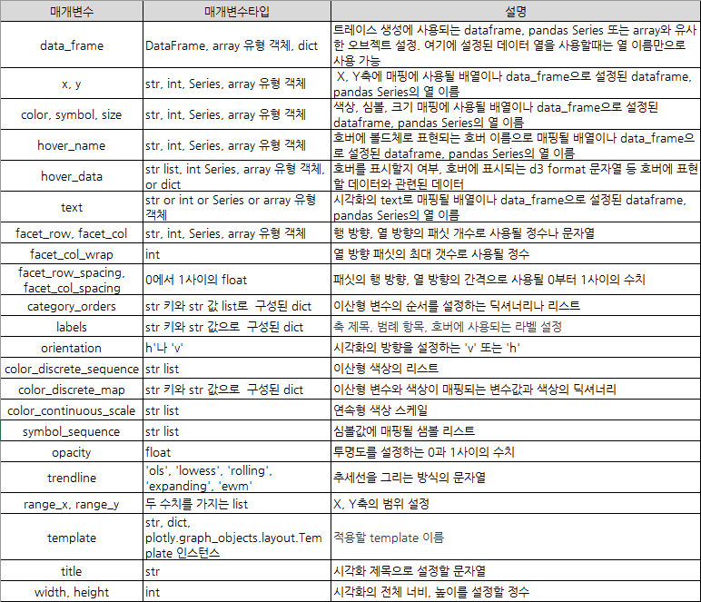

#### 기본 scatter plot

```{python}
import plotly.express as px
df = px.data.gapminder()

fig = px.scatter(df.query("year==2007"), x="gdpPercap", y="lifeExp",
                 size="pop", color="continent", hover_name="country", 
                 size_max=60)
fig.show()

```

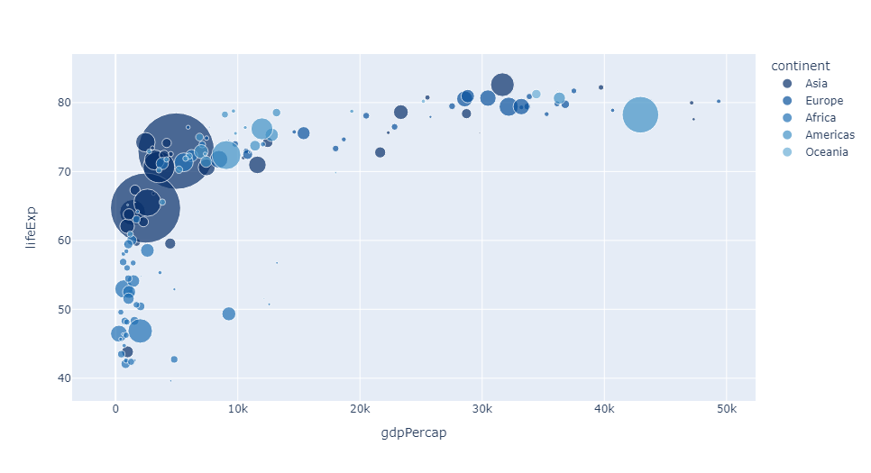

#### order, map 설정

```{python}
import plotly.express as px
df = px.data.tips()
fig = px.histogram(df, x="day", y="total_bill", color="sex",
            title="Receipts by Payer Gender and Day of Week",
            width=600, height=400,
            labels={ # replaces default labels by column name
                "sex": "Payer Gender",  "day": "Day of Week", "total_bill": "Receipts"
            },
            category_orders={ # replaces default order by column name
                "day": ["Thur", "Fri", "Sat", "Sun"], "sex": ["Male", "Female"]
            },
            color_discrete_map={ # replaces default color mapping by value
                "Male": "darkblue", "Female": "skyblue"
            }
            )
fig.show()

```


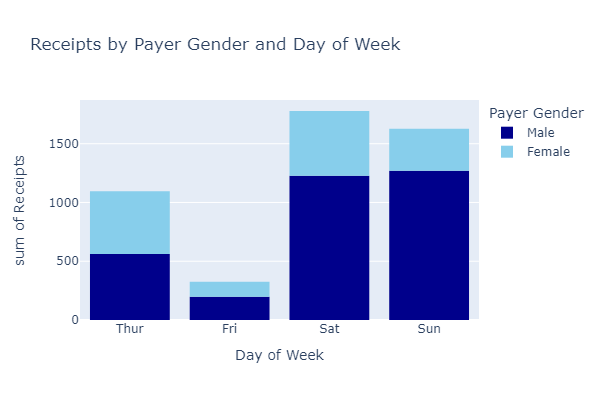

#### facet


```{python}
import plotly.express as px
df = px.data.tips()
fig = px.scatter(df, x="total_bill", y="tip", color="smoker", facet_col="sex", facet_row="time")
fig.show()

```

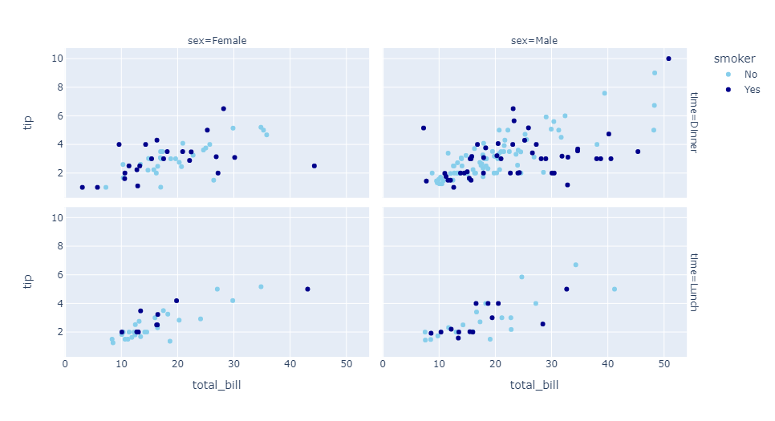

#### trendline, marginal 설정

```{python}
import plotly.express as px
df = px.data.iris()
fig = px.scatter(df, x="sepal_width", y="sepal_length", color="species", marginal_y="violin",
           marginal_x="box", trendline="ols", template="simple_white")
fig.show()

```

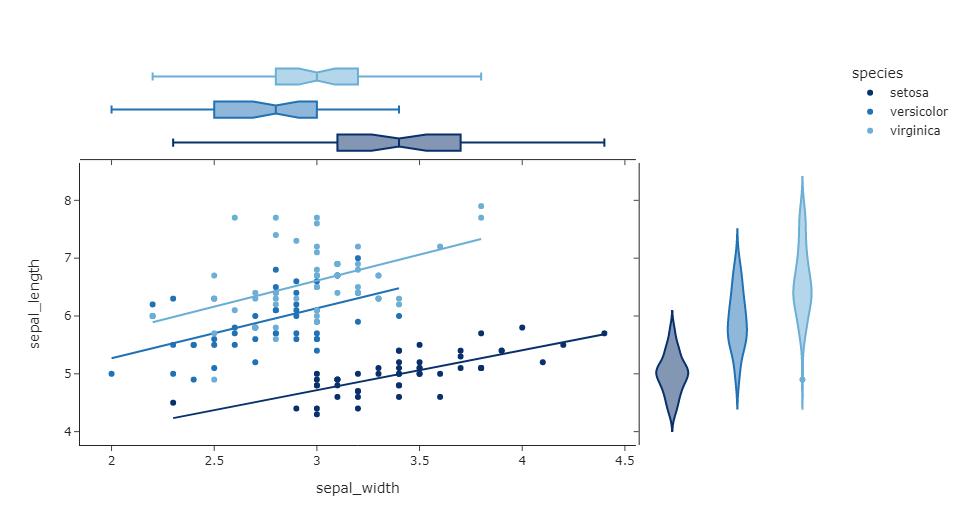

### plotly.express.scatter_polar

:::{comment}
plotly.express.scatter_polar(data_frame=None, r=None, theta=None, color=None, symbol=None, size=None, hover_name=None, hover_data=None, custom_data=None, text=None, animation_frame=None, animation_group=None, category_orders=None, labels=None, color_discrete_sequence=None, color_discrete_map=None, color_continuous_scale=None, range_color=None, color_continuous_midpoint=None, symbol_sequence=None, symbol_map=None, opacity=None, direction='clockwise', start_angle=90, size_max=None, range_r=None, range_theta=None, log_r=False, render_mode='auto', title=None, template=None, width=None, height=None)
:::

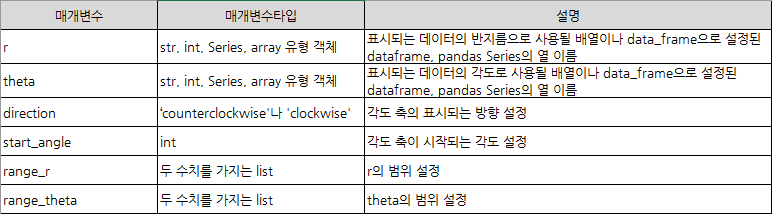

#### 기본 scatter_polar plot

```{python}
import plotly.express as px
df = px.data.wind()
fig = px.scatter_polar(df, r="frequency", theta="direction",
                       color="strength", symbol="strength", size="frequency",
                       color_discrete_sequence=px.colors.sequential.Viridis)
fig.show()

```

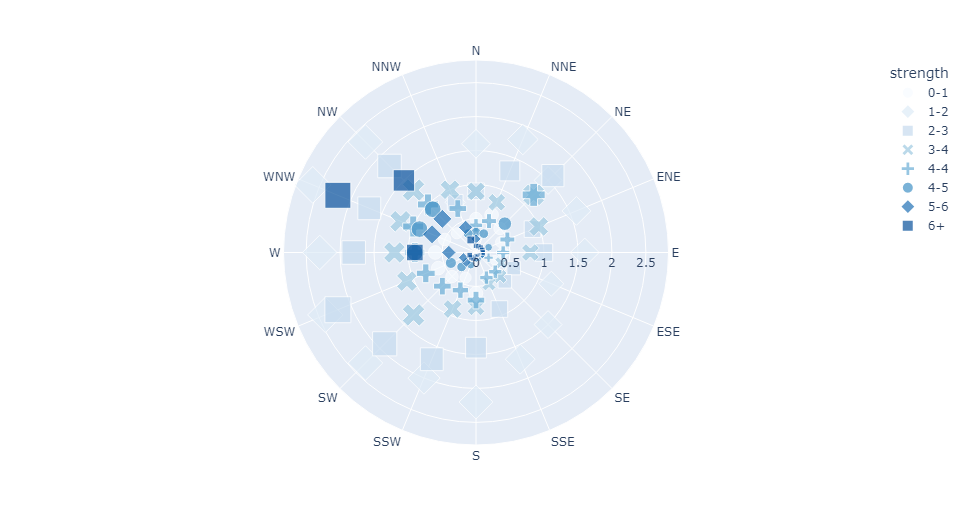

### plotly.express.line

:::{comment}
plotly.express.line(data_frame=None, x=None, y=None, line_group=None, color=None, line_dash=None, symbol=None, hover_name=None, hover_data=None, custom_data=None, text=None, facet_row=None, facet_col=None, facet_col_wrap=0, facet_row_spacing=None, facet_col_spacing=None, error_x=None, error_x_minus=None, error_y=None, error_y_minus=None, animation_frame=None, animation_group=None, category_orders=None, labels=None, orientation=None, color_discrete_sequence=None, color_discrete_map=None, line_dash_sequence=None, line_dash_map=None, symbol_sequence=None, symbol_map=None, markers=False, log_x=False, log_y=False, range_x=None, range_y=None, line_shape=None, render_mode='auto', title=None, template=None, width=None, height=None)
:::

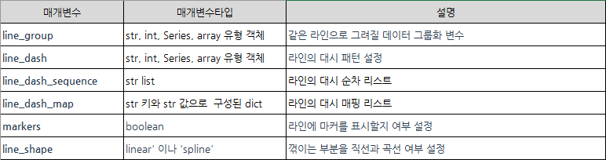

#### 기본 line plot

```{python}
import plotly.express as px
df = px.data.gapminder().query("continent == 'Oceania'")
fig = px.line(df, x='year', y='lifeExp', color='country', markers=True)
fig.show()

```

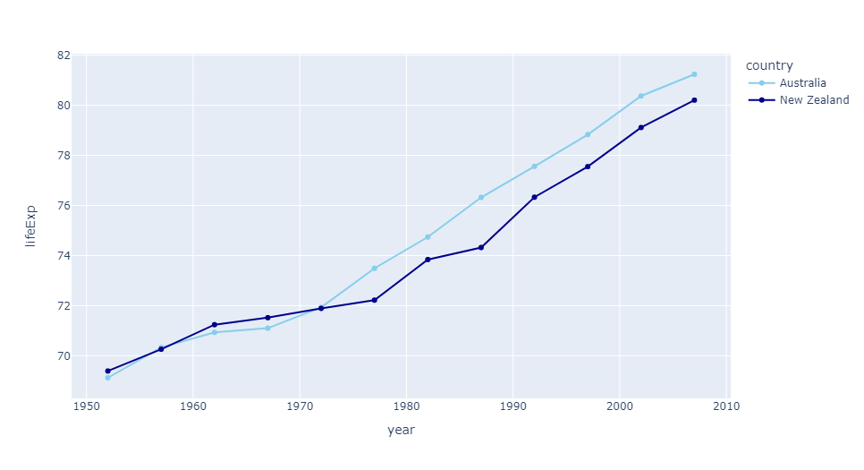

#### 범위 설정

```{python}
import plotly.express as px

df = px.data.stocks()
fig = px.line(df, x='date', y="GOOG", range_x=['2018-07-01','2019-06-30'])
fig.show()

```

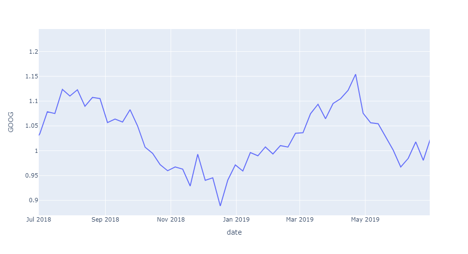

### plotly.express.bar

:::{comment}
plotly.express.bar(data_frame=None, x=None, y=None, color=None, pattern_shape=None, facet_row=None, facet_col=None, facet_col_wrap=0, facet_row_spacing=None, facet_col_spacing=None, hover_name=None, hover_data=None, custom_data=None, text=None, base=None, error_x=None, error_x_minus=None, error_y=None, error_y_minus=None, animation_frame=None, animation_group=None, category_orders=None, labels=None, color_discrete_sequence=None, color_discrete_map=None, color_continuous_scale=None, pattern_shape_sequence=None, pattern_shape_map=None, range_color=None, color_continuous_midpoint=None, opacity=None, orientation=None, barmode='relative', log_x=False, log_y=False, range_x=None, range_y=None, text_auto=False, title=None, template=None, width=None, height=None) 
:::

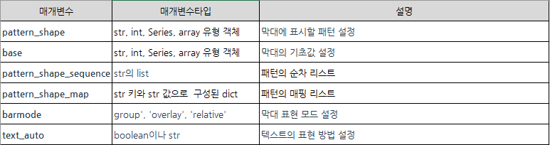

#### 기본 bar plot

```{python}
import plotly.express as px

df = px.data.gapminder().query("continent == 'Europe' and year == 2007 and pop > 2.e6")
fig = px.bar(df, y='pop', x='country', text_auto='.2s',
            title="Default: various text sizes, positions and angles")
fig.show()

```

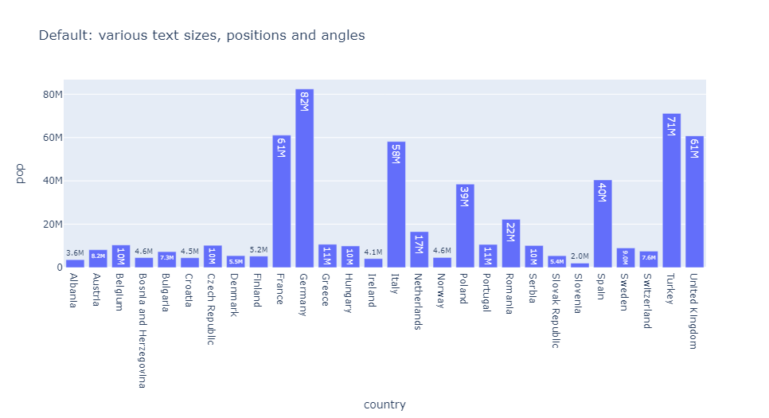

#### 넓은 형태 데이터프레임 사용

```{python}
import plotly.express as px

wide_df = px.data.medals_wide()

fig = px.bar(wide_df, x="nation", y=["gold", "silver", "bronze"], title="Wide-Form Input")
fig.show()

```

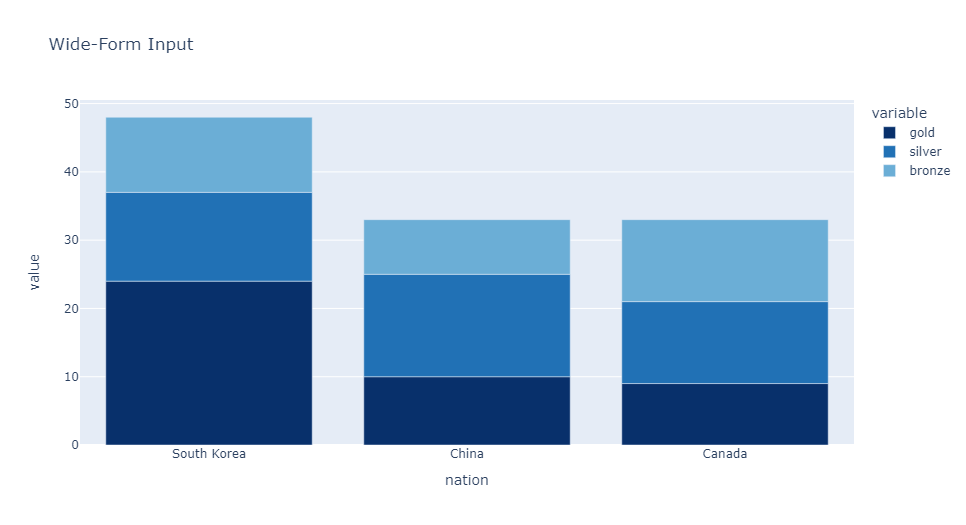

#### 패턴 설정

```{python}
import plotly.express as px
df = px.data.medals_long()

fig = px.bar(df, x="medal", y="count", color="nation",
             pattern_shape="nation", pattern_shape_sequence=[".", "x", "+"])
fig.show()

```

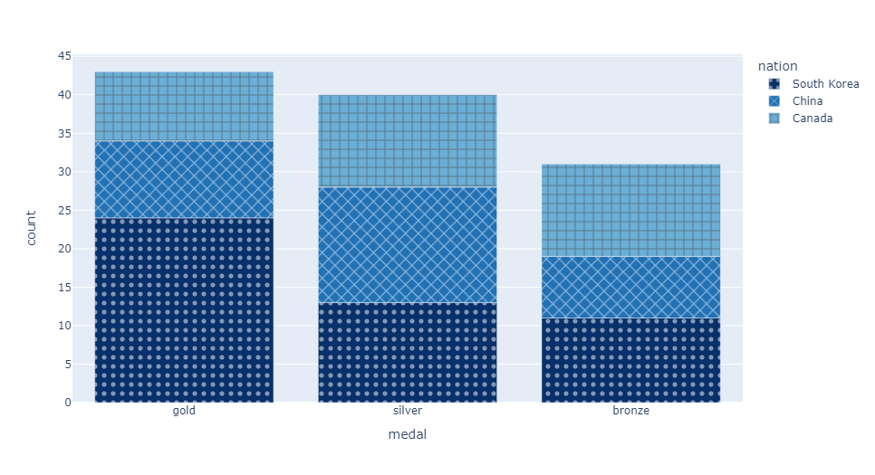

### plotly.express.violin

:::{comment}
plotly.express.violin(data_frame=None, x=None, y=None, color=None, facet_row=None, facet_col=None, facet_col_wrap=0, facet_row_spacing=None, facet_col_spacing=None, hover_name=None, hover_data=None, custom_data=None, animation_frame=None, animation_group=None, category_orders=None, labels=None, color_discrete_sequence=None, color_discrete_map=None, orientation=None, violinmode=None, log_x=False, log_y=False, range_x=None, range_y=None, points=None, box=False, title=None, template=None, width=None, height=None) 
:::

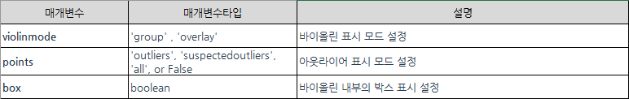

#### 기본 violin plot

```{python}
import plotly.express as px

df = px.data.tips()
fig = px.violin(df, y="total_bill")
fig.show()

```

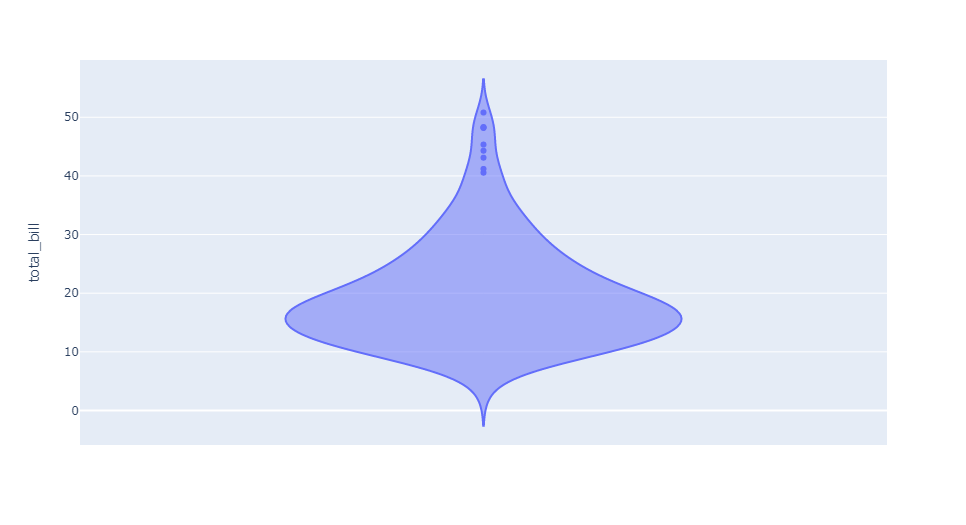

#### 다중 violin plot

```{python}
import plotly.express as px

df = px.data.tips()
fig = px.violin(df, y="tip", x="smoker", color="sex", box=True, points="all",
          hover_data=df.columns)
fig.show()

```

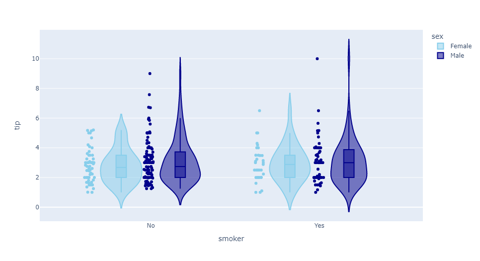

### plotly.express.histogram

:::{comment}
plotly.express.histogram(data_frame=None, x=None, y=None, color=None, pattern_shape=None, facet_row=None, facet_col=None, facet_col_wrap=0, facet_row_spacing=None, facet_col_spacing=None, hover_name=None, hover_data=None, animation_frame=None, animation_group=None, category_orders=None, labels=None, color_discrete_sequence=None, color_discrete_map=None, pattern_shape_sequence=None, pattern_shape_map=None, marginal=None, opacity=None, orientation=None, barmode='relative', barnorm=None, histnorm=None, log_x=False, log_y=False, range_x=None, range_y=None, histfunc=None, cumulative=None, nbins=None, text_auto=False, title=None, template=None, width=None, height=None) 
:::

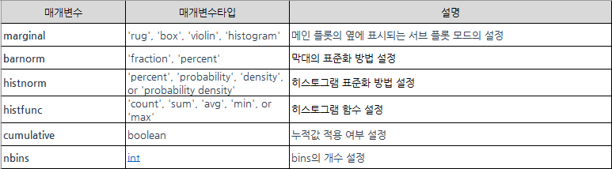

#### 기본 histogram plot

```{python}
import plotly.express as px
df = px.data.tips()
fig = px.histogram(df, x="total_bill", nbins=20)
fig.show()

```

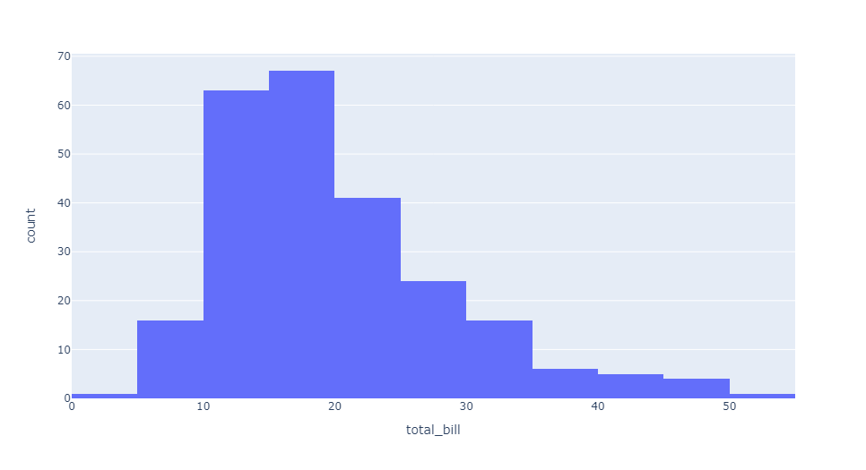

#### text가 표시된 평균 histogram

```{python}
import plotly.express as px
df = px.data.tips()
fig = px.histogram(df, x="total_bill", y="tip", histfunc="avg", nbins=8, text_auto=True)
fig.show()

```

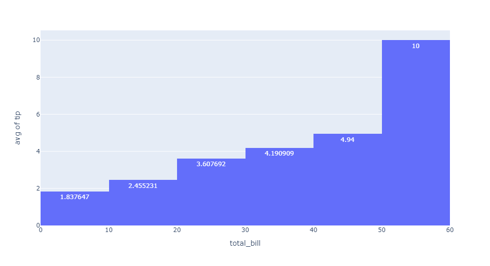

### plotly.express.pie

:::{comment}
plotly.express.pie(data_frame=None, names=None, values=None, color=None, facet_row=None, facet_col=None, facet_col_wrap=0, facet_row_spacing=None, facet_col_spacing=None, color_discrete_sequence=None, color_discrete_map=None, hover_name=None, hover_data=None, custom_data=None, category_orders=None, labels=None, title=None, template=None, width=None, height=None, opacity=None, hole=None) 
:::

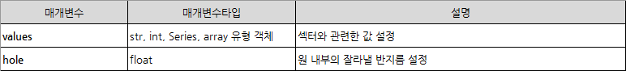

#### 기본 pie plot

```{python}
import plotly.express as px
df = px.data.tips()
fig = px.pie(df, values='tip', names='day')
fig.show()

```

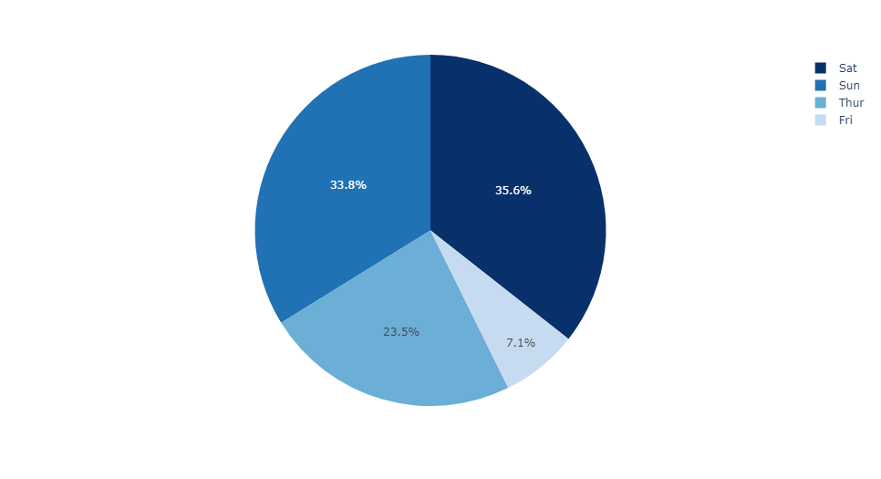

#### 도넛 pie

```{python}
import plotly.express as px
df = px.data.tips() 
px.pie(df, values='tip', names='day', hole = 0.3)

```

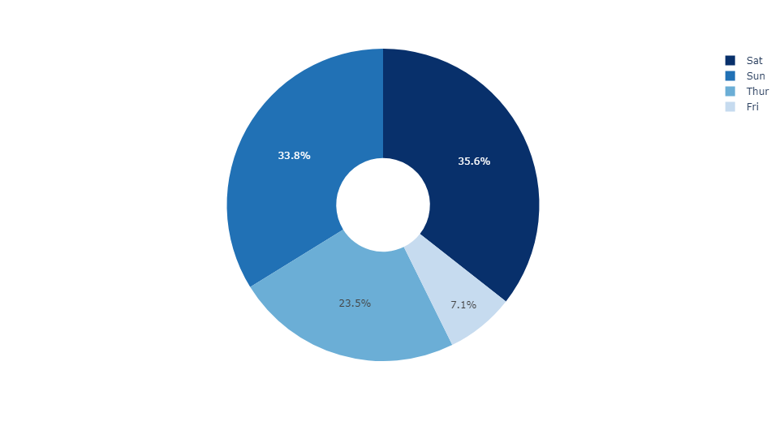

### plotly.express.treemap

:::{comment}
plotly.express.treemap(data_frame=None, names=None, values=None, parents=None, ids=None, path=None, color=None, color_continuous_scale=None, range_color=None, color_continuous_midpoint=None, color_discrete_sequence=None, color_discrete_map=None, hover_name=None, hover_data=None, custom_data=None, labels=None, title=None, template=None, width=None, height=None, branchvalues=None, maxdepth=None) 
:::

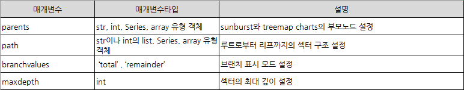

#### 기본 treemap plot

```{python}
import plotly.express as px
df = px.data.tips()
fig = px.treemap(df, path=[px.Constant("all"), 'sex', 'day', 'time'], 
                 values='total_bill', color='day')
fig.show()

```


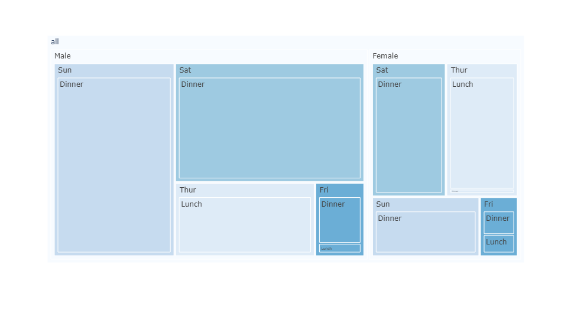

#### 컬러 매핑

```{python}
import plotly.express as px
df = px.data.tips()
fig = px.treemap(df, path=[px.Constant("all"), 'sex', 'day', 'time'], 
                 values='total_bill', color='time',
                  color_discrete_map={'(?)':'lightgrey', 'Lunch':'gold', 'Dinner':'darkblue'})
fig.show()

```

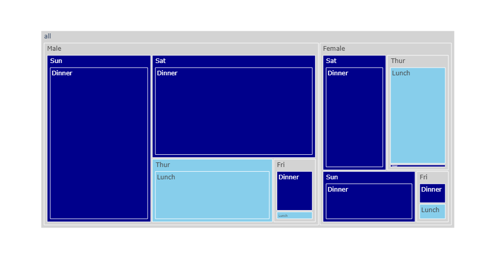

### plotly.express.sunburst

:::{comment}
plotly.express.sunburst(data_frame=None, names=None, values=None, parents=None, path=None, ids=None, color=None, color_continuous_scale=None, range_color=None, color_continuous_midpoint=None, color_discrete_sequence=None, color_discrete_map=None, hover_name=None, hover_data=None, custom_data=None, labels=None, title=None, template=None, width=None, height=None, branchvalues=None, maxdepth=None)
:::

#### 기본 sunburst plot

```{python}
import plotly.express as px
df = px.data.tips()
fig = px.sunburst(df, path=['day', 'time', 'sex'], values='total_bill')
fig.show()

```

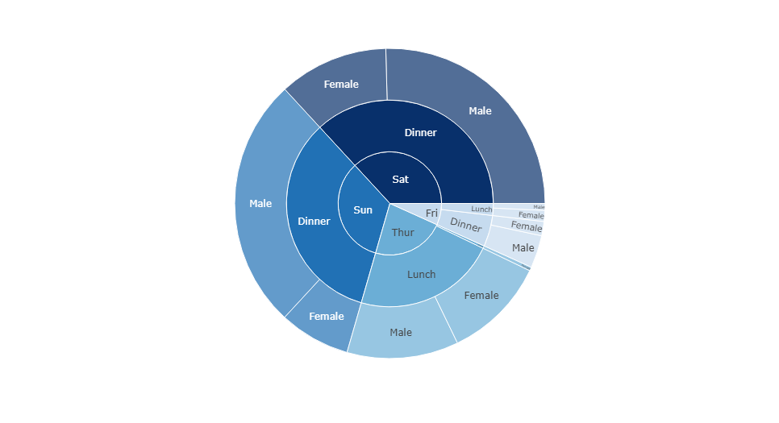

### plotly.express.funnel

:::{comment}
plotly.express.funnel(data_frame=None, x=None, y=None, color=None, facet_row=None, facet_col=None, facet_col_wrap=0, facet_row_spacing=None, facet_col_spacing=None, hover_name=None, hover_data=None, custom_data=None, text=None, animation_frame=None, animation_group=None, category_orders=None, labels=None, color_discrete_sequence=None, color_discrete_map=None, opacity=None, orientation=None, log_x=False, log_y=False, range_x=None, range_y=None, title=None, template=None, width=None, height=None) 
:::

#### 기본 funnel plot

```{python}
import plotly.express as px
data = dict(
    number=[39, 27.4, 20.6, 11, 2],
    stage=["Website visit", "Downloads", "Potential customers", "Requested price", "invoice sent"])
fig = px.funnel(data, x='number', y='stage')
fig.show()

```

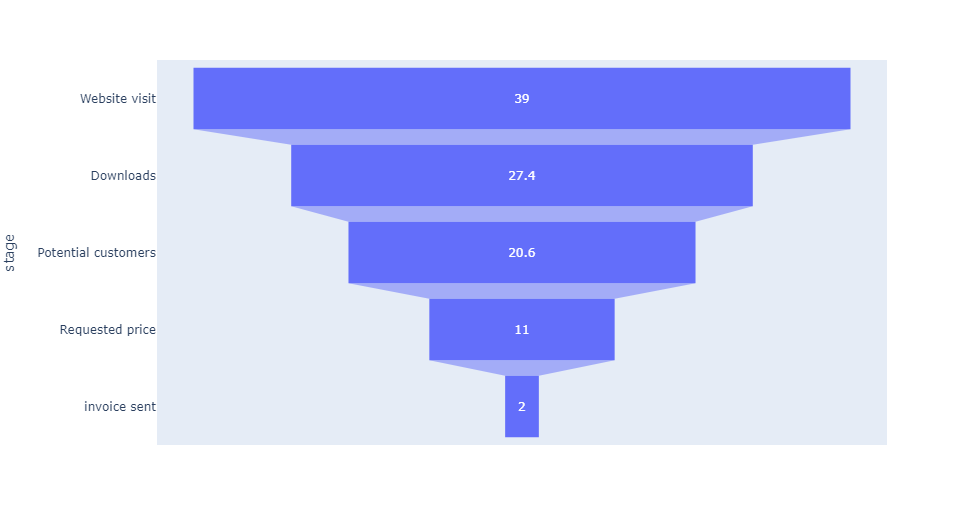

### plotly.express.choropleth

:::{comment}
plotly.express.choropleth(data_frame=None, lat=None, lon=None, locations=None, locationmode=None, geojson=None, featureidkey=None, color=None, facet_row=None, facet_col=None, facet_col_wrap=0, facet_row_spacing=None, facet_col_spacing=None, hover_name=None, hover_data=None, custom_data=None, animation_frame=None, animation_group=None, category_orders=None, labels=None, color_discrete_sequence=None, color_discrete_map=None, color_continuous_scale=None, range_color=None, color_continuous_midpoint=None, projection=None, scope=None, center=None, fitbounds=None, basemap_visible=None, title=None, template=None, width=None, height=None) 
:::

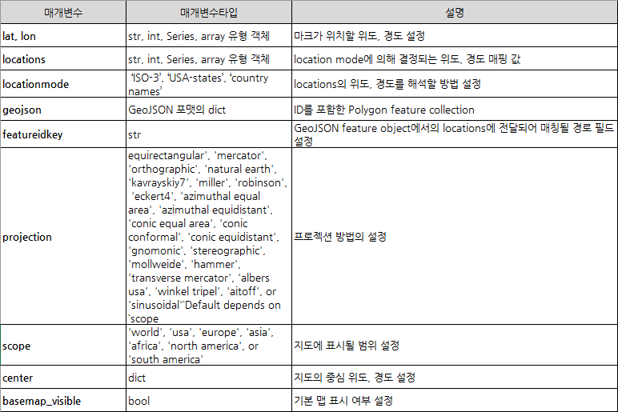

#### 기본 choropleth plot

```{python}
import plotly.express as px

fig = px.choropleth(locations=["CA", "TX", "NY"], locationmode="USA-states", color=[1,2,3], scope="usa")
fig.show()

```

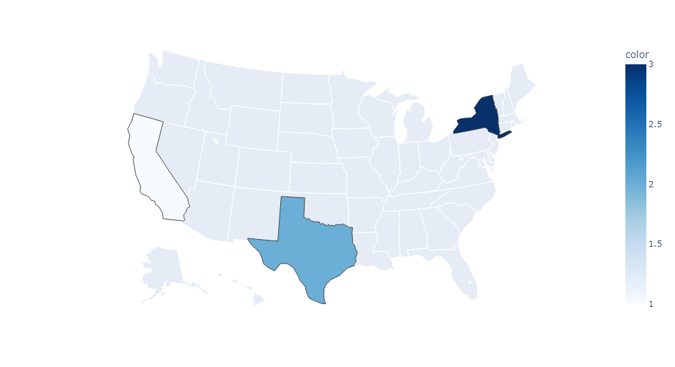


