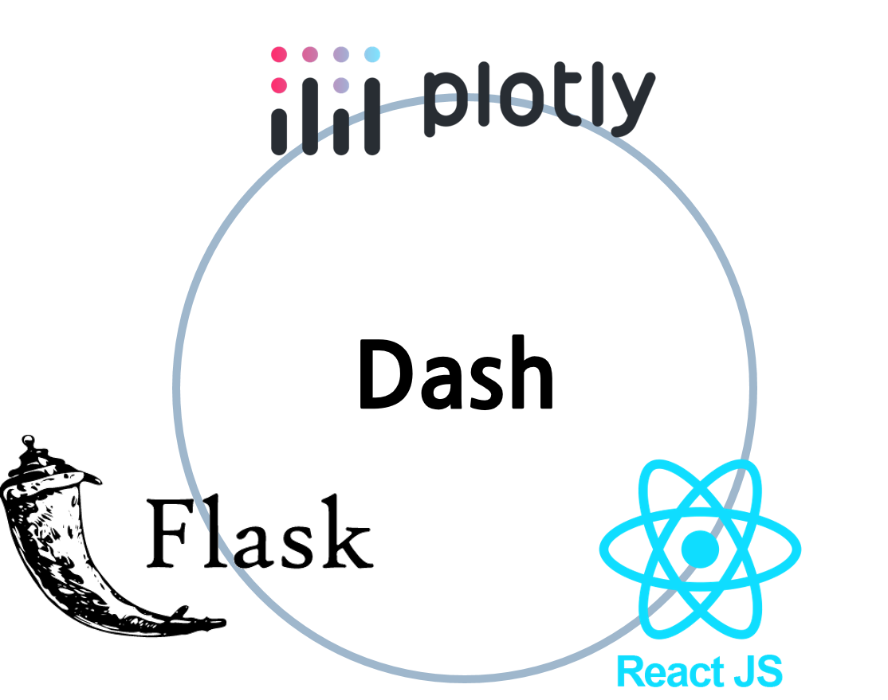
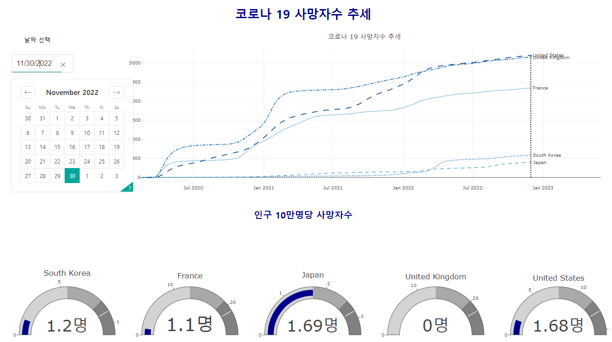
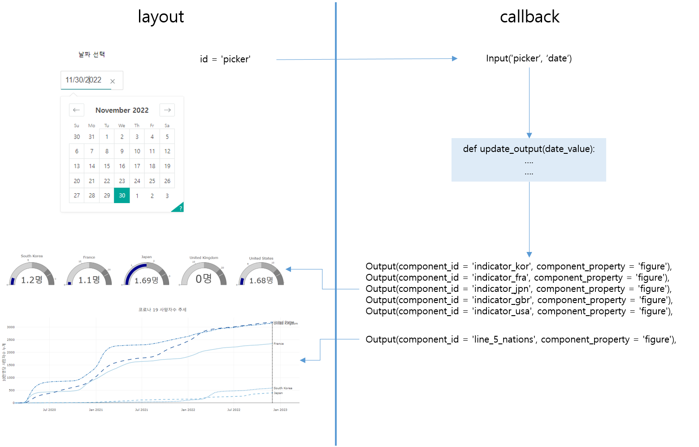

```{r setup, include=FALSE}
knitr::opts_chunk$set(echo = TRUE, message = FALSE, warning = FALSE, fig.width = 6.5, dpi = 130, eval = FALSE)
library(showtext)
showtext_auto()

pacman::p_load("tidyverse", "readxl", "readr", "lubridate", 'plotly')

```

```{r echo = FALSE, message = FALSE, warning = FALSE}
df_covid19 <- read_csv(file = "D:/R/data/Rnpy/owid-covid-data.csv",
                            col_types = cols(date = col_date(format = "%Y-%m-%d")
                                             )
                            )
df_covid19_100 <- df_covid19 |> 
  filter(iso_code %in% c('KOR', 'OWID_ASI', 'OWID_EUR', 'OWID_OCE', 'OWID_NAM', 'OWID_SAM', 'OWID_AFR')) |>
  filter(date >= max(date) - 100) |>
  mutate(location = case_when(
    location == 'South Korea' ~ '한국', 
    location == 'Asia' ~ '아시아', 
    location == 'Europe' ~ '유럽', 
    location == 'Oceania' ~ '오세아니아', 
    location == 'North America' ~ '북미', 
    location == 'South America' ~ '남미', 
    location == 'Africa' ~ '아프리카')) |>
  mutate(location = fct_relevel(location, '한국', '아시아', '유럽', '북미', '남미', '아프리카', '오세아니아')) |>
  arrange(date)

df_covid19_100_wide <- df_covid19_100 |>
  select(date, location, new_cases, people_fully_vaccinated_per_hundred) |>
  rename('date' = 'date', '확진자' = 'new_cases', '백신접종완료자' = 'people_fully_vaccinated_per_hundred') |>
  pivot_wider(id_cols = date, names_from = location, 
              values_from = c('확진자', '백신접종완료자')) |>
  arrange(date)

df_covid19_stat <- df_covid19 |> 
  group_by(iso_code, continent, location) |>
  summarise(인구수 = max(population, na.rm = T), 
            전체사망자수 = sum(new_deaths, na.rm = T), 
            백신접종자완료자수 = max(people_fully_vaccinated, na.rm = T),
            인구백명당백신접종완료율 = max(people_fully_vaccinated_per_hundred, na.rm = T),
            인구백명당부스터접종자수 = max(total_boosters_per_hundred, na.rm = T)) |> 
    ungroup() |>
    mutate(십만명당사망자수 = round(전체사망자수 / 인구수 *100000, 5),
           백신접종완료율 = 백신접종자완료자수 / 인구수)

margins_R <- list(t = 50, b = 25, l = 25, r = 25)


df_취업률 <- read_excel('D:/R/data/Rnpy/2021년 학과별 고등교육기관 취업통계.xlsx', 
                     ## '학과별' 시트의 데이터를 불러오는데,
                     sheet = '학과별',
                     ## 앞의 13행을 제외하고
                     skip = 13, 
                     ## 첫번째 행은 열 이름으로 설정
                     col_names = TRUE, 
                     ## 열의 타입을 설정, 처음 9개는 문자형으로 다음 79개는 수치형으로 설정
                     col_types = c(rep('text', 9), rep('numeric', 79)))

## df_취업률에서 첫번째부터 9번째까지의 열과 '계'로 끝나는 열을 선택하여 다시 df_취업률에 저장
df_취업률 <- df_취업률 |> 
  select(1:9, ends_with('계'), '입대자')

## df_취업률에서 졸업자가 500명 이하인 학과 2000개 샘플링
df_취업률_500 <- df_취업률 |> 
  filter(졸업자_계 < 500) |>
  mutate(id = row_number()) |>
  filter(row_number() %in% seq(from = 1, to = nrow(df_취업률), by = 4))

## 열 이름을 적절히 설정
names(df_취업률_500)[10:12] <- c('졸업자수', '취업률', '취업자수')

```

```{python echo = FALSE, message = FALSE, warning = FALSE, eval = FALSE}
import pandas as pd
from datetime import datetime, timedelta
from pandas.api.types import CategoricalDtype
from matplotlib import pyplot as plt
import plotly.graph_objects as go

df_covid19 = pd.read_csv("D:/R/data/Rnpy/owid-covid-data.csv")

df_covid19['date'] = pd.to_datetime(df_covid19['date'], format="%Y-%m-%d")

df_covid19_100 = df_covid19[(df_covid19['iso_code'].isin(['KOR', 'OWID_ASI', 'OWID_EUR', 'OWID_OCE', 'OWID_NAM', 'OWID_SAM', 'OWID_AFR'])) & (df_covid19['date'] >= (max(df_covid19['date']) - timedelta(days = 100)))]


df_covid19_100.loc[df_covid19_100['location'] == 'South Korea', "location"] = '한국'
df_covid19_100.loc[df_covid19_100['location'] == 'Asia', "location"] = '아시아'
df_covid19_100.loc[df_covid19_100['location'] == 'Europe', "location"] = '유럽'
df_covid19_100.loc[df_covid19_100['location'] == 'Oceania', "location"] = '오세아니아'
df_covid19_100.loc[df_covid19_100['location'] == 'North America', "location"] = '북미'
df_covid19_100.loc[df_covid19_100['location'] == 'South America', "location"] = '남미'
df_covid19_100.loc[df_covid19_100['location'] == 'Africa', "location"] = '아프리카'

ord = CategoricalDtype(categories = ['한국', '아시아', '유럽', '북미', '남미', '아프리카', '오세아니아'], ordered = True)

df_covid19_100['location'] = df_covid19_100['location'].astype(ord)

df_covid19_100 = df_covid19_100.sort_values(by = 'date')

df_covid19_100_wide = df_covid19_100.loc[:,['date', 'location', 'new_cases', 'people_fully_vaccinated_per_hundred']].rename(columns={'new_cases':'확진자', 'people_fully_vaccinated_per_hundred':'백신접종완료자'})

df_covid19_100_wide = df_covid19_100_wide.pivot(index='date', columns='location', values=['확진자', '백신접종완료자']).sort_values(by = 'date')

df_covid19_100_wide.columns = ['확진자_한국', '확진자_아시아', '확진자_유럽', '확진자_북미', '확진자_남미', '확진자_아프리카','확진자_오세아니아',
                              '백신접종완료자_한국', '백신접종완료자_아시아', '백신접종완료자_유럽', '백신접종완료자_북미', '백신접종완료자_남미', '백신접종완료자_아프리카','백신접종완료자_오세아니아']
                              
df_covid19_stat = df_covid19.groupby(['iso_code', 'continent', 'location'], dropna=False).agg(
    인구수 = ('population', 'max'),
    전체확진자수 = ('new_cases', 'sum'),
    전체사망자수 = ('new_deaths', 'sum'), 
    백신접종자완료자수 = ('people_fully_vaccinated', 'max'),
    인구백명당백신접종완료율 = ('people_fully_vaccinated_per_hundred', 'max'),
    인구백명당부스터접종자수 = ('total_boosters_per_hundred', 'max')
).reset_index()

df_covid19_stat['십만명당사망자수'] = round(df_covid19_stat['전체사망자수'] / df_covid19_stat['인구수'] *100000, 5)

df_covid19_stat['백신접종완료율'] = df_covid19_stat['백신접종자완료자수'] / df_covid19_stat['인구수']

######################################   
## python 코드
## 대학 학과 취업률 데이터 셋

df_취업률 = pd.read_excel("D:/R/data/Rnpy/2021년 학과별 고등교육기관 취업통계.xlsx", 
                           sheet_name = '학과별',
                           skiprows=(13), 
                           header = 0)

df_취업률 = pd.concat([df_취업률.iloc[:, 0:8], 
                    df_취업률.loc[:, df_취업률.columns.str.endswith('계')], 
                    df_취업률.loc[:, '입대자']], 
                   axis = 1
                   )

df_취업률_2000 = df_취업률.loc[(df_취업률['졸업자_계'] < 500)]

df_취업률_2000 = df_취업률_2000.iloc[range(0, len(df_취업률_2000.index) , 4)]

df_취업률_2000 = df_취업률_2000.rename(columns = {'졸업자_계':'졸업자수', '취업률_계':'취업률', '취업자_합계_계':'취업자수'})

margins_P = dict(t = 50, b = 25, l = 25, r = 25)

```

# Dash 란?

Dash는 반응형 웹 기반 애플리케이션을 만들기 위한 오픈 소스 라이브러리이다. 2015년부터 개발이 시작되었는데 당시에는 Github을 통해 공개 개발 플랫폼으로 개발되다 2017년부터 자체 개발 플랫폼으로 전환되었다. Dash는 Python, R, Julia 및 F#를 지원하는데 전체적으로 매월 800,000회 정도 다운로드되고 있다고 한다.

Dash는 plotly 시각화를 만드는 Plotly.js, 컴포넌트 간의 핸들링을 위해 메타(구 페이스북)에서 개발한 React.js, 앱 애플리케이션 구동 엔진으로 flask를 사용하여 작성된 플랫폼으로 데이터 앱을 구축하고 배포하는 데 활용하는 다양한 기능을 제공하는 플랫폼이다.



웹 브라우저에 렌더링되고 사용되기 때문에 OS의 영향을 덜 받고 모바일에서도 사용이 가능한 데이터 전용 앱의 개발에 효과적인 플랫폼이다. Dash는 Tableau나 PowerBI와는 달리 무료 패키지로 사용할 수 있고 R과 python 코딩만으로 javascript를 제어할 수 있으며. Django와 같은 프레임워크와 비교해서도 매우 적은 코드로 웹 애플리케이션을 만들 수 있다는 장점이 있다.

# Dash 패키지 구성 및 설치

Dash 프레임워크를 사용하여 데이터 앱을 개발하기 위해서는 먼저 Dash 관련 패키지를 설치하여야 한다. Dash 프레임워크는 dash 패키지를 중심으로 Dash Core Components, Dash HTML Components 세 개의 패키지가 사용된다. 다만 python에서는 Dash Bootstrap Components가 추가된다.

> -   Dash : Dash로 대시보드 앱을 개발하기 위한 가장 메인 패키지이다. dash.Dash 객체로 개발되는 앱의 백본 라이브러리이다. 대시보드 앱을 개발하기 위한 사용자 상호작용과 예외 처리의 필수적인 함수들을 제공한다.
>
> -   Dash Core Components : dropdown, date picker, slider 등 사용자와의 상호작용에 사용하는 컴포넌트들을 제공하는 라이브러리이다.
>
> -   Dash HTML Components : Dash에서 사용하는 모든 HTML 태그를 지원하는 패키지이다.
>
> -   Dash Bootstrap Components : Dash의 부트스트랩을 지원하는 python 써드파티(Third-Party) 패키지이다. layout과 시각적 시그널에 관련된 다양한 컴포넌트들이 포함되어 있다.

-   R

R에서 Dash 프레임워크를 사용하기 위해서는 dash 패키지를 설치하여야 한다. dash 패키지는 아직(2023.1월 현재) CRAN(The Comprehensive R Archive Network)에 등록되어 있지 않기 때문에 remotes 패키지의 `install_github()`을 사용하여 Github의 패키지를 설치하여야 한다. dash 패키지를 설치하면 dashCoreComponents, dashHtmlComponents 패키지가 같이 설치된다.

```{r}
if (!require('remotes')) {
  install.packages("remotes")
  library(remotes)
}

remotes::install_github("plotly/dashR")

```

-   python

python에서도 Dash 프레임워크를 사용하기 위해서는 dash 라이브러리를 설치하여야 한다. dash가 설치되면 dash_core_components, dash_html_components, dash_bootstrap_components 세 개의 패키지가 같이 설치된다.

`dash`는 pip를 사용하여 다음과 같이 설치할 수 있다.

```{python}
pip install dash

```

만약 Jupyter notebook이나 JupyterLab을 사용한다면 jupyter-dash를 설치하는 것이 좋다.

```{python}
pip install jupyter-dash

```

# Dash 앱의 구조

Dash 앱은 일반적으로 다음의 다섯개의 부분으로 구성되어 있다.

-   패키지 및 라이브러리 로딩 :

+---------------------------+-----------------------------+------------------------------------+
| app parts                 | R 샘플코드                  | python 샘플코드                    |
+===========================+=============================+====================================+
| 패키지 및 라이브러리 로딩 | library(dash)               | import dash                        |
|                           |                             |                                    |
|                           | library(dashCoreComponents) | from dash import dcc               |
|                           |                             |                                    |
|                           | library(dashHtmlComponents) | from dash import html              |
+---------------------------+-----------------------------+------------------------------------+
| 앱 초기화                 | app \<- dash_app()          | app = Dash(\_\_name\_\_)           |
+---------------------------+-----------------------------+------------------------------------+
| 앱 레이아웃(layout)       | app \|\> set_layout()       | app.layout = html.Div()            |
+---------------------------+-----------------------------+------------------------------------+
| 콜백(callback)            | app \|\> add_callback()     | @app.callback()                    |
+---------------------------+-----------------------------+------------------------------------+
| 앱 실행                   | app \|\> run_app()          | if \_\_name\_\_ == '\_\_main\_\_': |
|                           |                             |                                    |
|                           |                             | app.run_server()                   |
+---------------------------+-----------------------------+------------------------------------+

## 패키지 및 라이브러리 로딩

Dash 앱을 만들기 위해서 가장 먼저 해야하는 작업은 Dash를 사용하기 위한 패키지와 라이브러리를 로딩하는 것이다. 앞의 표와 같이 R과 python에서 로딩하는 방법은 다르지만 패키지는 동일하다.

-   R

R에서는 앞선 표에서 보였다시피 3개의 패키지를 각각 업로드 해준다.

```{r}
library(dash)
library(dashCoreComponents)
library(dashHtmlComponents)

```

-   python

python에서는 dash 라이브러리에서 dash_Core_Components, dash_Html_Components도 한꺼번에 임포트 해줄 수 있다. 일반적으로 다음과 같은 클래스 별칭을 써서 임포트한다.

```{python}
import dash
from dash import dcc, html

```

## 앱 초기화

레이아웃을 정의하기 전에 앱과 해당 서버를 초기화해야 한다. 앱의 기본적인 틀을 만들어 주는 것으로 브라우저 윈도우 제목, 작업 폴더 경로 등에 대한 앱의 기본 설정을 해줄 수 있다.

-   R

R에서 dash 앱의 초기화는 다음과 같이 `dash_app()`을 호출함으로써 만들어진다. `dash_app()`의 결과로 만들어진 객체는 Dash의 R6 클래스 객체이다.

```{r}
app <- dash_app()

```

-   python

python에서 dash 앱의 초기화는 다음과 같이 `dash.Dash()`를 사용한다. 일반적으로 매개변수로 '\_\_name\_\_'을 사용하도록 권고되는데, flask에서 해당 앱의 이름으로 사용된다.'\_\_name\_\_'은 글로벌 변수이기 때문에 인용부호 없이 사용되고, 특별한 설정이 없다면 `dash.Dash()`는 '\_\_name\_\_' 변수에 '\_\_main\_\_'을 할당한다.

```{python}
app = dash.Dash(__name__)

```

## 앱 레이아웃

앱의 초기화가 끝나면 앱의 전체적인 형태를 만드는 레이아웃을 설정하게 된다. 앱 레이아웃은 앱에 표현되는 문자, 버튼, 그림, 텍스트, 링크 등을 적절하게 배치하게 되는데, 레이아웃은 html 태그와 plotly Graph와 같은 구성 요소들의 트리로 구성하게 된다.

다음은 'Hello, Dash!'를 출력하는 Dash 앱을 만드는 레이아웃의 R과 python 코드이다.

-   R

R에서는 레이아웃을 설정하기 위해 `set_layout()`을 사용한다. `set_layout()`에 HTML의 태그를 생성하는 함수들을 사용하여 화면을 구성한다.

```{r}
app %>% set_layout(
  h1('Hello Dash!'))

```

-   python

python에서는 레이아웃을 설정하기 위해 앞서 초기화한 앱 객체의 layout 속성에 트리 형태의 리스트로 구성하여 할당한다.

```{python}
app.layout = html.Div(children=[
    html.H1(children='Hello Dash')])
    
```

## 콜백

Dash 앱은 사용자와의 상호작용을 통해 데이터의 결과값을 산출하는 대시보드를 설계하는 것이 목적이다. 그렇다면 HTML 화면에 구성된 사용자 상호작용 컴포넌트에서 입력 받은 값을 화면에 구성된 출력 요소들에게 전달하고 이에 따른 동작을 함수화하여 정의하여야 한다. 이와 같이 사용자의 상호작용에 따라 Dash 앱이 자동으로 호출하는 함수 콜백함수라고 한다.

## 앱 실행

레이아웃과 콜백이 구성된 dash 앱은 웹 브라우저를 통해 실행되어야 한다. 앱이 실행되면 dash에서 자체적인 localhost 웹 서비스가 구동되며, dash에서 사용하는 locahhost 주소는 '[http://127.0.0.1:8050/'이다](http://127.0.0.1:8050/'이다){.uri}. 웹 브라우저에서 해당 주소로 들어가면 웹에서 구동되는 dash 앱을 볼 수 있다.

-   R

R에서 dash 앱의 실행에는 `run_app()`을 사용한다. 앞서 만들었던 dash 앱 객체를 매개변수로 전달함으로써 앱이 실행된다. `run_app()`의 매개변수로 localhost의 주소와 포트를 설정할 수 있다.

```{r}
app |> run_app()

```

-   python

python에서는 Dash 앱을 실행하기 위해서는 먼저 dash 앱이 만들어졌는지를 점검하여야 한다. dash 앱이 만들어졌다면 dash 앱을 초기화할 때 사용한 `dash.Dash()`에서 설정한 '\_\_name\_\_'에'\_\_main\_\_'이 설정되었는지를 확인함으로써 증명이 가능하다. 따라서 `if`를 사용하여 '\_\_name\_\_'에'\_\_main\_\_'이 설정되어 있다면 앱 실행 함수를 사용하여 설정된 dash 앱을 실행한다.

dash 앱을 실행하는 python 함수는 `run_server()`이다. `run_server()`에는 앱의 실행 환경을 추적하기 위한 다양한 옵션들을 사용할 수 있다.

'debug' 옵션은 앱의 실행 시 오류가 발생한 경우 오류를 추적하기 위한 정보를 생성하는 옵션이다. 앱이 완성되어 최종 배포 시에는 가급적 False로 설정하는 것이 권장된다.

'use_reloader' 옵션은 앱이 초기화되어 다시 로딩될 때 Flask 엔진을 다시 로딩할지를 결정하는 옵션이다. 이 옵션이 False가 설정되면 다시 로딩될 때 Flask 엔진이 다시 로딩되지 않는다. 만약 'debug'가 활성화되어있다면, 'use_reloader'가 직접 활성화되므로 직접 비활성화해야 한다.

```{python}
if __name__ == '__main__':
    app.run_server(debug=True, use_reloader=False)

```


# dash 앱 만들기

dash의 전반적인 기능을 살펴보기 위해 지금까지 사용했던 코로나19 데이터를 사용하여 dash 앱을 만들어 보겠다. 레이아웃의 구성, 콜백의 구현 순서로 앱을 만드는 과정을 설명하는데 R과 python을 분리하여 설명하겠다. 사용하는 데이터는 앞에서 사용했던 코로나 데이터 셋을 사용한다.

코로나 19 데이터를 활용한 dash 앱은 크게 네 개의 부분으로 구성된다. 첫 번째 부분은 최상단의 제목이 보이는 div이고, 두 번째 부분은 두 번째 div의 좌측에 특정일의 코로나 19 데이터를 선택하기 위한 'dccDatePickerSingle' 컨트롤을 위치시킨다. 세 번째는 두 번째 div의 우측에 앞선 5장에서 그렸던 주요 5개국의 선 그래프를 위치시키고, 네 번쨰는 마지막 div로 각 국가별 게이지 인디케이터를 5개 나란히 그리는 dash 앱이다.



## 레이아웃의 구성

dash 앱의 레이아웃은 dash html 컴포넌트와 사용자와 데이터 간의 상호작용을 위한 dcc 컴포넌트(Dash Core Components)로 구성한다. dash html 컴포넌트는 HTML을 직접 작성하거나 HTML 작성을 위한 프로그램이나 엔진을 사용하지 않고 dash 패키지에서 제공하는 다양한 html 컴포넌트 생성 함수들을 사용하여 만든다. dcc 컴포넌트는 사용자와의 상호작용을 위해 생성하는 드롭다운, 버튼, 슬라이더 등의 컨트롤이나 plotly 객체를 말한다.

dash 앱은 dash.html 파일에 div 블록들로 구성된 다양한 컴포넌트들을 dash에서 제공하는 함수들을 사용하여 html 파일을 구성한다. 예를 들어 '\<h1\>Hello, World!\</h1\>'라는 HTML 코드를 직접 작성하는 것이 아니고 html.H1('Hello, World!')을 호출함으로써 HTML 파일에 해당 HTML 태그가 만들어진다. 레이아웃을 구성하는 모든 컴포넌트가 HTML 문법에 따른 컴포넌트는 아니다. 특히 dcc 컴포넌트에는 React.js 라이브러리를 통해 JavaScript, HTML 및 CSS로 생성되는 구성 요소가 포함되어 있다.

레이아웃을 구성하는데 이해하여야 하는 것이 'children' 키워드이다. dash에서 제공하는 html 컴포넌트를 설정할 때는 관례로 컴포넌트의 첫 번째 속성을 'children'으로 설정한다. 이는 생략이 가능하다. 예를 들어 html.H1('Hello, World!')의 호출은 html.H1(children = 'Hello, World!')과 동일하다. 'children'에는 문자열, 숫자, 단일 컴포넌트 또는 컴포넌트의 리스트를 설정할 수 있다.

각각의 html 컴포넌트들에는 css style로 지정이 가능한 스타일을 설정할 수 있다. 각각의 html 설정 함수에서 'style' 키워드에 css style의 스타일을 설정하는데, style 속성은 plotly의 속성 설정과 유사하게 R은 list, python은 딕셔너리로 설정한다. css style을 설정하기 위한 키워드는 css에서 사용하던 키워드를 사용하는 것이 아니고 카멜 표기법을 적용한 css 키워드를 사용한다. 카멜 표기법은 프로그래밍에서 파일, 변수, 함수 등 대상의 이름을 띄어쓰기 없이 짓기 위하여 따르는 관례인 네이밍컨벤션(Naming convention)의 하나인데, css 키워드에서 띄어쓰기 대신 사용하는 '-'를 제거하고 붙여주는데, 붙여주는 키워드의 첫 문자를 대문자로 표기한다. 예를 들어 css 키워드인 'text-align'은 'textAlign'으로 바꾸어 사용한다. 또 HTML class 속성은 Dash에서는 'className'으로 사용한다.

dcc 컴포넌트 모듈에는 'Graph'라고 불리는 컴포넌트가 포함되어 있다. 'Graph'는 plotly.js를 사용하여 데이터 시각화를 렌더링한다. 이것은 플롯, 차트, 다이어그램, 그림 등과 같은 plotly 기반의 시각화 요소를 표시할 수 있는 매우 중요한 구성 요소이다. 'Graph' 컴포넌트의 'figure' 매개변수에 `plotly.graph_objects` 객체를 설정하게 된다.

각각의 컴포넌트는 고유한 'id'를 설정할 수 있다. 이 'id'는 생략이 가능하지만, 추후 콜백 함수에서 호출시에 사용되기 때문에 가급적 중요한 컴포넌트에는 설정해두는 것이 좋다.

-   R

R에서 코로나19 Dash 앱을 레이아웃을 만들기 위해 html 컴포넌트 함수로 `htmlDiv()`, `htmlH1()`, `htmlLabel()`를 사용했고 dcc 컴포넌트 함수로 `dccDatePickerSingle()`, `dccGraph()`를 사용했다.

-   `htmlDiv()` : html 5 요소중 \<div\>를 만들어주는 html 컴포넌트 함수

-   `htmlH1()` : html의 첫 번째 레벨의 제목인 \<h1\>을 만들어주는 html 컴포넌트 함수

-   `htmlLabel()` : html 5 요소중 <label>를 만들어주는 html 컴포넌트 함수

-   `dccDatePickerSingle()` : 달력에서 특정한 날을 선택할 수 있는 dcc 컴포넌트 함수

-   `dccGraph()` : plotly.js 기반 데이터 시각화를 렌더링하는 dcc 컴포넌트 함수, 그래프의 호버링, 클릭, 셀렉트와 같은 사용자 상호 작용의 콜백 정의 단위로 사용됨.

코로나19 Dash 앱의 구성을 위한 R 코드는 다음과 같다.

```{r}
library(dash)
library(dashCoreComponents)
library(dashHtmlComponents)

total_deaths_5_nations_by_day <- df_covid19 |> 
  filter((iso_code %in% c('KOR', 'USA', 'JPN', 'GBR', 'FRA'))) |>
  filter(!is.na(total_deaths_per_million))

last_day = max(distinct(total_deaths_5_nations_by_day, date) |> pull())

fig <- total_deaths_5_nations_by_day |>
  plot_ly() |>
  add_trace(type = 'scatter', mode = 'lines', 
            x = ~date, y = ~total_deaths_per_million , linetype = ~location, connectgaps = T, 
            color = ~location) |>
  add_annotations( 
    x =~ (total_deaths_5_nations_by_day |> filter(date == max(date)) |> select(date) |> pull()), 
    y = ~(total_deaths_5_nations_by_day |> filter(date == max(date)) |> select(total_deaths_per_million) |> pull()),
    text = ~(total_deaths_5_nations_by_day |> filter(date == max(date)) |> select(location) |> pull()), 
    textposition = 'middle right', xanchor = 'left', showarrow = FALSE
  ) |>
  layout(title = '코로나 19 사망자수 추세', 
         xaxis = list(title = '', range = c('2020-02-15', format(last_day, format="%Y-%m-%d"))), 
         yaxis = list(title = '10만명당 사망자수 누계'), 
         margin = margins_R,
         showlegend = FALSE)

max_deaths_per_million_by_day <- total_deaths_5_nations_by_day |> group_by(location) |>
  summarise(최대사망자 = max(new_deaths_per_million, na.rm = TRUE))

deaths_per_million_in_lateast <- total_deaths_5_nations_by_day |> group_by(location) |>
  filter(is.na(new_deaths_per_million) == FALSE) |>
  filter(date == max(date)) |>
  select(iso_code, date, new_deaths_per_million)

df_gauge <- left_join(max_deaths_per_million_by_day, deaths_per_million_in_lateast, by = 'location') |> arrange(location)

## 한국 게이지 인디케이터 생성
fig_gauge_kor <- df_gauge |> plot_ly() |>
  add_trace(type = 'indicator', mode = "gauge+number", title = pull(df_gauge[3, 1]),
            value = pull(df_gauge[3, 5]), 
            gauge = list(axis = list(
              range = list(NULL, pull(df_gauge[3, 2])*1.2)),
              steps = list(
                list(range = c(0, pull(df_gauge[3, 2])*1.2*0.5), color = "lightgray"),
                list(range = c(pull(df_gauge[3, 2])*1.2*0.5, pull(df_gauge[3, 2])*1.2*0.75), color = "darkgray"),
                list(range = c(pull(df_gauge[3, 2])*1.2*0.75, pull(df_gauge[3, 2])*1.2), color = "gray")),
              threshold = list(line = list(color = 'white'),
                               value = pull(df_gauge[3, 2])), 
              bar = list(color = "darkblue")), 
            number = list(suffix = '명'))

## 프랑스 게이지 인디케이터 생성
fig_gauge_fra <- df_gauge |> plot_ly() |>
  add_trace(type = 'indicator', mode = "gauge+number", title = pull(df_gauge[1, 1]),
            value = pull(df_gauge[1, 5]), 
            gauge = list(axis = list(
              range = list(NULL, pull(df_gauge[1, 2])*1.2)),
              steps = list(
                list(range = c(0, pull(df_gauge[1, 2])*1.2*0.5), color = "lightgray"),
                list(range = c(pull(df_gauge[1, 2])*1.2*0.5, pull(df_gauge[1, 2])*1.2*0.75), color = "darkgray"),
                list(range = c(pull(df_gauge[1, 2])*1.2*0.75, pull(df_gauge[1, 2])*1.2), color = "gray")),
              threshold = list(line = list(color = 'white'),
                               value = pull(df_gauge[1, 2])), 
              bar = list(color = "darkblue")), 
            number = list(suffix = '명'))

## 일본 게이지 인디케이터 생성
fig_gauge_jpn <- df_gauge |> plot_ly() |>
  add_trace(type = 'indicator', mode = "gauge+number", title = pull(df_gauge[2, 1]),
            value = pull(df_gauge[2, 5]), 
            gauge = list(axis = list(
              range = list(NULL, pull(df_gauge[2, 2])*1.2)),
              steps = list(
                list(range = c(0, pull(df_gauge[2, 2])*1.2*0.5), color = "lightgray"),
                list(range = c(pull(df_gauge[2, 2])*1.2*0.5, pull(df_gauge[2, 2])*1.2*0.75), color = "darkgray"),
                list(range = c(pull(df_gauge[2, 2])*1.2*0.75, pull(df_gauge[2, 2])*1.2), color = "gray")),
              threshold = list(line = list(color = 'white'),
                               value = pull(df_gauge[2, 2])), 
              bar = list(color = "darkblue")), 
            number = list(suffix = '명'))

## 영국 게이지 인디케이터 생성
fig_gauge_gbr <- df_gauge |> plot_ly() |>
  add_trace(type = 'indicator', mode = "gauge+number", title = pull(df_gauge[4, 1]),
            value = pull(df_gauge[4, 5]), 
            gauge = list(axis = list(
              range = list(NULL, pull(df_gauge[4, 2])*1.2)),
              steps = list(
                list(range = c(0, pull(df_gauge[4, 2])*1.2*0.5), color = "lightgray"),
                list(range = c(pull(df_gauge[4, 2])*1.2*0.5, pull(df_gauge[4, 2])*1.2*0.75), color = "darkgray"),
                list(range = c(pull(df_gauge[4, 2])*1.2*0.75, pull(df_gauge[4, 2])*1.2), color = "gray")),
              threshold = list(line = list(color = 'white'),
                               value = pull(df_gauge[4, 2])), 
              bar = list(color = "darkblue")), 
            number = list(suffix = '명'))

## 미국 게이지 인디케이터 생성
fig_gauge_usa <- df_gauge |> plot_ly() |>
  add_trace(type = 'indicator', mode = "gauge+number", title = pull(df_gauge[5, 1]),
            value = pull(df_gauge[5, 5]), 
            gauge = list(axis = list(
              range = list(NULL, pull(df_gauge[5, 2])*1.2)),
              steps = list(
                list(range = c(0, pull(df_gauge[5, 2])*1.2*0.5), color = "lightgray"),
                list(range = c(pull(df_gauge[5, 2])*1.2*0.5, pull(df_gauge[5, 2])*1.2*0.75), color = "darkgray"),
                list(range = c(pull(df_gauge[5, 2])*1.2*0.75, pull(df_gauge[5, 2])*1.2), color = "gray")),
              threshold = list(line = list(color = 'white'),
                               value = pull(df_gauge[5, 2])), 
              bar = list(color = "darkblue")), 
            number = list(suffix = '명'))

## Dash 앱의 초기화
app <- dash_app()

##  Dash 앱 레이아웃 설정
app |> set_layout(
  ##  첫 번째 div 설정
  htmlDiv(id = 'header', children = list(
    ## 첫 레벨 제목 설정
    htmlH1('코로나 19 사망자수 추세',
           ## 제목의 스타일 설정
       style = list(textAlign = 'center', color = 'darkblue'))
    )
  ),
  ##  두 번째 div 설정
  htmlDiv(id = 'second block', children = list(
    ##  두 번째 좌측 div 설정
    htmlDiv(id = 'picker', children = list(
      htmlLabel('날짜 선택', style = list(position = 'absolute', top = '10%', left = '5%')),
      dccDatePickerSingle(date = last_day, placeholder='Select a date', clearable=TRUE,
                          style = list(position = 'absolute', top = '15%', left = '3%', width = '10px'))),
      style = list(width = '20%', display = 'inline-block')),
    ##  두 번째 우측 div 설정
    htmlDiv(
      dccGraph(figure=fig), 
      style = list(width = '80%', display = 'inline-block'))
    )
  ),
  ##  세 번째 div  설정
  htmlDiv(id = 'third block', 
          children = list(
              dccGraph(id = 'indicator_kor',figure = fig_gauge_kor,
              style = list(width = '20%', display = 'inline-block')),
              dccGraph(id = 'indicator_fra',figure = fig_gauge_fra,
              style = list(width = '20%', display = 'inline-block')),
              dccGraph(id = 'indicator_jpn',figure = fig_gauge_jpn,
              style = list(width = '20%', display = 'inline-block')),
              dccGraph(id = 'indicator_gbr',figure = fig_gauge_gbr,
              style = list(width = '20%', display = 'inline-block')),
              dccGraph(id = 'indicator_usa',figure = fig_gauge_usa,
              style = list(width = '20%', display = 'inline-block'))
            )
          )
  )

################################################
##  콜백 추가 부분
###############################################

##  Dash 앱 실행
app |> run_app()
  

```

-   python

python에서 코로나19 Dash 앱을 레이아웃을 만들기 위해 html 컴포넌트 함수로 `html.Div()`, `html.H1()`, `html.Label()`를 사용했고 dcc 컴포넌트 함수로 `dcc.DatePickerSingle()`, `dcc.Graph()`를 사용했다.

-   `html.Div()` : html 5 요소중 \<div\>를 만들어주는 html 컴포넌트 함수

-   `html.H1()` : html의 첫 번째 레벨의 제목인 \<h1\>을 만들어주는 html 컴포넌트 함수

-   `html.Label()` : html 5 요소중 <label>를 만들어주는 html 컴포넌트 함수

-   `dcc.DatePickerSingle()` : 달력에서 특정한 날을 선택할 수 있는 dcc 컴포넌트 함수

-   `dcc.Graph()` : plotly.js 기반 데이터 시각화를 렌더링하는 dcc 컴포넌트 함수, 그래프의 호버링, 클릭, 셀렉트와 같은 사용자 상호 작용의 콜백 정의 단위로 사용됨.

코로나19 Dash 앱의 구성을 위한 python 코드는 다음과 같다.

```{python}
total_deaths_5_nations_by_day = df_covid19.copy()
total_deaths_5_nations_by_day = total_deaths_5_nations_by_day[(total_deaths_5_nations_by_day['iso_code'].isin(['KOR', 'USA', 'JPN', 'GBR', 'FRA']))].dropna(subset = ['total_deaths_per_million'])

nations = {'France':'0', 'Japan':'1', 'South Korea':'2', 'United Kingdom':'3', 'United States':'4'}

fig = go.Figure()
for location, group in total_deaths_5_nations_by_day.groupby('location'):
    fig.add_trace(go.Scatter(
        mode = 'lines', 
        x = group['date'], 
        y = group['total_deaths_per_million'], 
        line = dict(dash = nations[location]), 
        name = location,
        connectgaps = True, showlegend = False
    ))
    fig.add_trace(go.Scatter(
        mode = 'text',
        x = group.loc[group['date'] == group['date'].max(), 'date'], 
        y = group.loc[group['date'] == group['date'].max(), 'total_deaths_per_million'],
        text = group.loc[group['date'] == group['date'].max(), 'location'], 
        showlegend = False, 
        textposition = 'middle right'
    ))    

fig.update_layout(title = dict(text = '코로나 19 사망자수 추세', x = 0.5), 
                  xaxis = dict(title = '', 
                               range = [total_deaths_5_nations_by_day['date'].min(), total_deaths_5_nations_by_day['date'].max() + timedelta(days=150)]), 
                  yaxis = dict(title = '10만명당 사망자수 누계'))   

deaths_per_million_in_lateast = total_deaths_5_nations_by_day[total_deaths_5_nations_by_day['new_deaths_per_million'].isna() == False]
deaths_per_million_in_lateast = pd.merge(deaths_per_million_in_lateast.groupby('location')['date'].max(), deaths_per_million_in_lateast, on = ("location", 'date'))[['iso_code', 'location', 'date', 'new_deaths_per_million']]
df_gauge = pd.merge(deaths_per_million_in_lateast, total_deaths_5_nations_by_day.groupby('location')['new_deaths_per_million'].max().reset_index(), on = 'location').sort_values('location')
df_gauge.columns = ('iso_code', 'location', 'date', '최근사망자', '최대사망자')

## 한국 게이지 인디케이터 생성
fig_gauge_kor = go.Figure()
fig_gauge_kor.add_trace(go.Indicator(
    type = 'indicator', mode = "gauge+number", title = df_gauge.iloc[2, 1],
            value = df_gauge.iloc[2, 3], 
            gauge = dict(axis = dict(
              range = (0, df_gauge.iloc[2, 4]*1.2)),
              steps = [
                dict(range = (0, (df_gauge.iloc[2, 4])*1.2*0.5), color = "lightgray"),
                dict(range = ((df_gauge.iloc[2, 4])*1.2*0.5, (df_gauge.iloc[2, 4])*1.2*0.75), color = "darkgray"), 
                dict(range = ((df_gauge.iloc[2, 4])*1.2*0.75, (df_gauge.iloc[2, 4])*1.2), color = "gray")],
              threshold = dict(
                line = dict(color = 'white'),
                value = df_gauge.iloc[2, 4]), 
              bar = dict(color = "darkblue")), 
            number = dict(suffix = '명')
))

## 프랑스 게이지 인디케이터 생성
fig_gauge_fra = go.Figure()
fig_gauge_fra.add_trace(go.Indicator(
    type = 'indicator', mode = "gauge+number", title = df_gauge.iloc[0, 1],
            value = df_gauge.iloc[0, 3], 
            gauge = dict(axis = dict(
              range = (0, df_gauge.iloc[0, 4]*1.2)),
              steps = [
                dict(range = (0, (df_gauge.iloc[0, 4])*1.2*0.5), color = "lightgray"),
                dict(range = ((df_gauge.iloc[0, 4])*1.2*0.5, (df_gauge.iloc[0, 4])*1.2*0.75), color = "darkgray"),
                dict(range = ((df_gauge.iloc[0, 4])*1.2*0.75, (df_gauge.iloc[0, 4])*1.2), color = "gray")],
              threshold = dict(
                line = dict(color = 'white'),
                value = df_gauge.iloc[0, 4]), 
              bar = dict(color = "darkblue")), 
            number = dict(suffix = '명')))

## 일본 게이지 인디케이터 생성
fig_gauge_jpn = go.Figure()
fig_gauge_jpn.add_trace(go.Indicator(
    type = 'indicator', mode = "gauge+number", title = df_gauge.iloc[1, 1],
            value = df_gauge.iloc[1, 3], 
            gauge = dict(axis = dict(
              range = (0, df_gauge.iloc[1, 4]*1.2)),
              steps = [
                dict(range = (0, (df_gauge.iloc[1, 4])*1.2*0.5), color = "lightgray"),
                dict(range = ((df_gauge.iloc[1, 4])*1.2*0.5, (df_gauge.iloc[1, 4])*1.2*0.75), color = "darkgray"),
                dict(range = ((df_gauge.iloc[1, 4])*1.2*0.75, (df_gauge.iloc[1, 4])*1.2), color = "gray")],
              threshold = dict(
                line = dict(color = 'white'),
                value = df_gauge.iloc[1, 4]), 
              bar = dict(color = "darkblue")), 
            number = dict(suffix = '명')))

## 영국 게이지 인디케이터 생성
fig_gauge_gbr = go.Figure()
fig_gauge_gbr.add_trace(go.Indicator(
    type = 'indicator', mode = "gauge+number", title = df_gauge.iloc[3, 1],
            value = df_gauge.iloc[3, 3], 
            gauge = dict(axis = dict(
              range = (0, df_gauge.iloc[3, 4]*1.2)),
              steps = [
                dict(range = (0, (df_gauge.iloc[3, 4])*1.2*0.5), color = "lightgray"),
                dict(range = ((df_gauge.iloc[3, 4])*1.2*0.5, (df_gauge.iloc[3, 4])*1.2*0.75), color = "darkgray"),
                dict(range = ((df_gauge.iloc[3, 4])*1.2*0.75, (df_gauge.iloc[3, 4])*1.2), color = "gray")],
              threshold = dict(
                line = dict(color = 'white'),
                value = df_gauge.iloc[3, 4]), 
              bar = dict(color = "darkblue")), 
            number = dict(suffix = '명')))

## 미국 게이지 인디케이터 생성
fig_gauge_usa = go.Figure()
fig_gauge_usa.add_trace(go.Indicator(
    type = 'indicator', mode = "gauge+number", title = df_gauge.iloc[4, 1],
            value = df_gauge.iloc[4, 3], 
            gauge = dict(axis = dict(
              range = (0, df_gauge.iloc[4, 4]*1.2)),
              steps = [
                dict(range = (0, (df_gauge.iloc[4, 4])*1.2*0.5), color = "lightgray"),
                dict(range = ((df_gauge.iloc[4, 4])*1.2*0.5, (df_gauge.iloc[4, 4])*1.2*0.75), color = "darkgray"),
                dict(range = ((df_gauge.iloc[4, 4])*1.2*0.75, (df_gauge.iloc[4, 4])*1.2), color = "gray")],
              threshold = dict(
                line = dict(color = 'white'),
                value = df_gauge.iloc[4, 4]), 
              bar = dict(color = "darkblue")), 
            number = dict(suffix = '명')))

from dash import Dash, dcc, html, Input, Output
import plotly.express as px

## Dash 앱의 초기화
app = Dash(__name__)

##  Dash 앱 레이아웃 설정
app.layout = html.Div(children = [
    ##  첫 번째 div 설정
    html.Div(id = 'header', children = [
        html.H1('코로나 19 사망자수 추세', style = dict(textAlign = 'center', color = 'darkblue'))],
            ), 
    ##  두 번째 div 설정
    html.Div(id = 'second block', children = [
        ##  두 번째 좌측 div 설정
        html.Div(children = [
            html.Label('날짜 선택', style = dict(position = 'absolute', top = '10%', left = '5%')),
            dcc.DatePickerSingle(id = 'picker', date = total_deaths_5_nations_by_day['date'].max() , 
                                 placeholder='Select a date', clearable=True,
                                 style = dict(position = 'absolute', top = '15%', left = '3%', width = '10px'))],
            style = dict(width = '20%', display = 'inline-block')),
        ##  두 번째 우측 div 설정
        html.Div(
            dcc.Graph(id = 'line_5_nations', figure=fig),
            style = dict(width = '80%', display = 'inline-block'))
    ]), 
    ##  세 번째 div 설정
    html.Div(id = 'third block', children = [
        dcc.Graph(id = 'indicator_kor',figure = fig_gauge_kor, style = dict(width = '20%', display = 'inline-block')),
        dcc.Graph(id = 'indicator_fra',figure = fig_gauge_fra, style = dict(width = '20%', display = 'inline-block')),
        dcc.Graph(id = 'indicator_jpn',figure = fig_gauge_jpn, style = dict(width = '20%', display = 'inline-block')),
        dcc.Graph(id = 'indicator_gbr',figure = fig_gauge_gbr, style = dict(width = '20%', display = 'inline-block')),
        dcc.Graph(id = 'indicator_usa',figure = fig_gauge_usa, style = dict(width = '20%', display = 'inline-block'))
        ]), 
     html.Div(id='output-container-date-picker-single')
    ])

################################################
##  콜백 추가 부분
###############################################

app.run_server(debug=True, use_reloader = False)

```

## 콜백의 구현

이 절에서는 콜백을 사용하여 dash 앱을 만드는 방법을 설명한다. 콜백 함수는 Dash 앱에 구성된 dcc 컴포넌트가 업데이트되면 이에 연관된 컴포넌트를 변경하기 위해 dash가 자동으로 호출하는 함수이다.

콜백은 Input과 Output의 매개변수로 가지는데, 이 매개변수는 함수의 형태로 호출하며 input과 output은 컴포넌트의 id와 property를 매개변수로 하여 구성하고, 콜백 함수는 해당 콜백이 호출될 때, 동작해야 하는 함수를 정의한다. id는 레이아웃에서 구성한 다양한 컴포넌트에 설정된 컴포넌트 중에서 해당 콜백의 입력이나 출력으로 사용될 컴포넌트의 id를 설정하고, 해당 id로 전달되는 컴포넌트의 타입을 property로 설정한다. Input과 Output에서 사용되는 주요 property는 다음과 같다.

| property | 설명                                        |
|----------|---------------------------------------------|
| children | 해당 컴포넌트 전체를 업데이트 대상으로 사용 |
| figure   | plotly 객체를 업데이트 대상으로 사용        |
| value    | 수치나 문자열을 업데이트 대상으로 사용      |
| date     | 날짜를 업데이트 대상으로 사용               |

콜백에 전달되는 Input과 Output이 설정되면 실제 수행되는 콜백 함수를 정의한다. 함수에 정의되는 매개변수는 어떠한 이름이라도 관계없으나 콜백 함수내에서 사용되는 이름으로 정의한다. 

여기서 하나 주의해야 하는 것은 Input과 Output이 여러 개 정의될 때 콜백 매개변수의 순서와 리턴 순서이다. Input이 여러 개일 경우 콜백 함수의 정의에서 선언한 순서대로 콜백의 입력 매개변수와 1:1로 매칭된다. 또 Output이 여러 개일 경우 콜백 함수의 지정된 순서대로 return 해준다. 

다음의 R과 python의 코드는 앞서 만든 레이아웃의 콜백이다. 이 콜백은 'DatePickerSingle' 컴포넌트에서 선택된 날짜를 Input으로 설정하고 5개의 인디케이터 컴포넌트와 주요 5개국 선 그래프를 Output으로 설정하였다. Input의 'DatePickerSingle' 컴포넌트 property는 'date'로, Output의 컴포넌트 property는 모두 'figure'로 설정되었다.

다음으로 설정한 콜백 함수의 매개변수는 Input으로 설정했던  'DatePickerSingle' 컴포넌트의 날짜를 'date_value'로 매핑했고, 콜백 함수의 리턴 값은 콜백 함수의 Output의 설정 순서인 'indicator_kor', 'indicator_fra','indicator_jpn','indicator_gbr','indicator_usa', 'line_5_nations'의 순서대로 리턴하도록 설정했다. 콜백 함수에서는 'DatePickerSingle' 컴포넌트로 선택된 날짜에 해당하는 주요 5개국의 인구 10만명당 사망자수를 사용하여 인디케이터 트레이스로 만들어진 5개의 게이지 인디케이터를 업데이터하고, 선그래프에 해당일을 표시해주기 위한 세로선을 표기해준다. 

다음의 그림은 레이아웃과 콜백이 상호작용하는 과정을 도식화한 것이다. 



-   R

R에서 콜백을 정의하기 위해서는 `add_callback()`을 사용한다. 이 함수는 다음과 같이 네 개의 매개변수를 가진다. 

:::{comment}
add_callback(app, outputs, params, callback)

-   app : dash_app()으로 초기화된 Dash 앱 객체
-   outputs : 콜백 함수에 의해 업데이트 되는 output(id, property)의 Unnamed list 
-   params : 콜백 함수의 input과 state로 제공되는 input(id, property)의 Unnamed list
-   callback : input()이나 state()로 전달되는  매개변수에 대한 콜백 함수로 output() 리스트를 리턴
:::

콜백 함수는 R에서 함수를 정의하는 방법 그대로 사용할 수 있는데 함수 이름은 설정하지 않아도 무방하다. 

```{r}
app |> add_callback(
  list(
    output(id = 'indicator_kor', property = 'figure'), 
    output(id = 'indicator_fra', property = 'figure'), 
    output(id = 'indicator_jpn', property = 'figure'), 
    output(id = 'indicator_gbr', property = 'figure'), 
    output(id = 'indicator_usa', property = 'figure'), 
    output(id = 'line_5_nations', property = 'figure')),
  input(id = 'datepicker', property = 'date'),
  function(date_value) {
    
    deaths_per_million_update <- total_deaths_5_nations_by_day |> 
      filter(is.na(new_deaths_per_million) == FALSE) |>
      filter(date == date_value) |>
      select(location, new_deaths_per_million) |> arrange(location)
########
    ## 한국 게이지 인디케이터 생성
    fig_gauge_kor <- df_gauge |> plot_ly() |>
      add_trace(type = 'indicator', mode = "gauge+number", title = pull(df_gauge[3, 1]),
                value = pull(deaths_per_million_update[3, 2]), 
                gauge = list(axis = list(
                  range = list(NULL, pull(df_gauge[3, 2])*1.2)),
                  steps = list(
                    list(range = c(0, pull(df_gauge[3, 2])*1.2*0.5), color = "lightgray"),
                    list(range = c(pull(df_gauge[3, 2])*1.2*0.5, pull(df_gauge[3, 2])*1.2*0.75), color = "darkgray"),
                    list(range = c(pull(df_gauge[3, 2])*1.2*0.75, pull(df_gauge[3, 2])*1.2), color = "gray")),
                  threshold = list(line = list(color = 'white'),
                                   value = pull(df_gauge[3, 2])), 
                  bar = list(color = "darkblue")), 
                number = list(suffix = '명'))    fig_gauge_kor.value <-  pull(deaths_per_million_update[3, 2])
    
    ## 프랑스 게이지 인디케이터 생성
    fig_gauge_fra <- df_gauge |> plot_ly() |>
      add_trace(type = 'indicator', mode = "gauge+number", title = pull(df_gauge[1, 1]),
                value = pull(deaths_per_million_update[1, 2]), 
                gauge = list(axis = list(
                  range = list(NULL, pull(df_gauge[1, 2])*1.2)),
                  steps = list(
                    list(range = c(0, pull(df_gauge[1, 2])*1.2*0.5), color = "lightgray"),
                    list(range = c(pull(df_gauge[1, 2])*1.2*0.5, pull(df_gauge[1, 2])*1.2*0.75), color = "darkgray"),
                    list(range = c(pull(df_gauge[1, 2])*1.2*0.75, pull(df_gauge[1, 2])*1.2), color = "gray")),
                  threshold = list(line = list(color = 'white'),
                                   value = pull(df_gauge[1, 2])), 
                  bar = list(color = "darkblue")), 
                number = list(suffix = '명'))
    
    ## 일본 게이지 인디케이터 생성
    fig_gauge_jpn <- df_gauge |> plot_ly() |>
      add_trace(type = 'indicator', mode = "gauge+number", title = pull(df_gauge[2, 1]),
                value = pull(deaths_per_million_update[2, 2]), 
                gauge = list(axis = list(
                  range = list(NULL, pull(df_gauge[2, 2])*1.2)),
                  steps = list(
                    list(range = c(0, pull(df_gauge[2, 2])*1.2*0.5), color = "lightgray"),
                    list(range = c(pull(df_gauge[2, 2])*1.2*0.5, pull(df_gauge[2, 2])*1.2*0.75), color = "darkgray"),
                    list(range = c(pull(df_gauge[2, 2])*1.2*0.75, pull(df_gauge[2, 2])*1.2), color = "gray")),
                  threshold = list(line = list(color = 'white'),
                                   value = pull(df_gauge[2, 2])), 
                  bar = list(color = "darkblue")), 
                number = list(suffix = '명'))
    
    ## 영국 게이지 인디케이터 생성
    fig_gauge_gbr <- df_gauge |> plot_ly() |>
      add_trace(type = 'indicator', mode = "gauge+number", title = pull(df_gauge[4, 1]),
                value = pull(deaths_per_million_update[4, 2]), 
                gauge = list(axis = list(
                  range = list(NULL, pull(df_gauge[4, 2])*1.2)),
                  steps = list(
                    list(range = c(0, pull(df_gauge[4, 2])*1.2*0.5), color = "lightgray"),
                    list(range = c(pull(df_gauge[4, 2])*1.2*0.5, pull(df_gauge[4, 2])*1.2*0.75), color = "darkgray"),
                    list(range = c(pull(df_gauge[4, 2])*1.2*0.75, pull(df_gauge[4, 2])*1.2), color = "gray")),
                  threshold = list(line = list(color = 'white'),
                                   value = pull(df_gauge[4, 2])), 
                  bar = list(color = "darkblue")), 
                number = list(suffix = '명'))
    
    ## 미국 게이지 인디케이터 생성
    fig_gauge_usa <- df_gauge |> plot_ly() |>
      add_trace(type = 'indicator', mode = "gauge+number", title = pull(df_gauge[5, 1]),
                value = pull(deaths_per_million_update[5, 2]), 
                gauge = list(axis = list(
                  range = list(NULL, pull(df_gauge[5, 2])*1.2)),
                  steps = list(
                    list(range = c(0, pull(df_gauge[5, 2])*1.2*0.5), color = "lightgray"),
                    list(range = c(pull(df_gauge[5, 2])*1.2*0.5, pull(df_gauge[5, 2])*1.2*0.75), color = "darkgray"),
                    list(range = c(pull(df_gauge[5, 2])*1.2*0.75, pull(df_gauge[5, 2])*1.2), color = "gray")),
                  threshold = list(line = list(color = 'white'),
                                   value = pull(df_gauge[5, 2])), 
                  bar = list(color = "darkblue")), 
                number = list(suffix = '명'))
    
    fig_temp <- fig |> layout(shapes = list(type = 'line',
                  y0 = 0, y1 = max(total_deaths_5_nations_by_day$total_deaths_per_million),
                  yref = "y", x0 = date_value, x1 = date_value,
                  line = list(color = 'black', dash="dot")))
    
    list(fig_gauge_kor, fig_gauge_fra, fig_gauge_jpn, fig_gauge_gbr, fig_gauge_usa, fig_temp)
########        
    }
)

```

-   python

python에서 콜백은 데코레이터 함수로 정의한다. 콜백의 일반적인 포맷은 `Dash(__name__)`으로 생성된 Dash 앱 객체에 `callback()` 데코레이션을 사용하여 `Input()`과 `Output()`를 설정한다. 다음으로 Dash 앱 객체의 속성으로써 콜백 함수를 정의하는데 콜백 함수의 매개변수로는 `Input()`과 1:1로 매핑되는 ID를 설정해주고 이 ID를 콜백 함수에서 사용하게 된다. 또 콜백 함수의 종료시 `Output()`과 1:1로 매핑되는 객체를 순서대로 리턴해주어야 한다. 

```{python}
@app.callback(
    Output(component_id = 'indicator_kor', component_property = 'figure'), 
    Output(component_id = 'indicator_fra', component_property = 'figure'), 
    Output(component_id = 'indicator_jpn', component_property = 'figure'), 
    Output(component_id = 'indicator_gbr', component_property = 'figure'), 
    Output(component_id = 'indicator_usa', component_property = 'figure'), 
    Output(component_id = 'line_5_nations', component_property = 'figure'), 
    Input(component_id = 'picker', component_property = 'date'))    
def update_output(date_value):
    total_deaths_5_nations_update = total_deaths_5_nations_by_day.loc[total_deaths_5_nations_by_day['date'] == date_value, ['date', 'iso_code', 'new_deaths_per_million']].sort_values(by = 'iso_code')
    ## 한국 게이지 인디케이터 생성
    fig_gauge_kor = go.Figure()
    fig_gauge_kor.add_trace(go.Indicator(
        type = 'indicator', mode = "gauge+number", title = df_gauge.iloc[2, 1],
                value = total_deaths_5_nations_update.iloc[2, 2], 
                gauge = dict(axis = dict(
                  range = (0, df_gauge.iloc[2, 4]*1.2)),
                  steps = [
                    dict(range = (0, (df_gauge.iloc[2, 4])*1.2*0.5), color = "lightgray"),
                    dict(range = ((df_gauge.iloc[2, 4])*1.2*0.5, (df_gauge.iloc[2, 4])*1.2*0.75), color = "darkgray"), 
                    dict(range = ((df_gauge.iloc[2, 4])*1.2*0.75, (df_gauge.iloc[2, 4])*1.2), color = "gray")],
                  threshold = dict(
                    line = dict(color = 'white'),
                    value = df_gauge.iloc[2, 4]), 
                  bar = dict(color = "darkblue")), 
                number = dict(suffix = '명')
    ))
        ## 프랑스 게이지 인디케이터 생성
    fig_gauge_fra = go.Figure()
    fig_gauge_fra.add_trace(go.Indicator(
        type = 'indicator', mode = "gauge+number", title = df_gauge.iloc[0, 1],
                value = total_deaths_5_nations_update.iloc[0, 2], 
                gauge = dict(axis = dict(
                  range = (0, df_gauge.iloc[0, 4]*1.2)),
                  steps = [
                    dict(range = (0, (df_gauge.iloc[0, 4])*1.2*0.5), color = "lightgray"),
                    dict(range = ((df_gauge.iloc[0, 4])*1.2*0.5, (df_gauge.iloc[0, 4])*1.2*0.75), color = "darkgray"),
                    dict(range = ((df_gauge.iloc[0, 4])*1.2*0.75, (df_gauge.iloc[0, 4])*1.2), color = "gray")],
                  threshold = dict(
                    line = dict(color = 'white'),
                    value = df_gauge.iloc[0, 4]), 
                  bar = dict(color = "darkblue")), 
                number = dict(suffix = '명')))
        ## 일본 게이지 인디케이터 생성
    fig_gauge_jpn = go.Figure()
    fig_gauge_jpn.add_trace(go.Indicator(
        type = 'indicator', mode = "gauge+number", title = df_gauge.iloc[1, 1],
                value = total_deaths_5_nations_update.iloc[1, 2], 
                gauge = dict(axis = dict(
                  range = (0, df_gauge.iloc[1, 4]*1.2)),
                  steps = [
                    dict(range = (0, (df_gauge.iloc[1, 4])*1.2*0.5), color = "lightgray"),
                    dict(range = ((df_gauge.iloc[1, 4])*1.2*0.5, (df_gauge.iloc[1, 4])*1.2*0.75), color = "darkgray"),
                    dict(range = ((df_gauge.iloc[1, 4])*1.2*0.75, (df_gauge.iloc[1, 4])*1.2), color = "gray")],
                  threshold = dict(
                    line = dict(color = 'white'),
                    value = df_gauge.iloc[1, 4]), 
                  bar = dict(color = "darkblue")), 
                number = dict(suffix = '명')))    
        ## 영국 게이지 인디케이터 생성
    fig_gauge_gbr = go.Figure()
    fig_gauge_gbr.add_trace(go.Indicator(
        type = 'indicator', mode = "gauge+number", title = df_gauge.iloc[3, 1],
                value = total_deaths_5_nations_update.iloc[3, 2], 
                gauge = dict(axis = dict(
                  range = (0, df_gauge.iloc[3, 4]*1.2)),
                  steps = [
                    dict(range = (0, (df_gauge.iloc[3, 4])*1.2*0.5), color = "lightgray"),
                    dict(range = ((df_gauge.iloc[3, 4])*1.2*0.5, (df_gauge.iloc[3, 4])*1.2*0.75), color = "darkgray"),
                    dict(range = ((df_gauge.iloc[3, 4])*1.2*0.75, (df_gauge.iloc[3, 4])*1.2), color = "gray")],
                  threshold = dict(
                    line = dict(color = 'white'),
                    value = df_gauge.iloc[3, 4]), 
                  bar = dict(color = "darkblue")), 
                number = dict(suffix = '명')))
#         ## 미국 게이지 인디케이터 생성
    fig_gauge_usa = go.Figure()
    fig_gauge_usa.add_trace(go.Indicator(
        type = 'indicator', mode = "gauge+number", title = df_gauge.iloc[4, 1],
                value = total_deaths_5_nations_update.iloc[4, 2], 
                gauge = dict(axis = dict(
                  range = (0, df_gauge.iloc[4, 4]*1.2)),
                  steps = [
                    dict(range = (0, (df_gauge.iloc[4, 4])*1.2*0.5), color = "lightgray"),
                    dict(range = ((df_gauge.iloc[4, 4])*1.2*0.5, (df_gauge.iloc[4, 4])*1.2*0.75), color = "darkgray"),
                    dict(range = ((df_gauge.iloc[4, 4])*1.2*0.75, (df_gauge.iloc[4, 4])*1.2), color = "gray")],
                  threshold = dict(
                    line = dict(color = 'white'),
                    value = df_gauge.iloc[4, 4]), 
                  bar = dict(color = "darkblue")), 
                number = dict(suffix = '명')))
    fig_temp = go.Figure(fig)
    fig_temp = fig_temp.add_shape(type = 'line', yref = "y",
                             y0 = 0, y1 = total_deaths_5_nations_by_day['total_deaths_per_million'].max(),
                             x0 = date_value, x1 = date_value,
                             line = dict(color = 'black', dash="dot"))          
    return fig_gauge_kor, fig_gauge_fra, fig_gauge_jpn, fig_gauge_gbr, fig_gauge_usa, fig_temp

```
