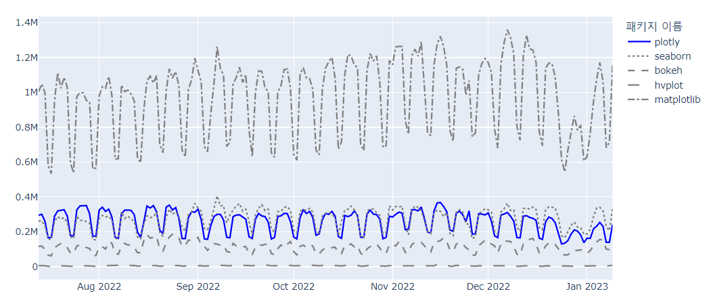
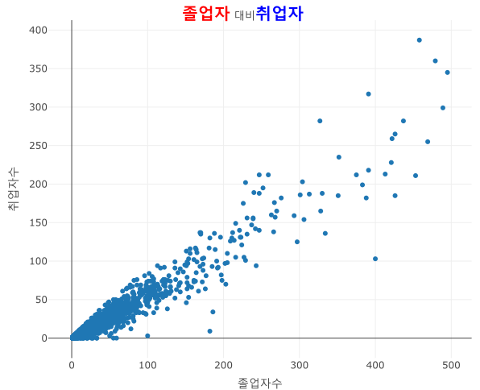

```{r setup, include=FALSE}
knitr::opts_chunk$set(echo = TRUE, message = FALSE, warning = FALSE, fig.width = 6.5, dpi = 130, eval = FALSE) # nolint
library(showtext)
showtext_auto()

library(tidyverse)
library(readxl)
library(readr)
library(lubridate)
library(plotly)

```

데이터 분석을 다루는 많은 교육 코스나 서적에서 데이터의 시각화는 R의 경우 R base나 ggplot2 패키지를 사용하는 방법, python의 경우 matplotlib이나 seaborn 패키지를 사용하는 방법을 위주로 설명한다. 이러한 방법들은 데이터 시각화 방법이 간단하고 그 품질이 좋은 편이기 때문에 많이 사용되고 있지만, 정적(Static) 시각화라는 한계를 가진다. 정적 시각화는 대부분 이미지로 저장되며 문서나 인쇄물에 많이 사용되고 웹에 게시되는 이미지로도 사용된다. 그렇기 때문에 대부분 png, jpg, pdf 등의 벡터 혹은 픽셀 이미지 파일로 제공된다. 정적 데이터 시각화는 데이터 분석가의 의도에 맞춰 작성되기 때문에 데이터 분석가의 데이터 분석 관점에 의존적일 수밖에 없으며, 시각화를 사용하는 사용자의 의도에 따른 해석은 매우 제한될 수밖에 없다.

이러한 제한점을 극복하기 위해 사용되는 데이터 시각화 방법이 동적(Dynamic) 시각화 혹은 인터랙티브(Interactive) 시각화라고 하는 방법이다. 이 동적 시각화는 시각화를 사용하는 사용자의 의도에 따라 데이터를 다각적 관점에서 살펴볼 수 있다는 점이 특징이다. 사용자의 의도에 따라 데이터가 동적으로 변동되어야 하므로 인쇄물 형태 매체에서 사용이 어렵고 웹을 통해 사용되어야 그 장점을 충실히 사용할 수 있다. R에서는 동적 시각화를 위해 rbokeh, highcharter 등이 사용되었고 python에서는 bokeh, hvplot 등을 사용되었다. 하지만 R과 python 모두에서 사용되는 plotly 패키지가 등장함으로써 R과 python의 동적 시각화 패키지 시장에서 매우 빠르게 사용자층을 넓혀가고 있다.

정적 시각화와 동적 시각화의 어느 것이 더 효용성이 있는지를 단언할 수 없다. 데이터 시각화가 사용되는 매체, 데이터 시각화를 보는 대상, 데이터 시각화에서 보여주고자 하는 스토리에 따라서 정적 시각화를 사용해야 할 때와 동적 시각화를 사용해야 할 때를 적절히 선택해야 한다.

# plotly란?
# plotly란?

plotly는 캐나다 몬트리올에 본사를 두고 있는 데이터 시각화 전문 회사의 이름이다. 이 회사는 2012년 처음 설립되었는데 데이터 전문 분석 도구와 데이터 시각화 전문 도구를 개발하여 보급한다. 'plotly'는 이 책에서 설명할 R과 python의 plotly 패키지 외에도 R, python, Julia 등의 개발도구에서 사용할 수 있는 데이터 대시보드 플랫폼인 dash를 비롯해 dash 플랫폼으로 개발된 웹페이지를 배포하기 위한 'Dash Enterprise', plotly를 기반으로 온라인 동적 시각화를 만드는 'Chart Studio Cloud' 등의 서비스를 제공하고 있다. 이 중 가장 유명한 제품이 회사의 이름에서도 나타나듯이 plotly 시각화 패키지이다.


plotly 패키지는 R, python, Julia, Java Script, F#, MATLAB 등의 다양한 언어에서 사용이 가능하도록 각각의 언어에 바인딩 되는 패키지를 개발하여 제공하고 있다. plotly에서 제공하는 데이터 시각화는 산점도, 선 그래프와 같은 기본 차트(Basic Chart), 박스 플롯, 히스토그램과 같은 통계 차트(Statistical Chart), 히트맵, 삼각 플롯(Ternary Plot)과 같은 과학 차트(Scienctific Chart), 시계열 차트, 캔들 차트와 같은 재정 차트(Finantial Chart) 등의 다양한 차트와 플롯을 제공한다.


다음의 R 그래픽 패키지 다운로드 현황에서 보이듯이, 여전히 R에서 가장 많이 사용되고 있는 그래픽 패키지는 ggplot2이다. 하지만 plotly는 2021년 하반기부터 다운로드가 늘고 있고, ggplot2를 제외한 다른 그래픽 패키지보다는 압도적인 다운로드 수를 보인다.

```{r echo = FALSE}
library(dlstats)

#x <- cran_stats(c("ggplot2", "plotly", "rbokeh", "highcharter"))
x1 <- cran_stats(c("ggplot2", "plotly", "rbokeh", "highcharter", 'lattice', 'esquisse', 'leaflet', 'dygraphs', 'ggvis', 'colourpicker', 'patchwork', 'ggforce'))

x1 |> plot_ly() |> #filter(package != 'ggplot2') |> 
  add_lines(x = ~end, y = ~downloads, color = ~package, colors = ~ifelse(package == 'plotly', 'darkblue', 'gray'))

```


plotly의 다운로드 수 증가는 python에서도 유사한 흐름을 보인다. 다음의 그림에서도 보이듯이 python에서 많이 사용되는 시각화 패키지 중 가장 다운로드 수가 많은 것은 역시나 matplotlib이다. 하지만 matplotlib을 제외하면 2022년 중순까지만 해도 seaborn 패키지의 다운로드 수가 가장 많았으나 이후 plotly가 seaborn과 대등하거나 오히려 더 다운로드가 많은 날이 상당히 눈에 띈다. 하지만 python에서 동적 시각화를 지원하는 bokeh나 hvplot보다는 월등히 많은 다운로드를 보인다. 결국 python에서도 동적 시각화에서는 plotly가 가장 많이 사용되는 패키지이다.



# 예제 데이터 Import와 전처리

먼저 plotly를 사용하여 시각화를 실습하는데 필요한 데이터 셋 두 가지를 전처리하겠다.

## Covid19 데이터 셋

첫 번째 데이터 셋은 2020년 1월부터 기록된 전 세계 국가의 코로나19 발병 관련 데이터이다. 이 데이터는 Github에서 전 세계 데이터를 배포하는 'Open World in Data'에서 제공하는 'COVID-19 Dataset by Our World in Data'를 사용한다.[^1] 이 데이터는 온라인으로 매일 업데이트되기 때문에 다운로드 시점에 따라 시각화 결과가 책과 다소 달라질 수 있다.[^2]

[^1]: <https://covid.ourworldindata.org/data/owid-covid-data.csv>

[^2]: 필자의 블로그(\<2stndard.tistory.com\>)에 업로드된 데이터를 활용하면 책과 동일한 결과를 얻을 수 있다.

OWID에서 제공하는 데이터를 활용하여 4개의 데이터 세트를 만든다. 첫 번째 데이터 세트는 OWID에서 제공하는 원본 데이터를 가져와서 로딩하는 원본 데이터 세트로 'df_covid19' 데이터프레임에 저장한다. 'df_covid19' 데이터프레임은 2020년 1월 1일부터 기록되어 있기 때문에 데이터가 다소 많다. 따라서 이 데이터 중에 최근 100일간의 데이터와 한국과 각 대륙 데이터만을 필터링한 데이터 세트를 두 번째 데이터 세트인 'df_covid19_100' 데이터프레임으로 저장한다. 세 번째 데이터 셋은 100일간의 데이터 세트를 넓은 형태의 데이터 세트로 변환한 'df_covid19_100_wide'로 저장한 데이터프레임이다. 네 번째는 2년 넘게 기록된 Covid19 데이터 세트의 각종 데이터를 국가별 요약 통계치를 산출하여 저장한 'df_covid19_stat' 데이터프레임이다.

-   R

```{r eval = FALSE, message = FALSE, warning = FALSE}
##  R code
## 데이터 전처리를 위한 패키지 설치 및 로딩
if(!require(tidyverse)) {
  install.packages('tidyverse')
  library(tidyverse) }

if(!require(readxl)) {
  install.packages('readxl')
  library(readxl) }

if(!require(readr)) {
  install.packages('readr')
  library(readr) }

if(!require(lubridate)) {
  install.packages('lubridate')
  library(lubridate) }


## 1. covid19 원본 데이터 셋 로딩
## covid19 데이터 로딩(파일을 다운로드 받은 경우)
df_covid19 <- read_csv(file = "데이터파일저장경로/owid-covid-data.csv",
                            col_types = cols(date = col_date(format = "%Y-%m-%d")
                                             )
                            )
## covid19 데이터 로딩(온라인에서 바로 로딩할 경우)
 df_covid19 <- read_csv(file = "https://covid.ourworldindata.org/data/owid-covid-data.csv",
                             col_types = cols(Date = col_date(format = "%Y-%m-%d")
                                              )
                             )
## 2. 전체 데이터셋 중 최근 100일간의 데이터를 필터링한 df_covid19_100 생성
df_covid19_100 <- df_covid19 %>% 
  ## 한국 데이터와 각 대륙별 데이터만을 필터링
  filter(iso_code %in% c('KOR', 'OWID_ASI', 'OWID_EUR', 'OWID_OCE', 'OWID_NAM', 'OWID_SAM', 'OWID_AFR')) %>%
  ## 읽은 데이터의 마지막 데이터에서 100일전 데이터까지 필터링
  filter(date >= max(date) - 100) %>%
  ## 국가명을 한글로 변환
  mutate(location = case_when(
    location == 'South Korea' ~ '한국', 
    location == 'Asia' ~ '아시아', 
    location == 'Europe' ~ '유럽', 
    location == 'Oceania' ~ '오세아니아', 
    location == 'North America' ~ '북미', 
    location == 'South America' ~ '남미', 
    location == 'Africa' ~ '아프리카')) %>%
  ## 국가 이름의 순서를 설정 
  mutate(location = fct_relevel(location, '한국', '아시아', '유럽', '북미', '남미', '아프리카', '오세아니아')) %>%
  ## 날짜로 정렬
  arrange(date)


## 3. df_covid19_100을 한국과 각 대륙별열로 배치한 넓은 형태의 데이터프레임으로 변환
df_covid19_100_wide <- df_covid19_100 |>
  ## 날짜, 국가명, 확진자와, 백신접종완료자 데이터만 선택
  select(date, location, new_cases, people_fully_vaccinated_per_hundred) |>
  ## 열 이름을 적절히 변경
  rename('date' = 'date', '확진자' = 'new_cases', '백신접종완료자' = 'people_fully_vaccinated_per_hundred') |>
  ## 넓은 형태의 데이터로 변환
  pivot_wider(id_cols = date, names_from = location, 
              values_from = c('확진자', '백신접종완료자')) |>
  ## 날짜로 정렬
  arrange(date)

## 4. covid19 데이터를 국가별로 요약한 df_covid19_stat 생성
df_covid19_stat <- df_covid19 |> 
  group_by(iso_code, continent, location) |>
  summarise(인구수 = max(population, na.rm = T), 
            전체사망자수 = sum(new_deaths, na.rm = T), 
            백신접종자완료자수 = max(people_fully_vaccinated, na.rm = T),
            인구백명당백신접종완료율 = max(people_fully_vaccinated_per_hundred, na.rm = T),
            인구백명당부스터접종자수 = max(total_boosters_per_hundred, na.rm = T)) |> 
    ungroup() |>
    mutate(십만명당사망자수 = round(전체사망자수 / 인구수 *100000, 5),
           백신접종완료율 = 백신접종자완료자수 / 인구수)

## 여백 설정을 위한 변수 설정
margins_R <- list(t = 50, b = 25, l = 25, r = 25)

```

```{r echo = TRUE, message = FALSE, warning = FALSE, eval = TRUE}
df_covid19 <- read_csv(file = "D:/R/data/Rnpy/owid-covid-data.csv",
                            col_types = cols(date = col_date(format = "%Y-%m-%d")
                                             )
                            )
df_covid19_100 <- df_covid19 |> 
  filter(iso_code %in% c('KOR', 'OWID_ASI', 'OWID_EUR', 'OWID_OCE', 'OWID_NAM', 'OWID_SAM', 'OWID_AFR')) |>
  filter(date >= max(date) - 100) |>
  mutate(location = case_when(
    location == 'South Korea' ~ '한국', 
    location == 'Asia' ~ '아시아', 
    location == 'Europe' ~ '유럽', 
    location == 'Oceania' ~ '오세아니아', 
    location == 'North America' ~ '북미', 
    location == 'South America' ~ '남미', 
    location == 'Africa' ~ '아프리카')) |>
  mutate(location = fct_relevel(location, '한국', '아시아', '유럽', '북미', '남미', '아프리카', '오세아니아')) |>
  arrange(date)

df_covid19_100_wide <- df_covid19_100 |>
  select(date, location, new_cases, people_fully_vaccinated_per_hundred) |>
  rename('date' = 'date', '확진자' = 'new_cases', '백신접종완료자' = 'people_fully_vaccinated_per_hundred') |>
  pivot_wider(id_cols = date, names_from = location, 
              values_from = c('확진자', '백신접종완료자')) |>
  arrange(date)

df_covid19_stat <- df_covid19 |> 
  group_by(iso_code, continent, location) |>
  summarise(인구수 = max(population, na.rm = T), 
            전체사망자수 = sum(new_deaths, na.rm = T), 
            백신접종자완료자수 = max(people_fully_vaccinated, na.rm = T),
            인구백명당백신접종완료율 = max(people_fully_vaccinated_per_hundred, na.rm = T),
            인구백명당부스터접종자수 = max(total_boosters_per_hundred, na.rm = T)) |> 
    ungroup() |>
    mutate(십만명당사망자수 = round(전체사망자수 / 인구수 *100000, 5),
           백신접종완료율 = 백신접종자완료자수 / 인구수)

margins_R <- list(t = 50, b = 25, l = 25, r = 25)

```

-   python

```{python echo = TRUE, message = FALSE, warning = FALSE, eval = FALSE}
## 필요한 라이브러리 로딩
import pandas as pd
from datetime import datetime, timedelta
from pandas.api.types import CategoricalDtype

## 1. covid19 원본 데이터 셋 로딩
## covid19 데이터 로딩(파일을 다운로드 받은 경우)
df_covid19 = pd.read_csv("데이터파일저장경로/owid-covid-data.csv")

## covid19 데이터 로딩(온라인에서 바로 로딩할 경우)
##df_covid19 = pd.read_csv("https://covid.ourworldindata.org/data/owid-covid-data.csv")

## 2. 전체 데이터셋 중 최근 100일간의 데이터를 필터링한 df_covid19_100 생성
##df_covid19['date']를 datetime으로 변환
df_covid19['date'] = pd.to_datetime(df_covid19['date'], format="%Y-%m-%d")

## 대륙 데이터와 최종 데이터로부터 100일전 데이터 필터링
df_covid19_100 = df_covid19[(df_covid19['iso_code'].isin(['KOR', 'OWID_ASI', 'OWID_EUR', 'OWID_OCE', 'OWID_NAM', 'OWID_SAM', 'OWID_AFR'])) & (df_covid19['date'] >= (max(df_covid19['date']) - timedelta(days = 100)))]

##  대륙명을 한글로 변환
df_covid19_100.loc[df_covid19_100['location'] == 'South Korea', "location"] = '한국'
df_covid19_100.loc[df_covid19_100['location'] == 'Asia', "location"] = '아시아'
df_covid19_100.loc[df_covid19_100['location'] == 'Europe', "location"] = '유럽'
df_covid19_100.loc[df_covid19_100['location'] == 'Oceania', "location"] = '오세아니아'
df_covid19_100.loc[df_covid19_100['location'] == 'North America', "location"] = '북미'
df_covid19_100.loc[df_covid19_100['location'] == 'South America', "location"] = '남미'
df_covid19_100.loc[df_covid19_100['location'] == 'Africa', "location"] = '아프리카'

## 이산형 변수 설정
ord = CategoricalDtype(categories = ['한국', '아시아', '유럽', '북미', '남미', '아프리카', '오세아니아'], ordered = True)

df_covid19_100['location'] = df_covid19_100['location'].astype(ord)

## date로 정렬
df_covid19_100 = df_covid19_100.sort_values(by = 'date')

## 3. df_covid19_100을 한국과 각 대륙별열로 배치한 넓은 형태의 데이터프레임으로 변환
df_covid19_100_wide = df_covid19_100.loc[:,['date', 'location', 'new_cases', 'people_fully_vaccinated_per_hundred']].rename(columns={'new_cases':'확진자', 'people_fully_vaccinated_per_hundred':'백신접종완료자'})

df_covid19_100_wide = df_covid19_100_wide.pivot(index='date', columns='location', values=['확진자', '백신접종완료자']).sort_values(by = 'date')

df_covid19_100_wide.columns = ['확진자_한국', '확진자_아시아', '확진자_유럽', '확진자_북미', '확진자_남미', '확진자_아프리카','확진자_오세아니아',
                              '백신접종완료자_한국', '백신접종완료자_아시아', '백신접종완료자_유럽', '백신접종완료자_북미', '백신접종완료자_남미', '백신접종완료자_아프리카','백신접종완료자_오세아니아']
                              
## 4. covid19 데이터를 국가별로 요약한 df_covid19_stat 생성
df_covid19_stat = df_covid19.groupby(['iso_code', 'continent', 'location'], dropna=True).agg(
    인구수 = ('population', 'max'),
    전체사망자수 = ('new_deaths', 'sum'), 
    백신접종자완료자수 = ('people_fully_vaccinated', 'max'),
    인구백명당백신접종완료율 = ('people_fully_vaccinated_per_hundred', 'max'),
    인구백명당부스터접종자수 = ('total_boosters_per_hundred', 'max')

).reset_index()

df_covid19_stat['십만명당사망자수'] = round(df_covid19_stat['전체사망자수'] / df_covid19_stat['인구수'] *100000, 5)

df_covid19_stat['백신접종완료율'] = df_covid19_stat['백신접종자완료자수'] / df_covid19_stat['인구수']

## 여백 설정을 위한 변수 설정
margins_P = {'t' : 50, 'b' : 25, 'l' : 25, 'r' : 25}

```

```{python eval = FALSE, echo = FALSE, message = FALSE, warning = FALSE}
## 필요한 라이브러리 로딩
import pandas as pd
from datetime import datetime, timedelta
from pandas.api.types import CategoricalDtype
import plotly.graph_objects as go

## 1. covid19 원본 데이터 셋 로딩
## covid19 데이터 로딩(파일을 다운로드 받은 경우)
df_covid19 = pd.read_csv("D:/R/data/Rnpy/owid-covid-data.csv")

## covid19 데이터 로딩(온라인에서 바로 로딩할 경우)
##df_covid19 = pd.read_csv("https://covid.ourworldindata.org/data/owid-covid-data.csv")

df_covid19['date'] = pd.to_datetime(df_covid19['date'], format="%Y-%m-%d")

df_covid19_100 = df_covid19[(df_covid19['iso_code'].isin(['KOR', 'OWID_ASI', 'OWID_EUR', 'OWID_OCE', 'OWID_NAM', 'OWID_SAM', 'OWID_AFR'])) & (df_covid19['date'] >= (max(df_covid19['date']) - timedelta(days = 100)))]


df_covid19_100.loc[df_covid19_100['location'] == 'South Korea', "location"] = '한국'
df_covid19_100.loc[df_covid19_100['location'] == 'Asia', "location"] = '아시아'
df_covid19_100.loc[df_covid19_100['location'] == 'Europe', "location"] = '유럽'
df_covid19_100.loc[df_covid19_100['location'] == 'Oceania', "location"] = '오세아니아'
df_covid19_100.loc[df_covid19_100['location'] == 'North America', "location"] = '북미'
df_covid19_100.loc[df_covid19_100['location'] == 'South America', "location"] = '남미'
df_covid19_100.loc[df_covid19_100['location'] == 'Africa', "location"] = '아프리카'

ord = CategoricalDtype(categories = ['한국', '아시아', '유럽', '북미', '남미', '아프리카', '오세아니아'], ordered = True)

df_covid19_100['location'] = df_covid19_100['location'].astype(ord)

df_covid19_100 = df_covid19_100.sort_values(by = 'date')

df_covid19_100_wide = df_covid19_100.loc[:,['date', 'location', 'new_cases', 'people_fully_vaccinated_per_hundred']].rename(columns={'new_cases':'확진자', 'people_fully_vaccinated_per_hundred':'백신접종완료자'})

df_covid19_100_wide = df_covid19_100_wide.pivot(index='date', columns='location', values=['확진자', '백신접종완료자']).sort_values(by = 'date')

df_covid19_100_wide.columns = ['확진자_한국', '확진자_아시아', '확진자_유럽', '확진자_북미', '확진자_남미', '확진자_아프리카','확진자_오세아니아',
                              '백신접종완료자_한국', '백신접종완료자_아시아', '백신접종완료자_유럽', '백신접종완료자_북미', '백신접종완료자_남미', '백신접종완료자_아프리카','백신접종완료자_오세아니아']
                              
df_covid19_stat = df_covid19.groupby(['iso_code', 'continent', 'location'], dropna=True).agg(
    인구수 = ('population', 'max'),
    전체사망자수 = ('new_deaths', 'sum'), 
    백신접종자완료자수 = ('people_fully_vaccinated', 'max'),
    인구백명당백신접종완료율 = ('people_fully_vaccinated_per_hundred', 'max'),
    인구백명당부스터접종자수 = ('total_boosters_per_hundred', 'max')

).reset_index()

df_covid19_stat['십만명당사망자수'] = round(df_covid19_stat['전체사망자수'] / df_covid19_stat['인구수'] *100000, 5)

df_covid19_stat['백신접종완료율'] = df_covid19_stat['백신접종자완료자수'] / df_covid19_stat['인구수']

## 여백 설정을 위한 변수 설정
margins_P = {'t' : 50, 'b' : 25, 'l' : 25, 'r' : 25}

```

## 대학 학과 취업률 데이터 셋

최근 청년층 실업 문제가 사회적 문제로 대두됨에 따라 대학 졸업생의 취업률은 매우 중요하게 활용되고 있는 데이터이다. 이 데이터는 대학 입학을 앞둔 수험생이나 학부모에게 대학 진학을 위한 학과 선택에 중요한 데이터이고 대학 입장에서는 학생들의 진로 지도를 위해 중요하게 사용되는 데이터이다. 이 데이터는 교육통계서비스 홈페이지에서 제공한다.[^3]

[^3]: 해당 데이터는 교육통계 서비스 홈페이지<https://kess.kedi.re.kr/contents/dataset?itemCode=04&menuId=m_02_04_03_02&tabId=m3>에서 다운로드를 받거나 필자의 블로그(2stndard.tistory.com)에서 다운로드 받을 수 있다.

취업률 데이터 세트는 다음과 같이 데이터를 로딩하고 전처리한다.

-   R

```{r message = FALSE, warning = FALSE}
##  대학 학과 취업률 데이터 로딩
df_취업률 <- read_excel('데이터파일저장경로/2021년 학과별 고등교육기관 취업통계.xlsx', 
                     ## '학과별' 시트의 데이터를 불러오는데,
                     sheet = '학과별',
                     ## 앞의 13행을 제외하고
                     skip = 13, 
                     ## 첫번째 행은 열 이름으로 설정
                     col_names = TRUE, 
                     ## 열의 타입을 설정, 처음 9개는 문자형으로 다음 79개는 수치형으로 설정
                     col_types = c(rep('text', 9), rep('numeric', 79)))

## df_취업률에서 첫번째부터 9번째까지의 열과 '계'로 끝나는 열을 선택하여 다시 df_취업률에 저장
df_취업률 <- df_취업률 |> 
  select(1:9, ends_with('계'), '입대자')

## df_취업률에서 졸업자가 500명 이하인 학과 중 25% 샘플링
df_취업률_500 <- df_취업률 |> 
  filter(졸업자_계 < 500) |>
  mutate(id = row_number()) |>
  filter(row_number() %in% seq(from = 1, to = nrow(df_취업률), by = 4))

## 열 이름을 적절히 설정
names(df_취업률_500)[10:12] <- c('졸업자수', '취업률', '취업자수')

```

```{r message = FALSE, warning = FALSE, echo=FALSE}
## R 코드

df_취업률 <- read_excel('D:/R/data/Rnpy/2021년 학과별 고등교육기관 취업통계.xlsx', 
                     ## '학과별' 시트의 데이터를 불러오는데,
                     sheet = '학과별',
                     ## 앞의 13행을 제외하고
                     skip = 13, 
                     ## 첫번째 행은 열 이름으로 설정
                     col_names = TRUE, 
                     ## 열의 타입을 설정, 처음 9개는 문자형으로 다음 79개는 수치형으로 설정
                     col_types = c(rep('text', 9), rep('numeric', 79)))

## df_취업률에서 첫번째부터 9번째까지의 열과 '계'로 끝나는 열을 선택하여 다시 df_취업률에 저장
df_취업률 <- df_취업률 |> 
  select(1:9, ends_with('계'), '입대자')

## df_취업률에서 졸업자가 500명 이하인 학과 2000개 샘플링
df_취업률_500 <- df_취업률 |> 
  filter(졸업자_계 < 500) |>
  mutate(id = row_number()) |>
  filter(row_number() %in% seq(from = 1, to = nrow(df_취업률), by = 4))

## 열 이름을 적절히 설정
names(df_취업률_500)[10:12] <- c('졸업자수', '취업률', '취업자수')

```

-   python

```{python eval = FALSE, message = FALSE, warning = FALSE}
## python 코드
##  대학 학과 취업률 데이터 로딩

df_취업률 = pd.read_excel("데이터파일저장경로/2021년 학과별 고등교육기관 취업통계.xlsx", 
                     ## '학과별' 시트의 데이터를 불러오는데,
                          sheet_name = '학과별',
                     ## 앞의 13행을 제외하고
                          skiprows=(13),
                     ## 첫번째 행은 열 이름으로 설정
                          header = 0)

## df_취업률에서 첫번째부터 9번째까지의 열과 '계'로 끝나는 열을 선택하여 다시 df_취업률에 저장
df_취업률 = pd.concat([df_취업률.iloc[:, 0:8], 
                    df_취업률.loc[:, df_취업률.columns.str.endswith('계')], 
                    df_취업률.loc[:, '입대자']], 
                   axis = 1
                   )

## df_취업률에서 졸업자가 500명 이하인 학과 중 25% 샘플링
df_취업률_500 = df_취업률.loc[(df_취업률['졸업자_계'] < 500)]

df_취업률_500 = df_취업률_500.iloc[range(0, len(df_취업률_500.index) , 4)]

df_취업률_500 = df_취업률_500.rename(columns = {'졸업자_계':'졸업자수', '취업률_계':'취업률', '취업자_합계_계':'취업자수'})

```

```{python echo = FALSE, message = FALSE, warning = FALSE}
######################################   
## python 코드
## 대학 학과 취업률 데이터 셋

df_취업률 = pd.read_excel("d:/R/data/Rnpy/2021년 학과별 고등교육기관 취업통계.xlsx", 
                           sheet_name = '학과별',
                           skiprows=(13), 
                           header = 0)

df_취업률 = pd.concat([df_취업률.iloc[:, 0:8], 
                    df_취업률.loc[:, df_취업률.columns.str.endswith('계')], 
                    df_취업률.loc[:, '입대자']], 
                   axis = 1
                   )

df_취업률_500 = df_취업률.loc[(df_취업률['졸업자_계'] < 500)]

df_취업률_500 = df_취업률_500.iloc[range(0, len(df_취업률_500.index) , 4)]

df_취업률_500 = df_취업률_500.rename(columns = {'졸업자_계':'졸업자수', '취업률_계':'취업률', '취업자_합계_계':'취업자수'})

```

# plotly의 구조

plotly 객체는 plotly.js에서 정의된 JSON 스키마로 저장된다. 이 스키마는 트리 형태로 구성되어 있는데 각 노드는 속성(attribute)으로 불리는 값을 가지게 되고 이들 속성이 모여서 전체 그림(Figure)을 구성한다.

plotly 객체 트리의 루트 노드에 바로 아래인 최고 레벨 속성은 'data', 'layout', 'frame'의 세 가지 속성이다. 이 세 가지 속성의 세부 속성들이 설정되어 시각화를 구성하는데 이들 속성은 부모 속성과 자식 속성으로 구성되는 트리 형태의 JSON 구조로 구성된다. 이 구성은 R과 python이 동일하지만, 그 구성 방법은 다소 다르다.

-   R

R에서는 plotly 구조를 구성하기 위해서 먼저 `plot_ly()`를 사용하여 plotly 객체를 초기화하여야 한다. 이후 세 가지 방법을 사용할 수 있다.

첫 번째 방법은 `add_trace()`와 `layout()`을 사용하는 방법이다. 이 두 가지 함수를 사용하기 위해서는 먼저 `plot_ly()`로 이 초기화된 plotly 객체에 `add_trace()`를 사용하여 'data'의 하위 속성들을 구성하고 `layout()`을 사용하여 'layout'의 하위 속성들을 구성한다.

두 번째 방법은 이 함수들을 사용하지 않고 `plot_ly()`에 직접 'data'와 'layout' 속성들을 설정할 수 있다. 이 방법은 plotly 구조를 하나하나 설정해야하기 때문에 구현하는 데 어려움이 있다.

세 번째 방법은 `add_trace()` 대신 트레이스 종류에 따라 제공되는 `add_*()`(`add_markers()`, `add_lines()`, `add_bars()` 등)을 사용하여 'data' 속성들을 구성하고 `layout()`을 사용하여 'layout' 속성들을 설정한다.

-   python

python에서 plotly를 설명하기 위해서는 먼저 plotly에서 제공하는 라이브러리의 종류를 이해하여야 한다. plotly에서는 python을 위한 라이브러리로 `plotly.graph_objects`와 `plotly.express`의 두 가지 라이브러리 모듈을 제공한다. 기본적으로 `plotly.graph_objects` 모듈이 plotly에서 제공하는 모든 기능을 사용하는 정규 방법이다. 하지만 `plotly.graph_objects`에서 제공하는 수많은 속성 중에 자주 사용되는 속성과 이들 속성을 설정하는 다소 쉬운 인터페이스로 설계한 함수들로 구성한 모듈이 `plotly.express` 이다.

`plotly.express`에서 제공하는 함수들은 `plotly.graphic_object`보다 직관적이고 사용하기 쉽다. plotly는 'data' 속성과 'layout' 속성이 루트 노드인 속성들의 트리 구조로 구현하기 때문에 이들 구조를 파악하는 것이 매우 중요하지만 그 양도 많고 구조도 복잡하다.

`plotly.express`에서 제공하는 함수들은 이 속성들을 트리 형태로 구성하지 않고 모두 매개 변수의 형태로 설정하는 방법을 사용하기 때문에 일반적 함수의 사용과 비슷해서 사용하기 쉽다는 장점이 있다. 또 `plotly.graph_objects`의 함수들보다 코드의 길이가 매우 짧아진다는 장점도 있다.

하지만 `plotly.express`는 결정적인 몇 가지 단점이 있다. 첫 번째 단점은 'mesh'나 'isosurface'와 같은 3차원 시각화는 아직 `plotly.express`에서는 지원하지 않는다. 두 번째는 여러 개의 trace를 가지는 서브플롯, 다중 축의 사용, 여러 개의 trace를 가지는 패싯(facet)과 같은 시각화는 `plotly.express`로 생성하는 데 다소 어려움이 있다. 따라서 `plotly.express`로는 다소 복잡한 plotly 객체를 생성하는 데에는 한계가 있어 `plotly.graphic_objects`의 함수들을 사용하여 보완해주어야 한다. 또 `plotly.graphic_objects`에서 제공하는 함수와 `plotly.express`에서 제공하는 함수의 속성도 다소 차이가 있기 때문에 `plotly.express`는 사용이 간편하긴 하지만 사용할 때는 사용법을 잘 확인하고 사용해야 한다.[^4]

[^4]: 본 책에서는 `plotly.graph_objects` 위주로 설명한다. `plotly.express`의 사용법은 <https://plotly.com/python-api-reference/> 을 참조하라.

`plotly.graph_objects` 모듈은 plotly 객체를 만들기 위해서는 먼저 plotly 객체를 초기화해야 한다. 이를 위해 `plotly.graph_objects`의 `Figure()`를 사용하여 초기화된 plotly 객체를 생성한다.

이 후 초기화된 plotly 객체에 'data', 'layout' 속성을 할당하기 위해 `plotly.graph_objects.add_trace()`와 `plotly.graph_objects.update_layout()`을 사용한다.

## plotly 속성의 설정

plotly는 시각화 생성을 위한 다양한 속성 데이터를 트리 형태로 구조화한 JSON 객체라고 소개하였다. 따라서 plotly를 구성하는데 사용하는 함수들은 대부분 이 속성 데이터를 트리 구조의 JSON 객체로 구조화하는 데 사용한다. 이렇게 속성 데이터를 트리 형태로 구조화하는 방법은 R과 python이 유사하지만 약간의 차이가 있다.

-   R

R에서 plotly의 속성 트리를 만들기 위해서는 리스트 데이터 타입을 사용한다. 리스트 데이터 타입은 벡터와는 다소 다른데 벡터는 벡터를 구성하는 원소들의 데이터 타입이 모두 같아야 하지만 리스트는 리스트를 구성하는 원소들의 데이터 타입이 서로 다를 수 있다. 특히 plotly에서 사용하는 리스트는 원소의 이름이 붙은 네임드 리스트(named list)를 사용한다.

R에서 네임드 리스트를 만들기 위해서는 `list()`를 사용하는데 속성명과 속성값은 '=' 기호를 사용하여 서로 할당해 준다. 속성값은 또다시 벡터나 리스트의 설정이 가능한데, 이 기능을 사용해 plotly의 전체 트리 구조를 만드는 데 사용한다. plotly에서 특정 속성의 하위 속성들이 존재하면 해당 하위 속성들을 다시 `list()`를 사용하여 네임드 리스트로 구성한다.

예를 들어 `layout = list(title = list(text = '타이틀 제목')))`이라는 코드는 'layout'에 리스트를 할당하는데, 이 리스트는 속성명이 'title'이고 속성값은 다시 리스트로 구성된 속성값을 가진다. 결국 하위 속성인 'title' 속성, 이 'title' 속성의 하위 속성인 'text' 속성값을 '타이틀 제목'으로 설정한다.

이렇게 구성된 plotly 객체의 속성과 속성값은 '.'을 사용한 속성값의 구조적 경로(Path)를 통해 접근할 수 있다. 앞서 예를 들었던 `layout = list(title = list(text = '타이틀 제목')))`에 바로 접근하려면 `layout.title.text`를 사용하여 접근할 수 있다. 이 방법을 사용하여 plotly 객체의 속성값을 추출하거나 해당 속성값을 바로 바꾸어 줄 수 있다.

-   python

python에서 plotly의 속성 트리를 만드는 것은 R보다 다소 복잡하다. python에서 속성 트리를 만드는 데 사용하는 데이터 타입은 딕셔너리이다. 하지만 하나의 속성에 여러 개의 딕셔너리가 구성되어야 하는 경우는 다시 python의 리스트로 구성한다. 결국 속성값들의 집합을 만드는 것은 딕셔너리를 사용하지만 딕셔너리의 집합은 리스트를 사용한다는 것이다.

python에서 딕셔너리를 구성하는 방법도 두 가지인데, plotly에서는 이 두 가지 방법을 모두 지원한다.

첫 번째 방법은 `{}` 기호를 사용하는 방법이다. 이 방법은 속성명을 지정할 때 반드시 인용부호(작은따옴표 혹은 큰따옴표)를 사용해야 하고 할당 기호로 ':'를 사용한다.

두 번째 방법은 `dict()`를 사용한다. `dict()`는 `{}`와는 달리 속성명을 지정할 때 인용부호를 사용하지 않아도 되고 할당 기호로 '='를 사용한다.

이렇게 속성명과 속성값으로 구성된 딕셔너리 여러 개를 하나의 속성에 할당할 때는 리스트 데이터 타입을 사용한다. 리스트 데이터 타입은 대괄호(`[]`)로 묶어준다.

## plotly 설치와 로딩

plotly를 사용하기 위해서는 먼저 R과 python에 plotly 패키지와 라이브러리를 설치하여야 한다. plotly 패키지는 자체적으로 실행할 수 있는 HTML 파일과 시각화를 작성하는 데 필요한 많은 것이 포함되어 있다.

-   R

R에서 plotly는 이미 공식 CRAN에 등록되어 있기 때문에 `install.packages()`를 사용하여 설치할 수 있다. 설치한 이후 R에서 'plotly'를 사용하기 위해서는 `library()`나 `require()`로 plotly 패키지를 로딩하고 사용할 수 있다. 다음과 같이 패키지를 설치하고 로딩할 수 있다.

```{r message=FALSE, warning=FALSE}
if(!require(plotly)) {        ## plotly 로딩이 안되면
  install.packages('plotly')  ## plotly  패키지 설치
  library(plotly)             ## plotly 패키지 로딩
}

```

-   python

python에서 plotly를 설치하기 위해서는 `pip`를 다음과 같이 실행하여 설치한다.

```{python}
$ pip install plotly    ## pip를 사용해 plotly 설치
```

또는 콘다에서 다음과 같이 실행하여 설치한다.

```{python}
$ conda install -c plotly plotly  ## conda를 사용해 plotly 설치
```

## plotly 초기화

plotly를 사용하기 위해서는 가장 먼저 해야 하는 것은 plotly 객체의 초기화이다. 이는 R과 python에서 모두 수행해야 하는 과정이다. plotly객체를 초기화하면 plotly.js에서 사용될 수 있는 JSON 형태의 객체가 생성된다. 이 객체에 다양한 시각화 속성들을 추가함으로써 전체 시각화를 완성한다.

-   R

R에서 plotly를 초기화하기 위해 `plot_ly()`를 사용한다. `plot_ly()`는 특별한 매개변수 없이 사용이 가능하지만 일반적으로 사용할 데이터프레임을 바인딩하는 경우가 많다. `tidyverse`에서 제공하는 `%>%`나 R base에서 제공하는 `|>`를 사용하여 `plot_ly()`에 사용할 데이터프레임을 바인딩하거나 `plot_ly()`의 매개변수로 데이터프레임을 바인딩하면 초기화된 plotly 객체가 생성된다.

```{r}
## R에서 plotly 객체 초기화
df_covid19_100 |> 
  plot_ly()

```

-   python

python에서 plotly를 초기화하기 위해서는 `plotly.graph_objects.Figure()`를 사용한다. 앞서 R에서는 plotly를 초기화할 때 사용하는 데이터프레임을 바인딩했지만 python에서는 초기화 때 데이터프레임을 바인딩하지 않는다. 하지만 `plotly.express` 모듈 함수는 해당 함수에서 사용하는 데이터프레임을 plotly 객체에 바인딩하는 기능을 지원한다.

```{python eval = FALSE}
## python에서 plotly 객체 초기화
import plotly.graph_objects as go

fig = go.Figure()
fig.show()
```


## 'data' 속성

plotly 구조의 첫 번째 레벨 속성인 'data' 속성은 시각화를 통해 표현해야 할 데이터와 그 표현 방식을 설정하는 속성이다. 'data' 속성은 데이터를 표현하는 트레이스를 구성하는 세부 속성들을 말하고, 트레이스는 plotly로 시각화할 수 있는 그래픽적 데이터 표현 방법이다. plotly에서는 'scatter', 'pie', 'bar' 등의 40개가 넘는 트레이스를 제공한다.

40여 가지 트레이스 중에 사용하고자 하는 트레이스를 추가하기 위해서는 R과 python 모두 `add_trace()`를 사용하는데, `add_trace()`를 사용하기 위해서는 반드시 'type' 속성으로 트레이스 종류를 설정해야 한다. 하지만 'type'을 설정하지 않더라도 X축과 Y축에 바인딩 된 변수들을 계산하여 자동으로 설정하기도 하고, 각각의 트레이스에 특화된 개별 함수를 사용한다면(예를 들어 R의 `add_lines()`나 python의 `plotly.express.line()` 등) 'type' 속성을 사용할 필요는 없다.

-   R

R에서 'data' 속성은 `plot_ly()`나 `add_trace()`를 사용하여 설정한다. 'data' 속성의 첫 번째 레벨 속성들은 바로 '='을 사용하여 속성값을 할당하지만, 해당 속성이 하위 속성으로 구성되는 컨테이너 속성의 경우 R의 기본 데이터 타입인 'list'를 사용하여 묶어서 설정한다.

다음의 코드는 `plot_ly()`를 사용하여 'data' 속성을 설정하는 코드이다. 'data' 속성의 첫 레벨 속성인 'type', 'x', 'y'는 바로 속성값을 설정하지만 컨테이너 속성인 'marker'와 'line'은 `list()`를 사용하여 리스트로 구성된 속성값이 설정되었다.

```{r fig.cap = 'R의 plot_ly()를 사용한 data 속성 설정'}
## 긴 형태의 100일 코로나19 데이터에서
df_covid19_100 |> 
  ## 한국 데이터만을 필터링 
  filter(iso_code == 'KOR') |>
  ## scatter 트레이스의 markers와 lines 모드의 plotly 시각화 생성
  plot_ly(type = 'scatter', mode = 'markers+lines',
          ## X, Y 축에 변수 매핑
          x = ~date, y = ~new_cases,
          ## 마커 색상 설정
          marker = list(color = '#264E86'),
          ## 라인 색상과 대시 설정
          line = list(color = '#5E88FC', dash = 'dash')
          )

```

앞 코드의 'data' 속성 트리 구조를 도식화하면 다음의 그림과 같다.


-   python

python에서도 'data' 속성 설정을 위해 plotly 초기화 함수인 `plotly.graph_objects.Figure()`와 `add_trace()`를 사용하는 두 가지 방법이 있다.

`plotly.graph_objects.Figure()`로 'data' 속성을 설정하기 위해서는 먼저 `plotly.graph_objects` 라이브러리를 'go'로 임포트하고 `go.Figure()`의 'data' 매개 변수로 'data' 속성들로 구성된 딕셔너리를 할당한다.

다음의 코드는 `Figure()`를 사용하여 R로 만든 시각화와 동일한 시각화를 만드는 python 코드이다. 하지만 앞의 R 코드에서는 scatter 트레이스의 "markers+lines"로 'mode'를 설정해서 하나의 트레이스로 설정했지만, python의 코드에서는 markers 스캐터 트레이스와 lines 스캐터 트레이스의 두 개의 트레이스로 구성하였다.

```{python eval = FALSE}
## plotly 초기화 함수로 data 속성 값 설정
go.Figure(
    ## data 키워드로 data 속성의 설정임을 명시
    data = [{
        ## scatter 트레이스의 markers 속성 설정
        'type' : 'scatter', 'mode' : 'markers',
        ## X, Y 축에 변수 매핑
        'x' : df_covid19_100.loc[df_covid19_100['iso_code'] == 'KOR', 'date'],
        'y' : df_covid19_100.loc[df_covid19_100['iso_code'] == 'KOR', 'new_cases'], 
        ## 마커 색상 설정
        'marker' : {'color' : '#264E86'}
        }, 
        ## scatter 트레이스의 line 속성 설정
        {'type' : 'scatter', 'mode' : 'lines',
        ## X, Y 축에 변수 매핑
        'x' : df_covid19_100.loc[df_covid19_100['iso_code'] == 'KOR', 'date'],
        'y' : df_covid19_100.loc[df_covid19_100['iso_code'] == 'KOR', 'new_cases'], 
        ## 라인 색상과 대시 설정
        'line' : {'color' : '#5E88FC', 'dash' : 'dash'}
        }
    ]).show()

```


앞 python 코드로 구현한 'data' 속성의 트리 구조를 도식화하면 다음의 그림과 같다.


## 'layout' 속성

'layout' 속성은 데이터를 표현하는 트레이스와 관련되지 않는 시각화의 나머지 속성들을 정의하는 설정들의 최상위 속성이다. 'layout'에서 설정할 수 있는 속성은 시각화의 차원 축(2차원, 3차원), 여백, 제목, 축, 범례, 컬러바(색 범례), 주석 등이다. 'layout' 속성들도 하위 속성들로 구성되어 있고 이들 하위 속성들은 리프 노드로 구성된 속성도 있지만 다시 하위 속성으로 구성된 컨테이너 속성도 있다.

-   R

R에서 'layout' 속성을 설정하기 위해서는 `layout()`을 사용한다. 다만 `layout()`을 사용하기 위해서는 plotly 객체가 있어야 한다. 다음의 코드는 앞서 그린 시각화에 'layout' 속성인 'title' 속성으로 시각화 제목, 'xaxis' 속성으로 X축 설정, 'yaxis' 속성으로 Y축 설정, 'margin' 속성으로 여백 설정을 하고 있다. 이 중 'xaxis'와 'yaxis'속성은 각각의 하위 속성이 있기 때문에 다시 list로 묶어서 설정하였다.

```{r fig.cap='R의 layout 속성 설정'}
df_covid19_100 |> 
  filter(iso_code == 'KOR') |>
  plot_ly(type = 'scatter', x = ~date, y = ~new_cases, 
          mode = 'markers+lines', 
          marker = list(color = '#264E86'), 
          line = list(color = '#5E88FC', dash = 'dash')
          ) |>
  layout(                             ## layout 속성의 설정
    title = "코로나 19 발생 현황",    ## 전체 제목 설정
    xaxis = list(title = "날짜", showgrid = F), ## X축 layout 속성 설정
    yaxis = list(title = "확진자수"), ## y축 layout 속성 설정
    margin = margins_R)                ## 여백 설정

```

-   python

python에서 'layout' 속성의 설정은 'data' 속성과 같이 두 가지 방법이 제공되는데 `Figure()`를 사용하는 방법과 `update_layout()`을 사용하는 방법이 있다. `Figure()`에서의 설정은 'data' 속성의 설정과 같이 'layout' 속성들로 구성된 딕셔너리를 "layout" 매개변수에 할당한다.

다음의 코드는 앞서 그린 시각화에 'layout' 속성을 설정하는 python 코드이다. 'title' 속성으로 시각화 제목을 설정하였고, 컨테이터 속성인 'xaxis', 'yaxis' 속성에 그 하위 속성들로 구성된 딕셔너리를 할당하였다. 또 'margin' 속성으로 미리 설정된 딕셔너리로 설정하였다.

```{python eval = FALSE}
fig = go.Figure(
    data = {
        'type' : 'scatter',
        'mode' : 'markers+lines',
        'x' : df_covid19_100.loc[df_covid19_100['iso_code'] == 'KOR', 'date'],
        'y' : df_covid19_100.loc[df_covid19_100['iso_code'] == 'KOR', 'new_cases'], 
        'marker' : {'color' : '#264E86'}, 
        'line' : {'color' : '#5E88FC', 'dash' : 'dash'}
      }, 
    layout = {                          ## layout 속성의 설정
      'title' : "코로나 19 발생 현황",  ## 전체 제목 설정
      'xaxis' : {'title' : "날짜", 'showgrid' : False},  ## X축 layout 속성 설정
      'yaxis' : {'title' : "확진자수"}, ## y축 layout 속성 설정
      'margin' : margins_P              ## 여백 설정
      })

fig.show()
```


## 'frame' 속성

'frame' 속성은 plotly의 애니메이션 기능과 관련된 속성 값을 설정하는 노드이다. 이 책에서는 다루지 않겠다.

## 'plotly' 구조 확인

앞서 언급했다시피 plotly는 JSON 형태의 데이터 타입으로 구성된다. 따라서 plotly로 만들어진 데이터는 그래프의 형태로 시각화할 수도 있지만 plotly 데이터의 구조를 직접 볼 수도 있다. 이 구조를 확인하면 plotly의 속성 설정을 이해하는 데 도움을 받을 수 있다.

-   R

R에서 plotly의 구조를 확인하기 위해서는 `plotly_json()`을 사용한다.

```{r eval = TRUE}
df_covid19_100 |> 
  filter(iso_code == 'KOR') |>
  plot_ly(type = 'scatter', x = ~date, y = ~new_cases, 
          mode = 'markers+lines', 
          marker = list(color = '#264E86'), 
          line = list(color = '#5E88FC', dash = 'dash')) |>
  plotly_json(jsonedit = FALSE)   ## plotly 구조 출력

```

-   python

python에서는 `print()`를 사용하여 데이터 구조를 확인할 수 있다.

```{python eval = FALSE}
fig = go.Figure(
    data = [
      {
        'type' : 'scatter',
        'mode' : 'markers+lines',
        'x' : df_covid19_100.loc[df_covid19_100['iso_code'] == 'KOR', 'date'],
        'y' : df_covid19_100.loc[df_covid19_100['iso_code'] == 'KOR', 'new_cases'], 
        'marker' : {'color' : '#264E86'}, 
        'line' : {'color' : '#5E88FC', 'dash' : 'dash'}
      }])

print(fig)     ## plotly 구조 출력

```

# plotly 생성

앞에서 plotly 객체의 구조에 대해 살펴보았다. plotly 객체는 plotly.js가 시각화해주는 JSON 형태의 데이터 구조체일 뿐이다. 따라서 plotly를 사용하여 시각화한다는 것은 'data', 'layout', 'frame' 속성값들을 설정하여 JSON 구조를 만드는 것이다.

## data : 트레이스의 생성

데이터를 시각화하기 위해는 점이든 막대든 원이든 특정한 도형으로 데이터를 표현하여야 한다. 이렇게 데이터를 시각화한 도형 레이어를 트레이스라고 한다. 그렇다면 이 트레이스의 크기, 색상 등과 같은 세부적인 속성들을 설정할 수 있어야 하는데, 트레이스의 세부적인 특성을 설정하는 속성을 'data' 속성이라고 한다. 따라서 'data' 속성은 트레이스로 표현되고 이 트레이스들이 적절하게 구성함으로써 plotly를 만들게 된다.

plotly를 잘 이해하기 위해서는 이 트레이스를 잘 이해해야 한다. 앞서 설명한 바와 같이 트레이스는 데이터를 시각화하기 위한 그래픽적 표현방법이지만, 같은 그래픽적 표현 방법이라 하더라도 여러 개의 트레이스로 구분될 수 있다. 예를 들어 남성과 여성으로 구성된 데이터를 점 산점도로 표시한다고 하면, 그 점이 표현하는 데이터의 특성, 즉 남자와 여자의 특성에 따라 두 개의 트레이스로 구성할 수 있다. 이렇게 구성된 남자와 여자의 트레이스는 각각의 'data' 속성에 따라 크기나 색상들이 달리 표현되고 범례와 호버에 의해서 구분된다.

plotly에서 data 속성을 추가하는 것은 plotly의 초기화 함수를 사용하는 방법과 트레이스를 추가하는 함수를 사용하는 두 가지 방법이 있다.

R의 `plot_ly()`나 python의 `Figure()`와 같은 plotly 초기화 함수에서 'data' 속성을 구성하여 plotly 객체를 만들 수 있다. 하지만 이 방법은 하나의 함수 코드 길이가 길어지고 리스트와 딕셔너리의 괄호들이 많아져서 매우 복잡해진다.

따라서 이 방법보다는 `add_trace()`를 사용하여 초기화된 plotly 객체에 트레이스를 추가하는 방법이 많이 사용된다.

-   R

R에서 트레이스를 만들기 위해서는 먼저 `plot_ly()`로 초기화된 plotly 객체에 `add_trace()`나 `add_markers()`, `add_bars()`와 같이 트레이스를 추가하는 함수를 사용한다. `add_markers()`, `add_bars()`와 같이 특정 트레이스 전용 함수를 사용할 때는 해당 함수명에 이미 트레이스의 종류가 설정되어 있기 때문에 바로 해당 트레이스에 관련된 'data' 속성을 설정한다. 하지만 `add_trace()`의 경우는 모든 트레이스의 추가에 사용되는 함수이기 때문에 'type' 속성을 사용하여 먼저 어떤 형태의 트레이스인지 설정해야 한다.

`add_trace()`이든 각각의 트레이스 전용 함수이든 하나 주의해야 할 점은 `plot_ly()`의 초기화 때 바인딩 된 데이터프레임의 열을 속성값으로 할당한다면 반드시 열 이름 앞에 '\~'를 붙여줘야 한다는 것이다. 만약 `c()`를 사용하여 직접 벡터형 변수를 할당한다면'\~'없이 할당할 수 있다.

```{r fig.cap='R의 트레이스 생성'}
df_취업률_500 |> 
  filter(졸업자수 < 500) |> 
  plot_ly() |>          ## plotly 초기화
  ## scatter 트레이스에 makers 모드 설정
  add_trace(type = 'scatter', mode = 'markers',  
            x = ~졸업자수, y = ~취업자수, 
            ## marker 사이즈와 색상 설정
            marker = list(size = 3, color = 'darkblue'))

```

-   python

python에서 트레이스를 설정하기 위해서는 먼저 `plotly.graph_objects`를 사용할 것인지, `plotly.express`를 사용할 것인지를 결정해야 한다. 여기서는 `plotly.graph_objects`를 사용해서 plotly를 그리는 두 가지 방법을 설명한다.

`plotly.graph_objects`를 사용하여 plotly를 그리는 첫 번째 방법은 `add_trace()`에 'data'의 하위 속성들을 딕셔너리로 구성하여 설정하는 방법이다. `add_trace()`는 'data' 속성값들의 딕셔너리가 매개 변수로 할당되어야 하고, 이 딕셔너리가 여러 개라면 리스트로 묶어 할당한다. 각각의 딕셔너리는 먼저 'type' 속성을 사용하여 어떤 타입의 트레이스인지 설정하고 해당 트레이스에 관련한 'data' 속성들을 설정한다.

```{python eval = FALSE}
##  plotly 초기화
fig = go.Figure()

fig.add_trace({              ## 트레이스 추가 
    'type' : 'scatter',      ## scatter 트레이스
    'mode' : 'markers',  ## markers 모드
    'x' : df_취업률_500['졸업자수'], 'y' : df_취업률_500['취업자수'], 
    'marker' : { 'size' : 3, 'color' : 'darkblue'} ## marker 크기와 색상설정
    })

fig.show()
```


두 번째 방법은 `add_trace()`의 매개변수로 `plotly.graph_objects`에서 제공하는 각각의 트레이스 함수를 사용하는 것이다. `plotly.graph_objects`에서 제공하는 각각의 트레이스 함수는 약 90여 개이다. 이들을 다 외울 수는 없으니 plotly 홈페이지에서 확인하여 사용하여야 한다.

다음은 scatter 트레이스를 추가하는 `go.Scatter()`에 속성값을 설정하는데 `{}`를 사용하는 방법을 사용한 python 코드이다.

```{python eval = FALSE}
fig = go.Figure()

fig.add_trace(go.Scatter(
  {              ## data 속성들로 구성되 딕셔너리 정의
    'type' : 'scatter', 'mode' : 'markers',  
    'x' : df_취업률_500['졸업자수'], 'y' : df_취업률_500['취업자수'],
    'marker' : {'size' : 3, 'color' : 'darkblue'}
  }  ## {} 사용
))

fig.show()
```

다음은 속성값을 설정하는데 `dict()`를 사용하는 방법을 사용한 python 코드이다. 앞서 `{}`를 사용할 때와 다른 것은 전체를 묶어주는 딕셔너리를 구성하지 않는다는 것이다. `{}`의 형태로 속성명과 속성값을 할당할 때는 반드시 전체 구조를 딕셔너리로 묶기 위해 `{}`를 사용하지만 `dict()` 형태의 속성명과 속성값을 할당할 때는 전체 구조를 딕셔너리를 묶어줄 필요가 없다는 것이다. 여러 가지 면에서 `{}`보다는 `dict()` 형태의 설정이 편리하기 때문에 3장 이후는 모두 `dict()` 형태의 설정법을 사용하도록 하겠다.

```{python eval = FALSE}
fig = go.Figure()

fig.add_trace(go.Scatter(    ##  dict() 형태의 속성 할당 방법 사용
    type = 'scatter', mode = 'markers',   
    x = df_취업률_500['졸업자수'], y = df_취업률_500['취업자수'],
    marker = dict(size = 3, color = 'darkblue')  ## dict() 사용
))

fig.show()
```

## 트레이스 공통 속성

plotly에서는 40여 개가 넘는 트레이스를 제공한다. 그 트레이스마다 사용되는 속성들이 다르지만, 공통으로 사용되는 속성들이 있다. 각각의 트레이스에서 공통으로 사용되는 대표적인 속성들은 다음과 같다.


### type

트레이스 설정에 가장 중요한 속성이 'type' 속성이다. 'type' 속성은 데이터를 표현할 트레이스의 종류를 설정하기 때문에 시각화의 가장 중요한 형태를 결정하는 속성이다. plotly에서 지원하는 주요 'trace'는 다음과 같다.

::: {custom-style="comment"}
-   산점도 타입 : 'scatter', 'scattergl'\
-   막대 타입 : 'bar', 'funnel', 'waterfall'\
-   집계된 bar 타입 : 'histogram'\
-   1차원 분포 타입 : 'box', 'violin'\
-   2차원 밀도 분포 타입 : 'histogram2d', 'histogram2dcontour'\
-   매트릭스 타입 : 'image', 'heatmap', 'contour'\
-   주가 타입 : 'olhc', 'candlestick'\
:::

### mode

'mode'는 'type'이 "scatter"인 스캐터 타입의 트레이스에서 사용하는 속성이다. scatter 타입의 트레이스는 점, 선, 문자를 사용하여 데이터를 표현한다. 따라서 스캐터 차트를 그릴때는 세 가지 타입의 표현 방법 중 어떤 것을 사용할지를 설정해야 한다. 이것을 설정하는 속성이 'mode'이다. 'mode'는 다음의 네 가지가 있는데 "none"을 제외한 세 가지 'mode'는'+' 기호를 사용하여 여러 개의 'mode'를 동시에 사용할 수 있다.

| mode    | 설명                             |
|---------|----------------------------------|
| markers | 데이터를 점으로 표시             |
| lines   | 데이터를 서로 이어주는 선을 표시 |
| text    | 데이터를 문자열로 표시           |
| none    | 데이터를 표시하지 않음           |

### x, y

트레이스 중 2차원 데카르트 좌표계를 사용하는 트레이스에서 X, Y축에 데이터를 매핑하는 속성이 'x', 'y'이다. 데카르트 좌표계를 사용하는 트레이스에서 가장 기본적으로 사용되는 속성이며 하위 속성이 없는 리프 노드 속성이다.

-   R

R에서 'x', 'y'에 할당 가능한 변수는 데이터프레임 열, 리스트, 벡터 등이다. 할당할 때 주의해야 할 것은 `plot_ly()` 초기화 시 바인딩 된 데이터프레임의 열을 사용한다면 반드시 `~`를 열 이름 앞에 붙여줘야 한다.

```{r fig.cap='R의 x, y 속성 설정'}
df_취업률_500 |> 
  plot_ly() |>
  add_trace(type = 'scatter', mode = 'markers', 
            x = ~졸업자수, y = ~취업자수)  ## X, Y 축에 매핑되는 변수 설정

```

-   python

python에서는 'x', 'y' 속성에 리스트(list), 넘파이 배열(numpy array), 수치형 판다스 시리즈(pandas series), 수치형 시리즈(series), 문자열(strings) 날짜와 시간형(datetimes) 등을 설정할 수 있다. `plotly.graph_objects`는 R과 같이 `go.Figure()`의 초기화에 사용할 데이터프레임을 바인딩하지 않기 때문에 'x', 'y'에 데이터프레임 열을 설정할 때는 데이터프레임 열을 인덱싱하여 리스트나 시리즈로 사용하여야 한다.

```{python eval = FALSE}
fig = go.Figure()

fig.add_trace(
    {'type' : 'scatter', 'mode' : 'markers',
     'x': df_취업률_500['졸업자수'],  ## X, Y 축에 매핑되는 변수 설정
     'y': df_취업률_500['취업자수']})

fig.show()

```


### name

plotly의 모든 트레이스는 각각의 고유한 이름을 가진다. 이 이름이 'name' 속성이다. 'name'은 plotly에서 범례와 호버에 해당 데이터를 표시하기 위해 사용된다. 따라서 범례에 의해 색상이나 크기로 데이터를 구분하기 위해서는 각각의 고유한 'name' 속성이 설정되어야 한다.

-   R

R에서는 'name' 속성을 사용하여 하나의 `add_trace()` 함수로 여러 개의 트레이스를 생성할 수 있다. R은 python과 달리 'name'에 단일 문자열을 할당할 수도 있고 데이터 프레임의 열, 문자열 리스트, 문자열 벡터를 설정할 수 있다. 만약 단일 문자열을 할당한다면 `add_trace()`로 생성된 트레이스는 하나의 이름을 가지는 단일 트레이스로 생성된다. 그러나 'name'을 데이터프레임의 열, 리스트, 벡터를 설정한다면 'name' 데이터의 그룹에 따라 여러 개의 트레이스로 분리된다. 따라서 데이터프레임의 열, 리스트, 벡터로 'name'을 설정한다면 표시되는 모든 데이터가 'name' 값을 가져야 한다. 다음의 코드의 예에서 보면 'name' 속성에 df_취업률_500 데이터프레임의 대계열 열을 할당하였다. 대계열 값은 총 7개인데, 'x', 'y'에 매핑된 졸업자 수, 취업자 수에 의해 표시되는 모든 데이터들은 대계열 7개 중에 하나의 값을 가진다. 따라서 표시되는 모든 데이터는 'name' 속성에 따라 7개의 트레이스로 분리되어 생성된다.

```{r eval = FALSE}
df_취업률_500 |>
  plot_ly() |>
  add_trace(type = 'scatter', mode = 'markers', 
            x = ~졸업자수, y = ~취업자수, 
            name = ~대계열)   ## name 속성 설정

```

```{r echo = FALSE}
df_취업률_500 |>
  ## X축은 졸업자수, Y축은 취업자수, name은 대계열로 매핑한 plotly 객체 생성
  plot_ly(x = ~졸업자수, y = ~취업자수, name = ~대계열, color = ~대계열, colors = 'Blues')

```

-   python

python에서 'name' 속성을 사용하는 것은 R보다는 다소 번거롭다. python에서 'name'에 설정이 가능한 데이터 타입은 단일 문자열(string)만을 설정할 수 있다. 따라서 표시되는 데이터를 그 특성에 따라 구분하기 위해서는 데이터의 특성값에 따른 그룹별로 `add_trace()`를 사용하여 트레이스를 추가해야 한다. 이때 각각의 그룹의 특성을 잘 반영하는 트레이스 이름을 'name' 속성에 설정하여야 한다.

만약 데이터가 넓은 형태로 구성되어 있다면 각각의 열별로 `add_trace()`를 사용하여 트레이스를 추가하는 방식으로 사용할 수 있다. 만약 데이터가 긴 형태로 구성되어 있다면 `groupby()`를 사용하여 데이터를 그룹화하고, 그룹화된 데이터를 `add_trace()`로 추가해주는 방식으로 사용할 수 있다.

하지만 `plotly.express`에서 제공하는 함수들은 R과 같이 'name'에 데이터프레임 열을 설정할 수 있어 다소 간단히 설정할 수 있다.

다음의 코드는 df_취업률_500의 학과별 졸업자 수와 취업자 수를 시각화하는데 그 학과의 대계열 값에 따라 트레이스를 분리하여 추가하는 코드이다. df_취업률_500 데이터프레임을 대계열로 그룹화하고, `for` 루프를 사용하여 각각의 서브 그룹들에 대해 `add_trace()`로 트레이스를 추가한다. 이때에 각각의 트레이스 이름을 'name' 속성으로 지정한다.

```{python eval = FALSE}
fig = go.Figure()

for 대계열, group in df_취업률_500.groupby('대계열'):
    fig.add_trace({
      'type' : 'scatter', 'mode' : 'markers',
      'x': group['졸업자수'], 'y': group['취업자수'], 
      'name' : 대계열})  ## name 속성 설정
      
fig.show()

```

```{python eval = FALSE, echo = FALSE}
fig = go.Figure()

for 대계열, group in df_취업률_500.groupby('대계열'):
    fig.add_trace({
      'type' : 'scatter',
      'mode' : 'markers',
      'x': group['졸업자수'],
      'y': group['취업자수'], 
      'name' : 대계열
      })
fig.update_layout(colorway = ("#EFF3FF", "#C6DBEF", "#9ECAE1", "#6BAED6", "#4292C6", "#2171B5", "#084594"))
fig.show()

```


### 데이터 값의 표시

데이터 시각화에서 데이터는 다양한 그래픽적 기하 도형으로 표현되기 때문에 데이터의 정확한 값을 측정하는 데 어려움이 있다. 이를 보완하기 위해 표시되는 각각의 데이터 트레이스에 데이터값을 표기하는 경우가 많다. plotly에서 지원하는 대부분의 트레이스는 'text' 속성을 사용해서 트레이스에 데이터값을 표시할 수 있다. 또 'textposition'과 'texttemplate'를 사용하여 표시되는 값의 위치나 표현 형태를 설정할 수 있다.

#### text

'data' 하위 속성 중 'text' 속성은 트레이스에 표시되는 문자열을 지정하는 속성이다. 이 속성은 하위 속성값을 가지지 않는 리프 노드 속성이기 때문에 단일 문자열을 지정하여 모든 데이터에 동일한 문자열이 표시되게 하거나 각각의 데이터에 1:1 매칭되는 고유한 문자열 배열을 설정해 각 데이터에 따른 문자열을 표시해 줄 수도 있다.

-   R

R에서 'text' 속성에 할당할 수 있는 데이터는 단일 문자열이나 데이터 프레임의 문자형 열, 문자형 리스트, 문자형 벡터를 사용할 수 있다. 'text'에 단일 문자열을 할당하면 모든 데이터에 같은 문자열이 표시되고 데이터 프레임의 문자형 열, 문자형 리스트, 문자형 벡터가 설정되면 각각의 데이터에 1:1로 매핑된 문자열이 표시된다. 만약 plotly 초기화 때 바인딩 된 데이터프레임의 열을 사용한다면'\~'를 붙여주어야 한다.

```{r fig.cap='R의 text 속성 설정'}
## 긴 형태의 100일간 코로나19 데이터 중에
df_covid19_100 |>
  ## 국가명으로 그룹화
  group_by(location) |>
  ## 확진자수의 합계를 new_cases로 산출
  summarise(new_cases = sum(new_cases)) |>
  ## X축을 location, Y축과 text를 new_case로 매핑
  plot_ly() |>
  add_trace(type = 'bar',  ## bar 트레이스 설정 
            x = ~location, y = ~new_cases, 
            text = ~new_cases)  ## 텍스트 설정 

```

-   python

python에서 'text' 속성에는 문자열 또는 문자열 배열을 할당할 수 있다. 앞서 'name' 속성에는 문자열 배열을 설정할 수 없었기 때문에 'name'에 따라 `add_trace()`를 각각 사용했지만, 'text' 속성은 문자열 배열을 사용할 수 있기 때문에 표현되는 데이터에 1:1로 매핑되는 문자열을 표시할 수 있다.

```{python eval = FALSE}
fig = go.Figure()

## 긴 형태의 100일간 코로나19 데이터 중에 국가명으로 그룹화, 확진자수의 합계를 new_cases로 산출하여 temp에 저장
temp = df_covid19_100.groupby('location').agg(new_cases = ('new_cases', 'sum'))

fig.add_trace({
      'type' : 'bar',  ## bar 트레이스 설정
      'x': temp.index, 'y': temp['new_cases'],
      'text' : temp['new_cases']  ## 텍스트 설정
      })

fig.show()

```


#### textposition

'textposition'는 'text'의 위치를 설정하는 속성이다. 'textposition'은 리프 노드 속성으로 "inside", "outside", "auto", "none"의 네 가지 플래그 문자열 중 하나를 설정한다. "inside"는 막대의 안쪽에 텍스트를 위치시킨다. 이 경우 막대의 너비와 표시되는 텍스트의 길이에 따라 가로로 표시될 수도 있고 세로로 표시될 수도 있다. "outside"는 막대 끝의 바깥에 텍스트를 위치시키는데 마찬가지로 막대의 너비에 따라 가로 혹은 세로로 표기될 수 있다. 또 "outside"는 막대가 쌓이는 "stack" 형의 막대그래프에서는 "inside"와 동일하게 표시된다. "auto"는 plotly에서 자동으로 계산된 형태로 텍스트가 표시된다. "none"은 텍스트가 표시되지 않는다.

-   R

다음은 R에서 'textposition'의 설정에 따른 결과를 보여준다. 설명한 바와 같이 막대의 너비에 따라 문자열이 가로 혹은 세로로 표시된다.

```{r eval = FALSE}
#######################################
df_covid19_100 |>
  group_by(location) |>
  summarise(new_cases = sum(new_cases)) |>
  plot_ly() |>
  add_trace(type = 'bar', x = ~location, y = ~new_cases, text = ~new_cases, 
            ## textposition을 'inside'로 설정
            textposition = 'inside')


#######################################
df_covid19_100 |>
  group_by(location) |>
  summarise(new_cases = sum(new_cases)) |>
  plot_ly() |>
  add_trace(type = 'bar', x = ~location, y = ~new_cases, text = ~new_cases, 
           ## textposition을 'outside'로 설정
           textposition = 'outside')

#######################################
df_covid19_100 |>
  group_by(location) |>
  summarise(new_cases = sum(new_cases)) |>
  plot_ly() |>
  add_trace(type = 'bar', x = ~location, y = ~new_cases, text = ~new_cases, 
           ## textposition을 'auto'로 설정
           textposition = 'auto')

#######################################
df_covid19_100 |>
  group_by(location) |>
  summarise(new_cases = sum(new_cases)) |>
  plot_ly() |>
  add_trace(type = 'bar', x = ~location, y = ~new_cases, text = ~new_cases, 
           ## textposition을 'none'으로 설정
           textposition = 'none')
```

```{r echo = FALSE, fig.cap='R의 textposition 속성 설정'}
p1 <- df_covid19_100 |>
  group_by(location) |>
  summarise(new_cases = sum(new_cases)) |>
  plot_ly(x = ~location, y = ~new_cases, text = ~new_cases, 
          textposition = 'inside', 
          textfont = list(color = 'white', size = 5.5), color = I('#1f77b4')) |> 
  layout(margin = margins_R)

p2 <- df_covid19_100 |>
  group_by(location) |>
  summarise(new_cases = sum(new_cases)) |>
  plot_ly(x = ~location, y = ~new_cases, text = ~new_cases, 
          textposition = 'outside', 
          textfont = list(color = 'black', size = 6), color = I('#1f77b4')) |> 
  layout(margin = margins_R)

p3 <- df_covid19_100 |>
  group_by(location) |>
  summarise(new_cases = sum(new_cases)) |>
  plot_ly(x = ~location, y = ~new_cases, text = ~new_cases, 
          textposition = 'auto', 
          textfont = list(size = 5.5), marker = list(color = '#1f77b4')) |> 
  layout(margin = margins_R)

p4 <- df_covid19_100 |>
  group_by(location) |>
  summarise(new_cases = sum(new_cases)) |>
  plot_ly(x = ~location, y = ~new_cases, text = ~new_cases, 
          textposition = 'none', 
          textfont = list(color = 'black', size = 7), color = I('#1f77b4')) |> 
  layout(title = list(text = '지역별 코로나19 확진자수'),
         xaxis = list(title = '지역', tickfont = list(size = 7)),
         yaxis = list(title = '확진자수'), 
         margin = margins_R)

subplot(
  p1 |> layout(annotations = list(x = 0.5 , y = 1.20, text = "textposition = 'inside'", showarrow = F, xref='paper', yref='paper', xanchor = 'center')),
  p2 |> layout(annotations = list(x = 0.5 , y = 1.2, text = "textposition = 'outside'", showarrow = F, xref='paper', yref='paper', xanchor = 'center')), 
  p3 |> layout(annotations = list(x = 0.5 , y = 1.2, text = "textposition = 'auto'", showarrow = F, xref='paper', yref='paper', xanchor = 'center')),
  p4 |> layout(annotations = list(x = 0.5 , y = 1.2, text = "textposition = 'none'", showarrow = F, xref='paper', yref='paper', xanchor = 'center')),
  nrows = 2, margin = 0.1
) |> hide_legend()

```

-   python

다음은 python에서 'textposition'의 설정에 따른 결과를 보여준다. 설명한 바와 같이 막대의 너비에 따라 문자열이 가로 혹은 세로로 표시된다.

```{python eval = FALSE}
temp = df_covid19_100.groupby('location').agg(new_cases = ('new_cases', 'sum'))

#######################################
fig = go.Figure()

fig.add_trace({
      'type' : 'bar', 'x': temp.index, 'y': temp['new_cases'],
      'text' : temp['new_cases'], 
      'textposition' : 'inside'})  ## textposition을 'inside'로 설정

fig.show()

#######################################
fig = go.Figure()

fig.add_trace({
      'type' : 'bar', 'x': temp.index, 'y': temp['new_cases'],
      'text' : temp['new_cases'], 
      'textposition' : 'outside'  ## textposition을 'outside'로 설정
      })

fig.show()

#######################################
fig = go.Figure()

fig.add_trace({
      'type' : 'bar', 'x': temp.index, 'y': temp['new_cases'],
      'text' : temp['new_cases'], 
      'textposition' : 'auto'  ## textposition을 'auto'로 설정
      })

fig.show()

#######################################
fig = go.Figure()

fig.add_trace({
      'type' : 'bar', 'x': temp.index, 'y': temp['new_cases'],
      'text' : temp['new_cases'], 
      'textposition' : 'none'  ## textposition을 'none'로 설정
      })

fig.show()

```

```{python eval = FALSE, echo = FALSE}
from plotly.subplots import make_subplots
fig = make_subplots(rows=2, cols=2)

temp = df_covid19_100.groupby('location').agg(new_cases = ('new_cases', 'sum'))

fig.add_trace({
      'type' : 'bar',
      'x': temp.index,
      'y': temp['new_cases'],
      'text' : temp['new_cases'], 
       'textposition' : 'inside', 
    'marker' : {'color' : 'darkblue'}
      }, row=1, col=1)

fig.add_trace({
      'type' : 'bar',
      'x': temp.index,
      'y': temp['new_cases'],
      'text' : temp['new_cases'], 
       'textposition' : 'outside', 
    'marker' : {'color' : 'darkblue'}
      }, row=1, col=2)

fig.add_trace({
      'type' : 'bar',
      'x': temp.index,
      'y': temp['new_cases'],
      'text' : temp['new_cases'], 
       'textposition' : 'auto', 
    'marker' : {'color' : 'darkblue'}
      }, row=2, col=1)

fig.add_trace({
      'type' : 'bar',
      'x': temp.index,
      'y': temp['new_cases'],
      'text' : temp['new_cases'], 
       'textposition' : 'none', 
    'marker' : {'color' : 'darkblue'}
      }, row=2, col=2)

fig.add_annotation(x = 0.2 , y = 1.10, text = "textposition = 'inside'", 
                   showarrow = False, xref='paper', yref='paper', xanchor = 'center')

fig.add_annotation(x = 0.2 , y = -0.2, text = "textposition = 'auto'", 
                   showarrow = False, xref='paper', yref='paper', xanchor = 'center')

fig.add_annotation(x = 0.8 , y = 1.10, text = "textposition = 'outside'",
                   showarrow = False, xref='paper', yref='paper', xanchor = 'center')

fig.add_annotation(x = 0.8 , y = -0.2, text = "textposition = 'none'",
                   showarrow = False, xref='paper', yref='paper', xanchor = 'center')

fig.update_layout(showlegend = False)

fig.show()
```


#### texttemplate

'texttemplate' 속성은 텍스트가 표시되는 형태를 설정하는 속성이다. 'texttemplate' 속성을 사용하여 표시되는 문자열을 설정할 수도 있고 텍스트가 표시되는 포맷을 설정할 수도 있다.

표시 문자열에 'x', 'y'와 같은 트레이스의 속성값을 변수로 표시해야 한다면'%{속성이름}'의 형태로 속성값을 변수로 포함시킬수 있다.'%{속성이름}'으로 설정된 부분은 해당 데이터의 속성값으로 대체되어 표시된다. 앞선 'textposition'의 코드에서 'x', 'y', 'text'의 세 가지 속성을 사용했다. 이 경우 'texttemplate'에서 사용할 수 있는 속성은 "%{x}", "%{y}", "%{text}"의 세 가지이다.

이 속성값에 대한 표시형식을 설정하고자 한다면 "%{속성이름:포맷}"의 형태로 사용할 수 있다. 포맷의 지정 방식은 자바스크립트의 d3 format[^5]을 사용한다. 예를 들어, 표시할 텍스트 수치를 천 단위 콤마가 포함된 포맷으로 설정하고자 한다면 "%{text:,}"로 설정하고 소수점 아래 둘째 자리까지 표기한다면 "%{text:2f}"로 설정할 수 있다.

[^5]: <https://github.com/d3/d3-format/tree/v1.4.5#d3-format>

다음은 'texttemplate' 속성을 사용하여 "확진자수:"를 표기한 후 확진자 수를 표시하는데 천 단위 콤마를 포함한 포맷으로 표시하는 R과 python 코드이다.

-   R

```{r fig.cap='R의 texttemplate 속성 설정'}
df_covid19_100 |>
  group_by(location) |>
  summarise(new_cases = sum(new_cases)) |>
  plot_ly() |>
  add_trace(type = 'bar', x = ~location, y = ~new_cases, text = ~new_cases, 
            textposition = 'inside',
            texttemplate = '확진자수:%{text:,}')  ## texttemplate를 설정
          
```

-   python

```{python eval = FALSE}
fig = go.Figure()

fig.add_trace({
      'type' : 'bar', 'x': temp.index, 'y': temp['new_cases'],
      'text' : temp['new_cases'], 'textposition' : 'inside',
       'texttemplate' : '확진자수:%{text:,}'  ## texttemplate를 설정
      })

fig.show()

```


### 호버

plotly와 같은 동적 시각화에서는 대부분 마우스 포인터가 데이터가 표시된 점이나 선에 위치하면 해당 위치의 데이터에 대한 정보가 표시된다. plotly에서는 이렇게 데이터의 정보를 표시하는 말풍선을 호버(hover)라고 한다. 'hover'를 설정하는 속성들은 여러 가지가 있지만 모두 'hover'로 시작한다. 호버는 트레이스의 종류마다 표시되는 호버의 정보가 다르기 때문에 각각의 트레이스마다 설정하는 항목이 다르다. 하지만 대부분의 트레이스에서 공통으로 사용되는 호버 설정 속성들은 다음과 같다.

#### hoverinfo

'hoverinfo' 속성은 호버에 표시되는 데이터 정보를 설정하는 속성으로 "x"(X축 좌표값), "y"(Y축 좌표값), "z"(Z축 좌표값), "text"('hovertext' 속성값), "name"(trace 이름), "none"(호버 제거), "skip"(생략)이 사용될 수 있고 각각은 `+`로 조합하여 여러 개를 동시에 사용할 수 있다.

다음은 'hoverinfo' 속성을 'y'로 설정하여 호버값에 Y축 값만 표시되도록 설정한 R과 python 코드이다.

-   R

```{r eval = FALSE}
df_취업률_500 |>
  plot_ly() |>
  add_trace(type = 'scatter', mode = 'markers', 
            x = ~졸업자수, y = ~취업자수,
            hoverinfo = 'y')  ## hoverinfo 설정

```

-   python

```{python eval = FALSE}
fig = go.Figure()

fig.add_trace({
  'type' : 'scatter', 'mode' : 'markers',
  'x': df_취업률_500['졸업자수'], 'y': df_취업률_500['취업자수'], 
  'hoverinfo' : 'y'})  ## hoverinfo 설정
  
fig.show()

```


#### hovertext

'hovertext' 속성은 표시되는 데이터에 대한 호버 문자열을 설정하는 속성이다. 이 속성에는 단일 문자열이나 문자열 배열을 설정할 수 있다. 단일 문자열을 설정하면 표시되는 모든 데이터에 모두 같은 문자열이 호버에 표시된다. 반면 문자열 벡터를 설정하면 표시되는 데이터에 연관된 문자열을 호버에 표시해 준다. 'hovertext'에 설정된 문자열이 호버에 표시되기 위해서는 반드시 'hoverinfo' 속성에 "text"가 포함되어야 한다.

다음은 호버에 기본적으로 표시되는 졸업자 수와 취업자 수 외에 해당 학과의 중계열, 소계열 정보를 추가로 표시해주는 R과 python 코드이다.

-   R

'hovertext' 속성에 문자열을 설정하기 위해서 `paste0()`나 `paste()`를 사용할 수 있다. 여기서 하나 주의할 것은 'text' 설정과 같이 `paste0()`나 `paste()`에 데이터프레임 열을 사용한다면 '\~'을 열 이름 앞이 아닌 `paste0()`나 `paste()` 앞에 붙여야 한다는 것이다. 만약 `paste0()`나 `paste()`를 사용하지 않고 바로 데이터프레임 열을 사용한다면 여전히 열 앞에'\~'를 사용하여야 한다.

```{r eval = FALSE}
df_취업률_500 |>
  plot_ly() |>
  add_trace(type = 'scatter', mode = 'markers', 
            x = ~졸업자수, y = ~취업자수,
            ## hovertext의 설정
            hovertext = ~paste0('중계열:', 중계열, '\n', '소계열:', 소계열))

```

-   python

python에서 'hovertext' 속성으로 표시할 데이터와 문자열을 하나의 문자열로 만들고, 이 문자열을 설정해 준다.

```{python eval=FALSE}
fig = go.Figure()

fig.add_trace({
  'type' : 'scatter', 'mode' : 'markers',
  'x': df_취업률_500['졸업자수'], 'y': df_취업률_500['취업자수'], 
  ## hovertext의 설정
  'hovertext' : '중계열:'+df_취업률_500['중계열']+'<br>'+'소계열:'+df_취업률_500['소계열']
  })

fig.show()
```


#### hovertemplate

'hovertemplete'는 호버에 표시되는 정보와 표시 형식을 결정하는 템플릿 포맷을 설정하는 속성이다. 이 속성은 앞서 설명한 'texttemplate'와 유사하게 설정한다.

호버에 트레이스의 속성값을 변수로 표시해야 한다면 '%{속성이름}'의 형태로 속성값을 변수로 포함할수 있다.'%{속성이름}'으로 설정된 부분은 해당 데이터의 속성값으로 대체되어 표시된다.

이 속성 값에 대한 표시형식을 설정하고자 한다면 "%{속성이름:포맷}"의 형태로 사용할 수 있다. 포맷의 지정 방식은 자바스크립트의 d3 format을 사용한다. 예를 들어, 표시할 텍스트로 X축의 값 수치, 형식을 천 단위 콤마가 포함된 포맷으로 설정하고자 한다면 "%{x:,}"로 설정하고 소수점 아래 둘째 자리까지 표기한다면 "%{x:2f}"로 설정할 수 있다.

앞서 설명한 'hovertext'와 'hovertemplate'는 모두 호버에 표시되는 정보를 설정한다는 동일한 기능을 가지고 있다. 하지만 몇 가지 차이점이 있다.

첫 번째 차이점은 'hovertext'는 호버 우측에 트레이스 이름이 표시되지 않지만 'hovertemplate'는 트레이스 이름이 표기된다. 만약, 'hovertemplate'에서 트레이스 이름을 제거하기 위해서는'\<extra\>\<\\extra\>'를 붙여준다.

두 번째는 'hovertemplate'에서는 d3 format으로 표시되는 데이터의 형태를 쉽게 표시할 수 있지만 'hovertext'에서는 데이터의 포맷 설정 기능을 제공하지 않는다.

세 번째는 'hovertext'에서는 표시하는 변수에 특별한 제한이 없지만 'hovertemplate'에서는 속성으로 설정된 속성값만 변수로 사용할 수 있다.

다음은 호버에 "졸업자:", X축 값, "취업자:", Y축의 값, "대계열:", 대계열 값을 표시는 R과 python 코드이다.

-   R

```{r eval = FALSE}
df_취업률_500 |> 
  plot_ly() |>
  add_trace(type = 'scatter', mode = 'markers', 
            x = ~졸업자수, y = ~취업자수, hovertext = ~대계열,
            ## hovertamplate의 설정
            hovertemplate = ' 졸업자:%{x}, 취업자:%{y}, 대계열:%{hovertext}')

```

-   python

```{python eval = FALSE}
fig = go.Figure()

fig.add_trace({
  'type' : 'scatter', 'mode' : 'markers',
  'x': df_취업률_500['졸업자수'], 'y': df_취업률_500['취업자수'], 
  'hovertext' : df_취업률_500['중계열'],
  ## hovertamplate의 설정
  'hovertemplate' : ' 졸업자:%{x}, 취업자:%{y}, 대계열:%{hovertext}'})

fig.show()

```


### opacity, alpha

'opacity'는 투명도를 설정하는 속성이다. 투명도는 0부터 1 사이의 값을 가지는데 0은 투명하고 1은 불투명하다. 여기서 하나 주의해야 할 점은 'opercity'가 설정되는 위치이다. 'opacity'는 'marker' 속성의 하위 속성으로 설정할 수도 있고, 트레이스의 첫 레벨 리프 노드로 설정할 수도 있다. 'marker'의 하위 속성으로 설정되면 각각의 마커에 대한 투명도이기 때문에, 마커가 서로 겹치는 부분의 투명도가 서로 간의 영향을 받게 된다. 그러나 트레이스의 첫 레벨 리프 노드로 설정되면 해당 트레이스 전체에 대한 투명도가 설정되기 때문에 겹치는 부분에 대해서 서로 간의 영향을 받지 않는다. 만약 'marker'의 투명도를 설정하게 된다면 가급적 'opacity'의 값은 0.5 이하로 설정하는 것이 바람직하다. 그래야 2개 이상의 데이터가 겹칠 때 효과를 나타낼 수 있다.

반면 투명도는 'alpha'를 사용하여 설정할 수도 있다. 다만 'alpha'는 각각의 색상 채널에 투명도가 적용된다. 따라서 'marker'의 내부 색에 'alpha' 속성값을 설정하면 내부 색에만 투명도가 설정된다. 만약 외곽선이 존재한다면 이 선의 색상에는 'alpha' 속성이 영향받지 않기 때문에 선들은 투명도가 설정되지 않는다.

다음은 'marker' 내에서 설정한 'opacity'와 'marker' 밖에서 설정한 'opacity'의 결과를 보여주는 R과 python 코드이다.

-   R

```{r eval = FALSE}
df_취업률_500 |> plot_ly() |>
  add_trace(type = 'scatter', mode = 'markers', 
            x = ~졸업자수, y = ~취업자수,
            ## marker 내부에서 opacity 설정
            marker = list(opacity = 0.3, color = 'darkblue'))

df_취업률_500 |> plot_ly() |>
  add_trace(type = 'scatter', mode = 'markers', 
            x = ~졸업자수, y = ~취업자수,
            marker = list(color = 'darkblue'),
            ## marker 외부에서 opacity 설정
            opacity = 0.3)

```

```{r echo = FALSE, fig.cap='R의 alpha와 opacity의 속성 설정'}
p1 <- df_취업률_500 |> plot_ly() |>
  add_trace(type = 'scatter', mode = 'markers', 
            x = ~졸업자수, y = ~취업자수,
            ## marker 내부에서 opacity 설정
            marker = list(opacity = 0.3, color = 'darkblue'))

p2 <- df_취업률_500 |> plot_ly() |>
  add_trace(type = 'scatter', mode = 'markers', 
            x = ~졸업자수, y = ~취업자수,
            marker = list(color = 'darkblue'),
            ## marker 외부에서 opacity 설정
            opacity = 0.3)

subplot(
  p1 |> layout(annotations = list(x = 0.5 , y = 1.05, text = "marker 내부의 opacity 설정", showarrow = F, xref='paper', yref='paper', xanchor = 'center')),
  p2 |> layout(annotations = list(x = 0.5 , y = 1.05, text = "marker 외부의 opacity 설정", showarrow = F, xref='paper', yref='paper', xanchor = 'center')), titleY = T, margin = 0.05
) |> hide_legend() |>
  layout(margin = margins_R)
```

-   python

```{python eval = FALSE}
########################
fig = go.Figure()

fig.add_trace({
  'type' : 'scatter', 'mode' : 'markers',
  'x': df_취업률_500['졸업자수'], 'y': df_취업률_500['취업자수'], 
   ## marker 외부에서 opacity 설정
  'opacity' : 0.3})    ## opacity를 0.3으로 설정

fig.show()

########################
fig = go.Figure()

fig.add_trace({
  'type' : 'scatter', 'mode' : 'markers',
  'x': df_취업률_500['졸업자수'], 'y': df_취업률_500['취업자수'], 
  ## marker 내부에서 opacity 설정
  'marker' : {'opacity' : 0.3}})    ## opacity를 0.3으로 설정

fig.show()

```


```{python echo = FALSE}
from plotly.subplots import make_subplots

fig_subplot = make_subplots(
    rows=1, cols=2, 
    subplot_titles = ('marker 내부의 opacity 설정', 'marker 외부의 opacity 설정'))

fig_subplot.add_trace({
  'type' : 'scatter', 'mode' : 'markers',
  'x': df_취업률_500['졸업자수'], 'y': df_취업률_500['취업자수'], 
  'marker' : {'opacity' : 0.3, 'color' : 'blue'}, 
    'showlegend' : False},
    row=1, col=1
    )

fig_subplot.add_trace({
  'type' : 'scatter', 'mode' : 'markers',
  'x': df_취업률_500['졸업자수'], 'y': df_취업률_500['취업자수'], 
  'marker' : {'color' : 'blue'}, 
  'opacity' : 0.3, 'showlegend' : False},
    row=1, col=2
    )


```

### showlegend

'showlegend'는 범례를 표기할지 여부를 설정하는 논리값(TRUE/FALSE) 속성으로 리프 노드 속성이기 때문에 바로 속성값을 설정한다. 이 속성은 각각의 트레이스에 사용되면 해당 트레이스에 대한 범례의 표시를 제어하고 'layout' 속성에서 사용되면 전체 범례의 표시를 제어할 수 있다.

-   R

R에서는 'showlegend' 속성을 "TRUE" 또는 "FALSE"로 설정함으로써 범례를 표시하거나 없앨 수 있다.

```{r eval = FALSE}
df_취업률_500 |> 
  plot_ly() |>
  add_trace(type = 'scatter', mode = 'markers', 
            x = ~졸업자수, y = ~취업자수, name = ~대계열,
          showlegend = FALSE)  ## showlegend을 FALSE로 설정

```

```{r echo = FALSE, fig.cap='R의 showlegend 설정 결과'}
df_취업률_500 |> 
  plot_ly() |>
  add_trace(type = 'scatter', mode = 'markers', 
            x = ~졸업자수, y = ~취업자수, name = ~대계열, color = ~대계열, colors = 'Blues',
          ## showlegend을 FALSE로 설정
          showlegend = FALSE)

```

-   python

python에서도 'showlegend' 속성을 "True" 또는 "False"로 설정함으로써 범례를 표시하거나 없앨 수 있다.

```{python eval = FALSE}
fig = go.Figure()

for 대계열, group in df_취업률_500.groupby('대계열'):
    fig.add_trace({
        'type' : 'scatter', 'mode' : 'markers',
        'x': group['졸업자수'], 'y': group['취업자수'],
        'name' : 대계열,
        'showlegend' : False})  ## showlegend을 FALSE로 설정
    
fig.show()

```

```{python eval = FALSE, echo = FALSE}
fig = go.Figure()

for 대계열, group in df_취업률_500.groupby('대계열'):
    fig.add_trace({
        'type' : 'scatter',
        'mode' : 'markers',
        'x': group['졸업자수'],
        'y': group['취업자수'],
        'name' : 대계열,
        'showlegend' : False, 
        'marker' : {'color' : df_취업률_500["대계열"].astype('category').values.codes, 'colorscale' : 'Blues'}
    })

fig.show()
```


## layout

지금까지는 'data' 속성을 사용하여 데이터를 표현하는 트레이스를 구성하는 방법에 대해 알아보았다. 반면 plotly에서 트레이스와 직접적으로 연관되지 않는 다양한 시각화 속성들도 있는데 이를 'layout' 속성이라고 한다. 'layout' 속성으로 다음과 같은 시각화 요소들을 설정할 수 있다.

::: {custom-style="comment"}
-   전체 플롯의 크기(Dimension)과 여백(Margin)\
-   전체 플롯의 템플릿, 테마, 폰트, 색상, 호버, 모드바의 기본 설정\
-   제목과 범례의 위치 설정\
-   컬러 바에 연관된 색상 축(color axis) 설정\
-   다중 트레이스가 사용되는 서브플롯의 다양한 타입 설정\
-   annotations, shapes, images와 같은 데이터과 관련없는 시각화 설정\
-   updatemenus, sliders와 같은 사용자와 상호작용하는 컨트롤 설정\
:::

### layout 속성 설정

R에서 'layout' 속성을 설정하기 위해서는 `layout()`을 사용한다. plotly 객체를 `layout()`의 첫 번째 매개변수로 할당하여야 하고, 이후 설정하고자 하는 'layout' 속성들을 설정함으로써 전체 'layout'을 설정하게 된다. 속성을 할당하는 방법은 `add_trace()`와 동일하다.

python에서는 plotly 객체에 `plotly.graph_objects.update_layout()`을 사용하여 'layout' 속성을 설정한다. 속성을 할당하는 방법은 `plotly.graph_objects.add_trace()`와 동일하다.

### layout 공통 주요 속성

'layout'은 대체로 대부분 속성들에 공통으로 적용되지만, 특정 트레이스에서만 사용되는 속성들도 있다. 다음은 'layout'의 공통 속성들 중에 주요 속성은 title, color, axis, legend, margin 등이 있다.

#### 제목(title) 설정

plotly의 제목을 설정하는 속성은 'title'이다. 'title'은 'layout'의 첫 레벨 속성이며, 'title'의 주요 속성은 다음과 같다.


이 속성은 다른 속성과는 조금 다른 성질이 있다. 원칙적으로 'title'은 'layout'의 첫 레벨 속성으로 세부 속성들의 컨테이너 역할을 하는 속성 이름이다. 하지만 'title'은 리프 노드 속성으로도 사용이 가능하다. 'title'에 설정되는 값이 'title'의 세부 속성에 대한 리스트나 딕셔너리라면 컨테이너 속성 노드로 취급되고 문자열이 설정되면 리프 속성 노드로써 설정된 문자열이 시각화 전체 제목으로 설정되는 동적 속성이다.

앞선 'title'의 속성 중 제목의 폰트 설정과 관련된 하위 속성은 'font', 'family', 'size'의 세 가지 속성뿐이다. 하지만 플롯 제목은 색상이나 굵기, 기울여 쓰기 등 다양한 설정이 필요하다. plotly에서는 제목과 같은 문자열을 꾸미기 위해 HTML 텍스트 태그를 지원한다. 하지만 전체 HTML 태그 중 다음의 5가지 HTML 텍스트 태그만을 지원한다.

| HTML tab               | 설명            |
|------------------------|-----------------|
| \<b\>\</b\>            | 볼드체 설정     |
| \<i\>\</i\>            | 이탤릭체 설정   |
| \<br\>                 | 줄 바꿈 설정    |
| \<sup\>\</sup\>        | 윗 첨자 설정    |
| \<sub\>\</sub\>        | 아래 첨자 설정  |
| \<a href='url'\>\</a\> | 하이퍼링크 설정 |

-   R

R에서 'title' 속성을 설정하기 위해서는 `layout()`에서 'title' 키워드에 'title' 하위 속성들의 리스트를 설정한다. 앞서 설명했다시피 'title'에 바로 문자열을 설정한다면 'title.text'에 문자열을 설정한 것과 동일한 효과가 있다. 하지만 이 방법은 단순히 제목 문자열만 설정할 수 있을 뿐 'title'의 다른 하위 속성들을 설정할 수 없다는 단점이 있다.

다음의 코드는 'title' 속성을 설정하는 R 코드이다. 'text'에 제목으로 사용할 문자열을 설정하였는데'\<b\>\</b\>'를 사용하여 볼드체로 설정하였고 'x' 속성으로 x축 방향의 위치를 전체의 중간(0.5), 'xanchor'와 'yanchor'를 "center"와 "top"으로 설정하여 제목의 상세 위치를 설정하였다.

```{r fig.cap='R의 title 속성 설정'}
R_layout_scatter <- df_취업률_500 |> 
  filter(졸업자수 < 500) |> 
  plot_ly() |>
  add_trace(type = 'scatter', mode = 'markers', 
            x = ~졸업자수, y = ~취업자수) |> 
  ## title 속성의 설정
  layout(title = list(text = '<b>졸업자 대비 취업자수</b>', 
                      x = 0.5, xanchor = 'center', yanchor = 'top'))

R_layout_scatter
```

-   python

다음의 코드는 ‘title’ 속성을 설정하는 python 코드이다. 

python에서 ‘title’ 속성을 설정하기 위해서는 `update_layout()`에서 ‘title’ 키워드에 ‘title’ 하위 속성들을 list로 설정한다. R과 같이 ’title’에 바로 문자열을 설정한다면 ’title.text’에 문자열을 설정한 것과 동일한 효과가 있고, 딕셔너리를 사용해서 제목의 세부 항목을 설정할 수도 있다. 

‘text’에 제목으로 사용할 문자열을 HTML 태그를 사용하여 볼드체로 설정하였고 ’x’ 속성으로 x축 방향의 위치를 전체의 중간(0.5), ’xanchor’와 ’yanchor’를 “center”와 “top”으로 설정하여 제목의 상세 위치를 설정하였다. R과 다른 부분은 title의 x 속성의 경우 R은 기본값이 0.5로 따로 설정하지 않아도 중간으로 위치하지만, python에서는 왼쪽 끝에 위치한다는 것이다. 

```{python eval = FALSE}
fig_scatter = go.Figure()

fig_scatter.add_trace({
    'type' : 'scatter', 'mode' : 'markers',
    'x' : df_취업률_500['졸업자수'], 'y' : df_취업률_500['취업자수'], 
        'marker' : {'color' : 'darkblue'}})

fig_scatter.update_layout(
    ## dict()를 사용한 title 속성의 설정
    title = dict(text = "<b>졸업자 대비 취업자수</b>",
    x = 0.5, xanchor = 'center', yanchor = 'top'))

fig_scatter.show()
```


plotly가 HTML 텍스트 tag를 일부만 지원함으로써 문자열 스타일링에 한계가 있다. 하지만 '\<span\>'을 사용하는 HTML inline 속성을 지원하기 때문에 CSS의 스타일을 사용하여 문자열의 세부 설정이 가능하다.

다음의 코드는 HTML inline 속성을 사용하여 제목 문자열 스타일을 설정한 R과 python코드이다. "졸업자 대비 취업률"이라는 문자열의 "졸업자"의 크기를 15, 컬러를 'red', 볼드체로, "취업자"의 크기를 15, 컬러를 'blue', 볼드체로, "대비"는 크기 10으로 설정하였다.

-   R

```{r fig.cap='R의 HTML inline title 속성 설정'}
R_layout_scatter |> 
  ## title의 HTML inline 설정
  layout(title = list(text = "<span style = 'font-size:15pt'><span style = 'color:red;font-weight:bold;'> 졸업자</span><span style = 'font-size:10pt'> 대비</span> <span style = 'color:blue;font-weight:bold;'>취업자</span></span>", 
                      x = 0.5, xanchor = 'center', yanchor = 'top'))
```

-   python

python도 '\<span\>'을 사용하는 HTML inline 속성을 사용하여 CSS의 스타일의 세부 설정이 가능하다. 다음의 python 코드는 앞의 코드와 동일하나 `add_trace()`에 속성 설정을 `go.Scatter()`를 사용하고 제목 문자열을 CSS inline으로 설정한 코드이다.

```{python eval=FALSE}
fig_scatter_temp = go.Figure(fig_scatter)

  ## title의 HTML inline 설정
fig_scatter_temp.update_layout(title = {'text' : "<span style = 'font-size:15pt'><span style = 'color:red;font-weight:bold;'> 졸업자</span><span style = 'font-size:10pt'> 대비</span> <span style = 'color:blue;font-weight:bold;'>취업률</span></span>",
                           'x' : 0.5, 'xanchor' : 'center',
                           'yanchor' : 'top'})
fig_scatter_temp.show()
                           
```



#### 색 설정

'layout'에서 플롯의 배경색이나 플롯에서 사용되는 전반적인 색 스케일을 설정하는 주요 속성은 다음과 같다.


plotly에서 사용하는 색의 설정은 색 이름, 16진수로 설정된 RGB값, `rgb()` 함수를 사용한 RGB 값이 주로 사용된다. 이외에도 hsl()을 사용하여 색조, 채도, 명조 값을 사용하거나, hsv()를 사용하여 색조, 채도, 명도 값을 사용할 수도 있다. 색이름을 사용할 경우에는 W3.org에서 제공하는 CSS 색이름을 사용한다.[^6]

[^6]: <https://www.w3schools.com/cssref/css_colors.asp>

다음의 코드는 앞서 그린 산점도의 전체 배경과 플롯 영역 배경색을 'darkgray'로 바꾸어주는 R과 python 코드이다.

-   R

```{r fig.cap='R의 color 속성 설정'}
R_layout_scatter <- R_layout_scatter |> 
  ## 페이퍼 배경색과 플롯 배경색의 설정
  layout(paper_bgcolor = 'lightgray', plot_bgcolor = 'lightgray')

R_layout_scatter
```

-   python

```{python eval = FALSE}
  ## 페이퍼 배경색과 플롯 배경색의 설정
fig_scatter.update_layout(paper_bgcolor = 'lightgray', plot_bgcolor = 'lightgray')
fig_scatter.show()

```


#### 축(xaxis, yaxis) 설정

plotly에서 축은 트레이스에 따라 다른 이름으로 불린다. X, Y축을 사용하는 2차원의 데카르트 좌표계에서는 'xaxis'와 'yaxis', 3차원 trace에서는 'scene', 극 좌표계에서는 'polar', 삼각 축 좌표계(ternary)에서는 'ternary', 지형(Geo) 좌표계에서는 'geo', Mapbox 좌표계에서는 'mapbox', 색 좌표계에서는 'coloraxis'로 사용된다. 이 중 2차원 데카르트 좌표계에서 사용되는 'xaxis'와 'yaxis'의 주요 속성은 다음과 같다.


##### 축 제목, 원점 선, 그리드의 설정

축의 제목을 설정하기 위해서는 'xaxis', 'yaxis'의 하위 속성인 'title'을 사용하여 설정한다. 플롯의 전체 제목 설정에 사용했던 'title'과 동일한 하위 속성을 가진다. 또 전체 제목 설정과 같이 'title'은 리프 속성 노드로도 사용될 수 있고 하위 속성을 담는 컨테이너 속성으로도 사용될 수 있다.

2차원 좌표계를 사용하는 시각화에서는 가급적 원점부터 데이터를 표시하여 데이터의 왜곡을 줄이는 것이 좋다고 알려져 있다. 이렇게 원점부터 데이터를 표시할 때 원점을 지나는 X, Y 축의 선을 강조할 필요가 있다면 'zerolinecolor', 'zerolinewidth'으로 설정이 가능하다.

2차원 좌표계에서 수평선과 수직선으로 축의 데이터를 표현하는 보조선을 그리드라고 한다. plotly에서 그리드를 설정하는 속성이 'gridcolor', 'gridwidth'를 사용하여 설정이 가능하다.

다음의 코드는 축 제목, 원점 선, 그리드를 설정하는 R과 python의 코드이다. X축의 설정에서 'title' 설정은 하위 속성을 설정하는 `list()`와 `dict()`를 사용하여 설정하였고, Y축의 설정에서 'title'의 설정은 리프 속성 노드로 설정하는 방법을 사용하였다. 축 제목은 HTML 태그를 이용하여 볼드체와 아래 첨자를 설정하였다. 또 'xaix'와 'yaxis'의 첫 번째 레벨로써 'color'를 설정하면 line, font, tick, and grid 색상의 기본값을 설정하게 된다. 이 외에 원점 선 색('zerolinecolor')을 'black', 원점 선 두께('zerowidth')를 3, 그리드 색('gridcolor')을 'gray', 그리드 두께('gridwidth')를 1로 설정하였다.

-   R

```{r fig.cap='R의 axis title, zeroline, grid 속성 설정'}
R_layout_scatter <- R_layout_scatter |>
  layout(xaxis = list(
           title = list(text = '<b>학과 졸업자수</b><sub>(명)</sub>'), ## 정상적 방법
           color =  'black', zerolinecolor = 'black', zerolinewidth = 3,
           gridcolor = 'gray', gridwidth = 1), 
         yaxis = list(
           title = '<b>학과 취업자수</b><sub>(명)</sub>', 
           color = 'black', zerolinecolor = 'black', zerolinewidth = 3,
           gridcolor = 'gray', gridwidth = 1) ## 약식 방법
         )

R_layout_scatter
```

-   python

```{python eval = FALSE}
fig_scatter.update_layout(
  xaxis = dict(
    title = dict(text = '<b>학과 졸업자수</b><sub>(명)</sub>'),  ## 정상적 방법
    color =  'black', zerolinecolor = 'black', zerolinewidth = 3,
    gridcolor = 'grey', gridwidth = 1),
  yaxis = dict(
    title = '<b>학과 취업자수</b><sub>(명)</sub>',  ## 약식 방법
    color = 'black', zerolinecolor = 'black', zerolinewidth = 3,
    gridcolor = 'grey', gridwidth = 1))

fig_scatter.show()
```


##### 눈금 라벨, 눈금 간격 설정

축의 설정에서 많이 사용되는 설정이 바로 눈금에 대한 설정이다. 특히 눈금 라벨과 눈금 간격을 어떻게 설정하는가에 따라 제공하는 정보가 매우 달라진다.

plotly에서 눈금 라벨과 눈금 간격을 설정하기 위해 'tickmode', 'tick0', 'nticks', 'dtick', 'ticktext', 'tickvals' 속성을 이용해 설정할 수 있다. 이 속성들은 모두 'xaxis'와 'yaxis'의 첫 번째 레벨 속성 노드이기 때문에 바로 속성값을 설정한다.

'tickmode'는 눈금이 표시되는 방법을 설정한다. 'tickmode'는 "auto", "linear", "array"의 세 가지 속성값을 가진다. "auto"는 'nticks'의 속성값으로 설정된 개수만큼 자동으로 눈금이 표시된다. "linear"는 'tick0'에서부터 'dtick'만큼의 간격으로 눈금이 표시된다. "array"는 'tickvals'와 'ticktext'에 설정된 눈금 배열만큼 눈금이 표시된다.

다음은 'xaxis'를 "array" 모드로 'ticktext'와 'tickvals'를 사용해 눈금 라벨과 눈금 간격을 설정하였다. 눈금에 사용하는 라벨은 숫자 대신 숫자가 의미하는 텍스트를 사용해 사용자에게 추가적 정보를 줄 수 있도록 설정하였다. 'yaxis'를 "linear" 모드로 'tick0'와 'dtick'을 사용하여 설정하는 R과 python 코드이다.

-   R

```{r fig.cap='R의 눈금라벨, 눈금 간격 속성 설정'}
R_layout_scatter <- R_layout_scatter |> 
  layout(xaxis = list(
           tickmode = 'array',   ## tickmode를 "array"로 설정
           ticktext = c('소규모', '중규모', '대규모'),  ## ticktext 설정
           tickvals = c(100, 300, 400)),  ## tickvals 설정
         yaxis = list(
           tickmode = 'linear',  ## tickmode를 "linear"로 설정
           tick0 = 100,   ## tick0 설정
           dtick = 100))   ## dtick 설정
                    
R_layout_scatter
```

-   python

```{python eval = FALSE}
fig_scatter_temp.update_layout(
    xaxis = dict(tickmode = 'array',  ## tickmode를 "array"로 설정
                 ticktext = ('소규모', '중규모', '대규모'),  ## ticktext 설정
                 tickvals = (100, 300, 400)  ## tickvals 설정
                 ),  
    yaxis = dict(tickmode = 'linear',  ## tickmode를 "linear"로 설정
                 tick0 = 100,          ## tick0 설정
                 dtick = 100)          ## dtick 설정
)

fig_scatter_temp.show()
```


##### 축 범위 설정

plotly는 트레이스에 할당된 데이터들이 다 표현되도록 각각의 축의 범위를 자동으로 설정한다. 하지만 시각화하다 보면 축의 일부를 강조하거나 확대하기 위해 전체 축의 범위 중에 일부의 범위에 한정하여 데이터를 표현해야 할 경우가 있다. 이렇게 축의 범위를 한정하거나 설정할 때 사용하는 속성이 'range'와 'rangemode'이다.

또 plotly는 'range'에 관련된 'rangeslider'나 'rangeselector'와 같은 축 범위 설정과 관련한 컨트롤을 제공하는데 이는 '5장 시간과 흐름의 시각화'에서 설명하도록 한다.

'range'는 표현하고자 하는 축의 최솟값과 최댓값으로 구성된 배열이나 벡터를 사용하여 축의 범위를 설정해주는 속성이다. 'range' 속성을 사용하여 Zoom In이나 Zoom Out과 유사한 효과를 낼 수 있다.

'rangemode'는 축 범위의 효과를 설정하는 속성으로 "normal", "tozero", "nonnegative"의 세 가지 속성값을 가진다. "normal"은 plotly의 기본값으로 데이터가 표현되는 전체를 축의 범위로 설정한다. "tozero"는 축의 시작점을 0부터 시작하도록 설정하고, "nonnegative"는 축에서 음수의 범위를 표시하지 않도록 설정한다.

다음은 X축과 Y축의 'range'와 'rangemode'를 설정하는 R과 python의 코드이다. X축은 0부터 350까지, Y축은 0부터 300까지로 설정하고, X축의 'rangemode'는 "nonnegative"로 Y축의 'rangemode'는 "tozero"로 설정하였다. 만약 'range'와 "rangemode"의 설정이 서로 배치되는 경우에는 'range' 속성이 우선한다. 눈금 라벨과 축과의 거리가 너무 가까워져서 'margin' 속성의 'pad' 속성을 사용하여 약간의 여백을 주었다.

-   R

R에서 'range' 속성을 설정하기 위해 `c()`를 사용하여 최솟값과 최댓값으로 구성된 벡터를 설정하였다.

```{r fig.cap='R의 축 범위 속성 설정'}
R_layout_scatter |>
  layout(xaxis = list(range = c(0, 350),  ## X축의 range 설정
                      rangemode = 'nonnegative'),  ## X축의 rangemode 설정
         yaxis = list(range = c(0, 300),  ## Y축의 range 설정
                      rangemode = 'tozero'), ## Y축의 rangemode 설정
         margin = list(pad = 5))

```

-   python

python에서 'range' 속성을 설정하기 위해서는 배열이나 튜플을 사용하여 최솟값과 최댓값으로 구성된 벡터를 설정한다. 배열을 사용한다면 `[]`로 최솟값과 최댓값을 묶고, 튜플을 사용한다면 `()`로 최소값과 최대값을 묶어준다.

```{python eval = FALSE}
fig_scatter_temp = go.Figure(fig_scatter)
fig_scatter_temp.update_layout(
    xaxis = dict(range = (0, 350),  ## 배열을 사용한 X축의 range 설정
                 rangemode = 'nonnegative'),  ## X축의 rangemode 설정
    yaxis = dict(range = [0, 300],  ## 튜플을 사용한 Y축의 range 설정 
                 rangemode = 'tozero'), ## Y축의 rangemode 설정 
    margin = dict(pad = 5)
    )

fig_scatter_temp.show()
```


#### 범례(legend) 설정

`layout()`에서 범례 설정과 관련된 속성은 'showlegend'와 'legend' 뿐이다.

'showlegend'는 범례를 표시하거나 제거하는 속성인데 `add_trace()`에서도 설정이 가능하다. `add_trace()`에서 설정하면 해당 트레이스만 범례에서 제거되고, `layout()`에서 설정하면 전체 범례를 제거하게 된다.

'legend'는 범례를 설정하기 위한 하위 속성들의 컨테이너 속성이다. 'legend'로 설정이 가능한 주요 속성은 다음과 같다.


다음은 넓은 형태로 구성된 코로나19의 확진자 수 데이터프레임을 사용하여 선형 차트를 그리는 R과 python 코드이다. 각각의 대륙별로 저장된 열을 `add_trace()`를 사용해 총 4개의 트레이스를 추가하였고, 이 중 아시아 트레이스에는 'showlegend'를 "FALSE"로 설정하여 아시아 트레이스의 범례를 제거하였다. 또 'layout'에서 범례의 방향을 가로 방향, 범례의 테두리 색을 회색, 테두리 두께를 2, x와 y의 위치를 0.95, xanchor를 "right"로 설정했다.

-   R

```{r eval = FALSE}
## 초기화 및 한국 확진자 선 scatter 트레이스 생성
R_layout_line <- df_covid19_100_wide |> 
  plot_ly() |>
  add_trace(type = 'scatter', mode = 'lines',
            x = ~date, y = ~확진자_한국, name = '한국')

## 아시아 확진자 선 scatter 트레이스 추가
R_layout_line <- R_layout_line |> 
  add_trace(type = 'scatter', mode = 'lines',
            x = ~date, y = ~확진자_아시아, name = '아시아', showlegend = FALSE)

## 유럽 확진자 선 scatter 트레이스 추가
R_layout_line <- R_layout_line |> 
  add_trace(type = 'scatter', mode = 'lines',
            x = ~date, y = ~확진자_유럽, name = '유럽')

## 북미 확진자 선 scatter 트레이스 추가
R_layout_line <- R_layout_line |> 
  add_trace(type = 'scatter', mode = 'lines',
            x = ~date, y = ~확진자_북미, name = '북미')

## 범례 layout 설정
R_layout_line <- R_layout_line |> 
  layout(title = list(text = '<b>대륙별 신규 확진자수 추이</b>',
                      x = 0.5, xanchor = 'center', yanchor = 'top'),
         legend = list(orientation = 'v',  bordercolor = 'gray', borderwidth = 2,
                       x = 0.95, y = 0.95, xanchor = 'right')
  )
  
R_layout_line
```

```{r echo = FALSE, fig.cap='R의 범례 설정'}
R_layout_line <- df_covid19_100_wide |> 
  plot_ly() |>
  add_trace(type = 'scatter', mode = 'lines',
            x = ~date, y = ~확진자_한국, name = '한국', color = I("#084594"))

R_layout_line <- R_layout_line |> 
  add_trace(type = 'scatter', mode = 'lines',
            x = ~date, y = ~확진자_아시아, name = '아시아', showlegend = FALSE, color = I("#2171B5"))

R_layout_line <- R_layout_line |> 
  add_trace(type = 'scatter', mode = 'lines',
            x = ~date, y = ~확진자_유럽, name = '유럽', color = I("#4292C6"))

R_layout_line <- R_layout_line |> 
  add_trace(type = 'scatter', mode = 'lines',
            x = ~date, y = ~확진자_북미, name = '북미', color = I("#6BAED6"))

R_layout_line <- R_layout_line |> 
  layout(title = list(text = '대륙별 신규 확진자수 추이',
                      xanchor = 'center', yanchor = 'top'),
         legend = list(orientation = 'v',  bordercolor = 'gray', borderwidth = 2,
                       x = 0.95, y = 0.95, xanchor = 'right'), 
         showlegend = TRUE
                    )
R_layout_line

```

-   python

```{python eval = FALSE}
## 초기화
fig_line = go.Figure()

## 한국 확진자 선 scatter 트레이스 생성
fig_line.add_trace({
    'type' : 'scatter', 'mode' : 'lines', 
    'x' : df_covid19_100_wide.index, 'y' : df_covid19_100_wide['확진자_한국'],
    'name' : '한국'
})

## 아시아 확진자 선 scatter 트레이스 추가
fig_line.add_trace({
    'type' : 'scatter', 'mode' : 'lines', 
    'x' : df_covid19_100_wide.index, 'y' : df_covid19_100_wide['확진자_아시아'],
    'name' : '아시아'
})

## 유럽 확진자 선 scatter 트레이스 추가
fig_line.add_trace({
    'type' : 'scatter', 'mode' : 'lines', 
    'x' : df_covid19_100_wide.index, 'y' : df_covid19_100_wide['확진자_유럽'],
    'name' : '유럽'
})

## 북미 확진자 선 scatter 트레이스 추가
fig_line.add_trace({
    'type' : 'scatter', 'mode' : 'lines', 
    'x' : df_covid19_100_wide.index, 'y' : df_covid19_100_wide['확진자_북미'],
    'name' : '북미'
})

## 범례 layout 설정
fig_line.update_layout(
    title = dict(text = '대륙별 신규 확진자수 추이', x = 0.5,
             xanchor = 'center', yanchor = 'top'),
    legend = dict(orientation = 'v',  bordercolor = 'gray', borderwidth = 2,
                  x = 0.95, y = 0.95, xanchor = 'right'),
    showlegend = True)

fig_line.show()
```

```{python eval=FALSE, echo = FALSE}
fig_line = go.Figure()

fig_line.add_trace({
    'type' : 'scatter', 
    'mode' : 'lines', 
    'x' : df_covid19_100_wide.index,
    'y' : df_covid19_100_wide['확진자_한국'],
    'name' : '한국'
})

fig_line.add_trace({
    'type' : 'scatter', 
    'mode' : 'lines', 
    'x' : df_covid19_100_wide.index,
    'y' : df_covid19_100_wide['확진자_아시아'],
    'name' : '아시아'
})

fig_line.add_trace({
    'type' : 'scatter', 
    'mode' : 'lines', 
    'x' : df_covid19_100_wide.index,
    'y' : df_covid19_100_wide['확진자_유럽'],
    'name' : '유럽'
})

fig_line.add_trace({
    'type' : 'scatter', 
    'mode' : 'lines', 
    'x' : df_covid19_100_wide.index,
    'y' : df_covid19_100_wide['확진자_북미'],
    'name' : '북미'
})

fig_line.update_layout(
    title = dict(text = '대륙별 신규 확진자수 추이', x = 0.5,
             xanchor = 'center', yanchor = 'top'),
    legend = dict(orientation = 'v',  bordercolor = 'gray', borderwidth = 2,
                  x = 0.95, y = 0.95, xanchor = 'right'), 
    colorway = ("#084594", "#2171B5", "#4292C6", "#6BAED6"),
         showlegend = True)


```


#### 여백(margin) 설정

'layout'의 하위 속성 중 여백의 설정과 관련된 속성은 'margin'이다. 'margin'은 컨테이너 속성으로 설정되는 여백은 플롯이 표시되는 면적과 전체 플롯 경계선과의 여백을 말한다. 여백 설정에 사용되는 세부 속성은 다음과 같다.


다음은 여백의 설정을 위한 R과 python 코드이다.

-   R

```{r fig.cap='R의 여백 설정'}
R_layout_line <- R_layout_line |> 
  ## 여백 설정
  layout(margin = list(t = 50, b = 25, l = 25, r = 25))

R_layout_line
```

-   python

```{python eval = FALSE}
fig_line.update_layout(
    ## 여백 설정
    margin = dict(t = 50, b = 25, l = 25, r = 25)
)

fig_line.show()
```


#### 플롯 크기 설정

'layout'에서 전체 플롯 크기의 설정을 위해서는 'autosize', 'height', 'width'의 세 가지 속성이 주로 사용된다. 'autosize'는 사용자가 정의하지 않은 레이아웃의 너비 또는 높이를 자동으로 설정하는 논리값을 설정한다. 그리고 사용자가 크기를 결정하려면 'height'와 'width'는 전체 플롯 레이아웃의 높이와 너비를 설정하는 속성이다.


다음은 세로로 긴 플롯 사이즈를 설정하는 R과 python 코드이다.

-   R

```{r fig.cap='R의 플롯 크기 속성 설정'}
R_layout_scatter |> 
  ## 플롯 사이즈 설정
  layout(width = 450, height = 700)

```

-   python

```{python eval = FALSE}
  ## 플롯 사이즈 설정
fig_scatter_temp.update_layout(width = 450, height = 700)

fig_scatter_temp.show()
```


#### 폰트 설정

'layout'에서 플롯 전체적인 문자열의 설정과 관련된 속성은 'font'이다. 'font'는 다음과 같은 세 개의 세부 속성을 설정할 수 있다. 특히 이 'font' 속성은 문자열과 관련된 많은 속성들에서 공통으로 사용되는 속성이다. 하지만 'layout'의 첫 레벨로써 'font' 설정은 plotly 전체적인 폰트를 설정하게 된다.

다음은 플롯 전체에 적용되는 폰트 설정에 대한 R과 python 코드이다.

-   R

전체적인 폰트의 설정은 다음과 같이 설정할 수 있다. ggplot2에서는 한글 폰트의 설정에 다소 어려움이 있었지만, plotly에서는 family 속성에 바로 폰트 이름을 설정하면 쉽게 한글 폰트를 사용할 수 있다.

```{r fig.cap='R의 폰트 설정'}
R_layout_line <- R_layout_line |> 
  ## 폰트 설정
  layout(font = list(family = "나눔고딕", color = 'MidnightBlue', size = 12))

R_layout_line
```

-   python

python에서 문자열에 대한 폰트 설정 코드는 다음과 같다. 폰트명은 OS에 설치된 폰트명을 사용하고 색상과 크기를 설정하였다.

```{python eval = FALSE}
  ## 폰트 설정
fig_line.update_layout(font = dict(family = "나눔고딕", color = 'MidnightBlue', size = 15))

fig_line.show()
```


# 서브플롯

데이터를 시각화할 때 하나의 시각화에 여러 개의 데이터를 표시하는 경우는 매우 빈번하게 발생한다. 보통 이런 경우 각각의 데이터를 구별하기 위해 색상, 크기, 라인 타입 등의 다양한 그래픽적 특성을 사용하여 데이터를 구분한다. 하지만 구분되어야 하는 데이터가 많은 경우는 데이터 구분 속성을 알아보기 힘들거나 일부 구간에 중복되어 인식하기 어려운 경우가 많은데, 이를 오버플로팅이라고 한다. 이런 경우 각각의 데이터들을 따로 떼서 작은 시각화를 만들어 주면 오버플로팅을 해소할 수 있다.

plotly에서도 이렇게 여러 개의 작은 플롯을 만드는 기능을 서브플롯이라는 이름으로 지원한다. 서브플롯은 동일한 트레이스를 사용하는 플롯으로 구성할 수도 있고, 서브플롯마다 각자의 트레이스를 사용해서 서로 다른 여러 개의 트레이스로 구성할 수도 있다.

## 서브플롯 생성과 제목 설정

plotly에서 서브플롯을 생성하기 위해서 사용하는 함수는 R에서는 `subplot()`, python에서는 `plotly.subplots` 모듈의 `make_subplots()`이다. 앞서 'data'와 'layout'의 경우 R과 python이 유사한 방법을 사용했지만 서브플롯에서는 두 언어 간 구현 방식이 다소 다르다.

서브플롯의 사용시에 하나 주의해야할 부분은 서브플롯은 서브플롯을 담는 전체 플롯과 서브플롯 들로 구성된다는 것이다. 'layout'의 속성을 사용하여 플롯의 'layout' 속성을 설정하면 이 속성은 전체 플롯에도, 서브플롯에도 적용될 수 있는데, 이때는 전체 플롯에 우선 적용되고 서브플롯에는 적용되지 않는다. 예를 들어 플롯의 제목을 설정하는 'title'의 경우 세부 서브플롯들의 제목과 전체 플롯의 제목이 모두 'layout'의 'title' 속성으로 설정된다. 하지만 서브플롯에 'layout'의 'title'로 세부 설정을 한다고 해도 결국은 전체 제목으로 설정된다는 것이다. 하지만 'xaxis'나 'yaxis'의 경우는 참조값을 사용하여 서브플롯의 축을 각각 설정할 수 있다. 

-   R

R에서 plotly가 서브플롯을 구현하는 방식은 먼저 서브플롯에 사용될 각각의 plotly 객체를 생성하고 이 객체들을 `subplot()`으로 전체 플롯을 구성한다. `subplot()`에서는 plotly 객체 뿐 아니라 ggplot2로 만들어진 객체도 서브플롯으로 구성할 수 있다.

또 `subplot()`에서 사용되는 매개변수들은 앞서 `add_trace()`나 `layout()`과 같이 속성들의 리스트가 아닌 함수의 매개변수 형태로 사용한다. R에서 서브플롯을 설정할 때 중요한 것이 'nrows' 이다. 'nrows'는 서브플롯의 행의 개수를 설정하는 매개변수인데 'nrows'가 설정되면 전체 서브플롯의 수에 따라 자동으로 열의 수가 결정된다.

`subplot()`의 주요 매개변수는 다음과 같다.

::: {custom-style="comment"}
subplot(..., nrows = 1, widths = NULL, heights = NULL, margin = 0.02, shareX = FALSE, shareY = FALSE, titleX = shareX, titleY = shareY, which_layout = "merge")\
- ... : plotly나 ggplot2 객체의 이름, 리스트, tibble\
- nrows : subplot의 행의 개수\
- widths : 각각의 subplot의 0부터 1사이의 상대적 열 너비\
- heights : 각각의 subplot의 0부터 1사이의 상대적 열 높이\
- margin : 0부터 1사이의 단일 수치나 4개의 수치(왼쪽, 오른쪽, 위, 아래)의 여백\
- shareX : X축을 공유할지에 대한 논리값\
- shareY : Y축을 공유할지에 대한 논리값\
- titleX : X축의 제목을 남길지에 대한 논리값\
- titleY : Y축의 제목을 남길지에 대한 논리값\
- which_layout : 어떤 플롯의 레이아웃에 적용할지 결정, 기본값은 "merge"로 뒤 플롯의 레이아웃 옵션이 앞 옵션보다 우선함을 의미\
:::

다음은 대륙별 확진자 수의 선 그래프를 서브플롯으로 구성하는 코드이다. 먼저 전체적인 plotly 객체를 초기화하고 이 초기화된 객체를 사용하여 한국, 아시아, 유럽, 북미, 남미, 오세아니아, 아프리카의 plotly 객체를 각각 생성한다. 이 객체들을 `subplot()`을 사용하여 서브플롯을 만들어주고 서브플롯의 'layout'을 설정하였다.

```{r eval = FALSE}
## 서브플롯 생성을 위한 기본 plotly 객체 생성
p_line_wide <- df_covid19_100_wide |> plot_ly()

## 첫 번째 서브플롯 생성
p1 <- p_line_wide |> 
  add_trace(type = 'scatter', mode = 'lines', x = ~date, 
            y = ~확진자_한국, name = '한국') |> 
  layout(title = '한국', 
    xaxis = list(tickfont = list(size = 10)), 
    yaxis = list(title = list(text = '확진자수')))

## 두 번째 서브플롯 생성
p2 <- p_line_wide |> 
  add_trace(type = 'scatter', mode = 'lines', x = ~date, 
            y = ~확진자_아시아, name = '아시아') |> 
  layout(title = '아시아', 
    xaxis = list(tickfont = list(size = 10)), 
    yaxis = list(title = list(text = '확진자수')))

## 세 번째 서브플롯 생성
p3 <- p_line_wide  |> 
  add_trace(type = 'scatter', mode = 'lines', x = ~date, 
            y = ~확진자_유럽, name = '유럽') |> 
  layout(title = '유럽', 
    xaxis = list(tickfont = list(size = 10)), 
    yaxis = list(title = list(text = '확진자수')))

## 네 번째 서브플롯 생성
p4 <- p_line_wide  |> 
  add_trace(type = 'scatter', mode = 'lines', x = ~date, 
            y = ~확진자_북미, name = '북미') |> 
  layout(title = '북미', 
    xaxis = list(tickfont = list(size = 10)), 
    yaxis = list(title = list(text = '확진자수')))

## 댜섯 번째 서브플롯 생성
p5 <- p_line_wide  |> 
  add_trace(type = 'scatter', mode = 'lines', x = ~date, 
            y = ~확진자_남미, name = '남미') |> 
  layout(title = '남미', 
    xaxis = list(tickfont = list(size = 10)), 
    yaxis = list(title = list(text = '확진자수')))

## 여섯 번째 서브플롯 생성
p6 <- p_line_wide  |> 
  add_trace(type = 'scatter', mode = 'lines', x = ~date,
            y = ~확진자_아프리카, name = '아프리카') |> 
  layout(title = '아프리카', 
    xaxis = list(tickfont = list(size = 10)), 
    yaxis = list(title = list(text = '확진자수')))

## 일곱 번째 서브플롯 생성
p7 <- p_line_wide  |> 
  add_trace(type = 'scatter', mode = 'lines', x = ~date, 
            y = ~확진자_오세아니아, name = '오세아니아') |> 
  layout(title = '오세아니아', 
    xaxis = list(tickfont = list(size = 10)), 
    yaxis = list(title = list(text = '확진자수')))

subplots <- subplot(p1, p2, p3, p4, p5, p6, p7, nrows = 3) |>
  layout(## 전체 제목 설정
         title = '최근 100일간 코로나19 확진자수',
          ## 전체 여백 설정
         margin = margins_R)

subplots
```

```{r echo = FALSE, fig.cap='R의 서브플롯 생성'}
## 서브플롯 생성을 위한 기본 plotly 객체 생성
p_line_wide <- df_covid19_100_wide |> plot_ly()

## 첫 번째 서브플롯 생성
p1_blue <- p_line_wide |> 
  add_trace(type = 'scatter', mode = 'lines', x = ~date, 
            y = ~확진자_한국, color = I(RColorBrewer::brewer.pal(9, 'Blues')[9]), name = '한국') |> 
  layout(title = list(text = '한국'),
         xaxis = list(tickfont = list(size = 10)), 
         yaxis = list(title = list(text = '확진자수')))

## 두 번째 서브플롯 생성
p2_blue <- p_line_wide |> 
  add_trace(type = 'scatter', mode = 'lines', x = ~date, 
            y = ~확진자_아시아, color = I(RColorBrewer::brewer.pal(9, 'Blues')[8]), name = '아시아') |> 
  layout(title = list(text = '아시아'),
         xaxis = list(tickfont = list(size = 10)), 
         yaxis = list(title = list(text = '확진자수')))

## 세 번째 서브플롯 생성
p3_blue <- p_line_wide  |> 
  add_trace(type = 'scatter', mode = 'lines', x = ~date, 
            y = ~확진자_유럽, color = I(RColorBrewer::brewer.pal(9, 'Blues')[7]), name = '유럽') |> 
  layout(title = list(text = '유럽'),
         xaxis = list(tickfont = list(size = 10)), 
         yaxis = list(title = list(text = '확진자수')))

## 네 번째 서브플롯 생성
p4_blue <- p_line_wide  |> 
  add_trace(type = 'scatter', mode = 'lines', x = ~date, 
            y = ~확진자_북미, color = I(RColorBrewer::brewer.pal(9, 'Blues')[6]), name = '북미') |> 
  layout(title = list(text = '북미'),
         xaxis = list(tickfont = list(size = 10)), 
         yaxis = list(title = list(text = '확진자수')))

## 댜섯 번째 서브플롯 생성
p5_blue <- p_line_wide  |> 
  add_trace(type = 'scatter', mode = 'lines', x = ~date, 
            y = ~확진자_남미, color = I(RColorBrewer::brewer.pal(9, 'Blues')[5]), name = '남미') |> 
  layout(title = list(text = '남미'),
         xaxis = list(tickfont = list(size = 10)), 
         yaxis = list(title = list(text = '확진자수')))

## 여섯 번째 서브플롯 생성
p6_blue <- p_line_wide  |> 
  add_trace(type = 'scatter', mode = 'lines', x = ~date,
            y = ~확진자_아프리카, color = I(RColorBrewer::brewer.pal(9, 'Blues')[4]), name = '오세아니아') |> 
  layout(title = list(text = '아프리카'),
         xaxis = list(tickfont = list(size = 10)), 
         yaxis = list(title = list(text = '확진자수')))

## 일곱 번째 서브플롯 생성
p7_blue <- p_line_wide  |> 
  add_trace(type = 'scatter', mode = 'lines', x = ~date, 
            y = ~확진자_오세아니아, color = I(RColorBrewer::brewer.pal(9, 'Blues')[3]), name = '아프리카') |> 
  layout(title = list(text = '오세아니아'),
         xaxis = list(tickfont = list(size = 10)), 
         yaxis = list(title = list(text = '확진자수')))

subplot(p1_blue, p2_blue, p3_blue, p4_blue, p5_blue, p6_blue, p7_blue, nrows = 3) |>
  layout(## 전체 제목 설정
         title = '최근 100일간 코로나19 확진자수',
          ## 전체 여백 설정
         margin = margins_R
         )

```


앞의 `subplot()`에서의 주의 깊게 보아야 하는 것은 제목의 설정이다. 앞의 코드에서 각각의 서브플롯을 만들때 'layout'의 'title' 속성을 사용하여 제목을 설정하였다. 하지만 결과 서브플롯에서는 세부 서브플롯들의 제목들이 반영되지 않는다. 앞서 설명했듯이 'title'과 같이 전체 플롯과 서브플롯에 공통으로 적용되는 속성들은 전체 플롯에 우선되기 때문에 이 코드에서는 결국 전체 플롯의 제목이 '한국'에서 '아시아'로, '아시아'에서 '유럽'으로 바뀌어 최종적으로 마지막 'layout'의 'title'인 '최근 100일간 코로나19 확진자수'로 설정된다. 만약 마지막 'layout'에서 'title' 속성이 설정되지 않는다면 마지막 'title' 속성인 '아프리카'로 제목이 설정된다. 제대로 된 서브플롯의 제목을 설정하기 위해서는 `add_annotation()`을 사용하여 주석(annotation)을 제목처럼 붙여주어야 한다.

또 앞의 예와 같이 서브플롯이 몇 개 되지 않을 때는 각각 plotly 객체를 만들어주고 `subplot()`으로 묶어 전체 서브플롯을 만들어 주는 것이 가능하겠지만, 서브플롯이 많을 때는 이러한 작업이 매우 어려워진다. 특히 긴 형태의 데이터프레임의 경우 각각의 서브플롯을 만들기 위해 데이터를 필터링하고 plotly 객체를 만들어야하기 때문에 매우 번거로운 작업이 수반된다.

이럴 경우는 `group_by()`로 데이터프레임을 그룹화하고 `.`을 사용하여 각각의 그룹화된 데이터 그룹별로 plotly 객체를 만드는 방식으로 간단히 서브플롯을 만들어 줄 수 있다.

이때 `do`를 사용하여 각각의 그룹화된 데이터 그룹별 plotly 객체를 만드는 코드를 적용하여야 한다. 다음의 코드는 `group_by()`와 `do`를 사용하여 서브플롯을 만드는 코드인데 각각의 서브플롯에 `add_annotation()`을 사용하여 서브플롯의 제목을 설정하였다.

```{r eval = FALSE}
df_covid19_100 |>
  ## 국가명으로 그룹화
  group_by(location) |>
  ## 그룹화한 각각의 데이터 그룹들에 적용할 코드 설정
  do(
      ## 각 그룹화한 데이터를 사용해 plotly 객체 생성    
      p = plot_ly(.) |> 
        ## line 모드의 스캐터 trace 추가
      add_trace(type = 'scatter', mode = 'lines',
                ## X, Y축에 변수 매핑, color를 설정
                x = ~date, y = ~new_cases, name = ~location) |>
      add_annotations(x = 0.5 , y = 1.02, text = ~location, 
                                showarrow = F, xref='paper', 
                                yref='paper', xanchor = 'center') |>
      ## layout으로 X, Y축을 설정
      layout(xaxis = list(tickfont = list(size = 10)),  
             yaxis = list(title = list(text = '확진자수')))
  ) |>
  ## 생성된 plotly 객체들을 subplot 생성
  subplot(nrows = 3, margin = 0.04) |>
  ## 생성된 subplot의 layout 설정
  layout(showlegend = TRUE, 
         title = '최근 100일간 코로나19 확진자수',
         margin = margins_R)
```

```{r echo = FALSE, fig.cap='R의 group_by()를 사용한 서브플롯 생성'}
subplots_blue <- df_covid19_100 |>
  ## 국가명으로 그룹화
  group_by(location) |>
  ## 그룹화한 각각의 데이터 그룹들에 적용할 코드 설정
  do(
      ## 각 그룹화한 데이터를 사용해 plotly 객체 생성    
      p = plot_ly(.) |> 
        ## line 모드의 스캐터 trace 추가
      add_trace(type = 'scatter', mode = 'lines',
                ## X, Y축에 변수 매핑, color를 설정
                x = ~date, y = ~new_cases, color = ~location, 
                name = ~location, colors = c("#08306B", "#08519C", "#2171B5", "#4292C6", "#6BAED6", "#9ECAE1", "#C6DBEF")) |>
      add_annotations(x = 0.5 , y = 1.02, text = ~location, 
                                showarrow = F, xref='paper', 
                                yref='paper', xanchor = 'center') |>
      ## layout으로 X, Y축을 설정
      layout(xaxis = list(tickfont = list(size = 10)),  
             yaxis = list(title = list(text = '확진자수')))
  ) |>
  ## 생성된 plotly 객체들을 subplot 생성
  subplot(nrows = 3, margin = 0.04) |>
  ## 생성된 subplot의 layout 설정
  layout(showlegend = TRUE, 
         title = '최근 100일간 코로나19 확진자수',
         margin = margins_R)

subplots_blue
```


-   python

python에서 서브플롯을 만들기 위해서는 `Figure()`로 초기화하지 않고 `make_subplots()`로 초기화하는데, 이 과정에서 서브플롯의 전체적 구조를 설정해야 한다. 서브플롯을 만들기 위해 가로, 세로로 몇 개의 서브플롯을 배치할지 결정해서 'row', 'col' 매개변수로 서브플롯의 구조를 초기화해야 한다.

`make_subplots()`의 주요 매개변수는 다음과 같다.

::: {custom-style="comment"}
make_subplots(rows=1, cols=1, shared_xaxes=False, shared_yaxes=False, start_cell='top-left', print_grid=False, horizontal_spacing=None, vertical_spacing=None, subplot_titles=None, column_widths=None, row_heights=None, specs=None, insets=None, column_titles=None, row_titles=None, x_title=None, y_title=None, figure=None, \*\*kwargs)\
\
- rows, cols : subplot의 행과 열의 개수\
- shared_xaxes, shared_yaxes : X, Y축을 공유할지에 대한 논리값\
- horizontal_spacing, vertical_spacing : 각각의 subplot의 가로, 세로 간격\
- subplot_titles : 각각의 subplot의 제목의 설정\
- column_widths, row_heights : 서브플롯의 너비와 높이\
- specs : 서브플롯의 타입에 대한 설정\
- x_title, y_title : 서브플롯들의 아래와 왼쪽에 표기할 타이틀\
:::

다음은 대륙별 확진자 수의 선 그래프를 서브플롯으로 구성하는 코드이다. 먼저 `plotly.subplots`를 `make_subplots()`로 import하고, 이를 사용하여 가로, 세로 3개씩의 서브플롯으로 구성되는 plotly 객체를 초기화한다. 다음으로 서브플롯에 들어갈 트레이스를 만드는데 각각의 트레이스에 'row'와 'col' 속성을 사용하여 서브플롯에서의 위치를 지정한다. python에서는 R과는 달리 각각의 서브플롯의 제목을 설정할 수 있다. 다만 각각의 서브플롯의 'layout' 설정에서 제목을 설정하는 것이 아닌 `make_subplot()`의 매개변수로 각각의 서브플롯 제목을 'subplot_titles'을 사용하여 설정한다.

```{python eval = FALSE}
## 서브플롯 생성을 위한 라이브러리 임포트
from plotly.subplots import make_subplots

## 서브플롯 생성을 위한 기본 plotly 객체 생성
fig_subplot = make_subplots(
    rows=3, cols=3, 
    ## 서브플롯 제목 설정
    subplot_titles = ('한국', '아시아', '유럽', '북미', '남미', '오세아니아', '아프리카'))

## 첫 번째 서브플롯 생성
fig_subplot.add_trace({
    'type' : 'scatter', 'mode' : 'lines', 
    'x': df_covid19_100_wide.index, 'y': df_covid19_100_wide['확진자_한국'], 
    'name':'한국'},
    row=1, col=1)

## 두 번째 서브플롯 생성
fig_subplot.add_trace({
    'type' : 'scatter', 'mode' : 'lines', 
    'x': df_covid19_100_wide.index, 'y': df_covid19_100_wide['확진자_아시아'], 
    'name':'아시아'},
    row=1, col=2)

## 세 번째 서브플롯 생성
fig_subplot.add_trace({
    'type' : 'scatter', 'mode' : 'lines', 
    'x': df_covid19_100_wide.index, 'y': df_covid19_100_wide['확진자_유럽'], 
    'name':'유럽'},
    row=1, col=3)

## 네 번째 서브플롯 생성
fig_subplot.add_trace({
    'type' : 'scatter', 'mode' : 'lines', 
    'x': df_covid19_100_wide.index, 'y': df_covid19_100_wide['확진자_북미'], 
    'name':'북미'},
    row=2, col=1
    )

## 다섯 번째 서브플롯 생성
fig_subplot.add_trace({
    'type' : 'scatter', 'mode' : 'lines', 
    'x': df_covid19_100_wide.index, 'y': df_covid19_100_wide['확진자_남미'], 
    'name':'남미'},
    row=2, col=2)

## 여섯 번째 서브플롯 생성
fig_subplot.add_trace({
    'type' : 'scatter', 'mode' : 'lines', 
    'x': df_covid19_100_wide.index, 'y': df_covid19_100_wide['확진자_아프리카'], 
    'name':'아프리카'},
    row=2, col=3)

## 일곱 번째 서브플롯 생성
fig_subplot.add_trace({
    'type' : 'scatter', 'mode' : 'lines', 
    'x': df_covid19_100_wide.index, 'y': df_covid19_100_wide['확진자_오세아니아'], 
    'name':'오세아니아'},
    row=3, col=1)

fig_subplot.update_layout(title=dict(text = "최근 100일간 코로나19 확진자", 
                          x = 0.5))

fig_subplot.show()
```

```{python eval = FALSE, echo = FALSE}
from plotly.subplots import make_subplots

fig_subplot = make_subplots(
    rows=3, cols=3, 
    subplot_titles = ('한국', '아시아', '유럽', '북미', '남미', '오세아니아', '아프리카'))

fig_subplot.add_trace({
    'type' : 'scatter', 'mode' : 'lines', 
    'x': df_covid19_100_wide.index,
    'y': df_covid19_100_wide['확진자_한국'], 
    'name':'한국', 
     'line':{'color':'#08306B'}},
    row=1, col=1
    )

fig_subplot.add_trace({
    'type' : 'scatter', 'mode' : 'lines', 
    'x': df_covid19_100_wide.index,
    'y': df_covid19_100_wide['확진자_아시아'], 
    'name':'아시아', 
     'line':{'color':'#08519C'}},
    row=1, col=2
    )

fig_subplot.add_trace({
    'type' : 'scatter', 'mode' : 'lines', 
    'x': df_covid19_100_wide.index,
    'y': df_covid19_100_wide['확진자_유럽'], 
    'name':'유럽', 
     'line':{'color':'#2171B5'}},
    row=1, col=3
    )

fig_subplot.add_trace({
    'type' : 'scatter', 'mode' : 'lines', 
    'x': df_covid19_100_wide.index,
    'y': df_covid19_100_wide['확진자_북미'], 
    'name':'북미', 
     'line':{'color':'#4292C6'}},
    row=2, col=1
    )

fig_subplot.add_trace({
    'type' : 'scatter', 'mode' : 'lines', 
    'x': df_covid19_100_wide.index,
    'y': df_covid19_100_wide['확진자_남미'], 
    'name':'남미', 
     'line':{'color':'#6BAED6'}},
    row=2, col=2
    )

fig_subplot.add_trace({
    'type' : 'scatter', 'mode' : 'lines', 
    'x': df_covid19_100_wide.index,
    'y': df_covid19_100_wide['확진자_아프리카'], 
    'name':'아프리카', 
     'line':{'color':'#9ECAE1'}},
    row=2, col=3
    )

fig_subplot.add_trace({
    'type' : 'scatter', 'mode' : 'lines', 
    'x': df_covid19_100_wide.index,
    'y': df_covid19_100_wide['확진자_오세아니아'], 
    'name':'오세아니아', 
     'line':{'color':'#C6DBEF'}},
    row=3, col=1
    )

fig_subplot.update_layout(title=dict(text = "최근 100일간 코로나19 확진자", 
                            x = 0.5))

fig_subplot.show()
```


## 서브플롯 범례 설정

앞선 예에서는 서브플롯으로 사용되는 플롯들에 세부 제목을 붙여줌으로써 각각의 서브플롯의 의미를 부여하였다. 그렇기 때문에 우측에 표현되는 범례가 큰 의미가 없다. 이렇게 서브플롯의 범례는 세부 플롯마다 범례가 표시되는 것이 아니라 전체 플롯의 하나의 범례로 표시된다. 따라서 모인 범례를 표시하거나 표시하지 않는 것을 결정하는 것은 전체 플롯의 'layout'의 'showlegend' 속성을 사용한다.

다음은 서브플롯의 범례를 없애는 R과 python 코드이다.

-   R

```{r eval = FALSE}
subplots |> 
  ## 범례는 제거
  layout(showlegend = FALSE)
```

```{r echo = FALSE, fig.cap='R의 서브플롯 범례 설정'}
subplots_blue |> 
  ## 범례는 제거
  layout(showlegend = FALSE)
```

-   python

```{python eval = FALSE}
  ## 범례는 제거
fig_subplot.update_layout(showlegend = False)

fig_subplot.show()
```


## 서브플롯 위치 배치와 편집

서브플롯은 일반적으로 행렬의 수만큼 격자형으로 배치하는 것이 일반적이다. 그러나 서브플롯에 표현되는 데이터의 특성에 따라 격자형 배치가 아닌 사용자 정의형 배치를 사용해야 할 때도 있다. plotly에서는 서브플롯의 크기나 위치를 편집하는 기능을 제공한다. 이 설정도 R과 python에서의 방법이 다르다.

-   R

기본적으로 서브플롯에 포함되는 플롯들의 크기는 서브플롯에 설정된 행과 열의 수에 따라 전체 높이와 너비를 동일한 비율로 공유한다. 하지만 이 비율은 'heights', 'widths'를 사용하여 변경할 수 있는데, 각각의 플롯의 크기를 변경함으로써 플롯들의 위치와 크기를 사용자가 원하는 대로 편집할 수 있다.'heights'와 'widths'는 전체 플롯의 높이와 너비를 1로 보고 상대적인 크기를 설정하며, 여러 개의 'heights'와 'widths'가 필요하다면 `c()`를 사용하여 벡터로 만들어야 한다.

서브플롯을 원하는 대로 배치하고 크기를 설정하기 위해서는 서브플롯이 배치되는 방향을 잘 고려해야 한다. 앞서 살펴본 서브플롯의 경우 p1부터 p7까지를 순서대로 `subplot()`의 매개변수로 설정했다. 그리고 'nrows'를 3으로 설정했기 때문에 7개의 플롯을 표시하기 위해서는 자동으로 열의 수가 3으로 설정된다. 전체 플롯을 9개로 등분하고 각각의 매개변수 호출 순서대로 열 방향으로 배치하게 된다. 전체 플롯을 9등분 하기 때문에 2개는 빈 공간으로 남게 된다. 만약 빈 공간을 마지막 행에 두지 않고 원하는 위치에 두고자 한다면, 원하는 위치에 `plotly_empty()`로 빈 plotly 객체를 설정해 준다.

앞의 예에서는 1행에 p1(한국), p2(아시아), p3(유럽), 2행에 p4(북미), p5(남미), p6(오세아니아)가 배치되고 마지막 행에는 하나 남은 p7(아프리카)가 1열에 배치되며 나머지 2열은 비게 된다. 만약 p1 플롯을 좀 부각하기 위해서는 다음과 같이 설정할 수 있다.


전체 9개의 서브플롯 공간의 높이와 넓이를 0.5, 0.25, 0.25로 각각 설정한다. 그러면 앞의 그림과 같이 길이와 너비가 각각 설정된 9개의 서브플롯 공간이 생기는데 여기서 비워둘 공간은 `plotly_empty()`를 사용하고 각각의 위치에 들어갈 plotly 객체를 `subplot()`에서 배치한다.

```{r eval = FALSE}
subplot(
  p1, p2, p3, plotly_empty(), p4, p5, plotly_empty(), p6, p7,
  ## 서브플롯은 3개의 열로 설정
  nrows = 3,
  ## 서브플롯간의 여백 설정
  heights = c(0.5, 0.25, 0.25), 
  widths = c(0.5, 0.25, 0.25), 
  margin = 0.04) |> 
  ## 범례는 제거
  layout(showlegend = TRUE,
         ## 전체 제목 설정
         title = '최근 100일간 코로나19 확진자수',
         ## 전체 여백 설정
         margin = margins_R)

```

```{r echo = FALSE, fig.cap='R의 서브플롯의 크기와 배치 설정'}
subplot(
  p1_blue, p2_blue, p3_blue, plotly_empty(), p4_blue, p5_blue, plotly_empty(), p6_blue, p7_blue,
  ## 서브플롯은 3개의 열로 설정
  nrows = 3,
  ## 서브플롯간의 여백 설정
  heights = c(0.5, 0.25, 0.25), 
  widths = c(0.5, 0.25, 0.25), 
  margin = 0.04) |> 
  ## 범례는 제거
  layout(showlegend = TRUE,
         ## 전체 제목 설정
         title = '최근 100일간 코로나19 확진자수',
         ## 전체 여백 설정
         margin = margins_R)

```


앞의 서브플롯을 보면 한국 플롯이 크게 표현되어 강조되는 효과를 내기는 했지만 같은 행, 같은 열에 있는 플롯들은 한쪽으로 길게 표시되어 보기에 어색해 보인다. 이를 해결하기 위해서는 `subplot()`을 중첩해서 해결할 수 있다. `subplot()`을 중첩하여 사용한다는 것은 `subplot()`으로 완성된 서브플롯을 다시 `subplot()`으로 배열한다는 것이다.

다음은 한국을 위에 길게 표현하고 아래에 6개의 플롯을 2행으로 배열하는 예이다. 다음의 예에서는 p1(한국)과 p2부터 p7까지의 플롯을 하나의 plotly로 생성하여 이 두 개의 플롯을 다시 `subplot()`으로 붙여주는 코드이다.

```{r eval=FALSE, fig.cap='크기와 배치를 수정한 서브플롯'}
subplot(
  ## 아래의 nrows가 2이기 때문에 맨 위 열에 p1 하나를 위치시킴
  p1, 
  ## subplot()으로 p2부터 p7까지를 묶어 하나의 플롯으로 만듬
  subplot(p2, p3, p4, p5, p6, p7,
  ## 서브플롯은 2개의 열로 설정함으로써 2행 3열 서브플롯 생성
  nrows = 2), 
  ## 전체 서브플롯은 2열로 구성
  nrows = 2
) |> 
  ## 범례는 제거
  layout(showlegend = TRUE,
         ## 전체 제목 설정
         title = '최근 100일간 코로나19 확진자수',
         ## 전체 여백 설정
         margin = margins_R)

```

```{r echo=FALSE, fig.cap='R의 서브플롯 2개를 사용한 서브플롯'}
subplot(
  ## 아래의 nrows가 2이기 때문에 맨 위 열에 p1 하나를 위치시킴
  p1_blue, 
  ## subplot()으로 p2부터 p7까지를 묶어 하나의 플롯으로 만듬
  subplot(p2_blue, p3_blue, p4_blue, p5_blue, p6_blue, p7_blue,
  ## 서브플롯은 2개의 열로 설정함으로써 2행 3열 서브플롯 생성
  nrows = 2), 
  ## 전체 서브플롯은 2열로 구성
  nrows = 2
) |> 
  ## 범례는 제거
  layout(showlegend = TRUE,
         ## 전체 제목 설정
         title = '최근 100일간 코로나19 확진자수',
         ## 전체 여백 설정
         margin = margins_R)

```


-   python

python에서는 R과 같이 서브플롯의 행과 열의 높이와 너비를 설정하는 방법을 사용할 수 있다. 그리고 또 하나의 방법을 제공하는데 `make_subplots()`에서 'specs'을 사용하여 서브플롯의 위치와 크기를 편집할 수도 있다.

다음은 서브플롯의 행과 열의 높이와 너비를 설정하는 방법이다. 행의 높이를 설정하기 위해서는 'row_heights', 열의 너비를 설정하기 위해서는 'column_widths'를 사용하는데 행과 열의 수에 맞게 각각의 서브플롯의 행과 열의 높이와 너비가 설정되어야 하며 높이와 너비는 전체 값을 1로 설정하여 상대적 높이와 너비를 설정한다. 다음에서는 행의 높이를 [0.5, 0.25, 0.25], 열의 너비를 [0.5, 0.25, 0.25]로 설정하였다.

```{python eval = FALSE}
from plotly.subplots import make_subplots

fig_subplot = make_subplots(
    rows=3, cols=3, 
    column_widths = [0.5,0.25,0.25],  ## 열 방향 너비 설정
    row_heights = [0.5,0.25,0.25],  ## 행 방향 너비 설정
    subplot_titles = ('한국', '아시아', '유럽', '', '북미', '남미', '', '오세아니아', '아프리카'))

fig_subplot.add_trace({
    'type' : 'scatter', 'mode' : 'lines', 
    'x': df_covid19_100_wide.index, 'y': df_covid19_100_wide['확진자_한국'], 
    'name':'한국'},
    row=1, col=1)

fig_subplot.add_trace({
    'type' : 'scatter', 'mode' : 'lines', 
    'x': df_covid19_100_wide.index, 'y': df_covid19_100_wide['확진자_아시아'], 
    'name':'아시아'}, 
    row=1, col=2)

fig_subplot.add_trace({
    'type' : 'scatter', 'mode' : 'lines', 
    'x': df_covid19_100_wide.index, 'y': df_covid19_100_wide['확진자_유럽'], 
    'name':'유럽'},
    row=1, col=3)

fig_subplot.add_trace({
    'type' : 'scatter', 'mode' : 'lines', 
    'x': df_covid19_100_wide.index, 'y': df_covid19_100_wide['확진자_북미'], 
    'name':'북미'},
    row=2, col=2)

fig_subplot.add_trace({
    'type' : 'scatter', 'mode' : 'lines', 
    'x': df_covid19_100_wide.index, 'y': df_covid19_100_wide['확진자_남미'], 
    'name':'남미'},
    row=2, col=3)

fig_subplot.add_trace({
    'type' : 'scatter', 'mode' : 'lines', 
    'x': df_covid19_100_wide.index, 'y': df_covid19_100_wide['확진자_아프리카'], 
    'name':'아프리카'},
    row=3, col=2)

fig_subplot.add_trace({
    'type' : 'scatter', 'mode' : 'lines', 
    'x': df_covid19_100_wide.index, 'y': df_covid19_100_wide['확진자_오세아니아'], 
    'name':'오세아니아'},
    row=3, col=3)

fig_subplot.update_layout(title=dict(text = "최근 100일간 코로나19 확진자", 
                            x = 0.5))


fig_subplot.show()
```


두 번째 방법은 'specs'를 사용하는 방법이다. 'specs'는 서브플롯 별로 옵션을 설정하는 매개변수로써 'rows'와 'cols'로 만들어지는 2차원 서브플롯 그리드에 일치하는 list로 구성된다.

'specs'로 해당 서브플롯 그리드 셀의 길이('rowspan')와 너비('colspan')을 설정한다. 셀의 길이와 너비는 셀 단위의 크기를 설정하는데 예를 들어 특정 서브플롯이 2칸의 행, 3칸의 열 크기를 사용한다면 'colspan'이 3로, 'rowspan'이 2으로 설정된 딕셔너리로 해당 셀을 설정해야 한다. 만약 셀을 비워야 한다면 'None' 키워드를 사용한다.

다음은 한국의 서브플롯을 상단 2행, 3열의 크기로 설정하고 나머지 서브플롯을 배치하는 python 코드이다. 여기서 'colspan'과 'rowspan'이 모두 1로 설정된다면 설정을 생략하고 `{}`만 설정해도 가능하다.

```{python eval = FALSE}
from plotly.subplots import make_subplots

fig_subplot = make_subplots(
    rows=4, cols=3, 
    ## specs를 사용한 서브플롯 구성 설정
    specs = [
        [{'colspan' : 3, 'rowspan' : 2}, None, None], 
        [None, None, None],
        [{}, {}, {}],
        [{}, {}, {}]  
    ], 
    subplot_titles = ('한국', '아시아', '유럽', '북미', '남미', '오세아니아', '아프리카'))

fig_subplot.add_trace({
    'type' : 'scatter', 'mode' : 'lines', 
    'x': df_covid19_100_wide.index, 'y': df_covid19_100_wide['확진자_한국'], 
    'name':'한국'},
    row=1, col=1)

fig_subplot.add_trace({
    'type' : 'scatter', 'mode' : 'lines', 
    'x': df_covid19_100_wide.index, 'y': df_covid19_100_wide['확진자_아시아'], 
    'name':'아시아'},
    row=3, col=1)

fig_subplot.add_trace({
    'type' : 'scatter', 'mode' : 'lines', 
    'x': df_covid19_100_wide.index, 'y': df_covid19_100_wide['확진자_유럽'], 
    'name':'유럽'},
    row=3, col=2)

fig_subplot.add_trace({
    'type' : 'scatter', 'mode' : 'lines', 
    'x': df_covid19_100_wide.index, 'y': df_covid19_100_wide['확진자_북미'], 
    'name':'북미'},
    row=3, col=3)

fig_subplot.add_trace({
    'type' : 'scatter', 'mode' : 'lines', 
    'x': df_covid19_100_wide.index, 'y': df_covid19_100_wide['확진자_남미'], 
    'name':'남미'},
    row=4, col=1)

fig_subplot.add_trace({
    'type' : 'scatter', 'mode' : 'lines', 
    'x': df_covid19_100_wide.index, 'y': df_covid19_100_wide['확진자_아프리카'], 
    'name':'아프리카'},
    row=4, col=2)

fig_subplot.add_trace({
    'type' : 'scatter', 'mode' : 'lines', 
    'x': df_covid19_100_wide.index, 'y': df_covid19_100_wide['확진자_오세아니아'], 
    'name':'오세아니아'},
    row=4, col=3)

fig_subplot.update_layout(title=dict(text = "최근 100일간 코로나19 확진자", 
                            x = 0.5))

fig_subplot.show()
```


## 축 공유

서브플롯에서 중요하게 사용되는 속성값이 몇 개 있는데 그 중 꼭 알아두어야 하는 속성값이 축 공유에 관련된 속성이다. R의 경우 'shareX'와 'shareY', python의 경우 'shared_xaxes', 'shared_yaxes'이다. 이 두 속성은 서브플롯에 표시되는 각각의 플롯의 X, Y축을 공유할지를 결정하는 속성이다. 이 속성값은 R의 경우 `subplot()`에서, python의 경우 `make_subplots()`에서 설정하는데 'shareX'나 'shared_xaxes' 값이 TRUE로 설정되면 같은 열의 서브플롯들의 X축은 모두 같은 스케일로 공유된다. 하지만 FALSE로 설정할 경우 모두 각각의 서브플롯에 적합한 축으로 표현되기 때문에 서브플롯별로 X축의 스케일이 달라질 수 있다. 마찬가지로 'shareY'나 'shared_yaxes'가 TRUE로 설정되면 같은 행에 표현된 서브플롯은 같은 스케일의 Y축을 공유한다.

다음은 X, Y축을 공유하는 서브플롯을 그리는 R과 python 코드이다.

-   R

```{r eval = FALSE}
subplot(
  p1, 
  subplot(p2, p3, p4, p5, p6, p7,
          nrows = 2, 
          ## shareX, shareY를 TRUE로 설정하여 축 공유
          shareX = TRUE, shareY = TRUE), 
  nrows = 2, margin = 0.04
  ) |> 
  layout(showlegend = TRUE, 
         title = '최근 100일간 코로나19 확진자수',
         margin = margins_R)
```

```{r echo = FALSE, fig.cap='R의 축 공유가 설정된 서브플롯'}
subplot(
  p1_blue, 
  subplot(p2_blue, p3_blue, p4_blue, p5_blue, p6_blue, p7_blue,
          nrows = 2, 
          ## shareX, shareY를 TRUE로 설정하여 축 공유
          shareX = TRUE, shareY = TRUE), 
  nrows = 2, margin = 0.04
  ## shareX, shareY를 TRUE로 설정하여 축 공유
  ) |> 
  layout(showlegend = TRUE, 
         title = '최근 100일간 코로나19 확진자수',
         margin = margins_R, 
          ## shareX, shareY를 TRUE로 설정하여 축 공유
         shareX = TRUE, shareY = TRUE)
```

-   python

```{python eval = FALSE}
fig_subplot = make_subplots(
    rows=4, cols=3, 
    specs = [
        [{'colspan' : 3, 'rowspan' : 2}, None, None], 
        [None, None, None],
        [{}, {}, {}],
        [{}, {}, {}]  
    ], 
    ## shareX, shareY를 TRUE로 설정하여 축 공유
    shared_xaxes = True, shared_yaxes = True,
    subplot_titles = ('한국', '아시아', '유럽', '북미', '남미', '오세아니아', '아프리카'))

fig_subplot.add_trace({
    'type' : 'scatter', 'mode' : 'lines', 
    'x': df_covid19_100_wide.index, 'y': df_covid19_100_wide['확진자_한국'], 
    'name':'한국'},
    row=1, col=1)

fig_subplot.add_trace({
    'type' : 'scatter', 'mode' : 'lines', 
    'x': df_covid19_100_wide.index, 'y': df_covid19_100_wide['확진자_아시아'], 
    'name':'아시아'},
    row=3, col=1)

fig_subplot.add_trace({
    'type' : 'scatter', 'mode' : 'lines', 
    'x': df_covid19_100_wide.index, 'y': df_covid19_100_wide['확진자_유럽'], 
    'name':'유럽'},
    row=3, col=2)

fig_subplot.add_trace({
    'type' : 'scatter', 'mode' : 'lines', 
    'x': df_covid19_100_wide.index, 'y': df_covid19_100_wide['확진자_북미'], 
    'name':'북미'},
    row=3, col=3)

fig_subplot.add_trace({
    'type' : 'scatter', 'mode' : 'lines', 
    'x': df_covid19_100_wide.index, 'y': df_covid19_100_wide['확진자_남미'], 
    'name':'남미'},
    row=4, col=1)

fig_subplot.add_trace({
    'type' : 'scatter', 'mode' : 'lines', 
    'x': df_covid19_100_wide.index, 'y': df_covid19_100_wide['확진자_아프리카'], 
    'name':'아프리카'},
    row=4, col=2)

fig_subplot.add_trace({
    'type' : 'scatter', 'mode' : 'lines', 
    'x': df_covid19_100_wide.index, 'y': df_covid19_100_wide['확진자_오세아니아'], 
    'name':'오세아니아'},
    row=4, col=3)

fig_subplot.update_layout(title=dict(text = "최근 100일간 코로나19 확진자", 
                            x = 0.5))

fig_subplot.show()
```


