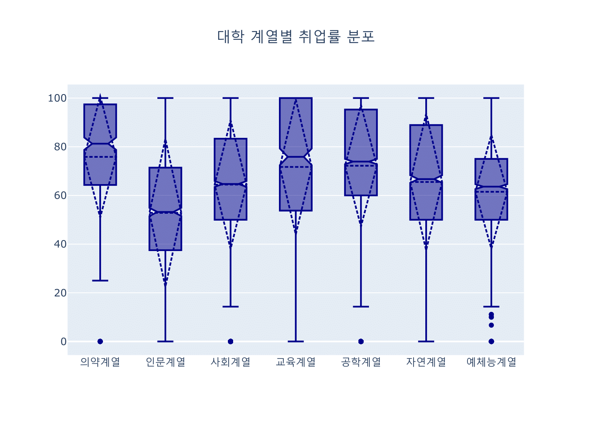

```{r setup, include=FALSE}
knitr::opts_chunk$set(echo = TRUE, message = FALSE, warning = FALSE, fig.width = 6.5, dpi = 300, eval = FALSE)
library(showtext)
showtext_auto()

library(tidyverse)
library(readxl)
library(readr)
library(lubridate)
library(plotly)

```

```{r echo = FALSE, message = FALSE, warning = FALSE}
df_covid19 <- read_csv(file = "D:/R/data/Rnpy/owid-covid-data.csv",
                            col_types = cols(date = col_date(format = "%Y-%m-%d")
                                             )
                            )
df_covid19_100 <- df_covid19 |> 
  filter(iso_code %in% c('KOR', 'OWID_ASI', 'OWID_EUR', 'OWID_OCE', 'OWID_NAM', 'OWID_SAM', 'OWID_AFR')) |>
  filter(date >= max(date) - 100) |>
  mutate(location = case_when(
    location == 'South Korea' ~ '한국', 
    location == 'Asia' ~ '아시아', 
    location == 'Europe' ~ '유럽', 
    location == 'Oceania' ~ '오세아니아', 
    location == 'North America' ~ '북미', 
    location == 'South America' ~ '남미', 
    location == 'Africa' ~ '아프리카')) |>
  mutate(location = fct_relevel(location, '한국', '아시아', '유럽', '북미', '남미', '아프리카', '오세아니아')) |>
  arrange(date)

df_covid19_100_wide <- df_covid19_100 |>
  select(date, location, new_cases, people_fully_vaccinated_per_hundred) |>
  rename('date' = 'date', '확진자' = 'new_cases', '백신접종완료자' = 'people_fully_vaccinated_per_hundred') |>
  pivot_wider(id_cols = date, names_from = location, 
              values_from = c('확진자', '백신접종완료자')) |>
  arrange(date)

df_covid19_stat <- df_covid19 |> 
  group_by(iso_code, continent, location) |>
  summarise(인구수 = max(population, na.rm = T), 
            전체사망자수 = sum(new_deaths, na.rm = T), 
            백신접종자완료자수 = max(people_fully_vaccinated, na.rm = T),
            인구백명당백신접종완료율 = max(people_fully_vaccinated_per_hundred, na.rm = T),
            인구백명당부스터접종자수 = max(total_boosters_per_hundred, na.rm = T)) |> 
    ungroup() |>
    mutate(십만명당사망자수 = round(전체사망자수 / 인구수 *100000, 5),
           백신접종완료율 = 백신접종자완료자수 / 인구수)

margins_R <- list(t = 50, b = 25, l = 25, r = 25)
## R 코드

df_취업률 <- read_excel('D:/R/data/Rnpy/2021년 학과별 고등교육기관 취업통계.xlsx', 
                     ## '학과별' 시트의 데이터를 불러오는데,
                     sheet = '학과별',
                     ## 앞의 13행을 제외하고
                     skip = 13, 
                     ## 첫번째 행은 열 이름으로 설정
                     col_names = TRUE, 
                     ## 열의 타입을 설정, 처음 9개는 문자형으로 다음 79개는 수치형으로 설정
                     col_types = c(rep('text', 9), rep('numeric', 79)))

## df_취업률에서 첫번째부터 9번째까지의 열과 '계'로 끝나는 열을 선택하여 다시 df_취업률에 저장
df_취업률 <- df_취업률 |> 
  select(1:9, ends_with('계'), '입대자')

## df_취업률에서 졸업자가 500명 이하인 학과 2000개 샘플링
df_취업률_500 <- df_취업률 |> 
  filter(졸업자_계 < 500) |>
  mutate(id = row_number()) |>
  filter(row_number() %in% seq(from = 1, to = nrow(df_취업률), by = 4))

## 열 이름을 적절히 설정
names(df_취업률_500)[10:12] <- c('졸업자수', '취업률', '취업자수')

```

```{python echo = FALSE, message = FALSE, warning = FALSE, eval = FALSE}
## 필요한 라이브러리 로딩
import pandas as pd
from datetime import datetime, timedelta
from pandas.api.types import CategoricalDtype

## 1. covid19 원본 데이터 셋 로딩
## covid19 데이터 로딩(파일을 다운로드 받은 경우)
df_covid19 = pd.read_csv("D:/R/data/Rnpy/owid-covid-data.csv")

## covid19 데이터 로딩(온라인에서 바로 로딩할 경우)
##df_covid19 = pd.read_csv("https://covid.ourworldindata.org/data/owid-covid-data.csv")

df_covid19['date'] = pd.to_datetime(df_covid19['date'], format="%Y-%m-%d")

df_covid19_100 = df_covid19[(df_covid19['iso_code'].isin(['KOR', 'OWID_ASI', 'OWID_EUR', 'OWID_OCE', 'OWID_NAM', 'OWID_SAM', 'OWID_AFR'])) & (df_covid19['date'] >= (max(df_covid19['date']) - timedelta(days = 100)))]


df_covid19_100.loc[df_covid19_100['location'] == 'South Korea', "location"] = '한국'
df_covid19_100.loc[df_covid19_100['location'] == 'Asia', "location"] = '아시아'
df_covid19_100.loc[df_covid19_100['location'] == 'Europe', "location"] = '유럽'
df_covid19_100.loc[df_covid19_100['location'] == 'Oceania', "location"] = '오세아니아'
df_covid19_100.loc[df_covid19_100['location'] == 'North America', "location"] = '북미'
df_covid19_100.loc[df_covid19_100['location'] == 'South America', "location"] = '남미'
df_covid19_100.loc[df_covid19_100['location'] == 'Africa', "location"] = '아프리카'

ord = CategoricalDtype(categories = ['한국', '아시아', '유럽', '북미', '남미', '아프리카', '오세아니아'], ordered = True)

df_covid19_100['location'] = df_covid19_100['location'].astype(ord)

df_covid19_100 = df_covid19_100.sort_values(by = 'date')

df_covid19_100_wide = df_covid19_100.loc[:,['date', 'location', 'new_cases', 'people_fully_vaccinated_per_hundred']].rename(columns={'new_cases':'확진자', 'people_fully_vaccinated_per_hundred':'백신접종완료자'})

df_covid19_100_wide = df_covid19_100_wide.pivot(index='date', columns='location', values=['확진자', '백신접종완료자']).sort_values(by = 'date')

df_covid19_100_wide.columns = ['확진자_한국', '확진자_아시아', '확진자_유럽', '확진자_북미', '확진자_남미', '확진자_아프리카','확진자_오세아니아',
                              '백신접종완료자_한국', '백신접종완료자_아시아', '백신접종완료자_유럽', '백신접종완료자_북미', '백신접종완료자_남미', '백신접종완료자_아프리카','백신접종완료자_오세아니아']
                              
df_covid19_stat = df_covid19.groupby(['iso_code', 'continent', 'location'], dropna=True).agg(
    인구수 = ('population', 'max'),
    전체사망자수 = ('new_deaths', 'sum'), 
    백신접종자완료자수 = ('people_fully_vaccinated', 'max'),
    인구백명당백신접종완료율 = ('people_fully_vaccinated_per_hundred', 'max'),
    인구백명당부스터접종자수 = ('total_boosters_per_hundred', 'max')

).reset_index()

df_covid19_stat['십만명당사망자수'] = round(df_covid19_stat['전체사망자수'] / df_covid19_stat['인구수'] *100000, 5)

df_covid19_stat['백신접종완료율'] = df_covid19_stat['백신접종자완료자수'] / df_covid19_stat['인구수']

## 여백 설정을 위한 변수 설정
margins_P = {'t' : 50, 'b' : 25, 'l' : 25, 'r' : 25}

######################################   
## python 코드
## 대학 학과 취업률 데이터 셋

df_취업률 = pd.read_excel("d:/R/data/Rnpy/2021년 학과별 고등교육기관 취업통계.xlsx", 
                           sheet_name = '학과별',
                           skiprows=(13), 
                           header = 0)

df_취업률 = pd.concat([df_취업률.iloc[:, 0:8], 
                    df_취업률.loc[:, df_취업률.columns.str.endswith('계')], 
                    df_취업률.loc[:, '입대자']], 
                   axis = 1
                   )

df_취업률_500 = df_취업률.loc[(df_취업률['졸업자_계'] < 500)]

df_취업률_500 = df_취업률_500.iloc[range(0, len(df_취업률_500.index) , 4)]

df_취업률_500 = df_취업률_500.rename(columns = {'졸업자_계':'졸업자수', '취업률_계':'취업률', '취업자_합계_계':'취업자수'})

```

관계의 시각화는 X축 데이터의 분포에 따라 Y축 데이터의 분포가 어떻게 분포하는지를 위주로 표현한다. 관계의 시각화에서 주로 시각화하는 정보는 상관관계이다. 어떤 독립 변수가 어떤 종속 변수와 밀접하게 관계가 있는지에 대한 전반적인 관계를 확인할 수 있다. 관계의 시각화는 주로 산점도를 사용한다.

분포의 시각화는 전체 데이터가 어떻게 세부적으로 분포하는지를 표현한다. 보통 전체 데이터를 이산형 변수로 분류하고 이에 대한 사례 수나 비율을 나타내는 시각화가 이에 속한다. 대표적인 분포의 시각화는 히스토그램, 박스 플롯, 바이올린 플롯 등이 있다.

# 산점도(scatter chart)

산점도는 `plolty`뿐 아니라 데이터 시각화에서 가장 기본적인 시각화 방법이다. 산점도는 X, Y축으로 구성된 좌표계 위에 데이터를 점으로 표현하여 데이터의 전반적 분포를 표현하는 방법으로 매우 간단한 시각화이지만, 데이터의 분포와 데이터의 관계성을 파악하는데 가장 효율적인 시각화이다. 데이터 분석을 시작할 때 대부분의 분석가들이 가장 먼저 시작하는 EDA(Exploratory Data Analysis)의 많이 활용되는 시각화이다. 

산점도는 기본적으로 2차원 공간에 흩어져(scattered) 보이는 형태의 시각화이고, 2차원 축에 매핑되어야 하기 때문에 2개의 변수가 모두 연속형 수치 변수이어야 한다. 산점도는 'x-y 그래프'라고도 하며, 데이터의 흩어져 있는 형태의 시각화를 통해 데이터의 분포와 관계를 알아보는데 사용되는 방법 중에 가장 많이 사용된다.

산점도를 통해 살펴볼 수 있는 패턴이나 상관관계는 보통 다음의 세 가지 정도이다.[^1]

[^1]: [https://medium.com/\@paymantaei/what-is-a-scatter-plot-and-when-to-use-one-2365e774541](https://medium.com/@paymantaei/what-is-a-scatter-plot-and-when-to-use-one-2365e774541){.uri}

::: {custom-style="comment"}
-   선형 또는 비선형 상관관계 : 선형 상관관계는 데이터의 추세선이 직선을 형성하지만 비선형 상관관계는 데이터의 추세선이 곡선 또는 기타 형태를 나타냄
-   강한 또는 약한 상관관계 : 강한 상관관계는 데이터 들이 추세선에 가까이 분포하지만 약한 상관관계는 데이터 들이 추세선에 더 멀리 분포해 있음
-   양의 또는 음의 상관관계 : 양의 상관관계는 추세선이 우상향하고(즉, x값이 증가할 때 y값이 증가) 음의 상관관계는 추세선이 우하향함(즉, x값은 증가할 때 y값은 감소).
:::

상관관계의 측면에서 풀어본다면 X축 변수는 독립변수이고 Y축 변수는 종속변수로 볼 수 있다. 하지만 많은 경우 종속 변수를 결정하는 독립 변수는 하나 이상이다. 이렇게 하나 이상의 독립 변수를 표현하는 산점도는 점의 색상이나 형태, 크기 등 변수를 추가하여 표현한다. 이렇게 X축, 색, 점의 형태, 점의 크기를 모두 사용한다면 Y축에 표현되는 종속 변수는 총 4개의 독립 변수로 표현되는 산점도를 그릴 수 있는 것이다. 이 중 점의 크기를 사용하는 산점도를 버블 차트라고 한다.

plotly에서 산점도는 스캐터(scatter) 트레이스를 사용하여 구현한다. plotly에서 스캐터 트레이스는 단지 산점도만을 그리는 것이 아니고 X, Y 축에 좌표상으로 표시되는 선 그래프를 포함하며 산점도와 선 그래프에 문자열을 표기하는 시각화까지 포함한다.

plotly에서 스캐터 트레이스에 사용되는 주요 속성은 다음과 같다.


-   R

R에서 산점도는 `add_trace(type = 'scatter', ...)`나 `add_markers()`를 사용하여 만들 수 있다. `add_markers()`에서 사용하는 속성은 `add_trace()`에서 사용하는 속성 그대로 사용할 수 있다. 만약 여러 개의 scatter 트레이스를 동시에 그리기 위해서는 R 자체적으로 제공하는 파이프(`|>`)나 `tidyverse`에서 지원하는 파이프(`%>%`)를 사용하여 scatter 트레이스를 계속 추가하여 그린다. 

```{r eval = FALSE}
df_취업률_500 |> 
  plot_ly() |>
  ## add_markers()로 marker mode의 scatter 트레이스 추가 
  add_markers(x = ~졸업자수, y = ~취업자수, color = ~대계열) |>
  layout(title = list(text = '<b>졸업자 대비 취업자수</b>', font = list(color = 'white')), 
         margin = margins_R, 
         paper_bgcolor = 'black', plot_bgcolor = 'black', 
         xaxis = list(color = 'white', ticksuffix = '명'), 
         yaxis = list(color = 'white', gridcolor = 'gray', ticksuffix = '명', dtick = 100), 
         legend = list(font = list(color = 'white')))
```

```{r echo = FALSE}
df_취업률_500 |> 
  plot_ly() |>
  add_markers(x = ~졸업자수, y = ~취업자수, color = ~대계열, colors = 'Blues') |>
  layout(title = list(text = '<b>졸업자 대비 취업자수</b>', font = list(color = 'white')), 
         margin = list(t = 50, b = 25, l = 25, r = 25), 
         paper_bgcolor = 'black', plot_bgcolor = 'black', 
         xaxis = list(color = 'white', ticksuffix = '명'), 
         yaxis = list(color = 'white', gridcolor = 'gray', ticksuffix = '명', dtick = 100), 
         legend = list(font = list(color = 'white')))
```

앞의 코드를 `add_trace(type = 'scatter', )`를 사용하면 다음의 코드와 같다.[^2]

[^2]: 이 후 R에서 plotly 구현은 add_trace()를 중심으로 설명하겠다.

```{r eval = FALSE}
df_취업률_500 |> 
  plot_ly() |>
  ## add_trace()로 marker mode의 scatter 트레이스 추가 
  add_trace(type = 'scatter', mode = 'markers', 
            x = ~졸업자수, y = ~취업자수, color = ~대계열) |>
  layout(
    ## 제목 설정
    title = list(text = '<b>졸업자 대비 취업자수</b>', font = list(color = 'white')),
    margin = margins_R,  ## 여백 설정
    paper_bgcolor = 'black', plot_bgcolor = 'black',  ## 여백 설정 
    xaxis = list(color = 'white', ticksuffix = '명'), ## X축 설정
    ## Y축 설정
    yaxis = list(color = 'white', gridcolor = 'gray', ticksuffix = '명', dtick = 100), 
    legend = list(font = list(color = 'white')))  ## 범례 설정

```

-   python

앞선 2장에서는 `add_trace()`에 'data' 속성을 딕셔너리로 구성하여 트레이스를 구성하였다. 이번 장부터는 이 방법보다는 `add_trace()`와 `plolty.graph_objects`에서 제공하는 각 트레이스 함수를 사용하는 방법을 사용한다.

`plolty.graph_objects`로 산점도를 그리기 위해서 `plolty.graph_objects.Scatter()`를 사용한다. 다음의 코드에서와 같이 초기화된 plotly 객체의 메쏘드로 `add_trace()`를 호출하고, `add_trace()`의 매개변수로 `plolty.graph_objects.Scatter()`를 호출한다. `plolty.graph_objects.Scatter()`는 scatter 트레이스에 해당하는 속성들을 매개변수처럼 '='을 사용하여 속성값을 설정하는데 만약 하위 속성이 있는 경우 `{}`나 `dict()`를 사용하여 딕셔너리를 만들어 설정한다. 

다음은 2장에서 만들었던 졸업자 대비 취업자 수를 `plolty.graph_objects.Scatter()`를 사용하여 산점도를 만드는 python 코드이다. 'color' 속성 설정을 위해 `for` 루프를 사용하였고 'colors' 딕셔너리를 만들어 대계열의 이름에 따른 정수값을 매칭해주었다. 그 이후 배경색을 검정으로 설정하고 축의 색과 그리드 컬러, 눈금 라벨 등의 'layout' 속성을 설정하였다.

```{python eval = FALSE}
import plotly.graph_objects as go

fig = go.Figure()

## 색상 설정을 위한 딕셔너리 정의
colors = {'의약계열': 0, '인문계열': 1, '사회계열': 2, '교육계열': 3, '공학계열': 4, '자연계열': 5, '예체능계열': 6}

## 색상 설정을 위해 '대계열'로 그룹화해서 for 루프 사용
for cat, group in df_취업률_500.groupby('대계열'):
    ##  scatter 트레이스 생성
    fig.add_trace(go.Scatter(
        mode = 'markers',
        x = group['졸업자수'], y = group['취업자수'],
        ## 트레이스 이름 설정
        name = cat,
        ##  마커 색상 설정
        marker = dict(color = colors[cat]), 
        showlegend = True
    ))

## layout 속성 설정
fig.update_layout(
  ## 제목 설정
  title = dict(text = '<b>졸업자 대비 취업자수</b>', x = 0.5, font = dict(color = 'white')), 
  margin = margins_P,  ## 여백 설정 
  paper_bgcolor = 'black', plot_bgcolor = 'black',   ##  배경색 설정
  ##  X축 설정
  xaxis = dict(color = 'white', ticksuffix = '명', showgrid = False),
  ##  Y축 설정
  yaxis = dict(color = 'white', gridcolor = 'gray', ticksuffix = '명', dtick = 100), 
  legend = dict(font = dict(color = 'white')))  ## 주석 설정
  
fig.show()

```

```{python eval = FALSE, echo = FALSE}
fig = go.Figure()

colors = {'의약계열': 0, '인문계열': 1, '사회계열': 2, '교육계열': 3, '공학계열': 4, '자연계열': 5, '예체능계열': 6}

for cat, group in df_취업률_500.groupby('대계열'):
    fig.add_trace(go.Scatter(
        mode = 'markers',
        x = group['졸업자수'], y = group['취업자수'],
        name = cat,
        marker = dict(color = colors[cat]), 
        showlegend = True
    ))

fig.update_layout(title = dict(text = '<b>졸업자 대비 취업자수</b>', x = 0.5, font = dict(color = 'white')), 
         margin = dict(t = 50, b = 25, l = 25, r = 25), 
         paper_bgcolor = 'black', plot_bgcolor = 'black', 
         xaxis = dict(color = 'white', ticksuffix = '명', showgrid = False), 
         yaxis = dict(color = 'white', gridcolor = 'gray', ticksuffix = '명', dtick = 100), 
         legend = dict(font = dict(color = 'white')),
                  colorway = ("#EFF3FF", "#C6DBEF", "#9ECAE1", "#6BAED6", "#4292C6", "#2171B5", "#084594")
                 )
fig.show()

```


앞의 코드를 `plotly.express`로 구현하면 다음과 같다.[^3] `plotly.express`에서 제공하는 scatter 트레이스 함수는 `scatter()`이다. 속성값 딕셔너리를 설정하는 `plotly.graph_objects`와 달리 `plotly.express`의 함수들은 매개변수를 사용하는 방식으로 사용된다. 따라서 트레이스 속성 중에서 매개변수로 지원하는 속성에만  매개변수에 허용된 값으로 전달해야 하며, 이 매개변수의 값은 data 속성의 값과 다른 경우가 많기 때문에 사용하기 전에 확인이 필요하다. 

[^3]: 이후 python에서 plotly의 구현은 plotly.graph_objects 중심으로 설명하겠다.

```{python eval = FALSE}
## plotly.express 라이브러리 로딩
import plotly.express as px

## px.scatter()로 scatter 트레이스 생성
fig = px.scatter(df_취업률_500, x= '졸업자수', y="취업자수", 
                 color = "대계열")
                 
##  layout 설정                 
fig.update_layout(title = dict(text = '<b>졸업자 대비 취업자수</b>', 
                          x = 0.5, font = dict(color = 'white')),
                  margin = dict(t = 50, b = 25, l = 25, r = 25), 
                  paper_bgcolor = 'black', plot_bgcolor = 'black', 
                  xaxis = dict(color = 'white', ticksuffix = '명', showgrid = False), 
                  yaxis = dict(color = 'white', gridcolor = 'gray', 
                          ticksuffix = '명', dtick = 100),
                  legend = dict(font = dict(color = 'white')))
fig.show()

```

```{python eval = FALSE, echo = FALSE}
import plotly.express as px
fig = px.scatter(df_취업률_500, x= '졸업자수', y="취업자수", 
                 color = "대계열", color_discrete_sequence = ("#EFF3FF", "#C6DBEF","#9ECAE1","#6BAED6","#4292C6","#2171B5","#084594"))
fig.update_layout(title = dict(text = '<b>졸업자 대비 취업자수</b>', x = 0.5, font = dict(color = 'white')), 
         margin = dict(t = 50, b = 25, l = 25, r = 25), 
         paper_bgcolor = 'black', plot_bgcolor = 'black', 
         xaxis = dict(color = 'white', ticksuffix = '명', showgrid = False), 
         yaxis = dict(color = 'white', gridcolor = 'gray', ticksuffix = '명', dtick = 100), 
         legend = dict(font = dict(color = 'white')))
fig.show()

```

## 추세 산점도

산점도가 가장 효과적으로 사용되는 경우는 변수 간의 관계성을 살펴보는 것이다. 따라서, 산점도에 뿌려지는 데이터에 어떤 상관관계가 있는지를 추세선으로 표시하면 데이터 간의 관계성을 좀 더 확실히 알아볼 수 있다.

다음의 그림과 같이 상관관계가 높을수록 추세선 주위에 데이터들이 모여있고 상관관계가 낮을수록 데이터는 추세선과 관계없이 넓게 뿌려진다. 이와 같이 상관관계의 높고 낮음을 계량화하여 비교하기 위해 상관계수를 사용한다. 보통 0.7 이상의 상관계수는 매우 강한 상관관계가 있다고 간주하고 0.5이상의 경우 적정한 상관관계가 있다고 간주한다.[^4]

[^4]: <https://www.reneshbedre.com/blog/correlation-analysis-r.html>


-   R

R에서 추세선을 그리는 데 가장 많이 사용하는 방법은 `ggplot2`에서 제공하는 `geom_smooth()`를 사용하는 방법이다. 하지만 plotly의 R 패키지에서는 이런 기능을 제공하지 않는다. 따라서 선형회귀(lm)나 국소 회귀(loess) 모델을 만들어 추세선을 그려야 한다.

선형 회귀 추세선 모델을 만들기 위해서는 R base에서 제공하는 `lm()`을 사용하여 상관관계를 파악하고자 하는 독립변수와 종속변수에 관한 선형회귀 모델을 사용하여 만든다. 이렇게 만든 모델에 `fitted()`나 `predict()`를 사용하여 독립변수(X축)에 대응하는 종속변수(Y축)에 대한 추세선을 그려준다. 만약 신뢰구간(Confidence Interval, CI)의 표현이 필요하다면 `add_ribbons()`을 사용하여 그려줄 수 있다.

국소 회귀 추세선(LOESS)을 plotly로 그리는 방법은 `loess()`을 사용하여 국소 선형 회귀 모델을 만들고 선형 회귀 추세선처럼 `fitted()`를 사용하여 해당 모델에 대한 적합치(Fitted Value)를 Y축에 매핑함으로써 그려줄 수 있다. 다만 이 과정에서 X축 변량의 순서대로 `fitted()` 값을 그려야 정상적인 추세선이 나타나기 때문에 이 데이터를 정렬하기 위해 임시 데이터프레임을 생성하여 사용하였다.

```{r eval = FALSE}
##  선형 회귀 모델 생성
lm_trend <- lm(data = df_취업률_500, 취업자수 ~ 졸업자수)

## 국소 회귀 모델 생성
loess_trend <- loess(data = df_취업률_500, 취업자수 ~ 졸업자수)

##  국소 회귀 모델 데이터 생성
df_loess_trend <- data.frame(X = df_취업률_500$졸업자수, Y = fitted(loess_trend)) |>
  arrange(X)

##  
df_취업률_500 |>
  plot_ly(type = 'scatter', mode = 'markers') |>
  add_trace(x = ~졸업자수, y = ~취업자수, showlegend = FALSE) |>
  ##  선형 회귀 데이터를 사용하여 line mode scatter 트레이스 생성 
  add_trace(mode = 'lines', x = ~졸업자수, y = ~fitted(lm_trend), 
            name = '선형 추세선', line = list(dash = 'dot')) |>
  ##  국소 =회귀 데이터를 사용하여 line mode scatter 트레이스 생성 
  add_trace(data = df_loess_trend, mode = 'lines', 
            x = ~X, y = ~Y, name = 'loess 추세선')
```

```{r echo = FALSE, fig.cap='R의  추세 산점도'}
lm_trend <- lm(data = df_취업률_500, 취업자수 ~ 졸업자수)

loess_trend <- loess(data = df_취업률_500, 취업자수 ~ 졸업자수)

df_loess_trend <- data.frame(X = df_취업률_500$졸업자수, Y = fitted(loess_trend)) |>
  arrange(X)

df_취업률_500 |>
  plot_ly(type = 'scatter', mode = 'markers') |>
  add_trace(x = ~졸업자수, y = ~취업자수, showlegend = FALSE, color = I('darkblue')) |>
  add_trace(mode = 'lines', x = ~졸업자수, y = ~fitted(lm_trend), name = '선형 추세선', color = I('blue'), line = list(dash = 'dot')) |>
  add_trace(data = df_loess_trend, mode = 'lines', x = ~X, y = ~Y, name = 'loess', color = I('skyblue'), dashline = 'dash')
```


하지만 추세선은 이렇게 전체적인 흐름을 보기 위해서도 그리지만, 많은 경우 세부 그룹별로 추세선을 그리는 경우도 많다. plotly의 R 패키지에서 자체적으로 추세선을 지원하지 않기 때문에 세부 그룹별로 추세선을 그 때는 `ggplot2`로 그린 후 plotly로 변환하는 것이 훨씬 효율적이다.

```{r eval = FALSE}
p <- df_취업률_500 |>
  ggplot(aes(x = 졸업자수, y = 취업자수, color = 대계열)) +
  geom_point() + 
  ## geom_smooth로 선형회귀 추세선 추가
  geom_smooth(method = 'lm', se = FALSE) + 
  ## geom_smooth로 국소 회귀 추세선 추가
  geom_smooth(method = 'loess', se= FALSE, linetype = 2)

##  ggplot2 객체를 plotly로 전환
ggplotly(p)
```

```{r echo = FALSE, fig.cap='ggplot2에서 변환한 R의 추세 산점도'}
p <- df_취업률_500 |>
  ggplot(aes(x = 졸업자수, y = 취업자수, color = 대계열)) +
  geom_point() + 
  geom_smooth(method = 'lm', se = FALSE) +
  scale_color_brewer(palette = 'Blues') + 
  geom_smooth(method = 'loess', se= FALSE, linetype = 2)

ggplotly(p)
```


-   python

python에서도 `plotly.graph_objects` 모듈에서는 추세선을 그리는 기능을 제공하지 않는다. 따라서 R과 같이 선형회귀 모델이나 국소 선형회귀 모델을 만들고 이 모델에 적합값을 산출하여 이 선을 그려주는 방법을 사용하여야 한다.

python에서 회귀 모델을 만들기 위해서는 먼저 `numpy`와 `scikit-learn` 라이브러리의 `LinearRegression` 모듈을 import하여 선형회귀 모델을 만든다. 이후 독립변수와 종속변수를 numpy 배열로 만들고 이 두 개의 배열을 `LinearRegression`로 만든 객체의 `fit()` 메쏘드를 사용하여 적합값을 생성한다. 생성된 적합값을 Y축에 매핑하고 독립변수로 사용했던 변수를 X축에 매핑하여 plotly 스캐터 트레이스의 선을 그려주면 추세선이 만들어진다.

또 loess 모델을 만들기 위해서 먼저 `statsmodels.api` 라이브러리를 'sm'으로 import하고 `sm.nonparametric.lowess()`를 사용하여 각각의 독립변수 데이터에 대한 적합값으로 구성된 배열을 산출한다. 이후 독립변수인 이 배열의 첫 번째 열을 X로 적합값인 두 번째 열을 Y로 매핑하여 plotly 스캐터 트레이스로 선을 그어주면 추세선이 만들어진다.

```{python eval = FALSE}
import numpy as np
import statsmodels.api as sm # to build a LOWESS model
from sklearn.linear_model import LinearRegression

############## 선형회귀 모델
linear_regr = LinearRegression()

X = df_취업률_500['졸업자수'].values.reshape(-1,1)  # 독립변수（NumPy의 배열）
Y = df_취업률_500['취업자수'].values         # 종속변수（Numpy의 배열）

linear_regr.fit(X, Y)                         # 선형 모델의 가중치를 학습
linear_fit = linear_regr.predict(X)

############## Loess 모델
lowess_fit = sm.nonparametric.lowess(df_취업률_500['취업자수'], df_취업률_500['졸업자수'])

fig = go.Figure()

fig.add_trace(go.Scatter(
    mode = 'markers',
    x = df_취업률_500['졸업자수'], y = df_취업률_500['취업자수'], 
    showlegend = False))

## 선형 회귀 추세선 추가
fig.add_trace(go.Scatter(
    mode = 'lines', 
    x = df_취업률_500['졸업자수'], y = linear_fit, 
    name = '선형추세선', 
    line = dict(dash = 'dot')))

## 국소 회귀 추세선 추가
fig.add_trace(go.Scatter(
    mode = 'lines', 
    x = lowess_fit[:,0], y = lowess_fit[:,1], 
    name = 'loess'))

fig.show()
```


이렇게 각각의 회귀 모델을 만들어 추세선을 만들어 주는 것이 정상적 방법이지만 좀 복잡하다. 하지만 `plotly.express`에서 제공하는 `scatter()`는 'trendline'의 매개변수를 지정해 줌으로써 간단히 추세선을 만들 수 있다. 'trendline' 매개변수의 값은 "ols", "lowess", "rolling", "expanding", "ewm" 중에 하나가 사용된다. "ols"는 'Ordinary Least Squares regression line'의 준말로 최소제곱법을 사용한 회귀선으로 일반적으로 말하는 선형회귀선을 말한다. 국소 선형회귀선인 "lowess", 이동 평균선인 "rolling", 확장 평균선인 "expanding", 지수 가중 평균인 "ewm"을 설정할 수 있다.

```{python eval = FALSE}
## plotly.express.scatter()로 선형 회귀 추세선 추가
fig = px.scatter(df_취업률_500, x= '졸업자수', y="취업자수", 
                 color = "대계열", trendline = 'ols')
                 
## plotly.express.scatter()로 국소 회귀 추세선 추가
fig = px.scatter(df_취업률_500, x= '졸업자수', y="취업자수", 
                 color = "대계열", trendline = 'lowess')
                 
fig.show()

```


## 버블 차트(Bubble Chart)

버블 차트는 풍선 차트라고도 하며 2차원의 산점도에 표현되는 각각의 점의 크기를 추가적인 데이터 변수에 따라 다르게 표현함으로써 산점도를 3차원으로 확장할 때 사용하는 차트이다. 물론 3차원 이상의 산점도를 표현하는데 점의 색이나 점의 모양으로 표현할 수도 있지만, 점의 색이나 점의 모양을 사용할 떄는 3차원 변수가 연속형 변수가 아니고 이산형 변수일 때 보다 효과적이다. 하지만 3차원 변수가 연속형 변수일 때는 점의 크기로 표현하는 버블 차트가 효과적이다.

버블 차트를 사용할 때 주의해야 하는 점이 있다. 첫 번째는 데이터가 너무 많이 표현되는 산점도에는 적절하지 않다는 것이다. 데이터가 표현되는 점의 크기로 세 번째 변수를 표현하기 때문에 데이터가 표시되는 간격이 적절하게 확보되어야 버블 차트의 효과가 높아진다. 두 번째는 데이터가 표현되는 점의 투명도를 잘 설정해야 한다는 것이다. 투명도가 너무 짙게 설정되면 데이터들이 서로 겹치는 부분의 데이터를 알아보기가 어려워질 수 있고 투명도가 너무 옅게 되면 데이터 자체를 알아보기 어려워질 수 있다. 세 번째는 점의 크기를 결정하는 세 번째 변수는 음의 값을 가지지 않는 데이터가 적합하다는 것이다. 음의 값을 가지면 데이터를 표현하는데 어려움이 있다. 네 번째로 사람의 눈은 일반적으로 원의 크기를 면적으로 인식한다고 알려져 있기 떄문에 원의 크기를 결정할 때는 가급적 지름의 크기로 설정하기 보다는 면적의 크기로 설정하는 것이 좋다.

plotly로 버블 차트를 만들기 위해서는 scatter 트레이스로 'mode'를 "markers"로 설정하여 만든다. 다음은 백신접종완료율 대비 인구 백 명당 부스터 접종자 수 산점도에 인구 십만 명당 사망자 수를 점의 크기로 하는 버블 차트를 그리는 R과 python 코드이다. 버블의 크기를 면적 단위로 설정하기 위해 'sizemode'를 "area"로 설정하였다.

-   R

```{r fig.cap='R의 버블 차트'}
df_covid19_stat |>
  plot_ly() |>
  add_trace(type = 'scatter', mode = 'markers', 
            x = ~백신접종완료율, y = ~인구백명당부스터접종자수,
            ## marker의 사이즈를 사용해 버블 차트 구현
            marker = list(size = ~십만명당사망자수, opacity = 0.5, sizemode = 'area')
            )


```

-   python

```{python eval = FALSE}
fig = go.Figure()

fig.add_trace(go.Scatter(
    mode = 'markers', 
    x = df_covid19_stat['백신접종완료율'], 
    y = df_covid19_stat['인구백명당부스터접종자수'], 
    ## marker의 사이즈를 사용해 버블 차트 구현
    marker = dict(size = df_covid19_stat['십만명당사망자수'], opacity = 0.5, sizemode = 'area')
))

```


# 히스토그램(histogram)

히스토그램은 데이터의 특정 변수에 따른 사례 수를 나타내는 시각화이다. 특정 변수의 일정한 급간에 몇 개의 사례가 있는지는 도수분포라고 하,고 이를 시각화한 것이 도수분포표, 즉 히스토그램이다. 대부분의 탐색적 데이터 분석(Exploratory Data Analysis)에서 가장 기본적으로 사용하는 시각화가 히스토그램이다. 히스토그램은 일변량 데이터 시각화에 사용하고 보통의 경우 연속형 데이터에서 많이 사용한다.

히스토그램은 데이터의 빈도 분석, 데이터 대칭성 분석을 확인하는 데 효과적으로 사용된다.

데이터의 빈도 분석은 값의 구간에 데이터가 집중되어 있는지 파악하는 것인데, 히스토그램에서 이 구간을 bin이라고 부른다. 데이터가 어떤 구간에 집중적으로 분포되어 있는지를 정확히 파악하기 위해서는 bin의 크기를 적절하게 설정해야 한다.

데이터 대칭성 분석은 히스토그램의 전반적 형태가 어떻게 생겼는지를 확인하는 것이다. 데이터의 전반적 분포들이 평균에서 얼마나 떨어져 있는지, 양의 방향 또는 음의 방향으로 치우쳐 있는지를 확인할 수 있다.

히스토그램의 비대칭성은 평균과 중앙값과 밀접한 관계를 가진다. 일반적으로 평균이 중앙값보다 크다면 데이터는 양의 방향으로 치우친 데이터이다. 양의 치우침이 있는 데이터는 데이터의 수가 가장 많은 Peak 점이 중앙값(Median)보다 작고 중앙값은 평균보다 작다. 결국 중앙값을 기준으로 최빈값(Mode)이 왼쪽, 평균이 오른쪽에 위치한다. 그리고 오른쪽으로 더 길게 치우쳐진 꼬리를 가지게 된다.


히스토그램을 그릴 때는 몇 가지 주의할 점이 있다.

첫 번째는 앞에서 언급한 바와 같이 bin의 개수를 잘 결정해야 한다. bin의 개수가 너무 적으면 데이터들의 분포 특성이 뭉개져서 데이터의 분포 특성을 알아내기 어렵다. 또 bin의 개수가 너무 많으면 데이터의 전반적 분포를 파악하기 어렵고 이상치 값들로 인해 데이터의 왜곡도 발생할 수 있다.

두 번째는 bin의 간격이 일정해야 한다. 맨 좌측이나 맨 우측의 긴 꼬리가 존재하는 경우 긴 꼬리 쪽을 몇 개의 'bin'을 병합하여 넓은 bin으로 설정한다면 데이터의 전반적 분포를 확인할 수 없다. 따라서 가급적 데이터의 처음부터 끝까지 동일한 bin의 간격을 유지하는 것이 바람직하다.

세 번째는 히스토그램의 Y축은 0부터 시작하여야 한다는 것이다. 히스토그램은 각각의 bin 구간에 따른 사례 수를 표현하기 때문에 사례가 없는 구간도 표현되어야 한다. 따라서 0부터 시작하는 것이 좋다.

마지막으로 히스토그램은 bin사이의 간격을 두지 않는게 일반적이다. 이것이 막대 그래프와 히스토그램의 차이인데 막대 그래프는 막대와의 간격을 두어 막대간의 구별이 가능하도록 만들지만, 히스토그램은 전체적 분포를 보기위해 사용하기 때문에 plolty의 기본값은 bin간의 간격을 두지 않는다. 하지만 히스토그램의 X변수를 연속형 변수가 아닌 이산형 변수를 설정하면 plotly는 bin 사이의 간격을 만드는데 사실 이것은 사실 히스토그램이라기 보다는 막대그래프로 보는 것이 맞을 것이다.

plotly에서 히스토그램을 그리기 위해서는 histogram 트레이스를 사용한다. 

histogram 트레이스에서 주로 사용하는 속성은 다음과 같다.  


다음은 각 학과의 취업률의 분포를 히스토그램으로 그리는 R과 python 코드이다. 히스토그램으로 표현할 단변량 변수인 취업률 변수는 X축에 매핑하고, bin의 설정을 위해 'xbins' 속성을 설정한다. 여기서는 bin의 시작점 속성인 'start'를 0, 끝점 속성인 'end'를 100, bin의 크기를 2.5로 설정하였다.

-   R

R에서 히스토그램을 그리기 위해서 `add_trace(type = 'histogram', ...)`나 `add_histogram()`을 사용한다. 

```{r fig.cap='R의 히스토그램'}
## 취업률 데이터를 사용해 plotly 객체 생성
p_histogram <- df_취업률_500 |> plot_ly()

p_histogram |> 
  ## histogram trace로 X축을 취업률로 매핑, name을 취업률로 설정
  add_histogram(x = ~취업률, name = '취업률',
                ## xbins 속성 설정
                xbins = list(start = 0, end = 100, size = 2.5)) |>
  ## 제목과 여백 설정
  layout(title = '취업률 histogram', margin = margins_R)
```

-   python

python에서 히스토그램을 그리기 위해서는 `plotly.graph_objects.Histogram()` 이나 `plotly.express.histogram()` 을 사용한다. 여기서는 `plotly.graph_objects.Histogram()`을 사용하였다. 

```{python eval = FALSE}
fig = go.Figure()

## histogram trace로 X축을 취업률로 매핑, name을 취업률로 설정
fig.add_trace(go.Histogram(x = df_취업률_500['취업률'], name = '취업률', 
              ## xbins 속성 설정
              xbins = dict(start = 0, end = 100, size = 2.5)))

## 제목과 여백 설정              
fig.update_layout(title = dict(text = '취업률 Histogram', x = 0.5))

fig.show()

```


## 오버레이 히스토그램

히스토그램은 단일 연속형 변수에 대한 사례 수를 표현하는 것이 목적이다. 하지만 몇 개의 카테고리로 그룹화한 단일 연속형 변수의 히스토그램을 겹쳐서 그리면 각각 카테고리의 분포를 한 눈에 비교할 수 있다. 이러한 히스토그램을 오버레이 히스토그램이라고 한다. 오버레이 히스토그램을 사용하면 서로 중첩된 여러 모집단의 데이터 분포를 비교할 수 있다.

plotly에서 오버레이 히스토그램을 그리기 위해서는 먼저 시각화하고자 하는 데이터에 대한 histogram 트레이스를 각각 만들어주고 'layout'의 'barmode'를 "overlay"로 설정해주면 그려진다. 다만 이 과정에서 서로 히스토그램이 겹치기 때문에 'opacity' 속성을 사용하여 각각의 histogram 트레이스의 투명도를 적절히 설정해주어야 한다.

다음의 코드는 학과별 취업률 히스토그램을 학위 과정별로 그리고 이들을 서로 겹쳐서 표현하는 오버레이 히스토그램을 그리는 R과 python의 코드이다. 각각의 히스토그램 트레이스의 'opacity'는 0.4로 설정하였다.

-   R

R에서 오버레이 히스토그램을 그리기 위해 설정하는 'barmode'는 `layout()`에서 설정해 준다.

```{r eval = FALSE}
p_histogram <- df_취업률_500 |> plot_ly()

p_histogram |> 
  ## histogram trace로 X축을 취업률로 매핑, name을 취업률로 설정
  add_histogram(x = ~취업률, color = ~과정구분,  opacity = 0.4,
            xbins = list(size = 5)) |>
  layout(title = '취업률 histogram', 
         ## histogram barmode를 "overlay"로 설정
         barmode = "overlay",          
         margin = margins_R)
```

```{r echo = FALSE, fig.cap='R의 오버레이 히스토그램'}
## 취업률 데이터를 사용해 plotly 객체 생성
p_histogram <- df_취업률_500 |> plot_ly()

p_histogram |> 
  ## histogram trace로 X축을 취업률로 매핑, name을 취업률로 설정
  add_histogram(x = ~취업률, color = ~과정구분, opacity = 0.4,
            xbins = list(size = 5), 
            colors = RColorBrewer::brewer.pal(9, 'Blues')[7:9]) |>
  ## 제목과 여백 설정
  layout(title = '취업률 histogram',          
         margin = list(t = 50, b = 25, l = 25, r = 25), 
         barmode = "overlay"
)
```

-   python

python에서 'barmode'의 설정은 `update_layout()`에서 설정한다. 각각의 histogram 트레이스 색상 구분을 위해, '과정구분'에 따라 그룹화한 후, `for` 루프를 사용하여 각각의 그룹에 대한 색상을 설정하였다.

```{python eval = FALSE}
fig = go.Figure()

## 색상 설정을 위한 딕셔너리 정의
categoreis = {'전문대학과정':'0', '대학과정':'1', '대학원과정':'2'}

for cat, group in df_취업률_500.groupby('과정구분'):
    fig.add_trace(go.Histogram(
        x = group['취업률'], name = cat, 
        xbins = dict(size = 10), opacity=0.4    
    ))

## histogram barmode를 "overlay"로 설정
fig.update_layout(barmode='overlay', title = dict(text = '취업률 Histogram', x = 0.5))

fig.show()
```

```{python eval = FALSE, echo = FALSE}
fig = go.Figure()

fig.add_trace(go.Histogram(x = df_취업률_500.loc[df_취업률_500['과정구분'] == '전문대학과정', '취업률'], 
                           name = "전문대학과정", xbins = dict(size = 5), opacity=0.4
                          )
             )

fig.add_trace(go.Histogram(x = df_취업률_500.loc[df_취업률_500['과정구분'] == '대학과정', '취업률'], 
                           name = '대학과정', xbins = dict(size = 5), opacity=0.4
                          )
             )

fig.add_trace(go.Histogram(x = df_취업률_500.loc[df_취업률_500['과정구분'] == '대학원과정', '취업률'], 
                           name = '대학원과정', xbins = dict(size = 5), opacity=0.4
                          )
             )
fig.update_layout(barmode='overlay', colorway = ("#2171B5", "#08519C", "#08306B"), title = dict(text = '취업률 Histogram', x = 0.5))

fig.show()

```


## 누적 히스토그램

누적 히스토그램은 bin으로 표현되는 데이터의 사례 수를 X축의 양의 방향으로 지속해 누적하여 표현하는 히스토그램을 말한다. 누적 히스토그램은 누적 빈도 곡선을 만들 수도 있고, 많은 양의 데이터에서 중앙값이나 사분위수와 같은 통계적 정보를 확인해야 할 때 유용하게 활용된다.

누적 히스토그램을 그리기 위해서는 histogram 트레이스의 속성 중 'cumulative' 속성의 하위 속성인 'enabled'를 TRUE로 설정한다. 다음은 R과 python에서 누적 히스토그램을 그리는 코드이다.

-   R

```{r fig.cap='R의 누적 히스토그램'}
p_histogram <- df_취업률_500 |> plot_ly()

p_histogram |> 
  add_histogram(x = ~취업률, name = '취업률',
            xbins = list(start = 0, end = 100, size = 2.5), 
            ## 누적 히스토그램 설정
            cumulative = list(enabled=TRUE)) |>
  layout(title = '취업률 histogram', margin = margins_R)

```

-   python

```{python eval = FALSE}
fig = go.Figure()

fig.add_trace(go.Histogram(x = df_취업률_500['취업률'], name = '취업률', 
                           xbins = dict(start = 0, end = 100, size = 2.5), 
                           ## 누적 히스토그램 설정
                           cumulative = dict(enabled = True)))

fig.update_layout(title = dict(text = '취업률 Histogram', x = 0.5))

fig.show()

```


## 히스토그램 함수의 사용

보통 히스토그램은 bin의 크기에 따라 설정된 범위에 속한 데이터의 사례 수, 즉 데이터 카운트를 표현한다. plotly에서도 기본적인 히스토그램은 데이터 사례 수를 표현하는 방법으로 히스토그램을 그리지만 이 값을 특정한 함수의 값으로 대체하는 방법도 제공한다. plotly에서 히스토그램 함수로 제공하는 것은 사례 수를 표시하는 "count", bin에 속한 값의 합을 표시하는 "sum", 평균을 표시하는 "avg", 가장 작은 값을 표시하는 "min", 가장 큰 값을 표시하는 "max"의 5개이다. 히스토그램 함수는 히스토그램 트레이스의 'histgunc' 속성에 함수명을 설정함으로써 사용할 수 있다. 만약 'count' 외의 함수를 사용한다면 각각의 함수에 적용되어야 하는 'y' 속성을 설정해 주어야 한다.

다음은 대학의 각 계열별로 "count", "sum", "avg", "max" 함수를 사용하는 히스토그램을 그리는 R과 python 코드이다.

-   R

R에서 'count' 이외의 히스토그램 함수를 사용할 때 하나 주의해야 할 점은 Y축에 매핑되는 'y' 속성에 설정되는 값은 수치형이 아닌 문자열로 설정해야 한다는 것이다.

```{r eval = FALSE}
#################
p_histogram |> 
  add_trace(type = 'histogram',  ## add_histogram()과 동의 함수 
            x = ~대계열, 
            ## 히그토그램 막대 함수를 'count'로 설정
            histfunc = 'count') |>
  layout(title = '취업률 histogram', 
         yaxis = list(title = list(text = '학과수')), 
         margin = margins_R)

#################
p_histogram |> 
  add_trace(type = 'histogram', x = ~대계열, y = ~as.character(취업률), 
            ## 히그토그램 막대 함수를 'sum'으로 설정
            histfunc = 'sum') |>
  ## Y축을 선형으로 설정
  layout(yaxis=list(type='linear',title = list(text = '취업률 합계')), 
         title = '취업률 histogram', 
         margin = margins_R)

#################
p_histogram |> 
  add_trace(type = 'histogram', x = ~대계열, y = ~as.character(취업률), 
            ## 히그토그램 막대 값을 'average'로 설정
            histfunc = 'avg') |>
  ## Y축을 선형으로 설정
  layout(yaxis=list(type='linear',title = list(text = '취업률 평균')), 
         title = '취업률 histogram', 
         margin = margins_R)

#################
p_histogram |> 
  add_trace(type = 'histogram', x = ~대계열, y = ~as.character(취업률),
            ##히그토그램 막대 값을 'max'로 설정
            histfunc = 'max') |>
  ## Y축을 선형으로 설정
  layout(yaxis=list(type='linear',title = list(text = '취업률 최대값')), 
         title = '취업률 histogram', 
         margin = margins_R)

```

```{r echo = FALSE, fig.cap='histfunc에 따른 R의 히스토그램'}

p1 <- p_histogram |> add_trace(type = 'histogram', x = ~대계열, stroke = I('white'), histfunc = 'count', color = I('#1f77b4'), stroke = I('white')) |>
  layout(yaxis = list(title = list(text = '학과수')))

p2 <- p_histogram |> add_trace(type = 'histogram', x = ~대계열, y = ~as.character(취업률), histfunc = 'sum', color = I('#1f77b4'), stroke = I('white')) |> layout(yaxis=list(type='linear', title = list(text = '취업률 합계')))

p3 <- p_histogram |> add_trace(type = 'histogram', x = ~대계열, y = ~as.character(취업률), histfunc = 'avg', color = I('#1f77b4'), stroke = I('white')) |> layout(yaxis=list(type='linear', title = list(text = '취업률 평균')))

p4 <- p_histogram |> add_trace(type = 'histogram', x = ~대계열, y = ~as.character(취업률), histfunc = 'max', color = I('#1f77b4'), stroke = I('white')) |> layout(yaxis=list(type='linear', title = list(text = '취업률 최대값')))

subplot(
  p1 |> layout(annotations = list(x = 0.5 , y = 1.05, text = "histfunc = 'count'", showarrow = F, xref='paper', yref='paper', xanchor = 'center')),
  p2 |> layout(annotations = list(x = 0.5 , y = 1.05, text = "histfunc = 'sum'", showarrow = F, xref='paper', yref='paper', xanchor = 'center')), 
  p3 |> layout(annotations = list(x = 0.5 , y = 1.05, text = "histfunc = 'avg'", showarrow = F, xref='paper', yref='paper', xanchor = 'center')),
  p4 |> layout(annotations = list(x = 0.5 , y = 1.05, text = "histfunc = 'max'", showarrow = F, xref='paper', yref='paper', xanchor = 'center')), 
  nrows = 2, margin = 0.1, titleY = TRUE
) |> hide_legend() |>
  layout(title = '취업률 histogram', margin = margins_R)

```

-   python

```{python eval = FALSE}
#################
fig = go.Figure()

fig.add_trace(go.Histogram(x = df_취업률_500['대계열'], 
                           ## 히그토그램 막대 함수를 'count'로 설정
                           histfunc = 'count', showlegend = False))
                           
fig.update_layout(title = dict(text = '취업률 Histogram', x = 0.5))

fig.show()

#################
fig = go.Figure()

fig.add_trace(go.Histogram(x = df_취업률_500['대계열'], y = df_취업률_500['취업률'],
                           ## 히그토그램 막대 함수를 'sum'으로 설정
                           histfunc = 'sum', showlegend = False))
                           
fig.update_layout(title = dict(text = '취업률 Histogram', x = 0.5))

fig.show()

#################
fig = go.Figure()

fig.add_trace(go.Histogram(x = df_취업률_500['대계열'], y = df_취업률_500['취업률'],
                           ## 히그토그램 막대 값을 'average'로 설정
                           histfunc = 'avg', showlegend = False))
                           
fig.update_layout(title = dict(text = '취업률 Histogram', x = 0.5))

fig.show()

#################
fig = go.Figure()

fig.add_trace(go.Histogram(x = df_취업률_500['대계열'], y = df_취업률_500['취업률'],
                           ##히그토그램 막대 값을 'max'로 설정
                           histfunc = 'max', showlegend = False))
                           
fig.update_layout(title = dict(text = '취업률 Histogram', x = 0.5))

fig.show()

```

```{python eval = FALSE, echo = FALSE}
from plotly.subplots import make_subplots
fig = make_subplots(rows=2, cols=2, 
                    subplot_titles = ("histfuct = 'count'", "histfuct = 'sum'", "histfuct = 'avg'", "histfuct = 'max'"))

fig.add_trace(go.Histogram(x = df_취업률_500['대계열'], y = df_취업률_500['취업률'],
                           histfunc = 'count', showlegend = False), 
             row = 1, col = 1)
fig.add_trace(go.Histogram(x = df_취업률_500['대계열'], y = df_취업률_500['취업률'],
                           histfunc = 'sum', showlegend = False, 
                          marker = dict(color = '#636EFA')), 
             row = 1, col = 2)
fig.add_trace(go.Histogram(x = df_취업률_500['대계열'], y = df_취업률_500['취업률'],
                           histfunc = 'avg', showlegend = False, 
                          marker = dict(color = '#636EFA')), 
             row = 2, col = 1)
fig.add_trace(go.Histogram(x = df_취업률_500['대계열'], y = df_취업률_500['취업률'],
                           histfunc = 'max', showlegend = False, 
                          marker = dict(color = '#636EFA')), 
             row = 2, col = 2)
fig.update_layout(title = dict(text = '취업률 Histogram', x = 0.5))

```


# 박스(Box) 플롯

박스 플롯[^5]은 이산형 변수에 따른 연속된 수치형 데이터의 전체 분포를 완벽하게 보여줄 수 있는 플롯이다. 앞서 설명한 산점도는 X, Y축 모두 연속형 수치 데이터를 사용하지만,  박스 플롯은 X축은 이산형 데이터를 매핑하여 이산형 데이터로 분류되는 데이터의 전반적 분포를 시각화할 수 있다는 점에서 활용도가 크다. 또 산점도(Scatter Plot)에서는 표현할 수 없었던 중간값, IQR 범위, 이상치 등의 추가적인 통계적 정보를 같이 볼 수 있다는 장점이 있다.

[^5]: 박스 플롯은 우리말로 상자 수염 그림, 상자 수염 차트 등으로 해석되는데 여기서는 박스 플롯으로 표현하겠다.

박스 플롯으로 표현되는 상자의 중심은 중앙값이다. 중앙값은 가로선으로 표현되며 그 주위를 상자가 둘러싸고 있다. 상자의 상단과 하단은 관측값들의 25%와 75%를 나타낸다. 상자의 상단과 하단 범위를 벗어나면 사분위 범위의 1.5배에 해당하는 '수염(whisker)'으로 표현된다. 수염 밖에 존재하는 값은 점으로 표기하며 이상치로 간주된다.


plolty에서 박스 플롯을 생성하기 위해서는 box 트레이스를 사용한다. 다음은 box 트레이스에서 사용하는 주요 속성이다. 


다음은 대학 학과의 계열별로 취업률의 분포를 박스 플롯으로 그린 R과 python 코드이다.

-   R

R에서 box 트레이스를 만들기 위해서는 `add_trace(type = 'box', ...)`를 사용하거나 `add_boxplot()`을 사용한다.

```{r fig.cap='R의 박스 플롯'}
df_취업률 |> 
  plot_ly() |> 
  ## box 트레이스 생성
  add_boxplot(x = ~대계열, y = ~취업률_계)|>
  layout(title = list(text = '대학 계열별 취업률 분포'), 
         margin = margins_R)


```

-   python

python에서는 `add_trace()`에 `plotly.graph_objects.Box()`를 사용한다. 

```{python eval = FALSE}
fig = go.Figure()
## box 트레이스 생성
fig.add_trace(go.Box(
    x = df_취업률['대계열'], y = df_취업률['취업률_계']))

fig.update_layout(title = dict(text = '대학 계열별 취업률 분포', x = 0.5))

fig.show()
```


## 평균, 표준편차가 포함된 박스 플롯

일반적으로 가장 많이 사용되지만, box 트레이스에서 제공되지 않는 요약 통계가 바로 평균(mean)이다. 보통 박스 플롯의 상자 안에 표시되는 가로선을 평균으로 오해하는 경우가 많은데, 이는 중간값이다. plotly에서는 평균값을 표시해주는 속성인 'boxmean'을 제공한다. 'boxmean'은 TRUE, "sd", FALSE의 세 가지 속성값을 가질 수 있는데 평균값 선을 표기하거나 표기하지 않는 TRUE, FALSE의 논리값, 평균값에 표준편차가 추가로 표시되는 "sd"를 설정하여 평균과 표준편차를 표시하였다. 

다음은 평균과 표준편차가 표시된 박스 플롯을 그리는 R과 python 코드이다. box 트레이스의 'boxmean' 속성을 "sd"로 설정하였다. 또 중간값과 평균을 구분하기 위해 'notched' 속성을 사용하여 중앙값이 표시되는 박스의 외관을 움푹 들어가도록 표현해주었다. 'notched'는 TRUE/FALSE의 논리값을 사용하여 표시할지 여부를 결정한다.

-   R

```{r fig.cap='평균, 표준편차가 포함된 R의 박스 플롯'}
df_취업률 |> 
  plot_ly() |> 
  add_boxplot(x = ~대계열, y = ~취업률_계, 
              ## boxmean과 notched 설정
              boxmean = 'sd', notched = TRUE)|>
  layout(title = list(text = '대학 계열별 취업률 분포'), 
         margin = margins_R)

```

-   python

```{python eval = FALSE}
fig = go.Figure()
fig.add_trace(go.Box(
    x = df_취업률['대계열'], y = df_취업률['취업률_계'], 
    ## boxmean과 notched 설정
    boxmean = 'sd', notched = True))

fig.update_layout(title = dict(text = '대학 계열별 취업률 분포', x = 0.5)) 

fig.show()    
```



## 그룹 박스 플롯

box 트레이스는 여러 개의 box 트레이스를 하나의 박스 플롯으로 만들 수 있다.  이렇게 여러 개의 box 트레이스를 하나의 박스 플롯에 그릴 때 구성 형태는 'layout' 속성의 'boxmode' 속성을 설정함으로써 가능하다.[^6]

[^6]: boxmode를 사용할 때 'Warning message'를 내는 경우가 있는데 이는 Plotly Community Forum에서도 적절치 않은 경고 메시지로 지적되고 있어 무시해도 무방하다.

'boxmode' 속성은 "group"과 "overlay"의 두 가지를 속성값을 설정할 수 있다. "group"은 각각의 박스들이 옆으로 배치되면서 전체 박스 플롯이 완성되고 'overlay'는 각각의 박스들이 겹쳐 그려지면서 완성된다. 다음의 코드는 'color'로 과정구분을 매핑하여 "group"형 박스 플롯을 생성하는 R과 python 코드이다.

-   R

```{r eval = FALSE}
df_취업률 |> 
  plot_ly() |> 
  add_boxplot(x = ~대계열, y = ~취업률_계, 
            ## color를 과정구분으로 매핑
            color = ~과정구분)|>
  ## boxmode를 group으로 설정
  layout(boxmode = "group", title = list(text = '대학 계열별 취업률 분포'), 
         margin = margins_R)
```

```{r echo = FALSE, fig.cap='R의 그룹 박스 플롯'}
p_box_group <- df_취업률 |> plot_ly() |> 
  add_boxplot(x = ~대계열, y = ~취업률_계, 
            ## color를 과정구분으로 매핑
            color = ~과정구분, colors = RColorBrewer::brewer.pal(9, 'Blues')[c(9, 7, 5)])

p_box_group |> 
  ## boxmode를 group으로 설정
  layout(boxmode = "group") |>
  layout(title = list(text = '대학 계열별 취업률 분포'), 
         margin = margins_R)
```

-   python

```{python eval = FALSE}
fig = go.Figure()

## 과정별 box 트레이스 생성
fig.add_trace(go.Box(
    x = df_취업률.loc[df_취업률['과정구분'] == '전문대학과정', '대계열'], y = df_취업률['취업률_계'], 
    name = '전문대학과정'))

fig.add_trace(go.Box(
    x = df_취업률.loc[df_취업률['과정구분'] == '대학과정', '대계열'], y = df_취업률['취업률_계'], 
    name = '대학과정'))

fig.add_trace(go.Box(
    x = df_취업률.loc[df_취업률['과정구분'] == '대학원과정', '대계열'], y = df_취업률['취업률_계'], 
    name = '대학원과정'))

## boxmode를 group으로 설정
fig.update_layout(boxmode = 'group', 
                  title = dict(text = '학위과정별 취업률 분포', x = 0.5, xanchor = 'center'))

```

```{python eval = FALSE, echo = FALSE}
fig = go.Figure()
fig.add_trace(go.Box(
    x = df_취업률.loc[df_취업률['과정구분'] == '전문대학과정', '대계열'], y = df_취업률['취업률_계'], 
    name = '전문대학과정', marker = dict(color = '#6BAED6'))
             )

fig.add_trace(go.Box(
    x = df_취업률.loc[df_취업률['과정구분'] == '대학과정', '대계열'], y = df_취업률['취업률_계'], 
    name = '대학과정', marker = dict(color = '#3182BD'))
             )

fig.add_trace(go.Box(
    x = df_취업률.loc[df_취업률['과정구분'] == '대학원과정', '대계열'], y = df_취업률['취업률_계'], 
    name = '대학원과정', marker = dict(color = '#08519C'))
             )

fig.update_layout(boxmode = 'group', 
                  title = dict(text = '학위과정별 취업률 분포', x = 0.5, xanchor = 'center')
                 )
```


## 지터(jitter) 박스 플롯

박스 플롯은 데이터의 분포를 여러 통계값을 사용하여 알아볼 수 있다는 점에서 매우 유용하지만 주의해야 할 점도 있다. 박스 플롯에는 데이터가 통계값으로 요약되기 때문에 이 요약으로 인해 잃게 되는 정보도 있다는 점이다. 가장 큰 것은 데이터의 사례 수가 밀집된 구간이 표현되지 않는다는 점이다. 앞선 그룹 박스 플롯과 같이 여러 데이터를 비교하는 경우 박스 플롯상에서 중간값, 25%, 75% 값이 다른 그룹보다 높게 있더라도, 그 그룹에 포함된 데이터 사례 수가 다른 그룹보다 현저하게 적다면, 이 부분을 다시 한번 검증해봐야 한다. 하지만 박스 플롯만으로는 이 부분을 알아내기가 어렵다. 이러한 단점을 보완하기 위해 실 데이터를 흩뿌려주는 산점도를 병합하는 방법을 사용하곤 한다.

박스 플롯에 산점도를 병합하는 방식인 지터 박스 플롯은 여전히 산점도가 가지고 있는 오버플로팅 문제가 존재한다. 이를 피하기 위해, 설명한 여러 방법(샘플수 조정, 투명도 조정 등)을 사용할 수 있지만 가장 많이 사용되는 방법은 데이터를 좌우로 흩뿌려 주는(Jitter) 방법이다.

plotly에서 지터 박스 플롯을 만들기 위해서는 'boxpoints', 'jitter', 'pointpos' 등의 속성을 설정한다. 'boxpoints'는 지터로 표시할 데이터의 범위를 설정하는 속성으로 전체 데이터를 표시하기 위한 "all", 이상치만을 표시하기 위한 "outliers", 이상치 중에서도 좀 더 극단치 이상치에 해당하는 이상치를 부각하는 "suspectedoutliers", 지터를 사용하지 않는 FALSE의 속성값을 가진다. 'jitter'는 데이터가 흩뿌려지는 너비를 결정하는 속성으로 0부터 1까지의 값을 가진다. 0은 데이터가 흩뿌려지지 않고 직선 위에 표시되며 1은 박스의 너비만큼의 범위에 데이터가 흩뿌려진다. 'pointpos'는 데이터 점이 표시되는 위치를 설정하는데 박스의 중심에서부터 거리를 설정한다. 이 값은 -2에서 2사이의 값을 가지는데 음수값은 박스의 좌측으로, 양수값은 박스의 우측으로 데이터가 표시되며 1은 박스 너비만큼 박스 중심에서부터 떨어진 곳에 데이터가 위치한다.

다음은 코로나19의 한국과 대륙별 일별 확진자 수에 대한 지터 박스 플롯을 그리는 R과 python 코드이다.

'boxpoints'는 "all"로 설정하여 데이터 전체를 표시하고, 'jitter'를 0.3으로 설정하여 박스 너비의 30%에 해당하는 너비만큼 데이터가 흩뿌려지게 설정하였고, 'pointpos'를 -1.8로 설정하여 박스의 좌측으로 박스 너비의 1.8배 되는 곳에 데이터가 표시되도록 설정하였다.

-   R

```{r eval = FALSE}
fig <- df_covid19_100_wide |> plot_ly()

## 대륙별 확진자 box 트레이스 생성
fig <- fig |> 
  add_boxplot(y = ~확진자_한국, name = '한국', 
              ## boxpoints, jitter, pointpos 설정
              boxpoints = "all", jitter = 0.3, pointpos = -1.8)

fig <- fig |> 
  add_boxplot(y = ~확진자_아시아, name = '아시아', 
              boxpoints = "all", jitter = 0.3, pointpos = -1.8)

fig <- fig |> 
  add_boxplot(y = ~확진자_유럽, name = '유럽', 
              boxpoints = "all", jitter = 0.3, pointpos = -1.8)

fig <- fig |> 
  add_boxplot(y = ~확진자_북미, name = '북미', 
              boxpoints = "all", jitter = 0.3, pointpos = -1.8)

fig <- fig |> 
  add_boxplot(y = ~확진자_남미, name = '남미', 
              boxpoints = "all", jitter = 0.3, pointpos = -1.8)

fig <- fig |> 
  add_boxplot(y = ~확진자_아프리카, name = '아프리카', 
              boxpoints = "all", jitter = 0.3, pointpos = -1.8)

fig <- fig |> 
  add_boxplot(y = ~확진자_오세아니아, name = '오세아니아', 
              boxpoints = "all", jitter = 0.3, pointpos = -1.8)

fig |>  layout(title = list(text = '한국 및 대륙별 일별 확진자 분포'), 
               xaxis = list(title = '대륙명'),
               yaxis = list(title = '확진자수(명)'),
         margin = margins_R, 
         paper_bgcolor='lightgray', plot_bgcolor='lightgray')

```

```{r echo = FALSE, fig.cap='R의 지터 박스 플롯'}
fig <- df_covid19_100_wide |> plot_ly()

fig <- fig |> 
  add_boxplot(y = ~확진자_한국, name = '한국', boxpoints = "all", jitter = 0.3,
              pointpos = -1.8)

fig <- fig |> 
  add_boxplot(y = ~확진자_아시아, name = '아시아', boxpoints = "all", jitter = 0.3,
        pointpos = -1.8)

fig <- fig |> 
  add_boxplot(y = ~확진자_유럽, name = '유럽', boxpoints = "all", jitter = 0.3,
        pointpos = -1.8)

fig <- fig |> 
  add_boxplot(y = ~확진자_북미, name = '북미', boxpoints = "all", jitter = 0.3,
        pointpos = -1.8)

fig <- fig |> 
  add_boxplot(y = ~확진자_남미, name = '남미', boxpoints = "all", jitter = 0.3,
        pointpos = -1.8)

fig <- fig |> 
  add_boxplot(y = ~확진자_아프리카, name = '아프리카', boxpoints = "all", jitter = 0.3,
        pointpos = -1.8)

fig <- fig |> 
  add_boxplot(y = ~확진자_오세아니아, name = '오세아니아', boxpoints = "all", jitter = 0.3,
        pointpos = -1.8)

  ## boxmode를 group으로 설정
fig |>  layout(title = list(text = '한국 및 대륙별 일별 확진자 분포'), 
               xaxis = list(title = '대륙명'),
               yaxis = list(title = '확진자수(명)'),
         margin = list(t = 50, b = 25, l = 25, r = 25), 
         paper_bgcolor='lightgray', plot_bgcolor='lightgray',
#         colorway = c("#EFF3FF", "#C6DBEF", "#9ECAE1", "#6BAED6", "#4292C6", "#2171B5", "#084594")
         colorway = RColorBrewer::brewer.pal(9, 'Blues')[seq(from = 9, to = 3, by = -1)]
         )

```

-   python

```{python eval = FALSE}
fig = go.Figure()

## 대륙별 확진자 box 트레이스 생성
fig.add_trace(go.Box(
  y = df_covid19_100_wide['확진자_한국'], name = '한국',
  ## boxpoints, jitter, pointpos 설정
  boxpoints = "all", jitter = 0.3, pointpos = -1.8))
  
fig.add_trace(go.Box(
  y = df_covid19_100_wide['확진자_아시아'], name = '아시아',
  boxpoints = "all", jitter = 0.3, pointpos = -1.8))
  
fig.add_trace(go.Box(
  y = df_covid19_100_wide['확진자_유럽'], name = '유럽',
  boxpoints = "all", jitter = 0.3, pointpos = -1.8))
  
fig.add_trace(go.Box(
  y = df_covid19_100_wide['확진자_북미'], name = '북미',
  boxpoints = "all", jitter = 0.3, pointpos = -1.8))
  
fig.add_trace(go.Box(
  y = df_covid19_100_wide['확진자_남미'], name = '남미',
  boxpoints = "all", jitter = 0.3, pointpos = -1.8))
  
fig.add_trace(go.Box(
  y = df_covid19_100_wide['확진자_아프리카'], name = '아프리카',
  boxpoints = "all", jitter = 0.3, pointpos = -1.8))
  
fig.add_trace(go.Box(
  y = df_covid19_100_wide['확진자_오세아니아'], name = '오세아니아',
  boxpoints = "all", jitter = 0.3, pointpos = -1.8))
  
fig.update_layout(title = dict(text = '한국 및 대륙별 일별 확진자 분포', x = 0.5),
                  xaxis = dict(title = '대륙명'),
                  yaxis = dict(title = '확진자수(명)'),
                  margin = margins_P, 
                  paper_bgcolor='lightgray', plot_bgcolor='lightgray')

```

```{python eval = FALSE, echo = FALSE}
fig = go.Figure()
fig.add_trace(go.Box(
  y = df_covid19_100_wide['확진자_한국'], name = '한국',
  boxpoints = "all", jitter = 0.3, pointpos = -1.8))
  
fig.add_trace(go.Box(
  y = df_covid19_100_wide['확진자_아시아'], name = '아시아',
  boxpoints = "all", jitter = 0.3, pointpos = -1.8))
  
fig.add_trace(go.Box(
  y = df_covid19_100_wide['확진자_유럽'], name = '유럽',
  boxpoints = "all", jitter = 0.3, pointpos = -1.8))
  
fig.add_trace(go.Box(
  y = df_covid19_100_wide['확진자_북미'], name = '북미',
  boxpoints = "all", jitter = 0.3, pointpos = -1.8))
  
fig.add_trace(go.Box(
  y = df_covid19_100_wide['확진자_남미'], name = '남미',
  boxpoints = "all", jitter = 0.3, pointpos = -1.8))
  
fig.add_trace(go.Box(
  y = df_covid19_100_wide['확진자_아프리카'], name = '아프리카',
  boxpoints = "all", jitter = 0.3, pointpos = -1.8))
  
fig.add_trace(go.Box(
  y = df_covid19_100_wide['확진자_오세아니아'], name = '오세아니아',
  boxpoints = "all", jitter = 0.3, pointpos = -1.8))
  
fig.update_layout(title = dict(text = '한국 및 대륙별 일별 확진자 분포', x = 0.5),
                  xaxis = dict(title = '대륙명'),
                  yaxis = dict(title = '확진자수(명)'),
                  margin = dict(t = 50, b = 25, l = 25, r = 25), 
                  paper_bgcolor='lightgray', plot_bgcolor='lightgray', 
                 colorway = ("#08306B", "#08519C", "#2171B5", "#4292C6", "#6BAED6", "#9ECAE1", "#C6DBEF"))

```


# 바이올린(Violin) 플롯

박스 플롯의 단점을 해결하기 위해 지터 박스 플롯을 고안하였다. 하지만 지터 박스 플롯의 경우 사례수가 많아지면 표기되는 점들이 서로 겹쳐 잘 알아보기 어려운 오버플로팅의 문제가 발생한다. 이러한 문제를 해결하기 위해 바이올린 플롯을 사용한다. 바이올린 플롯은 박스 플롯과 유사한 산술 통계값들을 사용한 시각화 방법이지만 박스 플롯처럼 직선으로 만들어진 네모난 박스를 사용하는 것이 아니라 확률 밀도 곡선을 사용하여 바이올린과 유사한 모양을 만들어 시각화함으로써 데이터가 집중된 위치를 파악하기 쉽게 만든 시각화이다. 결국 박스 플롯과 히스토그램을 결합한 형태의 시각화 방법이다. 데이터의 양이 많아져서 산점도를 겹쳐서 보여주기 어려우면 매우 효과적인 플롯이기 때문에 지터 박스 플롯의 단점을 보완할 수 있고 다양한 산술 통계값이 시각화된다는 것 때문에 히스토그램의 단점도 보완한다.

바이올린 플롯에서 표현되는 산술 통계값은 박스 플롯의 산술 통계값과 동일하다. 다만 박스 플롯과의 차이는 일반적으로 바이올린 플롯에서는 상한 수염값(Upper Whisker bound)와 하한 수염값(Lower Whisker bound) 구간 밖에 있는 이상치를 포함하여 플롯을 그린다는 것이다. 따라서 실제 값의 상한값과 하한값보다 다소 길게 표현된다는 단점이 있다.

plotly에서 바이올린 플롯은 바이올린 트레이스를 사용해서 그릴 수 있고, 바이올린 플롯에서 주로 사용하는 속성은 다음과 같다. 


-   R

R에서 바이올린 트레이스를 사용하기 위해서는 `add_trace(type = 'violin', ...)`을 사용해야 한다. `add_violin()`은 제공하지 않는다.

```{r fig.cap='R의 바이올린 플롯'}
df_취업률_500 |> 
  plot_ly() |> 
  ## 바이올린 trace 추가
  add_trace(type = 'violin', x = ~대계열, y = ~취업률) |>
  layout(title = list(text = '대학 계열별 취업률 분포'), 
         margin = margins_R)

```

-   python

python에서는 `plotly.graph_objects.Violin()`을 사용하거나 `plotly.express.Violin()`을 사용한다.

```{python eval = FALSE}
fig = go.Figure()

  ## 바이올린 trace 추가
fig.add_trace(go.Violin(
    x = df_취업률['대계열'], y = df_취업률['취업률_계']))

fig.update_layout(title = dict(text = '한국 및 대륙별 일별 확진자 분포', x = 0.5)) 

fig.show()
```


## 박스 플롯과 평균선이 포함된 바이올린 플롯

바이올린 플롯은 박스 플롯과 동일한 산술 통계값을 사용하지만, 그 값의 위치가 직접적으로 표시되지는 않는다. 따라서 이 값들을 표시하기 위해 박스 플롯과 평균선을 같이 사용할 수 있는데 'box'와 'meanline' 속성을 사용하여 설정할 수 있다. 이 두 속성은 다양한 하위 속성이 있는데 이 중 'visible' 속성을 TRUE로 설정하면 바이올린 플롯의 안쪽에 박스 플롯이 나타나고 평균선이 나타난다.

다음은 박스 플롯과 평균선을 포함한 바이올린 플롯을 그리는 R과 python 코드이다.

-   R

```{r fig.cap='박스 플롯과 평균선이 포함된 R의 바이올린 플롯'}
df_취업률_500 |> 
  plot_ly() |> 
  ## 바이올린 trace 추가
  add_trace(type = 'violin', x = ~대계열, y = ~취업률, 
            ## 바이올린 내부 박스 표시
            box = list(visible = TRUE),
            ## 평균 선 표시
            meanline = list(visible = TRUE)) |>
  layout(title = list(text = '대학 계열별 취업률 분포'), 
         margin = margins_R)

```

-   python

```{python eval = FALSE}
fig = go.Figure()

## 바이올린 trace 추가
fig.add_trace(go.Violin(
    x = df_취업률['대계열'], y = df_취업률['취업률_계'], 
    ## 바이올린 내부 박스 표시
    box = dict(visible = True),
    ## 평균 선 표시
    meanline = dict(visible = True)))

fig.update_layout(title = dict(text = '한국 및 대륙별 일별 확진자 분포', x = 0.5))

fig.show()
```


## 분리된 바이올린 플롯

앞의 예에서 각 계열별 바이올린 플롯과 박스 플롯을 동시에 보여주고 있는데 여기에 대학과 전문대학을 비교하고자 한다면 바이올린 플롯과 박스 플롯을 반으로 분리하여 그릴 수도 있다.

이렇게 두 개의 바이올린 플롯을 반씩 잘라 붙이는 속성이 'side'이다. 'side'는 바이올린의 양쪽을 다 사용하는 "both", 왼쪽 부분을 사용하는 "negative", 오른쪽 부분을 사용하는 "positive"를 설정할 수 있다. 그리고 이 두 바이올린을 붙이기 위해서는 'layout'의 'violinmode' 속성을 "overlay"로 설정한다. 여기에 앞서 설정한 'box'와 'meanline'을 설정하면 박스 트레이스와 평균선도 반으로 그려서 붙여줄 수 있다. 앞서 그렸던 대학과 전문대학의 계열별 바이올린 플롯을 붙이는 R과 python 코드는 다음과 같다.

-   R

```{r eval = FALSE}
df_취업률_500 |> 
  plot_ly() |> 
  ## 대학과정을 필터링한 데이터 설정
  add_trace(data = df_취업률_500 |> filter(과정구분 == '대학과정'),
            ## 바이올린 trace로 추가
            type = 'violin', x = ~대계열, y = ~취업률, name = '대학', 
            ## side, box의 설정
            side = 'positive', box = list(visible = TRUE, width = 0.5), 
            ## meanline의 속성 설정
            meanline = list(visible = TRUE, width = 1)) |>
  ## 전문대학과정을 필터링한 데이터 설정
  add_trace(data = df_취업률_500 |> filter(과정구분 == '전문대학과정'), 
            type = 'violin', x = ~대계열, y = ~취업률, name = '전문대학', 
            side = 'negative', box = list(visible = TRUE, width = 0.5), 
            meanline = list(visible = TRUE, width = 1)) |> 
  ## violonemode 설정
  layout(violinmode = "overlay", 
         title = list(text = '대학 계열별 취업률 분포'), 
         margin = margins_R)

```

```{r echo = FALSE, fig.cap='R의 분리된 바이올린 플롯'}
df_취업률_500 |> 
  plot_ly() |> 
  ## 대학과정을 필터링한 데이터 설정
  add_trace(data = df_취업률_500 |> filter(과정구분 == '대학과정'),
            ## 바이올린 trace로 추가
            type = 'violin', x = ~대계열, y = ~취업률, name = '대학', color = I(RColorBrewer::brewer.pal(5, 'Blues')[5]), 
            ## side, box의 설정
            side = 'positive', box = list(visible = TRUE, width = 0.5), 
            ## meanline의 속성 설정
            meanline = list(visible = TRUE, color = 'darkblue', width = 1)) |>
  ## 전문대학과정을 필터링한 데이터 설정
  add_trace(data = df_취업률_500 |> filter(과정구분 == '전문대학과정'), 
            type = 'violin', x = ~대계열, y = ~취업률, name = '전문대학', color = I(RColorBrewer::brewer.pal(5, 'Blues')[3]),  
            side = 'negative', box = list(visible = TRUE, width = 0.5), 
            meanline = list(visible = TRUE, color = 'darkblue', width = 1)) |> 
  layout(violinmode = "overlay", 
         title = list(text = '대학 계열별 취업률 분포'), 
         margin = margins_R)

```

-   python

```{python eval = FALSE}
fig = go.Figure()

## 전문대학과정 violin 트레이스 추가
fig.add_trace(go.Violin(
    x = df_취업률.loc[df_취업률['과정구분'] == '전문대학과정', '대계열'], y = df_취업률['취업률_계'], 
    ## side, box, meanline 속성의 설정
    name = '전문대학', 
    side = 'positive', box = dict(visible = True, width = 0.5),
    meanline = dict(visible = True, width = 1)))

fig.add_trace(go.Violin(
    x = df_취업률.loc[df_취업률['과정구분'] == '대학과정', '대계열'], y = df_취업률['취업률_계'], 
    name = '대학', 
    side = 'negative', box = dict(visible = True, width = 0.5),
    meanline = dict(visible = True, width = 1)))

fig.update_layout(title = dict(text = '대학 계열별 취업률 분포', x = 0.5), 
         margin = margin_P)

```

```{python eval = FALSE, echo = FALSE}
fig = go.Figure()
fig.add_trace(go.Violin(
    x = df_취업률.loc[df_취업률['과정구분'] == '전문대학과정', '대계열'], y = df_취업률['취업률_계'], 
    name = '전문대학', 
    side = 'positive', box = dict(visible = True, width = 0.5),
    meanline = dict(visible = True, color = 'red', width = 1)
))

fig.add_trace(go.Violin(
    x = df_취업률.loc[df_취업률['과정구분'] == '대학과정', '대계열'], y = df_취업률['취업률_계'], 
    name = '대학', 
    side = 'negative', box = dict(visible = True, width = 0.5),
    meanline = dict(visible = True, color = 'red', width = 1)
))
fig.update_layout(title = dict(text = '대학 계열별 취업률 분포', x = 0.5), 
         margin = dict(t = 50, b = 25, l = 25, r = 25),
                 colorway = ('#08519C', '#6BAED6'))
```


