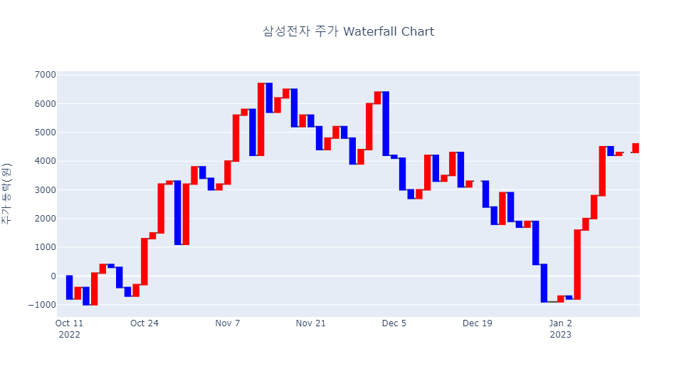

```{r setup, include=FALSE}
knitr::opts_chunk$set(echo = TRUE, message = FALSE, warning = FALSE, fig.width = 6.5, dpi = 130, eval = FALSE)
library(showtext)
showtext_auto()

library(tidyverse)
library(readxl)
library(readr)
library(lubridate)
library(plotly)
```

```{r echo = FALSE, message = FALSE, warning = FALSE}
df_covid19 <- read_csv(file = "D:/R/data/Rnpy/owid-covid-data.csv",
                            col_types = cols(date = col_date(format = "%Y-%m-%d")
                                             )
                            )
df_covid19_100 <- df_covid19 |> 
  filter(iso_code %in% c('KOR', 'OWID_ASI', 'OWID_EUR', 'OWID_OCE', 'OWID_NAM', 'OWID_SAM', 'OWID_AFR')) |>
  filter(date >= max(date) - 100) |>
  mutate(location = case_when(
    location == 'South Korea' ~ '한국', 
    location == 'Asia' ~ '아시아', 
    location == 'Europe' ~ '유럽', 
    location == 'Oceania' ~ '오세아니아', 
    location == 'North America' ~ '북미', 
    location == 'South America' ~ '남미', 
    location == 'Africa' ~ '아프리카')) |>
  mutate(location = fct_relevel(location, '한국', '아시아', '유럽', '북미', '남미', '아프리카', '오세아니아')) |>
  arrange(date)

df_covid19_100_wide <- df_covid19_100 |>
  select(date, location, new_cases, people_fully_vaccinated_per_hundred) |>
  rename('date' = 'date', '확진자' = 'new_cases', '백신접종완료자' = 'people_fully_vaccinated_per_hundred') |>
  pivot_wider(id_cols = date, names_from = location, 
              values_from = c('확진자', '백신접종완료자')) |>
  arrange(date)

df_covid19_stat <- df_covid19 |> 
  group_by(iso_code, continent, location) |>
  summarise(인구수 = max(population, na.rm = T), 
            전체사망자수 = sum(new_deaths, na.rm = T), 
            백신접종자완료자수 = max(people_fully_vaccinated, na.rm = T),
            인구백명당백신접종완료율 = max(people_fully_vaccinated_per_hundred, na.rm = T),
            인구백명당부스터접종자수 = max(total_boosters_per_hundred, na.rm = T)) |> 
    ungroup() |>
    mutate(십만명당사망자수 = round(전체사망자수 / 인구수 *100000, 5),
           백신접종완료율 = 백신접종자완료자수 / 인구수)

margins_R <- list(t = 50, b = 25, l = 25, r = 25)


df_취업률 <- read_excel('d:/R/data/Rnpy/2021년 학과별 고등교육기관 취업통계.xlsx', 
                     ## '학과별' 시트의 데이터를 불러오는데,
                     sheet = '학과별',
                     ## 앞의 13행을 제외하고
                     skip = 13, 
                     ## 첫번째 행은 열 이름으로 설정
                     col_names = TRUE, 
                     ## 열의 타입을 설정, 처음 9개는 문자형으로 다음 79개는 수치형으로 설정
                     col_types = c(rep('text', 9), rep('numeric', 79)))

## df_취업률에서 첫번째부터 9번째까지의 열과 '계'로 끝나는 열을 선택하여 다시 df_취업률에 저장
df_취업률 <- df_취업률 |> 
  select(1:9, ends_with('계'), '입대자')

## df_취업률에서 졸업자가 500명 이하인 학과 2000개 샘플링
df_취업률_500 <- df_취업률 |> 
  filter(졸업자_계 < 500) |>
  mutate(id = row_number()) |>
  filter(row_number() %in% seq(from = 1, to = nrow(df_취업률), by = 4))

## 열 이름을 적절히 설정
names(df_취업률_500)[10:12] <- c('졸업자수', '취업률', '취업자수')

```

```{python echo = FALSE, message = FALSE, warning = FALSE, eval = FALSE}
import pandas as pd
from datetime import datetime, timedelta
from pandas.api.types import CategoricalDtype
from matplotlib import pyplot as plt
import plotly.graph_objects as go

df_covid19 = pd.read_csv("D:/R/data/Rnpy/owid-covid-data.csv")

df_covid19['date'] = pd.to_datetime(df_covid19['date'], format="%Y-%m-%d")

df_covid19_100 = df_covid19[(df_covid19['iso_code'].isin(['KOR', 'OWID_ASI', 'OWID_EUR', 'OWID_OCE', 'OWID_NAM', 'OWID_SAM', 'OWID_AFR'])) & (df_covid19['date'] >= (max(df_covid19['date']) - timedelta(days = 100)))]


df_covid19_100.loc[df_covid19_100['location'] == 'South Korea', "location"] = '한국'
df_covid19_100.loc[df_covid19_100['location'] == 'Asia', "location"] = '아시아'
df_covid19_100.loc[df_covid19_100['location'] == 'Europe', "location"] = '유럽'
df_covid19_100.loc[df_covid19_100['location'] == 'Oceania', "location"] = '오세아니아'
df_covid19_100.loc[df_covid19_100['location'] == 'North America', "location"] = '북미'
df_covid19_100.loc[df_covid19_100['location'] == 'South America', "location"] = '남미'
df_covid19_100.loc[df_covid19_100['location'] == 'Africa', "location"] = '아프리카'

ord = CategoricalDtype(categories = ['한국', '아시아', '유럽', '북미', '남미', '아프리카', '오세아니아'], ordered = True)

df_covid19_100['location'] = df_covid19_100['location'].astype(ord)

df_covid19_100 = df_covid19_100.sort_values(by = 'date')

df_covid19_100_wide = df_covid19_100.loc[:,['date', 'location', 'new_cases', 'people_fully_vaccinated_per_hundred']].rename(columns={'new_cases':'확진자', 'people_fully_vaccinated_per_hundred':'백신접종완료자'})

df_covid19_100_wide = df_covid19_100_wide.pivot(index='date', columns='location', values=['확진자', '백신접종완료자']).sort_values(by = 'date')

df_covid19_100_wide.columns = ['확진자_한국', '확진자_아시아', '확진자_유럽', '확진자_북미', '확진자_남미', '확진자_아프리카','확진자_오세아니아',
                              '백신접종완료자_한국', '백신접종완료자_아시아', '백신접종완료자_유럽', '백신접종완료자_북미', '백신접종완료자_남미', '백신접종완료자_아프리카','백신접종완료자_오세아니아']
                              
df_covid19_stat = df_covid19.groupby(['iso_code', 'continent', 'location'], dropna=False).agg(
    인구수 = ('population', 'max'),
    전체확진자수 = ('new_cases', 'sum'),
    전체사망자수 = ('new_deaths', 'sum'), 
    백신접종자완료자수 = ('people_fully_vaccinated', 'max'),
    인구백명당백신접종완료율 = ('people_fully_vaccinated_per_hundred', 'max'),
    인구백명당부스터접종자수 = ('total_boosters_per_hundred', 'max')
).reset_index()

df_covid19_stat['십만명당사망자수'] = round(df_covid19_stat['전체사망자수'] / df_covid19_stat['인구수'] *100000, 5)

df_covid19_stat['백신접종완료율'] = df_covid19_stat['백신접종자완료자수'] / df_covid19_stat['인구수']

######################################   
## python 코드
## 대학 학과 취업률 데이터 셋

df_취업률 = pd.read_excel("d:/R/data/Rnpy/2021년 학과별 고등교육기관 취업통계.xlsx", 
                           sheet_name = '학과별',
                           skiprows=(13), 
                           header = 0)

df_취업률 = pd.concat([df_취업률.iloc[:, 0:8], 
                    df_취업률.loc[:, df_취업률.columns.str.endswith('계')], 
                    df_취업률.loc[:, '입대자']], 
                   axis = 1
                   )

df_취업률_2000 = df_취업률.loc[(df_취업률['졸업자_계'] < 500)]

df_취업률_2000 = df_취업률_2000.iloc[range(0, len(df_취업률_2000.index) , 4)]

df_취업률_2000 = df_취업률_2000.rename(columns = {'졸업자_계':'졸업자수', '취업률_계':'취업률', '취업자_합계_계':'취업자수'})

margins_P = dict(t = 50, b = 25, l = 25, r = 25)

```

시간과 흐름의 시각화는 시간이나 특정 이벤트, 서로 다른 데이터의 변화에 따라 발생하는 데이터의 변화와 흐름을 시각화한 것이다. 시간의 시각화는 추세(Trend)라고 하는 시간에 따른 데이터의 변화를 관찰하는데 매우 용이하다. 하지만 추세는 꼭 시간의 흐름에 종속되지는 않는다. 예를 들자면 회차(물론 이 또한 시간의 흐름과 무관하지 않지만)나 이벤트의 발생과 같은 데이터의 변화도 추세에 속할 수 있다. 하지만 추세의 측정에 있어 중요한 것은 그것이 시간이던, 회차이던, 특정 이벤트이던, 그들의 흐름을 측정하는 간격이나 성질이 일정해야 한다는 것이다. 시간의 경우 추세를 측정하기 위해서는 시간적 간격, 즉, 연도별, 월별, 일별 등의 간격이 동일해야 하고 회차의 경우 1회, 2회와 같이 연속된 회차로 기록되어야 유의미하다. 만약 시간의 간격이 어느 구간에서는 연도별, 어느 구간에서는 월별로 표현된다면 추세를 정확히 파악하기 어렵다. 따라서 추세에는 데이터의 흐름, 특히 흐름의 측정 간격이 매우 중요하다.

시간을 시각화할 때는 데이터의 포인트와 해당 데이터의 바로 전 데이터와 다음 데이터를 연결하는 선 그래프가 많이 사용되지만, 막대그래프도 많이 사용된다.

# 선 그래프

특정한 변량의 흐름에 따라 변화되는 데이터 값들을 선으로 연결하여 그 변화량을 보여주는 시각화 방법이다. 이 선 그래프가 가장 효과적으로 사용되는 시각화가 시간의 흐름에 따라 변화하는 시계열 데이터에 대한 시각화 방법이다.

선 그래프는 간단하고 이해하기 쉽고 효율적이므로 한 번에 많은 데이터 비교하거나, 시간 경과에 따른 변화 및 추세 표시, 중요한 문맥 및 주석 포함하는 시각화, 예측 데이터 및 불확실성의 표시, 데이터 시리즈 내 또는 데이터 시리즈 전반의 이상 징후 강조 등에 사용된다. 하지만 단순한 사물의 수량 표시, 이산형 데이터 작업 일부와 전체 비교를 위한 시각화, 데이터가 희소한 데이터 세트의 시각화에는 적합하지 않다.

선 그래프 (또는 꺾은 선형 차트)는 각각의 시간에 관측된 데이터 포인트들을 같은 변수나 변량끼리 선으로 연결하였기 때문에 그 기본은 산점도에 있다고 할 수도 있다.

plotly는 선 그래프를 위만 트레이스를 제공하지 않는다. 앞서 산점도를 그릴 때 사용했던 scatter 트레이스의 'mode'에 "lines"를 설정해 줌으로써 그릴 수 있다. 다음은 코로나19의 인구 10만 명당 사망자 수 누적값의 추세를 나타내는 R과 python 코드이다. 시각화를 위해 먼저 우리나라, 미국, 일본, 영국, 프랑스 다섯 국가의 데이터만 필터링한 데이터를 사용하도록 전처리하였다. 각 국가의 선을 더욱 쉽게 구분하기 위해 선의 형태를 다르게 설정하였고, 중간중간 빈 데이터를 이어주도록 속성을 설정하였다.

-   R

R에서 선 그래프를 그리기 위해서는 `add_trace(type = 'scatter', mode = 'lines', ...)`을 사용하거나 `add_lines()`를 사용한다.

```{r eval = FALSE}
## 5개국 데이터로 전처리
total_deaths_5_nations_by_day <- df_covid19 |> 
  filter((iso_code %in% c('KOR', 'USA', 'JPN', 'GBR', 'FRA'))) |>
  filter(!is.na(total_deaths_per_million))

total_deaths_5_nations_by_day |>
  plot_ly() |>
  ## scatter 트레이스 생성
  add_trace(type = 'scatter', mode = 'lines', 
            x = ~date, y = ~total_deaths_per_million , 
            linetype = ~location, connectgaps = T) |>
  ## layout의 제목, 축제목, 여백 속성 설정
  layout(title = '코로나 19 사망자수 추세', 
         xaxis = list(title = ''), 
         yaxis = list(title = '10만명당 사망자수 누계'), 
         margin = margins_R)

```

```{r eval = FALSE, echo = FALSE}
#### fig 5-1

total_deaths_5_nations_by_day <- df_covid19 |> 
  filter((iso_code %in% c('KOR', 'USA', 'JPN', 'GBR', 'FRA'))) |>
  filter(!is.na(total_deaths_per_million))

total_deaths_5_nations_by_day |>
  ## plotly 객체 생성
  plot_ly() |>
  add_trace(type = 'scatter', mode = 'lines', 
            x = ~date, y = ~total_deaths_per_million , linetype = ~location, connectgaps = T, 
            color = ~location, colors = RColorBrewer::brewer.pal(9, 'Blues')[seq(from = 9, to = 5, by = -1)]
) |>
  layout(title = '코로나 19 사망자수 추세', 
         xaxis = list(title = ''), 
         yaxis = list(title = '10만명당 사망자수 누계'), 
         margin = margins_R)

```

-   python

python에서 선 그래프를 그리기 위해서는 `add_trace()`에 `plotly.graph_objects.Scatter()`나 `plotly.express.line()`를 사용한다. 다음의 코드에서 'nations'라는 딕셔너리를 정의했는데 각각의 국가명에 맞는 선의 형태를 설정하기 위해 사용한다. 이 선의 형태를 설정하기 위해 `for` 루프를 사용하였다.

```{python eval = FALSE}
##  원본데이터 보존을 위해 데이터프레임 복사
total_deaths_5_nations_by_day = df_covid19.copy()
## 5개국 데이터로 전처리
total_deaths_5_nations_by_day = total_deaths_5_nations_by_day[(total_deaths_5_nations_by_day['iso_code'].isin(['KOR', 'USA', 'JPN', 'GBR', 'FRA']))].dropna(subset = ['total_deaths_per_million'])

##  라인 타입 설정을 위한 딕셔너리 정의
nations = {'France':'0', 'Japan':'1', 'South Korea':'2', 'United Kingdom':'3', 'United States':'4'}

##  plolty 초기화
fig = go.Figure()

##  국가별로 트레이스를 추가 
for location, group in total_deaths_5_nations_by_day.groupby('location'):
    fig.add_trace(go.Scatter(
        mode = 'lines', 
        x = group['date'], y = group['total_deaths_per_million'], 
        line = dict(dash = nations[location]), 
        name = location, connectgaps = True))

## layout의 제목, 축제목, 여백 속성 설정
fig.update_layout(title = dict(text = '코로나 19 사망자수 추세', x = 0.5), 
                  xaxis = dict(title = ''), 
                  yaxis = dict(title = '10만명당 사망자수 누계'))   

fig.show()

```

```{python eval = FALSE, echo=FALSE}
total_deaths_5_nations_by_day = df_covid19.copy()
total_deaths_5_nations_by_day = total_deaths_5_nations_by_day[(total_deaths_5_nations_by_day['iso_code'].isin(['KOR', 'USA', 'JPN', 'GBR', 'FRA']))].dropna(subset = ['total_deaths_per_million'])

nations = {'France':'0', 'Japan':'1', 'South Korea':'2', 'United Kingdom':'3', 'United States':'4'}

fig = go.Figure()
for location, group in total_deaths_5_nations_by_day.groupby('location'):
    fig.add_trace(go.Scatter(
        mode = 'lines', 
        x = group['date'], 
        y = group['total_deaths_per_million'], 
        line = dict(dash = nations[location]), 
        name = location,
        connectgaps = True
    ))

fig.update_layout(title = dict(text = '코로나 19 사망자수 추세', x = 0.5), 
                  xaxis = dict(title = ''), 
                  yaxis = dict(title = '10만명당 사망자수 누계'), 
                 colorway = ("#08306B", "#08519C", "#2171B5", "#4292C6", "#6BAED6"))   
    
fig.show()

```


## 주석을 사용하는 선 그래프

이 시각화를 보면 5개 국가의 사망자 수의 흐름이 잘 표현되어 있다. 하지만 하나 아쉬운 점은 범례를 사용하여 각 선에 해당하는 국가를 나타내고 있는데 선에 따른 국가를 확인하기 위해서는 범례와 데이터 선을 번갈아 찾아야 한다는 불편함이 따른다. 그래서 선 그래프를 사용하는 많은 경우에서 범례를 사용하기 보다는 선 옆에 바로 범례를 표현하는 방법을 사용한다. 또 선 그래프는 시간의 흐름에 따라 발생하는 다양한 이벤트를 표시하는 경우도 많다. 예를 들어 우리나라의 코로나19 확진자 수는 설이나 추석 등의 장기 연휴가 끝나면 급증하는 경향을 보인다. 또 특정한 정책이 시행되는 날의 이후 시계열적 데이터의 강한 변동이 보이는 경우도 많다. 따라서 이러한 달력상의, 사회상의 이벤트를 표시하는 경우가 많다.

이렇게 plotly에서 범례를 선 그래프 뒤에 붙여주는 기능이나 시간 축 상의 혹은 데이터 축 상의 특정한 이벤트를 표시하는 것은 주석(annotation)으로 처리하는 방법을 써야 한다.

주석은 플롯 위에 표시되는 텍스트 기반 정보를 말한다. 주석이 위치하는 좌표는 플롯의 상대 좌표나 그래프의 실제 데이터 좌표를 기준으로 위치를 지정하는데, 기본적으로 주석은 주석의 정확한 위치를 표시하는 화살표를 사용한다.

plotly에서 제공하는 주석은 'data'로 표시되는 트레이스도, 'layout'으로 표시되는 레이 아웃에도 속하지 않는 'layer'에 속한다. 'layer'는 'data'나 'layout'과 같이 plolty를 구성하는 필수적인 요소는 아니다. 'data'와 'layout'의 보완적 요소로써 'annotation', 'shape', 'images' 등의 요소들을 추가하는 데 사용할 수 있다. 따라서 R과 python 모두 'data'와 'layout'를 만들 때와는 다른 함수를 사용한다. 다음은 'annotation'에서 사용하는 주요 속성들이다.


다음은 5개국의 코로나19 누적 사망자 수를 표시하는 선 그래프이다. 앞의 선 그래프와 다른 것은 범례를 사용하지 않고 데이터의 끝에 해당 데이터의 해당 데이터의 이름을 붙여주는 R과 python 코드이다. 먼저 선 그래프의 오른쪽에 범례를 표시하기 위해 Y축의 오른쪽에 여분의 공간이 필요하다. 이를 위해 마지막 날짜의 180일 후까지 늘려주었다. 다음으로 scatter 트레이스의 'mode'를 "lines"로 설정하고, 5개국의 코로나19 누적 사망자 수의 선 그래프를 그리고 범례를 없앤다. 이 후 각각 데이터의 마지막 날 데이터의 위치에 'xanchor' 가 "left"로, 'textposition'이 "middle right"로 설정된 각각의 데이터 이름을 주석(annotation)으로 붙여준다. 여기서 'showarrow'를 FALSE로 설정하여 화살표를 없애고 좌표점에 데이터를 표시하도록 하였다. 다음으로 2022년 설날('2022-02-01')의 한국 데이터의 위치를 화살표로 '설날'로 표시하였다.

-   R

```{r eval = FALSE}
## 마지막 일로부터 180일 후 날짜 계산
last_day = max(distinct(total_deaths_5_nations_by_day, date) |> pull()) + 180

total_deaths_5_nations_by_day |>
  plot_ly() |>
  ## scatter 트레이스 생성
  add_trace(type = 'scatter', mode = 'lines', 
            x = ~date, y = ~total_deaths_per_million , 
            linetype = ~location, connectgaps = T) |>
  ## 각국의 마지막 일옆에 국가명 주석 추가 
  add_annotations( 
            x =~ (total_deaths_5_nations_by_day |> filter(date == max(date)) |> 
                    select(date) |> pull()), 
            y = ~(total_deaths_5_nations_by_day |> filter(date == max(date)) |> 
                    select(total_deaths_per_million) |> pull()),
            text = ~(total_deaths_5_nations_by_day |> filter(date == max(date)) |> 
                       select(location) |> pull()), 
            textposition = 'middle right', xanchor = 'left', showarrow = FALSE
  ) |>
  ## 설날 주석을 추가
  add_annotations( 
            x = '2022-02-01', 
            y = ~(total_deaths_5_nations_by_day |> 
                    filter(date == '2022-02-01', iso_code == 'KOR') |> 
                    select(total_deaths_per_million) |> pull()),
            text = '설날', 
            textposition = 'middle right', xanchor = 'right'
  ) |>
  layout(title = '코로나 19 사망자수 추세', 
         xaxis = list(title = '', 
                      range = c('2020-02-15', format(last_day, format="%Y-%m-%d"))), 
         yaxis = list(title = '10만명당 사망자수 누계'), 
         margin = margins_R,
         showlegend = FALSE)

```

```{r echo = FALSE, eval = FALSE}
############ fig5-2

last_day = max(distinct(total_deaths_5_nations_by_day, date) |> pull()) + 180

total_deaths_5_nations_by_day |>
  ## plotly 객체 생성
  plot_ly() |>
  add_trace(type = 'scatter', mode = 'lines', 
            x = ~date, y = ~total_deaths_per_million , linetype = ~location, connectgaps = T, 
            color = ~location, colors = RColorBrewer::brewer.pal(7, 'Blues')[3:7]) |>
  add_annotations( 
            x =~ (total_deaths_5_nations_by_day |> filter(date == max(date)) |> select(date) |> pull()), 
            y = ~(total_deaths_5_nations_by_day |> filter(date == max(date)) |> select(total_deaths_per_million) |> pull()),
            text = ~(total_deaths_5_nations_by_day |> filter(date == max(date)) |> select(location) |> pull()), 
            textposition = 'middle right', xanchor = 'left', showarrow = FALSE
  ) |>
  add_annotations( 
            x = '2022-02-01', 
            y = ~(total_deaths_5_nations_by_day |> filter(date == '2022-02-01', iso_code == 'KOR') |> select(total_deaths_per_million) |> pull()),
            text = '설날', 
            textposition = 'middle right', xanchor = 'right'
  ) |>
  layout(title = '코로나 19 사망자수 추세', 
         xaxis = list(title = '', range = c('2020-02-15', format(last_day, format="%Y-%m-%d"))), 
         yaxis = list(title = '10만명당 사망자수 누계'), 
         margin = margins_R,
         showlegend = FALSE)

```

-   python

```{python eval = FALSE}
fig = go.Figure()
##  국가별로 그룹화하여 for 루프 실행
for location, group in total_deaths_5_nations_by_day.groupby('location'):
  ##  각국의 백만명당 사망자수 scatter 트레이스 생성
    fig.add_trace(go.Scatter(mode = 'lines', 
        x = group['date'], 
        y = group['total_deaths_per_million'], 
        line = dict(dash = nations[location]), 
        name = location, connectgaps = True, showlegend = False
    ))
    ##  각국의 마지막 날 옆에 국가명 scatter 트레이스 생성
    fig.add_trace(go.Scatter(
        mode = 'text',
        x = group.loc[group['date'] == group['date'].max(), 'date'], 
        y = group.loc[group['date'] == group['date'].max(), 'total_deaths_per_million'],
        text = group.loc[group['date'] == group['date'].max(), 'location'], 
        showlegend = False, 
        textposition = 'middle right'
    ))    

##  설날 표시를 위한 주석 추가
fig.add_annotation(
    x = '2022-02-01', 
    y = total_deaths_5_nations_by_day.loc[(total_deaths_5_nations_by_day['date'] == '2022-02-01') & (total_deaths_5_nations_by_day['iso_code'] == 'KOR'), 'total_deaths_per_million'].values[0],
    text = '설날', showarrow=True, arrowhead=1, arrowsize = 1.5
    )    

## layout의 제목, xaxis, yaxis 설정
fig.update_layout(title = dict(text = '코로나 19 사망자수 추세', x = 0.5), 
                  xaxis = dict(title = '', 
                               range = [total_deaths_5_nations_by_day['date'].min(),
                               total_deaths_5_nations_by_day['date'].max() + timedelta(days=150)]), 
                  yaxis = dict(title = '10만명당 사망자수 누계'))
                  
fig.show()

```

```{python eval = FALSE, echo = FALSE}
############ fig5-2

fig = go.Figure()
for location, group in total_deaths_5_nations_by_day.groupby('location'):
    fig.add_trace(go.Scatter(
        mode = 'lines', 
        x = group['date'], 
        y = group['total_deaths_per_million'], 
        line = dict(dash = nations[location]), 
        name = location,
        connectgaps = True, showlegend = False
    ))
    fig.add_trace(go.Scatter(
        mode = 'text',
        x = group.loc[group['date'] == group['date'].max(), 'date'], 
        y = group.loc[group['date'] == group['date'].max(), 'total_deaths_per_million'],
        text = group.loc[group['date'] == group['date'].max(), 'location'], 
        showlegend = False, 
        textposition = 'middle right'
    ))    

fig.add_annotation(
    x = '2022-02-01', 
    y = total_deaths_5_nations_by_day.loc[(total_deaths_5_nations_by_day['date'] == '2022-02-01') & (total_deaths_5_nations_by_day['iso_code'] == 'KOR'), 'total_deaths_per_million'].values[0],
    text = '설날', 
    showarrow=True,
    arrowhead=1, 
    arrowsize = 1.5
)    

fig.update_layout(title = dict(text = '코로나 19 사망자수 추세', x = 0.5), 
                  xaxis = dict(title = '', 
                               range = [total_deaths_5_nations_by_day['date'].min(), total_deaths_5_nations_by_day['date'].max() + timedelta(days=150)]), 
                  yaxis = dict(title = '10만명당 사망자수 누계'), 
                 colorway = ("#08306B", "#08519C", "#2171B5", "#4292C6", "#6BAED6"))   
fig.show()
```


## rangeslider를 사용한 선 그래프

앞에서 그렸던 선 그래프는 R의 ggplot2나 python의 matplotlib, seaborn과 같은 정적 시각화 패키지로도 그릴 수 있는 그래프이다. 물론 plotly에서 기본적으로 제공되는 모드바나 마우스와의 상호작용과 같은 동적 시각화 기능을 사용하면 시각화를 보다 다양하게 사용할 수 있지만, plotly의 시계열 선 그래프에서 제공하는 특별한 기능이 있다. 대표적인 것이 'rangeslider'와 'rangebutton'이다. 

'rangeslider'는 X축에 매핑된 시간 축을 이동, 확대, 축소하기 위한 컨트롤을 말하는데, 'rangeslider'는 전체 선 그래프의 형태가 표현되며 양 쪽 끝의 슬라이더 막대를 움직여 X축의 범위를 설정할 수 있다. 이 'rangeslider'는 X축에만 제공되는 속성으로 'layout'-'xaxis'의 세부 속성 중 하나인 'rangeslider'의 세부 속성을 사용하여 세부 설정이 가능하다. 'rangeslider'를 시작하기 위해서는 먼저 'visible' 속성을 "True"로 설정해야 한다.

다음은 'rangeslider'의 주요 속성이다.


다음은 앞서 그렸던 5개 국가의 코로나19 사망자 수 추세 선 그래프에 rangeslider를 붙이는 R과 python 코드이다.

-   R

R에서 rangeslider는 `layout()`에서 'xaxis'의 하위 속성으로 설정이 가능하다.

```{r fig.cap = 'rangeslider가 설정된 선 그래프', eval = FALSE}
total_deaths_5_nations_by_day |>
  plot_ly() |>
  add_trace(type = 'scatter', mode = 'lines', 
            x = ~date, y = ~total_deaths_per_million , 
            linetype = ~location, connectgaps = T
) |>
  layout(title = '코로나 19 사망자수 추세', 
         xaxis = list(title = '', 
                      ## rangeslider 속성 설정
                      rangeslider = list(visible = T)), 
         yaxis = list(title = '10만명당 사망자수 누계'), 
         showlegend = T, margin = margins_R, 
         title = 'Time Series with Rangeslider')

```


```{r echo = FALSE}
################### fig 5-3

total_deaths_5_nations_by_day |>
  ## plotly 객체 생성
  plot_ly() |>
  add_trace(type = 'scatter', mode = 'lines', 
            x = ~date, y = ~total_deaths_per_million , linetype = ~location, connectgaps = T, 
            color = ~location, colors = RColorBrewer::brewer.pal(7, 'Blues')[3:7]
) |>
  layout(title = '코로나 19 사망자수 추세', 
         xaxis = list(title = '', rangeslider = list(visible = T)), 
         yaxis = list(title = '10만명당 사망자수 누계'), 
         showlegend = T, margin = margins_R, 
         title='Time Series with Rangeslider',
         margin = margins_R)

```

-   python

python에서는 `update_layout()`에서 'xaxis'의 하위 속성으로 설정이 가능하다.

```{python eval = FALSE}
fig = go.Figure()

for location, group in total_deaths_5_nations_by_day.groupby('location'):
    fig.add_trace(go.Scatter(
        mode = 'lines', 
        x = group['date'], y = group['total_deaths_per_million'], 
        line = dict(dash = nations[location]), 
        name = location, connectgaps = True))

fig.update_layout(title = dict(text = '코로나 19 사망자수 추세', x = 0.5), 
                  xaxis = dict(title = '',
                    ## rangeslider  속성 설정
                    rangeslider = dict(visible = True)), 
                  yaxis = dict(title = '10만명당 사망자수 누계'))   
    
fig.show()
```

```{python eval = FALSE, echo = FALSE}
fig = go.Figure()
for location, group in total_deaths_5_nations_by_day.groupby('location'):
    fig.add_trace(go.Scatter(
        mode = 'lines', 
        x = group['date'], 
        y = group['total_deaths_per_million'], 
        line = dict(dash = nations[location], color = "#08519C"), 
        name = location,
        connectgaps = True
    ))

fig.update_layout(title = dict(text = '코로나 19 사망자수 추세', x = 0.5), 
                  xaxis = dict(title = '', rangeslider = dict(visible = True)), 
                  yaxis = dict(title = '10만명당 사망자수 누계'))   
    
fig.show()
```


## rangeselector를 사용한 선 그래프

rangeslider는 전체 기간중에 특정 기간을 사용자가 직접 설정할 수 있는 장점이 있지만, 정확한 기간을 설정하기는 어렵다. 예를 들어 최근 30일, 최근 6개월과 같은 명확한 기간을 설정하고자 할 때는 효과적이지 못하다. 이런 경우를 대비하여 plotly에서 제공하는 기능이 'rangeselecor'이다. 'rangeselector'는 버튼으로 제공되는데 최근 일에서부터 거꾸로 얼마의 기간 범위를 설정할지를 결정할 수 있다. 'rangeselector' 속성을 설정하기 위해 사용하는 주요 하위 속성은 다음과 같다.


rangeselector의 동작은 각각의 버튼에 설정된 'count', 'step', 'stepmode'의 세 가지 속성을 위주로 작동한다. 버튼을 클릭하면 가장 최근 데이터로부터 'stepmode' 방향으로 'step' 속성에 설정된 단위에 의해 'count' 만큼 X축의 범위가 설정된다. 'step'은 "month", "day", "year" 등의 시간 간격이 설정되고, 'stepmode'는 "backward", "todate"의 두 속성값이 설정된다. "backward"는 'step' 단위로 'count' 만큼 뒤쪽으로 X축 범위의 시작 값이 설정되고, "todate"는 'step' 단위로 'count' 만큼 뒤쪽의 첫 번째 타임스탬프로 설정된다. 예를 들면 'stepmode'가 "todate"인 경우 'step'이 "year"이고 'count'가 "1"로 설정되어 있다면 첫 번째 타임스탬프인 해당년도 1월 1일로 이동한다. 반면 'stepmode'가 "bakcward"인 경우는 기간상으로 1년 전으로 X축의 시작 범위가 설정된다.

다음의 코드는 rangeselect 버튼을 사용하는 R과 python 코드이다. 이 코드를 보면 총 5개의 버튼이 만들어졌는데, 첫 번째 버튼은 'stepmode'가 "bakcward", 'step'을 "day"로 설정하고 'count'를 "7"로 설정하였기 때문에 범위를 마지막 날로부터 7일 전부터 마지막 날까지 설정된다. 두 번째 버튼과 세 번째 버튼은 각각 한 달, 6개월 전부터 마지막 날까지 설정하는 버튼이다. 네 번째 버튼에서 보면 'stepmode'가 다른 버튼과 달리 "todate"로 설정되어 있고 'step'은 "year", 'count'는 "1"로 설정되어 있다. 따라서 이 버튼은 연도의 타임 스탬프, 즉 첫번째 1월 1일로 X축의 시작 범위가 이동한다. 반면 다섯 번째 버튼은 네 번째 버튼과 'count', 'step'은 동일하게 설정되어 있지만 'stepmode'는 "backward"로 설정이 되었다. 따라서 이 버튼은 가장 최근 일로부터 1년 전으로 X축의 시작 범위가 설정된다.

여기서 하나 주의해 보아야 하는 것은 rangeselector의 'buttons' 속성은 다른 속성과 달리 딕셔너리(R의 경우 list)의 리스트로 구성한다는 것이다. 버튼은 여러 개를 설정할 수 있기 때문에 이 버튼들의 딕셔너리를 리스트로 설정하여 'button' 속성에 설정한다는 것이다.

-   R

```{r eval = FALSE}
total_deaths_5_nations_by_day |>
  plot_ly() |>
  add_trace(type = 'scatter', mode = 'lines', 
            x = ~date, y = ~total_deaths_per_million , linetype = ~location, connectgaps = T) |>
  layout(title = '코로나 19 사망자수 추세', 
         yaxis = list(title = '10만명당 사망자수 누계'), 
         xaxis = list(title = '', 
                      range = c(min(total_deaths_5_nations_by_day$date),
                                max(total_deaths_5_nations_by_day$date)),
                      ## rangeslider 속성 설정
                      rangeslider = list(visible = T),
                      ##  rangeselector  속성 설정
                      rangeselector=list(
                        ## rangeselector의 buttons 속성 설정
                        buttons=list(
                          list(count=7, label='1 Week before', step='day', stepmode='backward'),
                          list(count=1, label='1 month before', step='month', stepmode='backward'),
                          list(count=6, label='6 months before', step='month', stepmode='backward'),
                          list(count=1, label='new years day', step='year', stepmode='todate'),
                          list(count=1, label='1 year before', step='year', stepmode='backward')
                        ))),
         showlegend = T, margin = list(t = 75, b = 25, l = 25, r = 25))

```

```{r echo = FALSE}
################### fig 5-4
total_deaths_5_nations_by_day |>
  ## plotly 객체 생성
  plot_ly() |>
  add_trace(type = 'scatter', mode = 'lines', 
            x = ~date, y = ~total_deaths_per_million , linetype = ~location, connectgaps = T, 
            color = ~location, colors = RColorBrewer::brewer.pal(7, 'Blues')[3:7]
) |>
  layout(title = '코로나 19 사망자수 추세', 
         yaxis = list(title = '10만명당 사망자수 누계'), 
         xaxis = list(title = '', 
                      range = c(min(total_deaths_5_nations_by_day$date),
                                max(total_deaths_5_nations_by_day$date)),
                      rangeslider = list(visible = T), 
                      rangeselector=list(
                        buttons=list(
                          list(count=7, label='1 Week before', step='day', stepmode='backward'),
                          list(count=1, label='1 month before', step='month', stepmode='backward'),
                          list(count=6, label='6 months before', step='month', stepmode='backward'),
                          list(count=1, label='new years day', step='year', stepmode='todate'),
                          list(count=1, label='1 year before', step='year', stepmode='backward')
                          )
                        )
                      ),
         showlegend = T, margin = list(t = 75, b = 25, l = 25, r = 25)
         )

```

-   python

```{python eval = FALSE}
fig = go.Figure()

for location, group in total_deaths_5_nations_by_day.groupby('location'):
    fig.add_trace(go.Scatter(
        mode = 'lines', 
        x = group['date'], 
        y = group['total_deaths_per_million'], 
        line = dict(dash = nations[location]), 
        name = location,  connectgaps = True))

fig.update_layout(title = dict(text = '코로나 19 사망자수 추세', x = 0.5), 
                  xaxis = dict(title = '', 
                               ## rangeslider 속성 설정
                               rangeslider = dict(visible = True),
                               ## rangeselector 속성 설정
                               rangeselector=dict(
                                   ## rangeselector의 buttons 속성 설정
                                   buttons=list([
                                       dict(count=7, label='1 Week before', step='day', stepmode="backward"),
                                       dict(count=1, label='1 month before', step='month', stepmode="backward"),
                                       dict(count=6, label='6 months before', step="month", stepmode="backward"),
                                       dict(count=1, label='new years day', step="year", stepmode="todate"),
                                       dict(count=1, label='1 year before', step="year", stepmode="backward")
                                       ]))), 
                  yaxis = dict(title = '10만명당 사망자수 누계'))   
    
fig.show()
```

```{python eval = FALSE, echo = FALSE}
fig = go.Figure()
for location, group in total_deaths_5_nations_by_day.groupby('location'):
    fig.add_trace(go.Scatter(
        mode = 'lines', 
        x = group['date'], 
        y = group['total_deaths_per_million'], 
        line = dict(dash = nations[location], color = "#08519C"), 
        name = location,
        connectgaps = True
    ))

fig.update_layout(title = dict(text = '코로나 19 사망자수 추세', x = 0.5), 
                  xaxis = dict(title = '', 
                               rangeslider = dict(visible = True),
                               rangeselector=dict(
                                   buttons=list([
                                       dict(count=7, label="1 Week before", step="day", stepmode="backward"),
                                       dict(count=1, label="1 month before", step="month", stepmode="backward"),
                                       dict(count=6, label="6 months before", step="month", stepmode="backward"),
                                       dict(count=1, label="new years day", step="year", stepmode="todate"),
                                       dict(count=1, label="1 year before", step="year", stepmode="backward")
                                       ])
                                   )
                               ), 
                  yaxis = dict(title = '10만명당 사망자수 누계'))   
    
fig.show()

```


## 호버모드를 사용한 선 그래프

plolty는 동적 데이터 시각화이기 때문에 온라인에서 사용자의 반응에 따라 작동하는 다양한 기능을 제공한다. 여기에는 여러 가지 기능이 있지만 데이터의 값과 해당 값의 변량 등 시각화된 데이터의 해석이 원활하도록 제공하는 기능이 호버이다. 호버는 plotly에서만 제공하는 기능은 아니고 과거 'tooltip'이라는 이름으로 많이 사용되는 기능인데, 사용자의 마우스나 디지털 포인팅 장비와 상호 반응해 그 기기가 포인팅하는 곳의 정보를 조그마한 박스를 통해 사용자에게 알려주는 기능이다. 이 호버는 흔히 'mouse over', 'mouse hover', 'hover box'라고도 불리며, CSS(Cascade Style Sheet)를 사용하여 웹 브라우저에서 사용할 수 있다.

plotly에서도 호버를 표시하는 여러 가지 방법을 제공하는데, 이때 사용되는 속성이 'hovermode'이다. 'hovermode'는 다른 트레이스에서도 사용이 가능하지만 시간의 시각화에 사용되는 scatter 트레이스의 "lines" 모드에서 매우 효과적으로 사용된다.

'hovermode'는 'layout'에서 설정되는 속성으로 "x", "y", "closest", False, "x unified", "y unified"의 6가지 속성값을 가질 수 있다. "x", "y"는 X축, Y축 상에  같은 값을 가지는 트레이스에 대한 호버를 모두 표시해주는 호버모드이다. 마우스 포인트가 가리키는 X축과 Y축의 값을 인식하고 이들과 동일한 값을 가지는 트레이스의 해당 위치에 각각의 호버가 표시된다. 이 모드는 각각의 동일한 축 데이터끼리 서로 비교할 수 있다는 장점이 있는데, plotly 시각화의 우측 상단에 표시되는 'modebar'에서도 설정할 수 있다. "closet"은 마우스 포인팅과 가장 가까운 곳의 호버를 표시하는 모드로 특별한 설정이 없다면 "closet" 모드로 설정된다. "x unified", "y unified"는 동일한 X축과 Y축의 값에 해당하는 각각의 트레이스 데이터들이 하나의 호버 박스에 표시된다. 이로써 데이터를 한 번에 비교할 수 있는 장점이 있는데, 또 하나의 장점은 X축, Y 축의 방향으로 보조선이 표시된다는 것이다. 이 보조선은 스파이크라인이라고 하며 'skikemode' 속성으로 표시할 수도 있는데, 호버 모드에서 "x unified", "y unified"는 자동적으로 스파이크 라인이 표시되어 보다 수월하게 데이터를 확인할 수 있다. "x unified"와 "y unified"는 "x", "y"와 동일하게 마우스의 포인팅과 동일한 X축과 Y축의 모든 데이터에 대한 호버를 표시하는 것은 동일하지만 표시되는 호버를 각각의 데이터에 분산시키는 것이 아니고 하나의 호버에 묶어서 표시하는 것이 다르다.

'hovermode'와 관련된 속성 중에 호버가 표시되는 데이터와 포인팅과의 거리는 'hoverdistance'로 설정할 수 있다. 'hoverdistance'는 -1과 0이상의 수치로 설정하는데 -1이 설정되면 항상 호버를 표시하고 0은 호버를 표시하지 않는다.

다음은 'hovermode'를 "x", "y", "x unified", "y unified"를 설정하는 R과 python 코드이다.

-   R

```{r eval = FALSE}
##  호버모드가 x인 시각화
total_deaths_5_nations_by_day |>
  plot_ly() |>
  add_trace(type = 'scatter', mode = 'lines', 
            x = ~date, y = ~total_deaths_per_million , 
            linetype = ~location, connectgaps = T) |>
  layout(title = '코로나 19 사망자수 추세', 
         xaxis = list(title = ''), 
         yaxis = list(title = '10만명당 사망자수 누계'), 
         margin = margins_R,
         ## 호버 모드 설정
         hovermode="x")

##  호버모드가 y인 시각화
total_deaths_5_nations_by_day |>
  plot_ly() |>
  add_trace(type = 'scatter', mode = 'lines', 
            x = ~date, y = ~total_deaths_per_million , 
            linetype = ~location, connectgaps = T) |>
  layout(title = '코로나 19 사망자수 추세', 
         xaxis = list(title = ''), 
         yaxis = list(title = '10만명당 사망자수 누계'), 
         margin = margins_R, 
         ## 호버 모드 설정
         hovermode="y")

##  호버모드가 x unified인 시각화
total_deaths_5_nations_by_day |>
  plot_ly() |>
  add_trace(type = 'scatter', mode = 'lines', 
            x = ~date, y = ~total_deaths_per_million , 
            linetype = ~location, connectgaps = T) |>
  layout(title = '코로나 19 사망자수 추세', 
         xaxis = list(title = ''), 
         yaxis = list(title = '10만명당 사망자수 누계'), 
         margin = margins_R, 
         ## 호버 모드 설정
         hovermode="x unified")

##  호버모드가 y unified인 시각화
total_deaths_5_nations_by_day |>
  plot_ly() |>
  add_trace(type = 'scatter', mode = 'lines', 
            x = ~date, y = ~total_deaths_per_million , 
            linetype = ~location, connectgaps = T) |>
  layout(title = '코로나 19 사망자수 추세', 
         xaxis = list(title = ''), 
         yaxis = list(title = '10만명당 사망자수 누계'), 
         margin = margins_R, 
         ## 호버 모드 설정
         hovermode="y unified")
```

-   python

```{python eval = FALSE}
##  호버모드가 x인 시각화
fig = go.Figure()
for location, group in total_deaths_5_nations_by_day.groupby('location'):
    fig.add_trace(go.Scatter(
        mode = 'lines', 
        x = group['date'], 
        y = group['total_deaths_per_million'], 
        line = dict(dash = nations[location]), 
        name = location, connectgaps = True))
fig.update_layout(title = dict(text = '코로나 19 사망자수 추세', x = 0.5), 
                  xaxis = dict(title = ''), 
                  yaxis = dict(title = '10만명당 사망자수 누계'),
                  ## 호버 모드 설정
                  hovermode="x")       
fig.show()

##  호버모드가 y인 시각화
fig = go.Figure()
for location, group in total_deaths_5_nations_by_day.groupby('location'):
    fig.add_trace(go.Scatter(
        mode = 'lines', 
        x = group['date'], 
        y = group['total_deaths_per_million'], 
        line = dict(dash = nations[location]), 
        name = location, connectgaps = True))
fig.update_layout(title = dict(text = '코로나 19 사망자수 추세', x = 0.5), 
                  xaxis = dict(title = ''), 
                  yaxis = dict(title = '10만명당 사망자수 누계'),
                  ## 호버 모드 설정
                  hovermode="y")       
fig.show()

##  호버모드가 x unified인 시각화
fig = go.Figure()
for location, group in total_deaths_5_nations_by_day.groupby('location'):
    fig.add_trace(go.Scatter(
        mode = 'lines', 
        x = group['date'], 
        y = group['total_deaths_per_million'], 
        line = dict(dash = nations[location]), 
        name = location, connectgaps = True))
fig.update_layout(title = dict(text = '코로나 19 사망자수 추세', x = 0.5), 
                  xaxis = dict(title = ''), 
                  yaxis = dict(title = '10만명당 사망자수 누계'),
                  ## 호버 모드 설정
                  hovermode="x unified")       
fig.show()

##  호버모드가 y unified인 시각화
fig = go.Figure()
for location, group in total_deaths_5_nations_by_day.groupby('location'):
    fig.add_trace(go.Scatter(
        mode = 'lines', 
        x = group['date'], 
        y = group['total_deaths_per_million'], 
        line = dict(dash = nations[location]), 
        name = location, connectgaps = True))
fig.update_layout(title = dict(text = '코로나 19 사망자수 추세', x = 0.5), 
                  xaxis = dict(title = ''), 
                  yaxis = dict(title = '10만명당 사망자수 누계'),
                  ## 호버 모드 설정
                  hovermode="y unified")       
fig.show()
```


## 스파이크 라인을 사용한 선 그래프

plotly에서는 호버를 사용하여 데이터를 보다 쉽게 파악할 수 있는 기능을 제공한다. 여기에 보조적으로 사용할 수 있는 기능인 스파이크 라인(spikeline)도 지원한다. 스파이크 라인은 마우스가 포인팅하는 곳의 X축, Y축 안내선을 의미한다. 이 안내선을 사용하여 해당 마우스 포인트가 현재 어떤 값을 가리키고 있는지를 쉽게 알 수 있다.

이 스파이크 라인은 'xaxis', 'yaxis'의 하위 속성인 'spikemode' 속성을 사용하여 설정할 수 있다. 'xaxis'와 'yaxis'에 각각의 스파이크라인을 설정함으로써 양쪽 축에 해당하는 스파이크라인을 표시할 수 있다. 스파이크 라인은 항상 나타나는 것이 아니고 호버가 나타날 경우 나타난다. 'hovermode'가 "closet" 일 경우에는 마우스 포인터가 트레이스의 데이터를 가리켜서 호버가 나타날 때에만 나타나고, 'hovermode'가 "x", "y"나 "x unified", "y unified"일 경우는 항상 나타난다.

'spikemode'는 "across", "toaxis", "marker"의 세 가지 속성값을 가지는데 이 들은'+'를 사용하여 서로 조합하여 사용할 수 있다. "across"는 X축이나 Y축의 값에 대해 전체 플롯을 가로지르는 스파이크 라인을 표시하고, "toaxis"는 X축이나 Y축의 기본선에서부터(zeroline) 마우스 포인터에 해당하는 트레이스까지의 스파이크 라인을 만들어준다. "marker"는 X축이나 Y축위에 마커를 표시하고 해당 데이터를 표시하는 방법이다. 이 방법은 선이 나타나지는 않고 축 위에 포인팅만이 나타난다.

다음은 X축의 'spikemode'를 "across", Y축의 'spikemode'를 "toaxis"로 설정한 R과 python 코드이다.

-   R

```{r eval = FALSE}
total_deaths_5_nations_by_day |>
  plot_ly() |>
  add_trace(type = 'scatter', mode = 'lines', 
            x = ~date, y = ~total_deaths_per_million , linetype = ~location, connectgaps = T) |>
  layout(title = '코로나 19 사망자수 추세', 
         xaxis = list(title = '', 
                      ##  X축의 spikemode 설정
                      spikemode = 'across'), 
         yaxis = list(title = '10만명당 사망자수 누계', 
                      ##  Y축의 spikemode 설정
                      spikemode = 'toaxis'), 
         hovermode='x', 
         margin = margins_R)

```

```{r echo = FALSE, eval = FALSE}
total_deaths_5_nations_by_day |>
  ## plotly 객체 생성
  plot_ly() |>
  add_trace(type = 'scatter', mode = 'lines', 
            x = ~date, y = ~total_deaths_per_million , linetype = ~location, connectgaps = T, 
            color = ~location, colors = RColorBrewer::brewer.pal(7, 'Blues')[3:7]) |>
  layout(title = '코로나 19 사망자수 추세', 
         xaxis = list(title = '', 
                      spikemode = 'across'), 
         yaxis = list(title = '10만명당 사망자수 누계', 
                      spikemode = 'toaxis'), 
         margin = margins_R, 
         hovermode="x")


```

-   python

```{python eval = FALSE}
fig = go.Figure()

for location, group in total_deaths_5_nations_by_day.groupby('location'):
    fig.add_trace(go.Scatter(
        mode = 'lines', 
        x = group['date'], 
        y = group['total_deaths_per_million'], 
        line = dict(dash = nations[location]), 
        name = location, connectgaps = True))

fig.update_layout(title = dict(text = '코로나 19 사망자수 추세', x = 0.5), 
                  xaxis = dict(title = '', 
                      ##  X축의 spikemode 설정
                      spikemode = 'across'), 
                  yaxis = dict(title = '10만명당 사망자수 누계', 
                      ##  Y축의 spikemode 설정
                      spikemode = 'toaxis'), 
                  hovermode="x")   
    
fig.show()

```

```{python eval = FALSE, echo = FALSE}
fig = go.Figure()
for location, group in total_deaths_5_nations_by_day.groupby('location'):
    fig.add_trace(go.Scatter(
        mode = 'lines', 
        x = group['date'], 
        y = group['total_deaths_per_million'], 
        line = dict(dash = nations[location]),
        name = location,
        connectgaps = True
    ))
fig.update_layout(title = dict(text = '코로나 19 사망자수 추세', x = 0.5), 
                  xaxis = dict(title = '', 
                      spikemode = 'across'), 
                  yaxis = dict(title = '10만명당 사망자수 누계', 
                      spikemode = 'toaxis'), 
                  hovermode="x", 
                  colorway = ("#9ECAE1", "#6BAED6", "#4292C6", "#2171B5", "#084594")                  
                  )   
    
fig.show()
```


## 시간 축의 설정

선 그래프는 주로 시계열 데이터의 시각화에 많이 사용된다. 시계열 데이터는 시간이라는 축을 사용하기 때문에 이 축을 잘 사용하는 것이 매우 중요한 요소이다. plotly는 시간 축을 설정하기 위해 많은 기능을 제공하는데 이를 잘 활용하면 보다 효율적인 시각화를 만들 수 있다.

시간 축의 설정에서 plotly는 R과 python을 다소 다르게 다루고 있다. R에서 plotly는 시간 축의 데이터 유형을 R에서 기본적으로 사용하는 'Date' 타입으로 자동 설정하지 않는다. 따라서 축에 매핑되는 데이터 타입을 시간 축으로 설정하려면 축에 대해 `as.Data()`를 사용하여 축에 매핑되는 열의 데이터 타입을 'Date' 타입으로 설정하고 매핑해야 한다. 반면 python에서는 시간 축에 매핑하는 데이터가 ISO 형식의 날짜 문자열이거나 pandas와 numPy의 date형이 매핑되면 축의 유형을 시간 축으로 자동 설정한다.

### 눈금 라벨의 설정

plotly는 시간 축에 나타나는 눈금 라벨을 년, 월, 일, 시, 분, 초의 시간으로 표기하며, 눈금 라벨과 연결된 그리드 라인이 표시한다. 눈금 라벨은 'tickformat' 속성으로 표시되는 형태를 설정할 수 있다. 'tickformat'은 웹 표준으로 사용되는 D3.js에서 사용하는 시간 포맷을 사용한다. 예를 들어 '2022년 1월 1일'로 표시하기 위해서는 "%Y년 %m월 %d일"로 설정한다.

눈금의 간격은 'dtick' 속성을 사용하여 설정할 수 있다. 시간 축상에서 'dtick'은 밀리 초 단위의 수치로 설정한다. 따라서 1일을 간격으로 설정하기 위해서는 86,400,000(24*60*60\*1000)을 설정해야 한다. 이렇게 설정하는 것이 다소 번거롭기 때문에 plotly에서는 "M"을 사용하여 월 단위로의 간격 설정이 가능하도록 하였다. "M1" 설정은 "1개월"을 의미하는데, 일을 표시하기 위한 "D"나 년을 표시하기 위한 "Y"는 제공하지 않는다.

다음은 눈금 라벨을 "2022년 01월"과 같이 표시하고 눈금 간격을 3개월로 설정한 R과 python 코드이다.

-   R

```{r eval = FALSE}
total_deaths_5_nations_by_day |>
  plot_ly() |>
  add_trace(type = 'scatter', mode = 'lines', 
            x = ~date, y = ~total_deaths_per_million , linetype = ~location, connectgaps = T) |>
  layout(title = '코로나 19 사망자수 추세', 
         xaxis = list(title = '', spikemode = 'across',
                      ## X축 눈금 라벨 설정
                      tickformat = '%Y년 %m월',
                      ## X축 눈금 간격 설정
                      dtick = 'M3'), 
         yaxis = list(title = '10만명당 사망자수 누계', 
                      spikemode = 'toaxis'), 
         hovermode = 'x', 
         margin = margins_R)

```

```{r echo = FALSE}
################### fig 5-7
total_deaths_5_nations_by_day |>
  ## plotly 객체 생성
  plot_ly() |>
  add_trace(type = 'scatter', mode = 'lines', 
            x = ~date, y = ~total_deaths_per_million , linetype = ~location, connectgaps = T, 
            color = ~location, colors = RColorBrewer::brewer.pal(7, 'Blues')[3:7]) |>
  layout(title = '코로나 19 사망자수 추세', 
         xaxis = list(title = '', spikemode = 'across', tickformat = '%Y년 %m월',
                      dtick = 'M3'), 
         yaxis = list(title = '10만명당 사망자수 누계', 
                      spikemode = 'toaxis'), 
         margin = margins_R, 
         hovermode="x")

```

-   python

```{python eval = FALSE}
fig = go.Figure()

for location, group in total_deaths_5_nations_by_day.groupby('location'):
    fig.add_trace(go.Scatter(
        mode = 'lines', 
        x = group['date'], 
        y = group['total_deaths_per_million'], 
        line = dict(dash = nations[location]), 
        name = location, connectgaps = True))

fig.update_layout(title = dict(text = '코로나 19 사망자수 추세', x = 0.5), 
                  xaxis = dict(title = '', spikemode = 'across',
                      ## X축 눈금 라벨 설정
                      tickformat = '%Y년 %m월',
                      ## X축 눈금 간격 설정
                      dtick = 'M3'), 
                  yaxis = dict(title = '10만명당 사망자수 누계', 
                      spikemode = 'toaxis'), 
                  hovermode="x")   
    
fig.show()

```

```{python eval = FALSE, echo = FALSE}
fig = go.Figure()
for location, group in total_deaths_5_nations_by_day.groupby('location'):
    fig.add_trace(go.Scatter(
        mode = 'lines', 
        x = group['date'], 
        y = group['total_deaths_per_million'], 
        line = dict(dash = nations[location]),
        name = location,
        connectgaps = True
    ))
fig.update_layout(title = dict(text = '코로나 19 사망자수 추세', x = 0.5), 
                  xaxis = dict(title = '', 
                      spikemode = 'across', tickformat = '%Y년 %m월',
                      dtick = 'M3'), 
                  yaxis = dict(title = '10만명당 사망자수 누계', 
                      spikemode = 'toaxis'), 
                  hovermode="x", 
                  colorway = ("#9ECAE1", "#6BAED6", "#4292C6", "#2171B5", "#084594")                  
                  )   
    
fig.show()

```


### Zoom In/Out에 반응하는 눈금의 설정

plolty에서는 사용자의 마우스 드래그나 rangeslider, rangeselector, plotly 우측 상단의 modebar를 사용하면 시각화 그래프의 Zoom in이나 Zoom out을 할 수 있다. 이때 문제는 각각의 축에 표시된 라벨이 변동하지 않기 때문에 너무 좁은 구간을 선택하면 라벨이 전혀 나타나지 않아 데이터를 읽기 어려운 상황이 된다는 것이다.


plotly는 이렇게 Zoom in/out의 레벨에 따라 동적으로 눈금이 설정이 가능한데, 이 기능은 'tickformatstops' 속성을 사용한다. 'tickformatstops'는 Zoom in/out의 수준에 따라 눈금 리벨의 서식을 설정하는 속성으로 rangeselector와 같이 'tickformatstops'의 세부 속성의 리스트로 구성된 딕셔너리(R의 경우 list)로 설정할 수 있다.

'tickformatstops'은 하위 속성인 'dtickrange', 'value'로 설정이 가능하다. 'dtickrange'는 Zoom의 최소, 최대 값의 리스트로 구성되는데 밀리 세컨드 단위로 최대, 최솟값을 설정한다. 일반적으로 일 단위에서 주 단위로 표시되는 간격은 `list(86400000, 604800000)`, 주 단위에서 월 단위는 `list(604800000, "M1")`, 월 단위에서 년 단위는 `list("M1", "M12")`, 년 단위 이상은 `list("M12", NULL)`로 설정한다.

다음은 Zoom 레벨에 따른 눈금 설정의 R과 python 코드이다.

-   R

```{r eval = FALSE}
total_deaths_5_nations_by_day |>
  ## plotly 객체 생성
  plot_ly() |>
  add_trace(type = 'scatter', mode = 'lines', 
            x = ~date, y = ~total_deaths_per_million , linetype = ~location, connectgaps = T) |>
  layout(title = '코로나 19 사망자수 추세', 
         xaxis = list(title = '', spikemode = 'across', tickformat = '%Y년 %m월',
                      ##  tickformatstops 설정
                      tickformatstops = list(
                        ## 1000밀리초까지의 tickformat
                        list(dtickrange=list(NULL, 1000), value="%H:%M:%S.%L 밀리초"),
                        ## 1초 ~ 1분까지의 tickformat
                        list(dtickrange=list(1000, 60000), value="%H:%M:%S 초"),
                        ## 1분 ~ 1시간까지의 tickformat
                        list(dtickrange=list(60000, 3600000), value="%H:%M 분"),
                        ## 1시간 ~ 1일까지의 tickformat
                        list(dtickrange=list(3600000, 86400000), value="%H:%M 시"),
                        ## 1일 ~ 1주까지의 tickformat
                        list(dtickrange=list(86400000, 604800000), value="%e. %b 일"),
                        ## 1주 ~ 1월까지의 tickformat
                        list(dtickrange=list(604800000, "M1"), value="%e. %b 주"),
                        ## 1월 ~ 1년까지의 tickformat
                        list(dtickrange=list("M1", "M12"), value="%b '%y 월"),
                        ## 1년 이상의 tickformat
                        list(dtickrange=list("M12", NULL), value="%Y 년")
                      )), 
         yaxis = list(title = '10만명당 사망자수 누계', 
                      spikemode = 'toaxis'), 
         hovermode = 'x', 
         margin = margins_R)
```

```{r eval = FALSE, echo = FALSE}
################### fig 5-8
total_deaths_5_nations_by_day |>
  ## plotly 객체 생성
  plot_ly() |>
  add_trace(type = 'scatter', mode = 'lines', 
            x = ~date, y = ~total_deaths_per_million , linetype = ~location, connectgaps = T, 
            color = ~location, colors = RColorBrewer::brewer.pal(7, 'Blues')[3:7]) |>
  layout(title = '코로나 19 사망자수 추세', 
         xaxis = list(title = '', spikemode = 'across', tickformat = '%Y년 %m월',
                      tickformatstops = list(
                        list(dtickrange=list(NULL, 1000), value="%H:%M:%S.%L 밀리초"),
                        list(dtickrange=list(1000, 60000), value="%H:%M:%S 초"),
                        list(dtickrange=list(60000, 3600000), value="%H:%M 분"),
                        list(dtickrange=list(3600000, 86400000), value="%H:%M 시"),
                        list(dtickrange=list(86400000, 604800000), value="%e. %b 일"),
                        list(dtickrange=list(604800000, "M1"), value="%e. %b 주"),
                        list(dtickrange=list("M1", "M12"), value="%b '%y 월"),
                        list(dtickrange=list("M12", NULL), value="%Y 년")
                      )
         ), 
         yaxis = list(title = '10만명당 사망자수 누계', 
                      spikemode = 'toaxis'), 
         margin = margins_R, 
         hovermode="x")
```


-   python

```{python eval = FALSE}
fig = go.Figure()
for location, group in total_deaths_5_nations_by_day.groupby('location'):
    fig.add_trace(go.Scatter(
        mode = 'lines', 
        x = group['date'], 
        y = group['total_deaths_per_million'], 
        line = dict(dash = nations[location]), 
        name = location, connectgaps = True))
        
fig.update_layout(title = dict(text = '코로나 19 사망자수 추세', x = 0.5), 
                  xaxis = dict(title = '', 
                      spikemode = 'across', tickformat = '%Y년 %m월',
                      ##  tickformatstops 설정
                      tickformatstops = (
                        ## 1000밀리초까지의 tickformat
                        dict(dtickrange=(None,1000), value="%H:%M:%S.%L 밀리초"),
                        ## 1초 ~ 1분까지의 tickformat
                        dict(dtickrange=(1000, 60000), value="%H:%M:%S 초"),
                        ## 1분 ~ 1시간까지의 tickformat
                        dict(dtickrange=(60000, 3600000), value="%H:%M 분"),
                        ## 1시간 ~ 1일까지의 tickformat
                        dict(dtickrange=(3600000, 86400000), value="%H:%M 시"),
                        ## 1일 ~ 1주까지의 tickformat
                        dict(dtickrange=(86400000, 604800000), value="%e. %b 일"),
                        ## 1주 ~ 1월까지의 tickformat
                        dict(dtickrange=(604800000, "M1"), value="%e. %b 주"),
                        ## 1월 ~ 1년까지의 tickformat
                        dict(dtickrange=("M1", "M12"), value="%b '%y 월"),
                        ## 1년 이상의 tickformat
                        dict(dtickrange=("M12",None), value="%Y 년")
                      )), 
                  yaxis = dict(title = '10만명당 사망자수 누계', 
                      spikemode = 'toaxis'), 
                  hovermode="x")   
    
fig.show()

```

```{python eval = FALSE, echo = FALSE}
fig = go.Figure()
for location, group in total_deaths_5_nations_by_day.groupby('location'):
    fig.add_trace(go.Scatter(
        mode = 'lines', 
        x = group['date'], 
        y = group['total_deaths_per_million'], 
        line = dict(dash = nations[location]), 
        name = location,
        connectgaps = True
    ))
fig.update_layout(title = dict(text = '코로나 19 사망자수 추세', x = 0.5), 
                  xaxis = dict(title = '', 
                      spikemode = 'across', tickformat = '%Y년 %m월',
                      tickformatstops = (
                        dict(dtickrange=(None,1000), value="%H:%M:%S.%L 밀리초"),
                        dict(dtickrange=(1000, 60000), value="%H:%M:%S 초"),
                        dict(dtickrange=(60000, 3600000), value="%H:%M 분"),
                        dict(dtickrange=(3600000, 86400000), value="%H:%M 시"),
                        dict(dtickrange=(86400000, 604800000), value="%e. %b 일"),
                        dict(dtickrange=(604800000, "M1"), value="%e. %b 주"),
                        dict(dtickrange=("M1", "M12"), value="%b '%y 월"),
                        dict(dtickrange=("M12",None), value="%Y 년")
                      )), 
                  yaxis = dict(title = '10만명당 사망자수 누계', 
                      spikemode = 'toaxis'), 
                  hovermode="x", 
                  colorway = ("#9ECAE1", "#6BAED6", "#4292C6", "#2171B5", "#084594")   )   
    
fig.show()

```


# 캔들 스틱 차트

선 그래프는 여러 곳에서 사용이 되지만 특히 경제, 경영 분야의 재정(Finance) 데이터 분석에서 매우 많이 사용된다. 특히 최근 재정 데이터와 금융 데이터가 늘어남에 따라 금융 데이터를 전문적으로 분석하고 머신러닝, 딥러닝, AI 알고리즘 등을 적용하여 예측 분석을 하는 사례가 늘고 있다. 이러한 재정, 금융 데이터 분석에 사용되는 시각화는 일반적인 시계열적 선 그래프와는 다른 변형된 형태의 선 그래프를 사용하는 경우가 많다. 그 대표적인 사례가 주가 분석에 많이 사용되는 OHLC(Open, High, Low, Close) 그래프이다. 매일 매일의 주식 가격은 장 초기의 시가, 장 종료의 종가, 장 중의 고가와 저가를 모두 표현해야 하고, 또 이들 가격에 대한 전반적인 추세를 표현하는 선 그래프가 그려져야 한다. 또 주식 가격의 전반적인 흐름을 감지하기 위한 이동 평균선을 사용하는 경우도 많다. plolty에서는 기본적으로 OHLC 그래프에 대한 두 개의 트레이스를 제공하는데 candlestick 트레이스와 OHLC 트레이스이다.

candlestick 트레이스는 캔들 스틱 차트를 만드는 데 사용하는 트레이스이다. 캔들 스틱은 18세기 일본에서부터 시작된 것으로 알려져 있는데 캔들 스틱이라고 불리는 봉을 사용하여 하루의 주식 가격의 변동치인 시가, 종가, 고가, 저가를 표현하는 방법이다.

{.uri}](1024px-Candlestick_chart_scheme_01-en.svg.png)

candlestick 트레이스를 만들기 위해서는 당연히 캔들 스틱을 구성하는 Open, High, Low, Close 값이 필요하고, 이 값들을 candlestick 트레이스의 open, close, high, low 속성에 설정해주면 간단히 그려진다. candlestick 트레이스는 자동적으로 rangeslider를 포함한다.

candlestick 트레이스에서 사용하는 주요 속성은 다음과 같다. 


candlestick 트레이스를 만들기 위해서는 지금까지 사용했던 데이터가 아닌 주식 가격 데이터를 사용한다. 다음은 삼성전자의 특정일로부터 최근 100일 주가를 가져오고[^2] 기본적인 candlestick 트레이스를 그리는 R과 python 코드이다.

[^2]: 온라인에서 데이터를 가져오면 이 책에서의 그래프와 다를 수 있다. 동일한 결과를 얻으려면 필자의 블로그(2stndard.tistory.com)에서 데이터를 다운받을 수 있다 .

-   R

R에서 재정 분석과 금융 분석에 주로 사용되는 패키지는 `tidyquant`와 `quantmod`이다. 이 패키지에서는 야후와 구글에서 주가 데이터를 가져오는데 한국의 주가 데이터를 가져오는 데에는 다소 어려움이 있다. 그래서 한국 주식 데이터를 가져오는 전문 패키지인 `tqk` 패키지를 사용하였다. 다만 `tqk` 패키지는 CRAN에 등록된 정식 패키지가 아니기 때문에 `install.packages()`를 사용할 수 없고 Github에서 설치하여야 한다.

```{r}
if (!requireNamespace("remotes")) {
  install.packages("remotes")
  remotes::install_github("mrchypark/tqk")
}

```

`tqk` 패키지를 사용하여 오늘로부터 100일간 주가 데이터를 가져오기 위해서는 먼저 `lubridate` 패키지가 필요하다. 먼저 `tqk` 패키지의 `code_get()`을 사용하여 우리나라 주식 이름, 코드, 거래 시장 데이터를 가져온다. 이 데이터 중에서 '삼성전자' 데이터를 필터링하여 주식 코드를 얻어오고 `tqk_get()`을 사용하여 시작일을 '2022-10-07'로 설정하고 이후 100일 간의 데이터를 얻어 온다. 얻어온 데이터에는 주식 거래일(date), 시가(open), 고가(high), 저가(low), 종가(close), 거래량(volume), 수정 종가(adjusted)를 포함한다.

```{r eval = TRUE}
##  관련 패키지 로딩
library(tqk)
library(lubridate)
##  주가 코드를 가져옴
code <- code_get()

start_day = as.Date('2022-10-07')
end_day = start_day + 100

## 삼성전자 코드값을 가져옴
sse_code <- code |> filter(name == '삼성전자') |>
  select(code) |> pull()

##  삼성전자의 최근 100일 주가를 가져옴
samsung <- tqk_get(sse_code, from=start_day, to=end_day)
samsung |> head()
```

주가 데이터를 잘 가져왔으면 이제 candlestick 트레이스를 만든다. R에서 candlestick 트레이스를 사용하기 위해서는 `add_trace(type = 'candlestick', ...)`을 사용하고, 'open', 'close', 'high', 'low' 값으로 그릴 값이 저장된 열을 매핑해주면 간단히 그려진다.

```{r eval = FALSE}
samsung |> plot_ly() |>
  add_trace(
    ## candlestick 트레이스를 추가
    type="candlestick", x = ~date,
    ## OHLC 데이터 설정
    open = ~open, close = ~close,
    high = ~high, low = ~low) |> 
  layout(title = "삼성전자 Candlestick Chart", 
         margin = margins_R)

```

-   python

python에서 주가 데이터를 가져오기 위해 FinanceDataReader 라이브러리를 사용한다. 이를 위해서는 먼저 finance-datareader 라이브러리를 설치하여야 한다.

```{python eval = FALSE}
> pip install finance-datareader

```

설치가 완료되면 pandas_datareader 라이브러리를 import하고 주가 데이터를 가져올 시작일과 종료일을 설정한 후, `get_data_yahoo()`를 사용하여 삼성전자 주식을 가져온다.

```{python eval = TRUE}
import FinanceDataReader as fdr
from datetime import datetime, timedelta

start_day = datetime(2022, 10, 7)
end_day = start_day + timedelta(days = 100)

samsung_stock = fdr.DataReader('005930', start_day, end_day)
samsung_stock.head()
```

데이터를 가져왔으면 candlestick 트레이스를 그린다. python에서 candlestick 트레이스를 그리기 위해서는 `add_trace()`에 `plotly.graph_objects.Candlestick()`을 사용해야 한다. candlestick 트레이스는 `plotly.express` 에서는 제공하지 않는다.

```{python eval = FALSE}
fig = go.Figure()
## cadlestick 트레이스 추가
fig.add_trace(go.Candlestick(
     x = samsung_stock.index,
     ## OHLC 데이터 설정
    open = samsung_stock['Open'], close = samsung_stock['Close'],
    high = samsung_stock['High'], low = samsung_stock['Low']
))

fig.update_layout(title = dict(text = "삼성전자 Candlestick Chart", x = 0.5))

fig.show()
```


## 캔들 스틱 색 변경

앞에서 그린 캔들스틱은 우리가 흔히 보는 주가 그래프와 조금 다른 점이 있다. 캔들스틱의 색인데 우리나라에서는 파란색과 붉은색으로 표시되는 반면, plotly에서는 초록색과 붉은색으로 표시된다. 미국과 캐나다에서는 초록색과 붉은색을 사용한다. 이를 파란색과 붉은색으로 바꾸기 위해서는 'increasing'과 'decreasing' 속성의 하위 속성을 사용하여 변경할 수 있다. 'increasing'은 전날 종가에 비해 다음날 종가가 높은 경우의 막대를 설정하는 속성이고 'decreasing'은 전날 종가에 비해 다음날 종가가 낮은 경우 막대를 설정하는 속성이다. 

다음은 plotly에서 제공하는 candlestick 트레이스의 상승 캔들의 색과 하락 캔들의 색을 붉은색과 푸른색으로 변경하고 rangeslider를 없애는 R과 python의 코드이다. 

-   R

```{r eval = FALSE}
samsung |> plot_ly() |>
  add_trace(
    type="candlestick", x = ~date,
    open = ~open, close = ~close,
    high = ~high, low = ~low, 
    ##  상승시 선 색상 설정
    increasing = list(line = list(color = 'red')), 
    ##  하락시 선 색상 설정
    decreasing = list(line = list(color = 'blue'))) |> 
  layout(title = "삼성전자 Candlestick Chart",
         ## rangeslider는 안보이도록 설정
         xaxis = list(rangeslider = list(visible = F)), 
         margin = margins_R)

```

-   python

```{python eval = FALSE}
fig = go.Figure()

fig.add_trace(go.Candlestick(
     x = samsung_stock.index,
    open = samsung_stock['Open'], close = samsung_stock['Close'],
    high = samsung_stock['High'], low = samsung_stock['Low'], 
    ##  상승시 선 색상 설정
    increasing = dict(line = dict(color = 'red')), 
    ##  하락시 선 색상 설정
    decreasing = dict(line = dict(color = 'blue'))))
    
fig.update_layout(title = dict(text = "삼성전자 Candlestick Chart", x = 0.5), 
         ## rangeslider는 안보이도록 설정
         xaxis = dict(rangeslider = dict(visible = False)))
         
fig.show()

```


## 거래량 그래프 추가

주가 데이터를 받을 때 들어있던 데이터 중에 하나가 바로 거래량 데이터이다. 거래량은 주가의 흐름을 파악하는데 매우 중요한 요소이기 때문에, 보통 캔들 스틱 그래프 아래에 막대그래프로 표시하는 것이 일반적이다. 하지만 plolty에서 제공하는 candlestick 트레이스는 거래량 그래프를 제공하지 않는다. 그래서 그래프 하단에 거래량 그래프를 추가해보도록 하겠다. 다음은 앞에서 그렸던 캔들스틱 그래프에 거래량 그래프를 추가하는 R과 python 코드이다. 거래량 그래프를 추가하기 위해서는 서브 플롯을 사용하여 두 개의 트레이스를 붙여서 그려야 한다. 그래서 bar 트레이스로 거래량 그래프를 그리고 이 그래프를 candlestick 차트 아래에 붙이도록 하겠다. 일반적으로 거래량 그래프는 아래쪽에 위치하고 크기는 전체 높이의 20%정도로 설정하고 캔들스틱 차트를 70%, 여백으로 10%정도를 설정하겠다. 

서브 플롯으로 그래프를 붙일 때 축 공유 속성을 사용하면 Zoom in/out시에 같은 축을 공유하는 서브플롯들은 모두 영향을 받는다. 따라서 여기서도 X축을 공유하도록 설정하였다. 

-   R

주가 그래프를 완성하기 위해 먼저 candlestick 트레이스로 만든 주가 그래프와 bar 트레이스로 만든 막대그래프를 그렸다. 이 두 개의 plolty 객체를 `subplot()`를 이용해 붙이는데, 행을 2개로 하여 위아래로 붙이고, X축을 공유하도록 설정하였다. 

```{r eval = FALSE}
fig1 <- samsung |> plot_ly() |>
  add_trace(
    type="candlestick", x = ~date,
    open = ~open, close = ~close,
    high = ~high, low = ~low, 
    increasing = list(line = list(color = 'red')), 
    decreasing = list(line = list(color = 'blue'))) |> 
  layout(title = "삼성전자 Candlestick Chart", 
         xaxis = list(rangeslider = list(visible = F)),
         yaxis = list(title = '주가'),
         showlegend = FALSE)

##  거래량 막대그래프인 bar 트레이스 추가
fig2 <- samsung %>% plot_ly() |>
  add_trace(type = 'bar', x=~date, y=~volume, type='bar',
                 color = I('gray'), showlegend = FALSE) |>
  layout(yaxis = list(title = '거래량'))

##  서브플롯으로 거래량 그래프 설정
subplot(fig1, fig2, heights = c(0.7,0.2), nrows=2, shareX = TRUE) |>
  layout(margin = margins_R)

```

-   python

python에서 서브 플롯을 그리기 위해 먼저 `make_subplots()`를 이용해 전체 구조를 설정해 주었다. 이 plotly 객체에 주가에 대한 candlestick 트레이스와 거래량에 대한 bar 트레이스를 그려서 배치하였다. 다음의 코드에서 하나 살펴보아야 하는 것은 각각의 서브 플롯의 Y축을 설정하기 위해 `update_yaxes()`를 사용했다는 점이다. 전체 플롯에는 서브 플롯이 2개 있으므로 전체적으로 X축이 2개, Y축이 2개 존재한다. 각각의 축의 설정을 하기 위해서는 두 가지 방법이 있는데 하나는 각각의 트레이스 속성에서 'xaxis', 'yaxis'를 사용해 X축과 Y축의 축 레퍼런스('x2', 'y2' 등)를 달아주고, 'layout'의 속성으로 'xaxis2', 'yaxis2'의 속성을 설정해주는 방법이다. 이 방법은 서브 플롯에서만 사용하는 것은 아니고 하나의 플롯에 이중 축을 설정할 때도 사용된다. 두 번째 방법은 `update_xaxes()`와 `update_yaxes()`를 사용하는 것이다. 이 두 함수에 축에 관련 설정을 하고 이 축이 설정되어야 하는 'row'와 'col'의 서브 플롯을 지정하여 해당 축을 적용하는 것이다. 

```{python eval = FALSE}
##  서브 플롯을 위한 라이브러리 로딩
from plotly.subplots import make_subplots

##  서브플롯 설정
fig = make_subplots(rows = 2, cols = 1, row_heights=[0.7, 0.3], shared_xaxes = True)

fig.add_trace(go.Candlestick(
    x = samsung_stock.index,
    open = samsung_stock['Open'], close = samsung_stock['Close'],
    high = samsung_stock['High'], low = samsung_stock['Low'], 
    increasing = dict(line = dict(color = 'red')), 
    decreasing = dict(line = dict(color = 'blue'))), 
    row = 1, col = 1)

##  거래량 막대그래프인 bar 트레이스 추가
fig.add_trace(go.Bar(
    x = samsung_stock.index,
    y = samsung_stock['Volume'], 
    marker = dict(color = 'gray')),
    row = 2, col =1)

##  서브플롯들의 Y축 제목 설정
fig.update_yaxes(title_text="주가", row=1, col=1)
fig.update_yaxes(title_text="거래량", row=2, col=1)

fig.update_layout(title = dict(text = "삼성전자 Candlestick Chart", x = 0.5),
                  xaxis = dict(rangeslider = dict(visible = False)), 
                  showlegend = False)

fig.show()
```


## 주말이 제거된 선 그래프

앞의 캔들스틱 그래프를 보면 하나 이상한 부분이 보일것이다. 캔들스틱 그래프만 볼 때는 잘 드러나지 않았지만 거래량에 대한 막대그래프를 보면 중간 중간 데이터가 비어있는 곳이 보일 것이다. 막대그래프가 비어 있는 곳은 캔들스틱 그래프도 비어있는 것을 확인할 수 있다. 이 현상은 주말과 공휴일에 주식 거래가 이루어지지 않은 날이기 때문이다. 주식 그래프에서 주말은 데이터 누락에 해당하는 결측치(Missing Data)로 보아야 한다. 이 결측치는 다양한  보간법(Interpolation)을 사용하여 해결하는데 보간법 중에 하나는 해당 데이터 기간을 제외하는 것이다.  

그렇다면 주가 그래프에서는 주말과 공휴일은 제거해야 한다. 다행히도 plolty에서는 주말과 지정한 공휴일을 제거할 수 있는 속성을 제공한다.   

 plotly는 달력 상의 특정 주기나 특정 날짜를 제거해주는 기능을 'rangebreaks'를 통해 설정할 수 있다. 'rangebreaks'를 사용할 때 하나 주의해야하는 것은 'rangebreaks'를 설정할 때는 반드시 하위 속성들의 리스트를 리스트로 묶어 설정하여야 한다. 

다음은 'rangebreaks'에서 사용하는 주요 속성이다. 


다음은 'rangebreaks'로 두 개의 리스트를 설정하여 주말과 공휴일 효과를 제거하는 R과 python 코드이다. 첫 번째 'rangebreaks'는 토요일과 일요일을 제거하기 위해 'bound' 속성에 'sat', 'mon'으로 설정하여 토요일과 일요일(월요일 이전으로 월요일을 포함하지 않음)을 제거하는 속성을 설정하였고, 두 번째는 2022년 추석, 개천절, 한글날(대체 공휴일)을 제거하는 속성 하나의 리스트를 설정하였다.  

-   R

```{r eval = FALSE}
fig1 <- samsung |> plot_ly() |>
  add_trace(
    type="candlestick", x = ~date,
    open = ~open, close = ~close,
    high = ~high, low = ~low, 
    increasing = list(line = list(color = 'red')), 
    decreasing = list(line = list(color = 'blue'))
  ) |> 
  layout(title = "삼성전자 Candlestick Chart", 
         xaxis = list(rangeslider = list(visible = F), 
                      ##  rangebreaks 설정
                      rangebreaks=list(
                        ## 주말 제거
                        list(bounds=list("sat", "mon")), 
                        ## 특정 공휴일 제거
                        list(values = list("2022-09-09", "2022-09-12", "2022-10-03", "2022-10-10", "2022-12-30"))
                      )),
         yaxis = list(title = '주가'),
         showlegend = FALSE)

fig2 <- samsung %>% plot_ly() |>
  add_trace(type = 'bar', x=~date, y=~volume, type='bar',
            color =I('gray'), showlegend = FALSE) |>
  layout(xaxis = list(rangebreaks=list(   ##  rangebreaks 설정
    ## 주말 제거
    list(bounds=list("sat", "mon")), 
    ## 특정 공휴일 제거
    list(values = list("2022-09-09", "2022-09-12", "2022-10-03", "2022-10-10", "2022-12-30"))
  )),
  yaxis = list(title = '거래량'))

subplot(fig1, fig2, heights = c(0.7,0.2), nrows=2, shareX = TRUE) |>
  layout(margin = margins_R)

```

-   python

다음의 python 코드에서는 'layout' 속성에서의 축의 설정과 `update_xaxes()`와 `update_yaxes()`를 모두 사용하여 전체 서브 플롯들의 축을 설정하였다. 첫 번째 서브 플롯은 트레이스 설정 시에 'xaxis', 'yaxis'를 설정하지 않았기 때문에 기본값인 'x1'과 'y1' 이 설정되었고, 'layout'에서 'xaxis'와 'yaxis'에 매칭되어 축이 설정된다. 그러나 두번째 서브 플롯의 경우는 `update_xaxes()`와 `update_yaxes()`를 사용하여 설정하였고, 'row'와 'col' 속성을 사용하여 두 번째 서브 플롯을 지정하였다.  

```{python eval = FALSE}
from plotly.subplots import make_subplots

fig = make_subplots(rows = 2, cols = 1, row_heights=[0.7, 0.3])

fig.add_trace(go.Candlestick(
    x = samsung_stock.index,
    open = samsung_stock['Open'], close = samsung_stock['Close'],
    high = samsung_stock['High'], low = samsung_stock['Low'], 
    increasing = dict(line = dict(color = 'red')), 
    decreasing = dict(line = dict(color = 'blue'))), 
    row = 1, col = 1)

fig.add_trace(go.Bar(
    x = samsung_stock.index,
    y = samsung_stock['Volume'], 
    marker = dict(color = 'gray'), 
    xaxis = 'x2'), 
    row = 2, col =1)

fig.update_xaxes(rangeslider = dict(visible = False), 
                 ##  rangebreaks 설정
                 rangebreaks = [
                   ## 주말 제거
                   dict(bounds=["sat", "mon"]),
                   ## 특정 공휴일 제거
                   dict(values=["2022-09-09", "2022-09-12", "2022-10-03", "2022-10-10", "2022-12-30"])
                   ],
                   row = 2, col = 1)

fig.update_yaxes(title_text="거래량", row=2, col=1)

fig.update_layout(xaxis = dict(rangeslider = dict(visible = False), 
                               ##  rangebreaks 설정
                               rangebreaks = [
                                   ## 주말 제거
                                   dict(bounds=["sat", "mon"]), 
                                   ## 특정 공휴일 제거
                                   dict(values=["2022-09-09", "2022-09-12", "2022-10-03", "2022-10-10", "2022-12-30"])                                    ]), 
                  yaxis = dict(title_text="주가"),
                  title = dict(text = "삼성전자 Candlestick Chart", x = 0.5),
                  showlegend = False)
                  
fig.show()
```


코로나19 데이터에 대해 1주일 이상의 장기 데이터를 한번이라도 본 경험이 있다면 일요일과 월요일에 확진자 수가 급감했다가 화요일에 다시 급증하는 특성을 쉽게 확인할 수 있을 것이다. 토요일과 일요일에 검사 건수가 적어지는 주말 효과에 의해 확진자가 감소했다가 월요일부터 다시 검사 건수가 늘어나기 때문에 이 검사 결과가 나오는 화요일부터 확진자가 증가한다. 이를 시계열 데이터의 계절성이라고 한다.  이 계절성이 시계열 데이터의 중요한 특성으로 데이터의 분석에 중요한 요인 중에 하나지만, 가끔은 데이터 분석 시에 제거해야 하는 대상이기도 하다. 

다음은 우리나라 코로나19 데이터에서 주말 효과로 인한 일요일과 월요일의 확진자를 제외하지 않은 데이터와 제외한 데이터를 선 그래프로 표현한 R과 python 코드이다. 이 결과에서 보면 전반적 추세는 유사하지만 주말 효과가 제거된 그래프에서 그 진폭이 다소 줄어드는 것을 볼 수 있다. 

-   R

```{r eval = FALSE}
##  최근 100일간의 우리나라 코로나19 신규확진자 데이터 전처리
total_deaths_5_nations_since_100day <- total_deaths_5_nations_by_day |>
  filter((iso_code %in% c('KOR'))) |>
  filter(date > max(date)-100) 

##  주말이 포함된 scatter 트레이스 생성
p1 <- total_deaths_5_nations_since_100day |>
  plot_ly() |>
  add_trace(type = 'scatter', mode = 'lines', 
            x = ~date, y = ~new_cases , color = I('darkblue'), connectgaps = T)

##   주말이 제거된 scatter 트레이스 생성
p2 <- total_deaths_5_nations_since_100day |>
  filter((iso_code %in% c('KOR'))) |>
  plot_ly() |>
  add_trace(type = 'scatter', mode = 'lines', 
            x = ~date, y = ~new_cases , color = I('darkblue'), connectgaps = T) |> 
  layout(xaxis = list(rangebreaks=list(list(bounds=list("sun", "tue")), 
                                       list(values=list('2022-03-02'))
                                       )))
## 서브 플롯 생성
subplot(
  p1 |> layout(annotations = list(x = 0.5 , y = 1.05,
                                  text = "주말이 포함된 확진자수", showarrow = F,
                                  xref='paper', yref='paper', xanchor = 'center')),
  p2 |> layout(annotations = list(x = 0.5 , y = 1.05,
                                  text = "주말이 제거된 확진자수", showarrow = F, 
                                  xref='paper', yref='paper', xanchor = 'center')), 
  nrows = 2, margin = 0.05) |>
  layout(title = '우리나라의 코로나19 확진자수 추세', hovermode = "x unified", 
         margin = margins_R, showlegend = FALSE)

```

-   python 

```{python eval = FALSE}
##  최근 100일간의 우리나라 코로나19 신규확진자 데이터 전처리
start_day = total_deaths_5_nations_by_day['date'].max() - timedelta(days=100)

total_deaths_5_nations_since_100day = total_deaths_5_nations_by_day.loc[(total_deaths_5_nations_by_day['iso_code'] =='KOR') & (total_deaths_5_nations_by_day['date'] > start_day)]

##  서브플롯 설정
fig = make_subplots(rows = 2, cols = 1, 
         subplot_titles=('주말이 포함된 확진자수','주말이 제거된 확진자수'))

##  주말이 포함된 scatter 트레이스 생성
fig.add_trace(go.Scatter(
    mode = 'lines', 
    x = total_deaths_5_nations_since_100day['date'], 
    y = total_deaths_5_nations_since_100day['new_cases'], 
    line = dict(color = 'darkblue'), 
    connectgaps = True), 
    row = 1, col = 1)

##   주말이 제거된 scatter 트레이스 생성
fig.add_trace(go.Scatter(
    mode = 'lines', 
    x = total_deaths_5_nations_since_100day['date'], 
    y = total_deaths_5_nations_since_100day['new_cases'], 
    line = dict(color = 'darkblue'), 
    connectgaps = True), 
    row = 2, col = 1) 

fig.update_xaxes(rangebreaks=[
                    dict(bounds=["sun", "tue"]), 
                    dict(values=['2022-03-02'])], 
                 row = 2, col = 1) 

fig.update_layout(title = dict(text = '우리나라의 코로나19 확진자수 추세', x = 0.5), 
                  hovermode = "x unified", 
                  showlegend = False)

fig.show()
```


## 이동평균 그리기

주가 정보에서 OHLC 정보와 함께 빠지지 않는 정보는 이동 평균 정보이다. 이동 평균은 시계열 데이터에서 기준일로부터 이동 구간(롤링 윈도우)의 평균을 말한다. 이동 평균은 시계열 데이터의 전반적인 추세를 파악하는데 많이 사용되는 데이터이다. 그렇다 보니 주가 그래프에서 이동 평균을 같이 표시하는게 일반적이다. 

plotly에서는 이동 평균을 구하는 기능을 제공하지 않기 때문에 R과 python의 이 동평균을 산출할 수 있는 패키지의 함수를 사용하여 이동 평균을 구하고 이를 각각의 트레이스로 그려야 한다. 다음은 5일, 20일, 40일 이동 평균을 구하고 이를 캔들스틱 그래프에 그리는 R과 python 코드이다. 

-   R

R에서 이동 평균을 구하는 방법은 여러가지가 있지만 시계열 전용 패키지인 `zoo` 패키지에서 제공하는 `rollmean()`을 사용하였다. `rollmean()`을 사용하여 5일, 20일, 40일 이동평균을 구하여 'MA_5', 'MA_20', 'MA_40' 열로 저장하였다. 이 열들의 데이터를 각각 scatter 트레이스로 캔들 스틱 그래프에 추가하였다. 

```{r eval = FALSE}
##  zoo 패키지 설치 및 로딩
if(!require(zoo)) {
  install.packages('zoo')
  library(zoo)
}

##  5일, 20일, 40일 이동평균 산출
samsung_moving <- samsung %>% 
  mutate(MA_5 = zoo::rollmean(x = close, k = 5, 
                            align = "right", fill = NA), 
         MA_20 = zoo::rollmean(x = close, k = 20,  
                             align = "right", fill = NA), 
         MA_40 = zoo::rollmean(x = close, k = 40, 
                             align = "right", fill = NA)) 

## casdlestick 트레이스 생성
fig1 <- samsung_moving |> plot_ly() |>
  add_trace(
    type="candlestick", x = ~date,
    open = ~open, close = ~close,
    high = ~high, low = ~low, 
    increasing = list(line = list(color = 'red')), 
    decreasing = list(line = list(color = 'blue')),
    showlegend = FALSE
  ) |> 
  layout(title = "삼성전자 Candlestick Chart", 
         xaxis = list(rangeslider = list(visible = F), 
                      rangebreaks=list(
                        list(bounds=list("sat", "mon")), 
                        list(values = list("2022-09-09", "2022-09-12", "2022-10-03", "2022-10-10"))
                      )),
         yaxis = list(title = '주가'))

##  5일 이동평균선 추가
fig1 <- fig1 |> add_trace(type = 'scatter', mode = 'lines', 
                          line = list(dash = 'solid'), 
                          x = ~date, y = ~MA_5, name = '5일 이동평균')

##  20일 이동평균선 추가
fig1 <- fig1 |> add_trace(type = 'scatter', mode = 'lines', 
                          line = list(dash = 'dash'), 
                          x = ~date, y = ~MA_20, name = '20일 이동평균')

##  40일 이동평균선 추가
fig1 <- fig1 |> add_trace(type = 'scatter', mode = 'lines', 
                          line = list(dash = 'dot'), 
                          x = ~date, y = ~MA_40, name = '40일 이동평균')

##  거래량 그래프 추가
fig2 <- samsung %>% plot_ly() |>
  add_trace(type = 'bar', x=~date, y=~volume, type='bar',
            color =I('gray'), showlegend = FALSE) |>
  layout(xaxis = list(rangebreaks=list(
    list(bounds=list("sat", "mon")), 
    list(values = list("2022-09-09", "2022-09-12", "2022-10-03", "2022-10-10"))
  )),
  yaxis = list(title = '거래량'))

##  서브플롯 설정
subplot(fig1, fig2, heights = c(0.7,0.2), nrows=2, shareX = TRUE) |>
  layout(margin = margins_R)


```


```{r eval = FALSE, echo = FALSE}
####################### 5-15
if(!require(zoo)) {
  install.packages('zoo')
  library(zoo)
}

samsung_moving <- samsung %>% 
  mutate(MA_5 = zoo::rollmean(x = close, # column to take
                            k = 5, # rolling time period
                            align = "right", #leave values above the top
                            fill = NA), 
         MA_20 = zoo::rollmean(x = close, k = 20,  
                             align = "right", fill = NA), 
         MA_40 = zoo::rollmean(x = close, k = 40, 
                             align = "right", fill = NA)) 

fig1 <- samsung_moving |> plot_ly() |>
  add_trace(
    type="candlestick", x = ~date,
    open = ~open, close = ~close,
    high = ~high, low = ~low, 
    increasing = list(line = list(color = 'red')), 
    decreasing = list(line = list(color = 'blue')),
    showlegend = FALSE) |> 
  layout(title = "삼성전자 Candlestick Chart", 
         xaxis = list(rangeslider = list(visible = F), 
                      rangebreaks=list(
                        list(bounds=list("sat", "mon")), 
                        list(values = list("2022-09-09", "2022-09-12", "2022-10-03", "2022-10-10"))
                      )),
         yaxis = list(title = '주가'))

fig1 <- fig1 |> add_trace(type = 'scatter', mode = 'lines', 
                          line = list(dash = 'solid', color = '#08306B'), 
                          x = ~date, y = ~MA_5, name = '5일 이동평균')

fig1 <- fig1 |> add_trace(type = 'scatter', mode = 'lines', 
                          line = list(dash = 'dash', color = '#2171B5'), 
                          x = ~date, y = ~MA_20, name = '20일 이동평균')

fig1 <- fig1 |> add_trace(type = 'scatter', mode = 'lines', 
                          line = list(dash = 'dot', color = '#6BAED6'), 
                          x = ~date, y = ~MA_40, name = '40일 이동평균')

fig2 <- samsung %>% plot_ly() |>
  add_trace(type = 'bar', x=~date, y=~volume, type='bar',
            color =I('gray'), showlegend = FALSE) |>
  layout(xaxis = list(rangebreaks=list(
    list(bounds=list("sat", "mon")), 
    list(values = list("2022-09-09", "2022-09-12", "2022-10-03", "2022-10-10"))
  )),
  yaxis = list(title = '거래량'))

subplot(fig1, fig2, heights = c(0.7,0.2), nrows=2, shareX = TRUE) |>
  layout(margin = margins_R)


```

-   python

python에서는 pandas 라이브러리에서 제공하는 `rolling()`과 `mean()`을 사용하면 이동 평균을 산출할 수 있다. 이를 사용해 5일 이동 평균, 20일 이동 평균, 40일 이동 평균을 구하여 각각의 열로 저장해주고, 캔들스틱 그래프에 scatter 트레이스를 추가해 그려준다.  

```{python eval = FALSE}
##  5일, 20일, 40일 이동평균 산출
samsung_stock['M5'] = samsung_stock['Close'].rolling(5).mean()
samsung_stock['M20'] = samsung_stock['Close'].rolling(20).mean()
samsung_stock['M40'] = samsung_stock['Close'].rolling(40).mean() 
samsung_stock

from plotly.subplots import make_subplots

## 서브 플롯 설정
fig = make_subplots(rows = 2, cols = 1, row_heights=[0.7, 0.3])

##  candlestick 트레이스 생성
fig.add_trace(go.Candlestick(
    x = samsung_stock.index,
    open = samsung_stock['Open'], close = samsung_stock['Close'],
    high = samsung_stock['High'], low = samsung_stock['Low'], 
    increasing = dict(line = dict(color = 'red')), 
    decreasing = dict(line = dict(color = 'blue')), showlegend = False
    ), row = 1, col = 1)

##  5일 이동평균 scatter 트레이스 추가
fig.add_trace(go.Scatter(
    mode = 'lines',
    x = samsung_stock.index, y = samsung_stock['M5'], 
    name = '5일 이동평균', line = dict(dash = 'solid')), 
    row = 1, col = 1)

##  20일 이동평균 scatter 트레이스 추가
fig.add_trace(go.Scatter(
    mode = 'lines',
    x = samsung_stock.index, y = samsung_stock['M20'], 
    name = '20일 이동평균', line = dict(dash = 'dash')), 
    row = 1, col = 1)

##  40일 이동평균 scatter 트레이스 추가
fig.add_trace(go.Scatter(
    mode = 'lines',
    x = samsung_stock.index,  y = samsung_stock['M40'], 
    name = '40일 이동평균', line = dict(dash = 'dot')), 
    row = 1, col = 1)

##  거래량 bar 트레이스 추가
fig.add_trace(go.Bar(
    x = samsung_stock.index, y = samsung_stock['Volume'], 
    marker = dict(color = 'gray'), xaxis = 'x2', showlegend = False), 
    row = 2, col =1)

fig.update_xaxes(rangeslider = dict(visible = False), 
                 rangebreaks = [
                   dict(bounds=["sat", "mon"]), 
                   dict(values=["2022-09-09", "2022-09-12", "2022-10-03", "2022-10-10"])
                   ],
                 row = 2, col = 1)

fig.update_yaxes(title_text="거래량", row=2, col=1)

fig.update_layout(xaxis = dict(rangeslider = dict(visible = False), 
                               rangebreaks = [
                                   dict(bounds=["sat", "mon"]),
                                   dict(values=["2022-09-09", "2022-09-12", "2022-10-03", "2022-10-10"])
                                   ]), 
                  yaxis = dict(title_text="주가"),
                  title = dict(text = "삼성전자 Candlestick Chart", x = 0.5))

fig.show()
```

```{python eval = FALSE, echo = FALSE}
samsung_stock['M5'] = samsung_stock['Close'].rolling(5).mean()
samsung_stock['M20'] = samsung_stock['Close'].rolling(20).mean()
samsung_stock['M40'] = samsung_stock['Close'].rolling(40).mean() 
samsung_stock

from plotly.subplots import make_subplots

fig = make_subplots(rows = 2, cols = 1, row_heights=[0.7, 0.3])

fig.add_trace(go.Candlestick(
    x = samsung_stock.index,
    open = samsung_stock['Open'], close = samsung_stock['Close'],
    high = samsung_stock['High'], low = samsung_stock['Low'], 
    increasing = dict(line = dict(color = 'red')), 
    decreasing = dict(line = dict(color = 'blue')), showlegend = False
    ), row = 1, col = 1)

fig.add_trace(go.Scatter(
    mode = 'lines',
    x = samsung_stock.index, y = samsung_stock['M5'], 
    name = '5일 이동평균', line = dict(dash = 'solid', color = '#08306B')
), row = 1, col = 1)

fig.add_trace(go.Scatter(
    mode = 'lines',
    x = samsung_stock.index, y = samsung_stock['M20'], 
    name = '20일 이동평균', line = dict(dash = 'dash', color = '#2171B5')
), row = 1, col = 1)

fig.add_trace(go.Scatter(
    mode = 'lines',
    x = samsung_stock.index, y = samsung_stock['M40'], 
    name = '40일 이동평균', line = dict(dash = 'dot', color = '#6BAED6')
), row = 1, col = 1)

fig.add_trace(go.Bar(
    x = samsung_stock.index, y = samsung_stock['Volume'], 
    marker = dict(color = 'gray'), xaxis = 'x2', showlegend = False
    ), row = 2, col =1)

fig.update_xaxes(rangeslider = dict(visible = False), 
                               rangebreaks = [
                                   dict(bounds=["sat", "mon"]), #hide weekends
                                   dict(values=["2022-09-09", "2022-09-12", "2022-10-03", "2022-10-10"])                                    ], 
                               row = 2, col = 1)

fig.update_yaxes(title_text="거래량", row=2, col=1)

fig.update_layout(xaxis = dict(rangeslider = dict(visible = False), 
                               rangebreaks = [
                                   dict(bounds=["sat", "mon"]), #hide weekends
                                   dict(values=["2022-09-09", "2022-09-12", "2022-10-03", "2022-10-10"])                                    ]), 
                  yaxis = dict(title_text="주가"),
                  title = dict(text = "삼성전자 Candlestick Chart", x = 0.5))

fig.show()
```


# 폭포수(Waterfall) 차트

폭포수 차트는 특정 데이터 변수의 증감을 시각화한 것으로, 해당 데이터가 어떻게 변화하는지 살펴볼 수 있는 차트이다. 폭포수 차트는 막대그래프로 표현되는 것이 일반적이고, 캔들스틱 차트처럼 상승과 하락을 색상으로 구분해주기 때문에 데이터의 증감을 이해하기 쉽다. 이 폭포수 차트는 주로 재정 분석에서 많이 사용되는데,  예를 들어 당기 순이익을 구성하는 매출, 매출원가 등의 항목들의 전년 대비 증감, 매달의 매출이 전년에 대비하여 어떻게 증감했는지 등을 파악하는데 효율적인 차트이다. 

plotly에서는 waterfall 트레이스를 사용하여 폭포수 차트를 그릴 수 있다. 다음은 waterfall 트레이스에서 사용하는 주요 속성들이다. 


waterfall 트레이스에서만 사용되는 'layout' 속성은 'waterfallmode', 'waterfallgap', 'waterfallgroupgap' 의 세 가지가 있다. 'waterfallmode'는 동일한 위치의 좌표계에서 여러개의 waterfall 트레이스가 그려질 때 막대를 어떻게 표시할지를 결정하는 속성이다. "group"과 "overlay"값을 가질 수 있는데  "group"이 설정되면 막대들이 서로 옆으로 그려지고 "overaly"가 설정되면 막대가 같은 위치에 겹처기기 때문에 투명도를 조절해야 각각의 폭포수 차트가 보인다. 'waterfallgap'은 워터폴 막대 간의 거리를 지정하고, 'waterfallgroupgap'은 'waterfallmode'가 "group"일 때 그룹 간의 거리를 설정한다. 

다음은 삼성전자 종가에 대한 폭포수 차트를 그리는 R과 python 코드이다. 

-   R

R에서 waterfall 트레이스를 그리기 위해서는 `add_trace(type = 'waterfall', ...)`을 사용한다. 

```{r eval = FALSE}
## 전일 종가 대비 등락가 전처리
fig <- samsung |> mutate(lag = close - lag(close)) |>
  plot_ly()

## waterfall 트레이스 생성
fig |> add_trace(type = 'waterfall', 
                 name = "등락", orientation = "v",
                 x = ~date, y = ~lag,
                 increasing = list(marker = list(color = 'red')),
                 decreasing = list(marker = list(color = 'blue')
                                   )
                 ) |>
  layout(xaxis = list(rangeslider = list(visible = FALSE),
                      rangebreaks = list(
                        list(bounds=c("sat", "mon")), 
                        list(values=c("2022-09-09", "2022-09-12", "2022-10-03", "2022-10-10"))  
                        )), 
                  yaxis = list(title_text="주가 등락(원)"),
                  title = list(text = "삼성전자 주가 Waterfall Chart", x = 0.5),
                  showlegend = FALSE, margin = margins_R)

```

-   python

python에서 waterfall 트레이스를 그리기 위해서는 `add_trace()`에 `plotly.graph_objects.Waterfall()`을 사용한다. 

```{python eval = FALSE}
## 전일 종가 대비 등락가 전처리
samsung_stock['lag'] = samsung_stock['Close'] - samsung_stock['Close'].shift(1) 

fig = go.Figure()
## waterfall 트레이스 생성
fig.add_trace(go.Waterfall(
    name = "등락", orientation = "v",
    x = samsung_stock.index,
    y = samsung_stock['lag'],
    increasing = dict(marker = dict(color = 'red')), 
    decreasing = dict(marker = dict(color = 'blue'))))

fig.update_layout(xaxis = dict(rangeslider = dict(visible = False), 
                               rangebreaks = [
                                   dict(bounds=["sat", "mon"]),
                                   dict(values=["2022-09-09", "2022-09-12", "2022-10-03", "2022-10-10"])
                                   ]), 
                  yaxis = dict(title_text="주가 등락(원)"),
                  title = dict(text = "삼성전자 주가 Waterfall Chart", x = 0.5),
                  showlegend = False)

fig.show()

```



# 퍼널(깔때기) 차트

퍼널(funnel) 차트의 퍼널은 우리말로 '깔대기'를 의미한다. 퍼널 차트는 차트가 깔대기처럼 생겼다는데 유래된 의미로 영업 및 마케팅 부서에서 자주 사용되는데, 여러 단계별로 값이나 지수가 변화하는 것을 한눈에 표현하기 위한 목적으로 사용한다. 이 차트는 수평 막대그래프와 유사하게 생겼지만, 막대그래프는 중심선에서 한쪽 방향으로 데이터를 표현하는 반면 퍼널 차트는 중심선을 중심으로 대칭된 막대를 그리는 것이 다르다. 흔히 인구 연령별 인구수를 표현 그래프에서 많이 보았을 것이다. 

일반적으로 퍼널 차트는 가장 긴 막대가 위에 위치하고 아래쪽으로 짧은 막대들이 위치하게 하는 형태를 띤다. 특히 막대의 맨 위에는 전체 사례 수에 대한 막대를 위치하게 하는 경우가 많다. 이렇게 배치함으로써 데이터가 가장 많이 이탈하는 곳을 확인할 수 있고 예기치 못한 감소가 있는 구간을 알아볼 수 있다.

plotly에서는 funnel 트레이스를 사용하여 퍼널 차트를 만들 수 있다. 다음은 funnel 트레이스에서 사용되는 주요 속성이다. 


funnel 트레이스에서만 사용되는 'layout' 속성은 'funnelmode', 'funnelgap', 'funnelgroupgap' 의 세 가지가 있다. 'funnelmode'는 동일한 위치의 좌표계에서 여러개의 funnel 트레이스가 그려질 때 막대를 어떻게 표시할지를 결정하는 속성이다. "stack", "group"과 "overlay"값을 가질 수 있는데  "stack"이 설정되면 누적 막대의 형태로 막대가 연결되어 그려지고, "group"이 설정되면 막대들이 서로 옆으로 그려지며, "overaly"가 설정되면 막대가 같은 위치에 겹처기기 때문에 투명도를 조절해야 각각의 퍼널 차트가 보인다. 'funnelgap'은 퍼널 막대간의 거리를 지정하고, 'funnelgroupgap'은 'funnelmode'가 "group"일 때 그룹 간의 거리를 설정한다. 


다음은 취업률 데이터 중에 유지취업률의 차수에 따른 취업자 수를 funnel 트레이스로 그리는 R과 python 코드이다. 먼저 funnel 트레이스로 그릴 데이터를 전처리한다. 전체 취업자수는 교외취업자와 교내취업자의 합이고, 각각의 차수에 따른 유지취업자 수를 합계값을 산출하였다. 이 데이터를 긴 형태의 데이터프레임으로 전환하고, 이 후 이 데이터를 사용하여 funnel 트레이스를 그리는데, 표시되는 정보는 데이터 값과 초기값(맨 위 막대 값)에 대한 백분율(percent initial)을 표시하도록 설정하였다. funnel 트레이스에서 'textinfo' 속성을 사용하여 표시할 수 있는 정보는 "label"(데이터 변량값), "text"('text' 속성값), "percent initial"(초기치에 대한 비율), "percent previous"(바로 앞 막대에 대한 비율), "percent total"(전체 합계값에 대한 비율), "value"(데이터 값)이고 이들의 조합을 사용할 수 있다. 마지막으로 'layout'의 Y축의 순서를 전체 값의 내림차순("totla descending")으로 설정하였다.

-   R

R에서 funnel 트레이스를 만들기 위해서는 `add_trace(type = 'funnel', ...)`을 사용하여야 한다. 

```{r eval = FALSE}
##  퍼널 차트를 위한 데이터 전처리
df_funnel <- df_취업률 |>
  summarise(전체취업자 = sum(`취업자_교외취업자_계` + `취업자_교내취업자_계`), 
            유지취업자_1차 = sum(`1차 유지취업자_계`), 
            유지취업자_2차 = sum(`2차 유지취업자_계`), 
            유지취업자_3차 = sum(`3차 유지취업자_계`), 
            유지취업자_4차 = sum(`4차 유지취업자_계`), 
            ) |>
  pivot_longer(1:5, names_to = '구분', values_to = '유지취업자')

##  funnel 트레이스 생성
df_funnel |>
  plot_ly() |>
  add_trace(type = 'funnel', x = ~유지취업자, y = ~구분, 
            text = ~유지취업자, textinfo = "text+percent initial") |>
  layout(title = '유지취업자 Funnel Chart', 
         yaxis = list(categoryorder = "total descending"), 
         margin = margins_R)

```

-   python

python에서 funnel 트레이스를 그리기 위해서는 `add_trace()`에 `plotly.graph_objects.Funnel()`을 사용하거나 `plotly.express.funnel()`을 사용한다. 

```{python eval = FALSE}
## funnel 트레이스를 위한 데이터 복사
df_취업률_funnel = df_취업률.copy()
##  funnel 트레이스를 위한 데이터 전처리
df_취업률_funnel['전체취업자'] = df_취업률_funnel[['취업자_교외취업자_계', '취업자_교내취업자_계']].sum(axis = 1) 

df_취업률_funnel = df_취업률_funnel[['전체취업자', '1차 유지취업자_계', '2차 유지취업자_계', '3차 유지취업자_계', '4차 유지취업자_계']].sum().reset_index()

df_취업률_funnel.columns = ['구분', '취업자수']

fig = go.Figure()

##  funnel 트레이스 생성
fig.add_trace(go.Funnel(
    x = df_취업률_funnel['취업자수'], 
    y = df_취업률_funnel['구분'],
    text = df_취업률_funnel['취업자수'], 
    textinfo = "text+percent initial"))

fig.update_layout(title = dict(text = '유지취업자 Funnel Chart', x = 0.5),
                  yaxis = dict(categoryorder = "total descending"))
                  
fig.show()
```


### 누적(stack) 퍼널 차트

퍼널 차트는 막대그래프에서 파생된 시각화이기 때문에 기본적으로 막대그래프에서 가지고 있는 특징들을 가지고 있다. 이 특징 중의 하나가 막대의 구성 비율을 사용하는 누적 막대그래프(스택 막대그래프)이다. 퍼널 차트에서도 이 누적 막대그래프와 유사한 누적 퍼널 차트를 사용할 수 있다. 이 누적 퍼널 차트는 각각의 퍼널 차트의 막대를 변량에 따라 나누어 줌으로써 각각의 카테고리에 따른 프로세스의 흐름을 알아볼수 있다. 

plotly에서 누적 퍼널 차트를 만들기 위해서는 funnel 트레이스를 2개 이상 만들어 주고 'layout'의 'funnelmode'에서 "stack"을 설정하면 만들어진 funnel트레이스들이 누적 막대그래프처럼 표시되면서 누적 퍼널 차트가 만들어진다. 'funnelmode'의 기본값이 "stack"이기 때문에 두 개 이상의 funnel 트레이스가 자동으로 누적 퍼널 차트로 그려진다. 

다음은 누적 퍼널 차트를 만드는 R과 python 코드이다. 

-   R

```{r eval = FALSE}
##  stack funnel 트레이스를 위한 전문대학 데이터 전처리
df_funnel_전문대학 <- df_취업률 |>
  filter(과정구분 == '전문대학과정') |>
  summarise(전체취업자 = sum(`취업자_교외취업자_계` + `취업자_교내취업자_계`), 
            유지취업자_1차 = sum(`1차 유지취업자_계`), 
            유지취업자_2차 = sum(`2차 유지취업자_계`), 
            유지취업자_3차 = sum(`3차 유지취업자_계`), 
            유지취업자_4차 = sum(`4차 유지취업자_계`), 
            ) |>
  pivot_longer(1:5, names_to = '구분', values_to = '유지취업자')

##  stack funnel 트레이스를 위한 대학 데이터 전처리
df_funnel_대학 <- df_취업률 |>
  filter(과정구분 == '대학과정') |>
  summarise(전체취업자 = sum(`취업자_교외취업자_계` + `취업자_교내취업자_계`), 
            유지취업자_1차 = sum(`1차 유지취업자_계`), 
            유지취업자_2차 = sum(`2차 유지취업자_계`), 
            유지취업자_3차 = sum(`3차 유지취업자_계`), 
            유지취업자_4차 = sum(`4차 유지취업자_계`), 
            ) |>
  pivot_longer(1:5, names_to = '구분', values_to = '유지취업자')


## stack funnel 트레이스 생성
df_funnel_전문대학 |> 
  plot_ly() |>
  add_trace(type = 'funnel', name = '전문대학', 
            x = ~유지취업자, y = ~구분, 
            text = ~유지취업자, texttemplate = '%{text:,.0f}') |>
  add_trace(data = df_funnel_대학, type = 'funnel', name = '대학',
            x = ~유지취업자, y = ~구분, 
            text = ~유지취업자, texttemplate = '%{text:,.0f}') |>
  layout(title = '유지취업자 Funnel Chart', 
         yaxis = list(categoryorder = "total descending"), 
         margin = margins_R)

```

```{r eval = FALSE, echo = FALSE}
################## 5-18
df_funnel_전문대학 <- df_취업률 |>
  filter(과정구분 == '전문대학과정') |>
  summarise(전체취업자 = sum(`취업자_교외취업자_계` + `취업자_교내취업자_계`), 
            유지취업자_1차 = sum(`1차 유지취업자_계`), 
            유지취업자_2차 = sum(`2차 유지취업자_계`), 
            유지취업자_3차 = sum(`3차 유지취업자_계`), 
            유지취업자_4차 = sum(`4차 유지취업자_계`), 
            ) |>
  pivot_longer(1:5, names_to = '구분', values_to = '유지취업자')

df_funnel_대학 <- df_취업률 |>
  filter(과정구분 == '대학과정') |>
  summarise(전체취업자 = sum(`취업자_교외취업자_계` + `취업자_교내취업자_계`), 
            유지취업자_1차 = sum(`1차 유지취업자_계`), 
            유지취업자_2차 = sum(`2차 유지취업자_계`), 
            유지취업자_3차 = sum(`3차 유지취업자_계`), 
            유지취업자_4차 = sum(`4차 유지취업자_계`), 
            ) |>
  pivot_longer(1:5, names_to = '구분', values_to = '유지취업자')

df_funnel_전문대학 |> 
  plot_ly() |>
  add_trace(type = 'funnel', name = '전문대학', 
            x = ~유지취업자, y = ~구분, 
            text = ~유지취업자, texttemplate = '%{text:,.0f}',
                marker = list(color = '#3182BD')) |>
  add_trace(data = df_funnel_대학, type = 'funnel', name = '대학',
            x = ~유지취업자, y = ~구분, 
            text = ~유지취업자, texttemplate = '%{text:,.0f}', 
                marker = list(color = '#9ECAE1')) |>
  layout(title = '유지취업자 Funnel Chart', 
         yaxis = list(categoryorder = "total descending"), 
         margin = margins_R)
  

```

-   python

```{python eval = FALSE}
##  stack funnel 트레이스를 위한 데이터 복사
df_취업률_funnel_stack = df_취업률.copy()
## stack funnel 트레이스를 위한 데이터 전처리
df_취업률_funnel_stack['전체취업자'] = df_취업률_funnel_stack[['취업자_교외취업자_계', '취업자_교내취업자_계']].sum(axis = 1) 

df_취업률_funnel_stack = df_취업률_funnel_stack.groupby('과정구분')[['전체취업자', '1차 유지취업자_계', '2차 유지취업자_계', '3차 유지취업자_계', '4차 유지취업자_계']].agg(
    전체취업자 = ('전체취업자', sum),
    유지취업자_1차 = ('1차 유지취업자_계', sum),
    유지취업자_2차 = ('2차 유지취업자_계', sum),
    유지취업자_3차 = ('3차 유지취업자_계', sum),
    유지취업자_4차 = ('4차 유지취업자_계', sum))

df_취업률_funnel_stack = df_취업률_funnel_stack.transpose()

fig = go.Figure()

##  stack funnel 트레이스 생성
fig.add_trace(go.Funnel(
    x = df_취업률_funnel_stack['전문대학과정'], 
    y = df_취업률_funnel_stack.index,
    name = '전문대학과정',
    text = df_취업률_funnel_stack['전문대학과정'], 
    textinfo = "text+percent initial")
)
fig.add_trace(go.Funnel(
    x = df_취업률_funnel_stack['대학과정'], 
    y = df_취업률_funnel_stack.index,
    name = '대학과정',
    text = df_취업률_funnel_stack['대학과정'], 
    textinfo = "text+percent initial")
)

fig.update_layout(title = dict(text = '유지취업자 Funnel Chart', x = 0.5),
                  yaxis = dict(categoryorder = "total descending"))

fig.show()
```


```{python eval = FALSE, echo = FALSE}
df_취업률_funnel_stack = df_취업률.copy()
df_취업률_funnel_stack['전체취업자'] = df_취업률_funnel_stack[['취업자_교외취업자_계', '취업자_교내취업자_계']].sum(axis = 1) 

df_취업률_funnel_stack = df_취업률_funnel_stack.groupby('과정구분')[['전체취업자', '1차 유지취업자_계', '2차 유지취업자_계', '3차 유지취업자_계', '4차 유지취업자_계']].agg(
    전체취업자 = ('전체취업자', sum),
    유지취업자_1차 = ('1차 유지취업자_계', sum),
    유지취업자_2차 = ('2차 유지취업자_계', sum),
    유지취업자_3차 = ('3차 유지취업자_계', sum),
    유지취업자_4차 = ('4차 유지취업자_계', sum),
)

df_취업률_funnel_stack = df_취업률_funnel_stack.transpose()
#df_취업률_funnel
fig = go.Figure()
fig.add_trace(go.Funnel(
    x = df_취업률_funnel_stack['전문대학과정'], 
    y = df_취업률_funnel_stack.index,
    name = '전문대학과정',
    text = df_취업률_funnel_stack['전문대학과정'], 
    marker = dict(color = '#3182BD'),
    textinfo = "text+percent initial")
)
fig.add_trace(go.Funnel(
    x = df_취업률_funnel_stack['대학과정'], 
    y = df_취업률_funnel_stack.index,
    name = '대학과정',
    text = df_취업률_funnel_stack['대학과정'], 
    textinfo = "text+percent initial",
    marker = dict(color = '#9ECAE1')
))

fig.update_layout(title = dict(text = '유지취업자 Funnel Chart', x = 0.5),
                  yaxis = dict(categoryorder = "total descending"))

fig.show()
```


### 퍼널 영역(funnelarea) 차트

퍼널 차트의 또 하나의 표현 방식은 퍼널 면적(funnel area) 차트이다. 퍼널 면적 차트가 완전한 피라미드 형태의 차트이다. 앞선 퍼널 차트에서 각각의 막대 사이의 공간을 없애고 삼각형 형태로 표현되며 면적으로 데이터 값을 표현한다. plotly에서 퍼널 영역 차트를 만들기 위해서는 funnelarea 트레이스를 사용한다. 다만 funnel 트레이스와 다른 것은 funnel 트레이스에서는 'x', 'y'를 사용하여 X축과 Y축을 매핑하여 사용하지만 funnelarea 트레이스는 'text'와 'values'를 사용하여 값과 표시되는 라벨을 설정한다. 

-   R

R에서 funnel 트레이스를 만들기 위해서는 `add_trace(type = 'funnelarea', ...)`을 사용하여야 한다. 

```{r eval = FALSE}
##  funnelarea 트레이스를 위한 데이터 전처리
df_funnelarea <- df_covid19_100_wide |>
  summarise(아프리카 = sum(확진자_아프리카), 
            아시아 = sum(확진자_아시아), 
            유럽 = sum(확진자_유럽), 
            북미 = sum(확진자_북미), 
            남미 = sum(확진자_남미), 
            오세아니아 = sum(확진자_오세아니아)) |>
  pivot_longer(1:6, names_to = '대륙', values_to = '전체확진자')

##  funnelarea 트레이스 생성
df_funnelarea |>
  plot_ly() |>
  add_trace(type = 'funnelarea', text = ~대륙, values = ~전체확진자, 
            textinfo = "text+value+percent") |>
  layout(title = '최근 100일간 대륙별 확진자수 Funnelarea 차트', 
         margin = margins_R)

```

```{r eval = FALSE, echo = FALSE}
######################## 5-19
df_funnelarea <- df_covid19_100_wide |>
  summarise(아프리카 = sum(확진자_아프리카), 
            아시아 = sum(확진자_아시아), 
            유럽 = sum(확진자_유럽), 
            북미 = sum(확진자_북미), 
            남미 = sum(확진자_남미), 
            오세아니아 = sum(확진자_오세아니아)) |>
  pivot_longer(1:6, names_to = '대륙', values_to = '전체확진자')

df_funnelarea |>
  plot_ly() |>
  add_trace(type = 'funnelarea', text = ~대륙, values = ~전체확진자, 
            textinfo = "text+value+percent") |>
  layout(title = '최근 100일간 대륙별 확진자수 Funnelarea 차트', 
         margin = margins_R, 
         funnelareacolorway = RColorBrewer::brewer.pal(9, 'Blues')[seq(from = 9, to = 4, by = -1)])
  
```

-   python

python에서 funnel 트레이스를 그리기 위해서는 `add_trace()`에 `plotly.graph_objects.Funnelarea()`을 사용하거나 `plotly.express.funnel_area()`을 사용한다. 

```{python eval = FALSE}
##  funnelarea 트레이스를 위한 데이터 전처리
df_funnelarea = df_covid19_100_wide[['확진자_아시아', '확진자_유럽', '확진자_북미', '확진자_남미', '확진자_아프리카', '확진자_오세아니아']].sum().reset_index()

df_funnelarea.columns = ('대륙', '전체확진자수')

fig = go.Figure()

##  funnelarea 트레이스 생성
fig.add_trace(go.Funnelarea(
    text = df_funnelarea['대륙'], 
    values = df_funnelarea['전체확진자수'],
    textinfo = "text+value+percent"))

fig.update_layout(title = dict(text = '최근 100일간 대륙별 확진자수 Funnelarea 차트', x = 0.5))

fig.show()
```

```{python eval = FALSE, echo = FALSE}
df_funnelarea = df_covid19_100_wide[['확진자_아시아', '확진자_유럽', '확진자_북미', '확진자_남미', '확진자_아프리카', '확진자_오세아니아']].sum().reset_index()

df_funnelarea.columns = ('대륙', '전체확진자수')

fig = go.Figure()

fig.add_trace(go.Funnelarea(
    text = df_funnelarea['대륙'], 
    values = df_funnelarea['전체확진자수'],
    textinfo = "text+value+percent"
))

fig.update_layout(title = dict(text = '최근 100일간 대륙별 확진자수 Funnelarea 차트', x = 0.5),
                 funnelareacolorway = ("#08306B", "#08519C", "#2171B5", "#4292C6", "#6BAED6"))

fig.show()
```


# 산키 다이어그램

산키 다이어그램은 두 개 혹은 두 개 이상의 변수 간 데이터 흐름을 잘 보여주는 다이어그램이다. 각각의 변수 항목의 변량들을 왼쪽과 오른쪽에 네모 박스로 표현하고 변량들의 데이터가 연관된 항목 간의 데이터 량에 따라 굵기가 다른 선으로 이어지는 형태로 표현된다.

다음은 sankey 트레이스에서 사용하는 주요 속성이다. 


plotly에서는 sankey 트레이스를  사용하여 산키 다이어그램을 그릴 수 있는데, sankey 트레이스를 생성하기 위해서는 세 가지 데이터가 필요하다.

첫 번째는 (네모 박스로 표현되는) 각각 노드의 이름, 두 번째는 각각의 노드들이 연결되는 링크에 대한 정보, 세 번째는 링크의 굵기가 표현될 데이터 정보이다.


다음은 취업통계 데이터를 학위 과정(전문대학 과정, 대학 과정, 대학원 과정)에 따른 졸업자가 졸업 후 어떤 진로를 선택했는지(취업, 진학 등)의 흐름을 연결하는 sankey 트레이스를 만드는 R과 python 코드이다. 

이 sankey 트레이스을 생성하기 위해서는 앞서 설명한 세 가지 데이터를 만들기 위해 다음과 같이 전처리하였다.

먼저 전체 데이터에서 sankey 트레이스를 만드는 데 사용해야 할 데이터만을 가진 데이터프레임을 만든다. 여기서는 '과정구분' 열과 전체 졸업자들이 분류되는 '취업자_합계_계', '진학자_계', '취업불가능자_계', '외국인유학생_계', '제외인정자_계', '기타_계', '미상_계'를 가진 데이터프레임을 만들었다. 이 데이터를 '과정구분'에 따라 그룹화하고 각각 열의 합계값만을 가진 넓은 형태의 데이터프레임으로 만들었다. 이를 다시 긴 형태의 데이터프레임으로 변환하고, '과정구분_node'와 '졸업구분_node' 열을 추가해 주는데 '과정구분' 값에 따라 0, 1, 2값을 가지고, '졸업구분' 값에 따라 3부터 9까지의 값을 가지도록 하여 각각의 노드들의 번호를 붙였다. 

-   R

R에서 데이터 전처리 중 가장 핵심적인 부분은 '과정구분' 열과 '졸업구분' 열의 번호를 붙이는 과정인데 tidyverse에서 제공하는 `case_when()`을 사용하여 각각의 값에 따른 열의 번호를 붙였다. 

```{r}
df_sankey <- df_취업률 |> 
  ## 열 중에서 3열(과정구분, 왼쪽 노드로 사용)과 12열, 21열부터 26열(오른쪽 노드로 사용)까지를 선택
  select(3, 12, 21:26) |> 
  ## 과정구분 열을 사용하여 그룹화
  group_by(과정구분) |>
  ## 전체 열에 대해 `sum`을 적용(summarise_all은 전체 열에 동일한 요약함수를 적영하는 함수임)
  summarise_all(sum) |>
  ## 열이름을 적절히 변경
  rename(c('취업' = '취업자_합계_계', '진학' = '진학자_계', '취업불가' = '취업불가능자_계', '외국인' = '외국인유학생_계', '제외인정' = '제외인정자_계', '기타' = '기타_계', '미상' = '미상_계')) |>
  ##  첫번째 열을 제외하고 나머지 열들에 긴 형태의 데이터로 변환, 열 이름이 들어간 열은 '구분'으로 데이터 값이 들어간 열은 '학생수'열로 설정
  pivot_longer(cols = 2:8, names_to = '졸업구분', values_to = '학생수') |>
  ## 과정구분 열과 구분 열의 순서설정을 위해 팩터 레벨 설정
  mutate(과정구분_node = case_when(
    과정구분 == '전문대학과정' ~ 0, 
    과정구분 == '대학과정' ~ 1,
    과정구분 == '대학원과정' ~ 2),
    졸업구분_node = case_when(
      졸업구분 == '취업' ~ 3, 
      졸업구분 == '진학' ~ 4, 
      졸업구분 == '취업불가' ~ 5, 
      졸업구분 == '외국인' ~ 6, 
      졸업구분 == '제외인정' ~ 7, 
      졸업구분 == '기타' ~ 8, 
      졸업구분 == '미상' ~ 9)
    ) |>
  arrange(과정구분_node, 졸업구분_node)

head(df_sankey, 10)
```

-   python

python에서 '과정구분' 열과 '졸업구분' 열의 번호를 붙이는 과정은 함수로 작성하였다. `apply(axis = 1)`을 사용하여 전처리된 데이터프레임의 각 행에 대해 `cat_1()`과 `cat_2()`를 호출한다. `cat_1()`은 '과정구분' 열의 데이터를 참조하여 0, 1, 2중에 하나의 값을 리턴하는 함수이고, `cat_2()`는 '졸업구분' 열의 데이터를 참조하여 3~9중 하나의 값을 리턴하는 함수이다. 이들 값을 각각 '과정구분_node'과 '졸업구분_node'로 저장한다. 

```{python eval = FALSE}
##  과정구분 데이터에 따른 코드값을 반환하는 함수 생성
def cat_1(row):
    key = row['과정구분']
    value = {"전문대학과정" : 0, "대학과정": 1, "대학원과정" : 2}.get(key)
    return value

##  졸업구분 데이터에 따른 코드값을 반환하는 함수 생성
def cat_2(row):
    key = row['졸업구분']
    value = {"취업" : 3, "진학": 4, "취업불가" : 5, "외국인" : 6, "제외인정" : 7, "기타" : 8, "미상" : 9}.get(key)
    return value

##  sankey 트레이스를 위한 데이터 전처리
df_sankey = df_취업률.iloc[:, [2, 10, 19, 20, 21, 22, 23, 24]].groupby('과정구분').sum().reset_index()
df_sankey.columns = ('과정구분', '취업', '진학', '취업불가', '외국인', '제외인정', '기타', '미상')

##  데이터 형태를 변환
df_sankey = df_sankey.melt(id_vars = '과정구분', var_name = '졸업구분', value_name = '학생수').sort_values('과정구분')

##  과정구분_node와 졸업구분_node 값 설정
df_sankey['과정구분_node']= df_sankey.apply(cat_1, axis=1)
df_sankey['졸업구분_node']= df_sankey.apply(cat_2, axis=1)

```

이제 이 데이터프레임을 사용하여 첫 번째 데이터인 노드 이름 데이터를 생성하는데 여기에서 사용하는 노드의 이름은 '과정구분' 열의 값과 '졸업구분' 열의 값이 되기 떄문에, 이들 값의 중복을 제거한 유니크 값으로 만들어진 배열을 생성하였다.   

-   R

```{r}
## 왼쪽 노드로 사용할 변량을 from에 저장
from <- unique(as.character(df_sankey$과정구분))

## 오른쪽 노드로 사용할 변량을 to에 저장
to <- unique(as.character(df_sankey$졸업구분))

## 전체 노드 벡터 생성
node <- c(from, to)

```

-   python

```{python eval = FALSE}
import numpy as np

## 왼쪽 노드로 사용할 변량을 from에 저장
node_from = df_sankey['과정구분'].unique()

## 오른쪽 노드로 사용할 변량을 to에 저장
node_to = df_sankey['졸업구분'].unique()

## 전체 노드 배열 생성
node = np.concatenate((node_from, node_to))

```

두 번째로는 노드 링크 정보를 생성한다. 노드 링크 정보는 앞서 전처리한 df_sankey에서 '과정구분' 열에서 '졸업구분'열로 이동하는 의미로 구성하였고 각각의 노드에 대한 번호를 만들었 때문에 'source'를 '과정구분_node' 열 벡터로, 'target'을 '졸업구분_node' 열로 설정한다.

세 번째로 노드 데이터 정보를 생성한다. 앞서 데이터를 전처리 할 때 노드 링크의 순서에 따라 데이터를 정리해 놓았기 때문에 df_sankey의 학생수 열을 사용할 수 있다.

이제 데이터의 전처리가 끝났으니 plotly의 sankey 트레이스를 사용하여 산키 다이어그램을 생성한다.

-   R

R에서 sankey 트레이스를 만들기 위해서는 `add_trace(type = 'sankey'...)`를 사용해야 한다. 사용할때 주의해야 하는 것은 R에서 사용하는 인덱스는 일반적으로 1부터 시작하지만 sankey 트레이스에서 사용하는 인덱스는 0부터 시작한다는 것이다.


```{r eval = FALSE}
##  sankey 트레이스 생성
df_sankey |> plot_ly(
    type = "sankey", orientation = "h",
    node = list(
      label = node,
      color = c(rep('lightblue', 3), rep('darkblue', 7)),
      pad = 15, thickness = 20,
      line = list(color = "black", width = 0.5)),
    link = list(
      source = ~과정구분_node,
      target = ~졸업구분_node,
      value =  ~학생수)) |>
  layout(title = '대학과정별 졸업자의 졸업 후 진로', 
         margin = margins_R)

```

-     python

python에서 sankey 트레이스를 만들기 위해서는 `add_trace(plotly.graph_objects.Sankey())`를 사용하여야 한다. `plotly.express`에서는 제공하지 않는다.  

```{python eval = FALSE}
fig = go.Figure()
fig.add_trace(go.Sankey(
    orientation = "h",
    node = dict(
      label = node,
      color = ['lightblue'] * 3 + ['darkblue'] * 7,
      pad = 15, thickness = 20,
      line = dict(color = "black", width = 0.5)),
    link = dict(
      source = df_sankey['과정구분_node'],
      target = df_sankey['졸업구분_node'],
      value =  df_sankey['학생수'])))

fig.update_layout(title = dict(text = '대학과정별 졸업자의 졸업 후 진로', x = 0.5))

fig.show()

```

