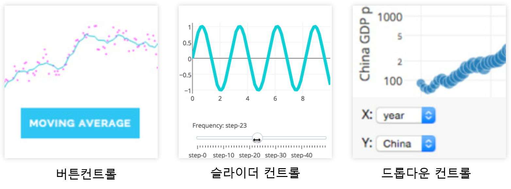
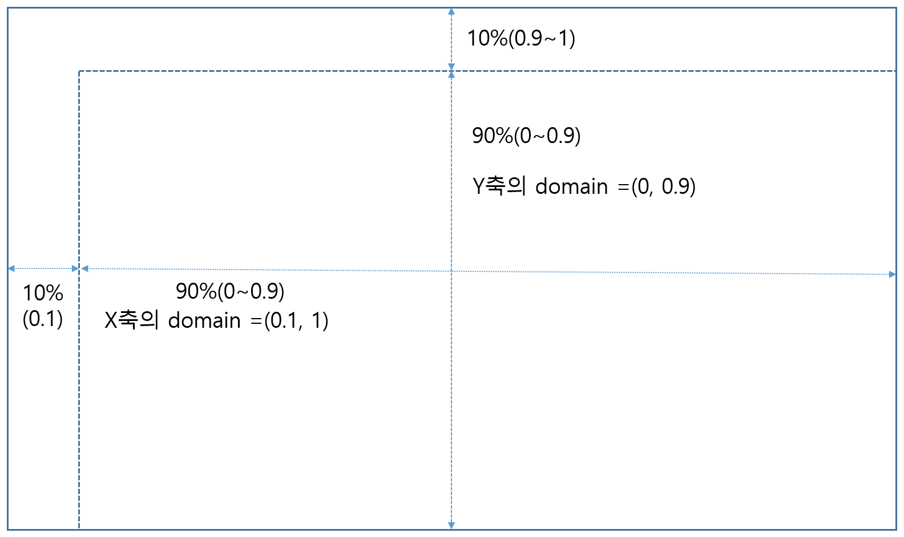
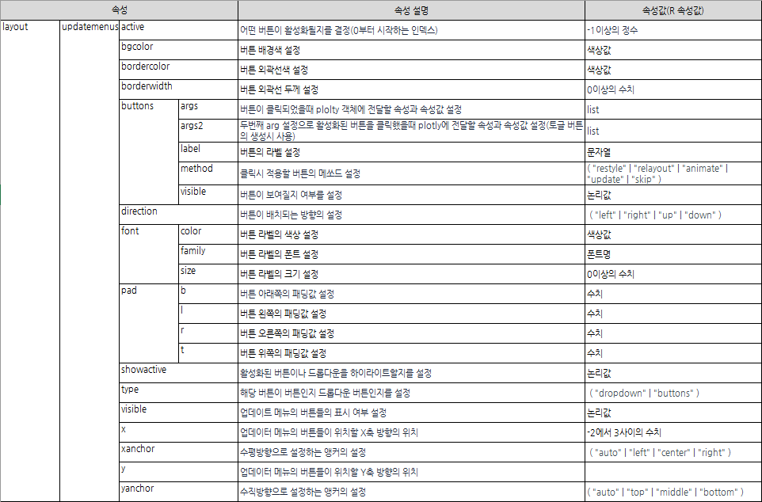
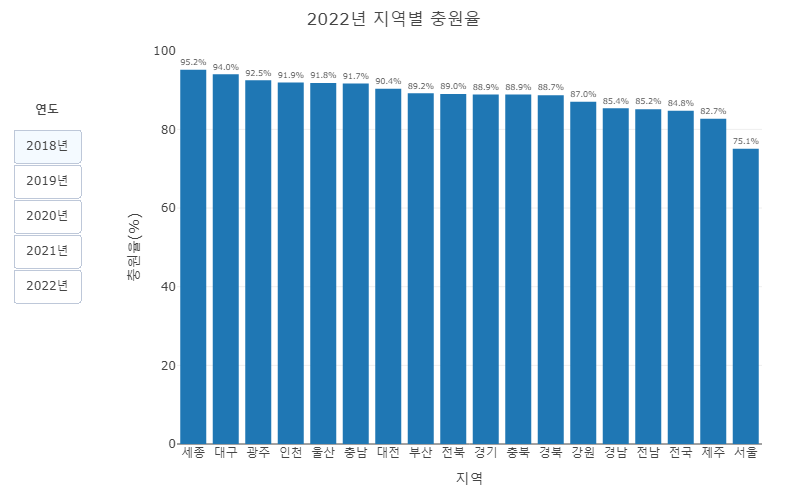
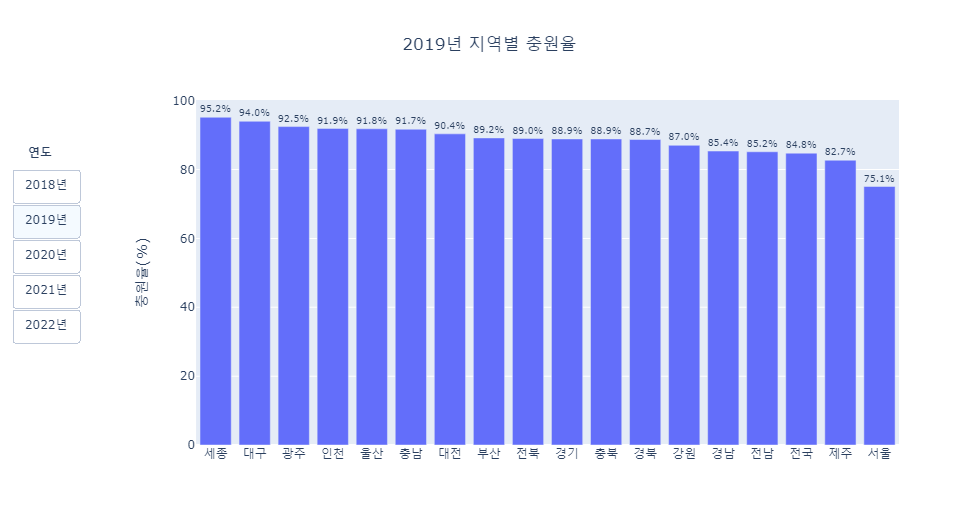
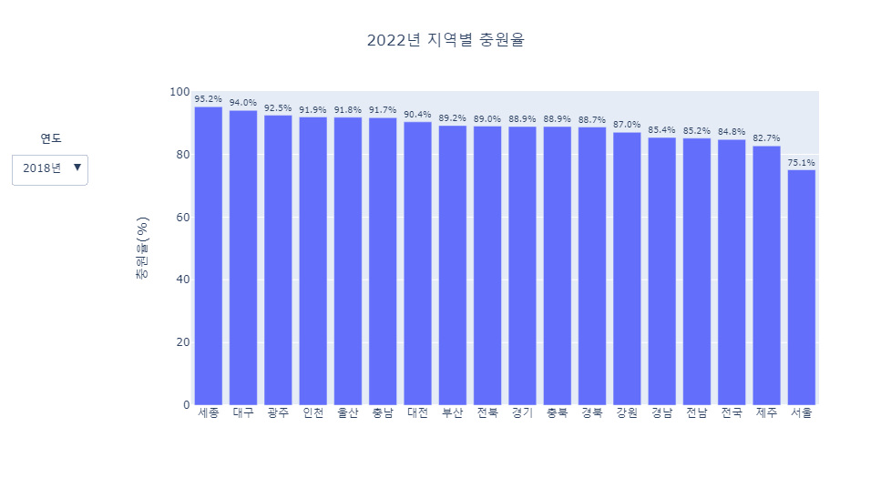
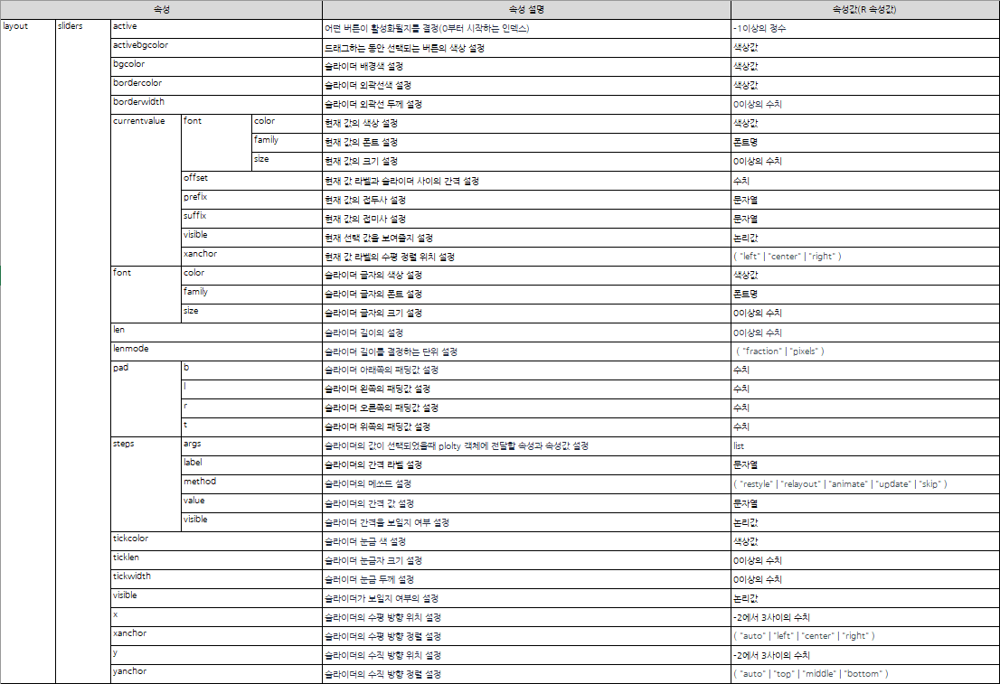
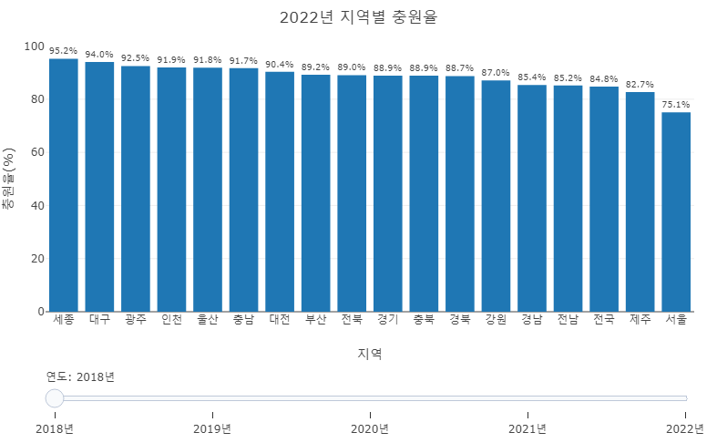

```{r setup, include=FALSE}
knitr::opts_chunk$set(echo = TRUE, message = FALSE, warning = FALSE, fig.width = 6.5, dpi = 130, eval = FALSE)
library(showtext)
showtext_auto()
library(tidyverse)
library(readxl)
library(readr)
library(lubridate)
library(plotly)
```

```{r echo = FALSE, message = FALSE, warning = FALSE, eval = TRUE}
df_covid19 <- read_csv(file = "D:/R/data/Rnpy/owid-covid-data.csv",
                            col_types = cols(date = col_date(format = "%Y-%m-%d")
                                             )
                            )
df_covid19_100 <- df_covid19 |> 
  filter(iso_code %in% c('KOR', 'OWID_ASI', 'OWID_EUR', 'OWID_OCE', 'OWID_NAM', 'OWID_SAM', 'OWID_AFR')) |>
  filter(date >= max(date) - 100) |>
  mutate(location = case_when(
    location == 'South Korea' ~ '한국', 
    location == 'Asia' ~ '아시아', 
    location == 'Europe' ~ '유럽', 
    location == 'Oceania' ~ '오세아니아', 
    location == 'North America' ~ '북미', 
    location == 'South America' ~ '남미', 
    location == 'Africa' ~ '아프리카')) |>
  mutate(location = fct_relevel(location, '한국', '아시아', '유럽', '북미', '남미', '아프리카', '오세아니아')) |>
  arrange(date)

df_covid19_100_wide <- df_covid19_100 |>
  select(date, location, new_cases, people_fully_vaccinated_per_hundred) |>
  rename('date' = 'date', '확진자' = 'new_cases', '백신접종완료자' = 'people_fully_vaccinated_per_hundred') |>
  pivot_wider(id_cols = date, names_from = location, 
              values_from = c('확진자', '백신접종완료자')) |>
  arrange(date)

df_covid19_stat <- df_covid19 |> 
  group_by(iso_code, continent, location) |>
  summarise(인구수 = max(population, na.rm = T), 
            전체사망자수 = sum(new_deaths, na.rm = T), 
            백신접종자완료자수 = max(people_fully_vaccinated, na.rm = T),
            인구백명당백신접종완료율 = max(people_fully_vaccinated_per_hundred, na.rm = T),
            인구백명당부스터접종자수 = max(total_boosters_per_hundred, na.rm = T)) |> 
    ungroup() |>
    mutate(십만명당사망자수 = round(전체사망자수 / 인구수 *100000, 5),
           백신접종완료율 = 백신접종자완료자수 / 인구수)

margins_R <- list(t = 50, b = 25, l = 25, r = 25)


df_취업률 <- read_excel('d:/R/data/Rnpy/2021년 학과별 고등교육기관 취업통계.xlsx', 
                     ## '학과별' 시트의 데이터를 불러오는데,
                     sheet = '학과별',
                     ## 앞의 13행을 제외하고
                     skip = 13, 
                     ## 첫번째 행은 열 이름으로 설정
                     col_names = TRUE, 
                     ## 열의 타입을 설정, 처음 9개는 문자형으로 다음 79개는 수치형으로 설정
                     col_types = c(rep('text', 9), rep('numeric', 79)))

## df_취업률에서 첫번째부터 9번째까지의 열과 '계'로 끝나는 열을 선택하여 다시 df_취업률에 저장
df_취업률 <- df_취업률 |> 
  select(1:9, ends_with('계'), '입대자')

## df_취업률에서 졸업자가 500명 이하인 학과 2000개 샘플링
df_취업률_500 <- df_취업률 |> 
  filter(졸업자_계 < 500) |>
  mutate(id = row_number()) |>
  filter(row_number() %in% seq(from = 1, to = nrow(df_취업률), by = 4))

## 열 이름을 적절히 설정
names(df_취업률_500)[10:12] <- c('졸업자수', '취업률', '취업자수')

```

```{python echo = FALSE, message = FALSE, warning = FALSE, eval = FALSE}
import pandas as pd
from datetime import datetime, timedelta
from pandas.api.types import CategoricalDtype
from matplotlib import pyplot as plt
import plotly.graph_objects as go

df_covid19 = pd.read_csv("D:/R/data/Rnpy/owid-covid-data.csv")

df_covid19['date'] = pd.to_datetime(df_covid19['date'], format="%Y-%m-%d")

df_covid19_100 = df_covid19[(df_covid19['iso_code'].isin(['KOR', 'OWID_ASI', 'OWID_EUR', 'OWID_OCE', 'OWID_NAM', 'OWID_SAM', 'OWID_AFR'])) & (df_covid19['date'] >= (max(df_covid19['date']) - timedelta(days = 100)))]


df_covid19_100.loc[df_covid19_100['location'] == 'South Korea', "location"] = '한국'
df_covid19_100.loc[df_covid19_100['location'] == 'Asia', "location"] = '아시아'
df_covid19_100.loc[df_covid19_100['location'] == 'Europe', "location"] = '유럽'
df_covid19_100.loc[df_covid19_100['location'] == 'Oceania', "location"] = '오세아니아'
df_covid19_100.loc[df_covid19_100['location'] == 'North America', "location"] = '북미'
df_covid19_100.loc[df_covid19_100['location'] == 'South America', "location"] = '남미'
df_covid19_100.loc[df_covid19_100['location'] == 'Africa', "location"] = '아프리카'

ord = CategoricalDtype(categories = ['한국', '아시아', '유럽', '북미', '남미', '아프리카', '오세아니아'], ordered = True)

df_covid19_100['location'] = df_covid19_100['location'].astype(ord)

df_covid19_100 = df_covid19_100.sort_values(by = 'date')

df_covid19_100_wide = df_covid19_100.loc[:,['date', 'location', 'new_cases', 'people_fully_vaccinated_per_hundred']].rename(columns={'new_cases':'확진자', 'people_fully_vaccinated_per_hundred':'백신접종완료자'})

df_covid19_100_wide = df_covid19_100_wide.pivot(index='date', columns='location', values=['확진자', '백신접종완료자']).sort_values(by = 'date')

df_covid19_100_wide.columns = ['확진자_한국', '확진자_아시아', '확진자_유럽', '확진자_북미', '확진자_남미', '확진자_아프리카','확진자_오세아니아',
                              '백신접종완료자_한국', '백신접종완료자_아시아', '백신접종완료자_유럽', '백신접종완료자_북미', '백신접종완료자_남미', '백신접종완료자_아프리카','백신접종완료자_오세아니아']
                              
df_covid19_stat = df_covid19.groupby(['iso_code', 'continent', 'location'], dropna=True).agg(
    인구수 = ('population', 'max'),
    전체확진자수 = ('new_cases', 'sum'),
    전체사망자수 = ('new_deaths', 'sum'), 
    백신접종자완료자수 = ('people_fully_vaccinated', 'max'),
    인구백명당백신접종완료율 = ('people_fully_vaccinated_per_hundred', 'max'),
    인구백명당부스터접종자수 = ('total_boosters_per_hundred', 'max')
).reset_index()

df_covid19_stat['십만명당사망자수'] = round(df_covid19_stat['전체사망자수'] / df_covid19_stat['인구수'] *100000, 5)

df_covid19_stat['백신접종완료율'] = df_covid19_stat['백신접종자완료자수'] / df_covid19_stat['인구수']

######################################   
## python 코드
## 대학 학과 취업률 데이터 셋

df_취업률 = pd.read_excel("d:/R/data/Rnpy/2021년 학과별 고등교육기관 취업통계.xlsx", 
                           sheet_name = '학과별',
                           skiprows=(13), 
                           header = 0)

df_취업률 = pd.concat([df_취업률.iloc[:, 0:8], 
                    df_취업률.loc[:, df_취업률.columns.str.endswith('계')], 
                    df_취업률.loc[:, '입대자']], 
                   axis = 1
                   )

df_취업률_2000 = df_취업률.loc[(df_취업률['졸업자_계'] < 500)]

df_취업률_2000 = df_취업률_2000.iloc[range(0, len(df_취업률_2000.index) , 4)]

df_취업률_2000 = df_취업률_2000.rename(columns = {'졸업자_계':'졸업자수', '취업률_계':'취업률', '취업자_합계_계':'취업자수'})

margins_P = dict(t = 50, b = 25, l = 25, r = 25)

```

plotly 시각화는 동적 시각화로써 웹을 통해 배포될 때 가장 효과가 크다. 웹을 사용한다는 것은 웹에서 제공하는 많은 기능을 사용할 수 있다는 장점이 있다. plotly 시각화는 호버를 사용한 사용자 반응형 기능이나 다음 장에서 설명할 범례나 마우스를 사용한 사용자 반응형 기능을 기본적으로 제공하지만, 버튼, 드롭다운 버튼, 슬라이더의 세 가지 컨트롤을 추가로 제공한다. 이 기능을 사용하면 시각화 내에서 데이터를 필터링하거나 원하는 데이터만 추출하는 등 아주 기초적인 대시보드의 역할을 할 수 있다.

plotly의 컨트롤 사용을 알아보기 위해 추가적인 데이터를 사용하는데, 2010년부터 2022년까지의 전국 17개 시도별 대학 신입생 충원율 자료를 다음과 같이 전처리하여 사용하겠다.

-    R

```{r echo = TRUE}
## 연도별 충원율 데이터를 불러들이고 전처리
df_충원율_botton <- read_excel('데이터저장경로/고등 주요 01-시도별 신입생 충원율(2010-2022)_220825y.xlsx', 
                     sheet = 'Sheet1', skip = 7, col_names = FALSE, 
                     col_types = c(rep('text', 2), rep('numeric', 12)))

df_충원율_botton <- df_충원율_botton |> dplyr::select(1, 2, 5)

colnames(df_충원율_botton) <- c('연도', '지역', '신입생충원율')

df_충원율_botton <- df_충원율_botton |> pivot_wider(names_from = '연도', values_from = '신입생충원율')

df_충원율_botton <- as.data.frame(df_충원율_botton)

```


```{r echo = FALSE}
## 연도별 충원율 데이터를 불러들이고 전처리
df_충원율_botton <- read_excel('D:/R/data/Rnpy/고등 주요 01-시도별 신입생 충원율(2010-2022)_220825y.xlsx', 
                     sheet = 'Sheet1', skip = 7, col_names = FALSE, 
                     col_types = c(rep('text', 2), rep('numeric', 12)))

df_충원율_botton <- df_충원율_botton |> dplyr::select(1, 2, 5)

colnames(df_충원율_botton) <- c('연도', '지역', '신입생충원율')

df_충원율_botton <- df_충원율_botton |> pivot_wider(names_from = '연도', values_from = '신입생충원율')

df_충원율_botton <- as.data.frame(df_충원율_botton)

```

-   python

```{python}
import pandas as pd
import plotly.graph_objects as go

df_충원율_control = pd.read_excel("데이터저장경로/고등 주요 01-시도별 신입생 충원율(2010-2022)_220825y.xlsx", 
                           sheet_name = 'Sheet1', skiprows=(6), header = 0)
df_충원율_control = df_충원율_control.iloc[:, [0, 1, 4]]
df_충원율_control.columns = ('연도', '지역', '신입생충원율')
df_충원율_control = df_충원율_control.pivot(index = '지역', columns = '연도', values = '신입생충원율').reset_index()

```

```{python echo = FALSE}
import pandas as pd
import plotly.graph_objects as go

df_충원율_control = pd.read_excel("D:/R/data/Rnpy/고등 주요 01-시도별 신입생 충원율(2010-2022)_220825y.xlsx", 
                           sheet_name = 'Sheet1', skiprows=(6), header = 0)
df_충원율_control = df_충원율_control.iloc[:, [0, 1, 4]]
df_충원율_control.columns = ('연도', '지역', '신입생충원율')
df_충원율_control = df_충원율_control.pivot(index = '지역', columns = '연도', values = '신입생충원율').reset_index()

```

plotly에서 제공하는 시각화 컨트롤은 마우스 클릭을 사용하여 특정 기능을 실행하는  버튼 컨트롤, 몇 가지 선택사항 중에 하나를 선택하는 드롭다운 버튼 컨트롤, 마우스 드래그를 통해 값을 설정하는 슬라이더의 세 가지 컨트롤을 사용할 수 있다. 이 중 버튼 컨트롤과 드롭다운 버튼 컨트롤은 'updatemenus'라는 같은 속성들을 사용하는데, 버튼 타입 설정 속성을 통해  버튼을 사용할지 드롭다운을 설정할지를 결정하게 된다. 하지만 슬라이더 컨트롤은 'slider' 속성을 사용하기 때문에 버튼 컨트롤, 드롭다운 컨트롤의 속성과 매우 다르다.



위의 컨트롤들은 'layout' 속성의 하위 속성인 'updatemenus' 속성으로 설정이 가능하다. 

# 컨트롤 위치 설정

컨트롤을 생성하기 전에 가장 먼저 결정해야 하는 것은 어떤 컨트롤을 만들지에 대한 결정일 것이다. 해당 컨트롤이 수행해야 할 기능에 따라 컨트롤의 종류가 달라질 것이다. 컨트롤의 종류가 결정되면 이 컨트롤을 어디에 배치할지를 결정해야 한다. plotly 시각화에서 컨트롤은 전체 플롯의 범위에서 plotly 그래프와 공간을 공유하기 때문에 plotly 그래프와 컨트롤의 크기와 위치에 대한 결정이 이루어져야 한다. 결정되었다면 plotly 시각화의 크기와 위치를 'domain' 속성을 사용하여 설정하여야 한다.

plotly의 크기와 위치 설정을 위해 사용하는 'domain' 속성은 'layout'의 'xaxis'와 'yaxis'의 하위 속성이다. 이 'domain' 속성은 전체 플로팅 영역에서 X축과 Y축이 그려지는 범위를 설정하는데, 좌측 하단의 시작 위치와 우측 상단의 끝 위치에 비례한 0과 1 사이의 수치값을 통해 설정한다. 다음의 그림과 같이 전체 플로팅 영역의 오른쪽 아래에 위치시키고 왼쪽과 상단에 10%씩의 공간을 남기기 위해서는 'xaxis'의 'domain'은 시작 위치를 0.1, 끝 위치를 1로 설정하고 'yaxis'의 'domain'은 시작 위치를 0, 끝 위치를 0.9로 설정하여야 한다.



# 버튼 컨트롤

버튼 컨트롤은 plotly로 만들어진 트레이스의 data 속성이나 layout 속성의 속성값을 변경하여 plotly 시각화에 변경을 가하는 컨트롤을 말한다. 다른 컨트롤에서도 동일하지만, 버튼 컨트롤로 어떤 속성을 갱신하느냐에 따라 해당 버튼의 속성이 설정된다. 이를 버튼 메쏘드(Method)라고 하며, 메쏘드에는 다음의 네 가지가 있다.

-   update : 데이터 속성과 레이아웃 속성이 모두 갱신되는 메쏘드

-   restyle : 데이터 속성만 갱신되는 메쏘드

-   relayout : 레이아웃 속성만 갱신되는 메쏘드

-   animate : 애니메이션의 시작과 중단을 설정하는 메쏘드

해당 버튼이 어떤 속성을 갱신하는지에 따라 위와 같이 네 가지 메쏘드 중에 하나를 설정하여야 하는데 만약 이 메쏘드의 설정이 적절하지 않으면 버튼은 작동하지 않는다. 예를 들어 'update' 메쏘드로 속성을 설정하고, 데이터 속성이나 레이아웃 속성 중 하나만 갱신하도록 설정되면 해당 버튼은 작동하지 않는다. 또 data 속성을 갱신하면서 'relayout' 메쏘드로 속성을 설정하거나 layout 속성을 갱신하면서 'restyle' 메쏘드로 속성을 설정하면 작동하지 않는다.

버튼 컨트롤은 'layout' 속성의 'updatemenus' 속성을 통해서 설정이 가능한데, 다음은 버튼에서 주로 사용하는 하위 속성이다. 이 'updatemenus' 속성에는 여러 개의 버튼 컨트롤을 정의할 수 있기 때문에 'updatemenus'는 각각의 버튼 설정들의 리스트로 구성하여야 한다.

다음은 'updatemenus'의 주요 속성들이다.



## restyle 버튼

restyle 버튼은 해당 버튼을 클릭함으로써 data 속성이 갱신되는 버튼을 말한다. 앞서 설명한 바와 같이 'updatemenus'의 속성으로는 각각의 버튼들의 속성들이 정의된 딕셔너리(R은 리스트)의 리스트로 설정해야 한다.

restyle 버튼이 클릭되면 갱신되어야 하는 data 속성들은 'args' 속성으로 설정한다. 여러 개의 data 속성이 갱신될 수 있기 때문에 'args' 속성에는 속성이름과 속성값으로 구성된 딕셔너리(R은 리스트)의 리스트로 설정되어야 한다. 또 해당 버튼의 메쏘드를 설정하기 위한 'type' 속성도 중요한데, 'type' 속성은 기본값이 "restyle"으로 설정된다. 버튼이 위치하는 'x', 'y'의 값도 설정이 필요하고 버튼에 표시될 라벨의 설정도 기본적으로 필요하다.

다음은 각 시도별 대학 신입생 충원율의 bar 트레이스를 그리고, restyle 버튼으로 연도를 설정하는 R과 python 코드이다. 먼저 bar 트레이스를 생성하고 'layout' 속성의 'xaxis', 'yaxis'의 'domain'을 설정하여 bar 트레이스의 위치를 설정하였다. 이후 'updatemenus' 속성으로 버튼을 설정하였는데 이 버튼은 총 7개의 세부 버튼으로 구성된 업데이트 메뉴인 것이다. 이 업데이트 메뉴에 속하는 버튼들은 'button' 속성을 사용하여 각각의 구성해준다.

'args'의 속성의 설정에 매우 주의해야 한다. plotly 시각화에는 여러 개의 트레이스들이 포함되어 하나의 시각화를 구성하기 때문에 하나의 속성명은 여러개의 트레이스에 영향을 미칠수 있다. 예를 들어 scatter 트레이스, bar 트레이스의 두개로 구성된 plotly에서 X, Y축에 매핑되는 'x', 'y' 속성은 scatter 트레이스와 bar 트레이스에 모두 존재하기 때문에 트레이스의 순서대로 각각의 매핑값을 리스트로 만들어주어야 한다. 만약 하나의 트레이스만 존재하더라도 리스트로 묶어야 한다.

'args' 속성의 설정에 또 하나 주의해야 하는 것은 특정 속성의 하위 속성은 어떻게 설정할 것인가이다. 위의 예에서 살펴본 'x', 'y'와 같이 'data' 속성이나 'layout' 속성에 첫 번째 하위 속성들은 바로 속성이름을 설정할 수 있지만 속성의 하위 속성들을 설정할 때는 '.'을 사용하여 상위 속성부터 차례대로 지정하여야 한다. 예를 들어 scatter 트레이스나 bar 트레이스의 글자 색을 설정하는 속성은 'data' 속성의 'textfont' 속성의 'color' 속성값을 표현해야하는데 이 속성은 'textfont.color'로 표현한다.

-   R

R에서 버튼을 추가하기 위해서는 `layout()`에서 설정하는데 'updatemenus' 속성의 하위 속성들을 설정함으로써 추가한다. 'updatenemus'는 앞에서 설명한 바와 같이 list의 리스트로 구성이 되기 때문에 `list()`가 두 번 중첩되어야 한다. 설정되는 버튼이 하나라고 하더라도 리스트로 묶어주어야 정상적으로 버튼이 나타난다. 'args' 속성 설정에는 갱신해야 할 속성명과 갱신되어야 할 속성값의 리스트로 구성하거나 속성명에 속성값을 '='로 설정하는 할당식을 사용하는데 여기서 주의할 것은 속성값을 다시 리스트로 묶어 주어야 한다는 것이다. 

```{r}
fig <- df_충원율_botton |>
  plot_ly() |>
  ## 데이터가 표시되는 bar 트레이스 생성
  add_trace(type = 'bar', x = ~지역, 
            y = ~`2022`, text = ~`2022`, 
            texttemplate = '%{text:.1f}%', textposition = 'outside')

##  버튼 제목이 표시되는 주석 레이어 생성
fig <- fig |> add_annotations(x = -0.1, y = 0.85, text = '<b>연도</b>', 
                              xanchor = 'center', yanchor = 'middle', 
                              yref='paper', xref='paper', showarrow=FALSE )

##  버튼 생성
fig <- fig %>% layout(
  title = "2022년 지역별 충원율",
  xaxis = list(domain = c(0.1, 1), categoryorder = "total descending"),
  yaxis = list(title = "충원율(%)"),
  updatemenus = list(
    list(
      type = "buttons", y = 0.8,
      buttons = list(
        list(method = "restyle",
             args = list(list(y = list(df_충원율_botton$`2018`), 
                              text = list(df_충원율_botton$`2018`))),
             label = "2018년"),
        list(method = "restyle",
             args = list(list(y = list(df_충원율_botton$`2019`), 
                              text = list(df_충원율_botton$`2019`))),
             label = "2019년"),
        list(method = "restyle",
             args = list(list(y = list(df_충원율_botton$`2020`), 
                              text = list(df_충원율_botton$`2020`))),
             label = "2020년"),
        list(method = "restyle",
             args = list(list(y = list(df_충원율_botton$`2021`), 
                              text = list(df_충원율_botton$`2021`))),
             label = "2021년"),
        list(method = "restyle",
             args = list(list(y = list(df_충원율_botton$`2022`), 
                              text = list(df_충원율_botton$`2022`))),
             label = "2022년")))
  ),
  margin = margins_R)

fig

```

-   python

python에서 버튼을 추가하기 위해서는 `update_layout()`에서 'updatemenus' 속성의 하위 속성들을 설정함으로써 추가한다. 'updatemenus'는 리스트로 구성이 되여야하기 때문에'[]'를 사용하여 버튼 속성 딕셔너리의 리스트로 설정한다. 버튼이 여러 개의 딕셔너리로 구성된 리스트를 설정하고, 여러 개 설정하지만 버튼이 하나이더라도 딕셔너리 하나로 구성된 리스트를 설정해야 한다. 이는 'button'의 설정도 유사한데 일반적으로 버튼은 여러개의 버튼을 설정하는 경우가 많기 때문에 'buttons'의 하위 속성들로 구성된 딕셔너리의 리스트('[]')로 구성하여 설정한다. 또 'args'의 설정은 갱신할 속성명과 갱신할 속성값으로 구성된 딕셔너리로 설정하지만 속성값의 설정은 반드시 리스트('[]')로 묶어서 설정하여야 한다. 즉 딕셔너리 안에 리스트가 구성되는 형태로 전달되어야 한다.

```{python}
fig = go.Figure()

## 데이터가 표시되는 bar 트레이스 생성
fig.add_trace(go.Bar(
    x = df_충원율_control['지역'], y = df_충원율_control[2022], 
    text = df_충원율_control[2022],
    texttemplate = '%{text:.1f}%', textposition = 'outside'
))

##  버튼 제목이 표시되는 주석 레이어 생성
fig.add_annotation(x = -0.1, y = 0.85, text = '<b>연도</b>', 
                   xanchor = 'center', yanchor = 'middle', 
                   yref='paper', xref='paper', showarrow=False)

##  버튼 생성
fig.update_layout(title = dict(text = "2022년 지역별 충원율", x = 0.5),
  xaxis = dict(domain = (0.1, 1), categoryorder = "total descending"),
  yaxis = dict(title = "충원율(%)"),
  updatemenus =[ 
    dict(
      type = "buttons",
      y = 0.8,
      buttons = [
        dict(method = "restyle",
             args = [dict(y = [df_충원율_control[2018]],
                          text = [df_충원율_control[2018]])],
             label = "2018년"),
        dict(method = "restyle",
             args = [dict(y = [df_충원율_control[2019]],
                          text = [df_충원율_control[2019]])],
             label = "2019년"),
        dict(method = "restyle",
             args = [dict(y = [df_충원율_control[2020]],
                          text = [df_충원율_control[2020]])],
             label = "2020년"),
        dict(method = "restyle",
             args = [dict(y = [df_충원율_control[2021]],
                          text = [df_충원율_control[2021]])],
             label = "2021년"),
        dict(method = "restyle",
             args = [dict(y = [df_충원율_control[2022]],
                          text = [df_충원율_control[2022]])],
             label = "2022년")
    ]) ])

fig.show()

```



## relayout 버튼

relayout 버튼은 해당 버튼을 클릭함으로써 layout 속성이 갱신되는 버튼을 말한다. relayout 버튼은 restyle 버튼과 대부분의 생성 방법은 동일한데, 버튼은 갱신되는 속성값이 'layout'의 하위 속성이어야 하고 'button'들의 'method'가 "relayout"으로 설정되어야 한다.

다음은 앞 선 restyle 버튼을 그대로 재활용하여 그래프 제목을 바꾸는 R과 python의 코드이다. 그래프의 제목에 해당하는 속성은 'title'의 'text'이기 때문에 이 속성은 'title.text'로 접근한다.

-   R

R에서 relayout 버튼을 만들기 위해서는 앞서 restyle 버튼과 동일한 방법을 사용한다. 다만 'method' 속성을 "relayout"으로 설정하고 'args'에 'layout' 관련 속성들을 갱신하도록 설정해야 한다. 

```{r}
fig <- df_충원율_botton |>
  plot_ly() |>
  add_trace(type = 'bar', x = ~지역, y = ~`2022`, text = ~`2022`, 
            texttemplate = '%{text:.1f}%', textposition = 'outside')

fig <- fig |> add_annotations(x = -0.1, y = 0.85, text = '<b>연도</b>', 
                              xanchor = 'center', yanchor = 'middle', 
                              yref='paper', xref='paper', showarrow=FALSE )

fig <- fig %>% layout(
  title = "2022년 지역별 충원율",
  xaxis = list(domain = c(0.1, 1), categoryorder = "total descending"),
  yaxis = list(title = "충원율(%)"),
  updatemenus = list(
    list(
      type = "buttons",
      y = 0.8,
      buttons = list(
        list(method = "relayout",
             args = list(list(title.text='2018년 지역별 충원율')),
             label = "2018년"),
        list(method = "relayout",
             args = list(list(title.text='2019년 지역별 충원율')),
             label = "2019년"),
        list(method = "relayout",
             args = list(list(title.text='2020년 지역별 충원율')),
             label = "2020년"),
        list(method = "relayout",
             args = list(list(title.text='2021년 지역별 충원율')),
             label = "2021년"),
        list(method = "relayout",
             args = list(list(title.text='2022년 지역별 충원율')),
             label = "2022년")))
  ),
  margin = margins_R)

fig

```

-   python[^1]

python에서 relayout 버튼을 만들기 위해서는 앞서 restyle 버튼과 동일한 방법을 사용한다. 다만 'method' 속성을 "relayout"으로 설정하고 'args'에 'layout' 관련 속성들을 갱신하도록 설정해야 한다. 

[^1]: python에서도 그래프의 제목에 해당하는 속성은 'title'의 'text'이기 때문에 이 속성은 'title.text'로 표현하였다. 이렇게 표현할 때는 `{}`를 사용하여 딕셔너리를 구성하면 가능하지만 `dict()`를 사용하면 오류가 나는데 plotly의 오류로 보인다.

```{python}
fig = go.Figure()

fig.add_trace(go.Bar(
    x = df_충원율_control['지역'], y = df_충원율_control[2022], 
    text = df_충원율_control[2022], texttemplate = '%{text:.1f}%',
    textposition = 'outside'))

fig.add_annotation(x = -0.1, y = 0.85, text = '<b>연도</b>', 
                   xanchor = 'center', yanchor = 'middle', 
                   yref='paper', xref='paper', showarrow=False)

fig.update_layout(title = dict(text = "2022년 지역별 충원율", x = 0.5),
  xaxis = dict(domain = (0.1, 1), categoryorder = "total descending"),
  yaxis = dict(title = "충원율(%)"),
  updatemenus =[ 
    dict(
      type = "buttons",
      y = 0.8,
      buttons = [
        dict(method = "relayout",
             args = [{'title.text' : '2018년 지역별 충원율'}],
             label = "2018년"),
        dict(method = "relayout",
             args = [{'title.text' : '2019년 지역별 충원율'}],
             label = "2019년"),
        dict(method = "relayout",
             args = [{'title.text' : '2020년 지역별 충원율'}],
             label = "2020년"),
        dict(method = "relayout",
             args = [{'title.text' : '2021년 지역별 충원율'}],
             label = "2021년"),
        dict(method = "relayout",
             args = [{'title.text' : '2022년 지역별 충원율'}],
             label = "2022년")
    ])
  ])

fig.show()

```



## update 버튼

update 버튼은 해당 버튼을 클릭함으로써 data와 layout 속성이 모두 갱신되는 버튼을 말한다. update 버튼은 restyle이나 relayout 버튼과 대부분의 생성 방법은 동일한데, restyle에 해당하는 'args' 속성값과 relayout에 해당하는 'args' 속성을 각각 리스트로 설정하여야 한다.

다음은 앞선 restyle 버튼과 relayout을 그대로 재활용하여 연도별 bar 트레이스와 그래프 제목을 바꾸는 R과 python의 코드이다.

-   R

R에서 update 버튼을 만들기 위해서는 앞서 restyle 버튼과 동일한 방법을 사용한다. 다만 'method' 속성을 "update"로 설정하고 'args'에 'data'에 관련한 속성으로 구성된 리스트와 'layout' 관련 속성들로 구성된 리스트로 구성하여야 한다. 


```{r}
fig <- df_충원율_botton |>
  plot_ly() |>
  add_trace(type = 'bar', x = ~지역, y = ~`2022`, text = ~`2022`, 
            texttemplate = '%{text:.1f}%', textposition = 'outside')

fig <- fig |> add_annotations(x = -0.1, y = 0.85, text = '<b>연도</b>', 
                              xanchor = 'center', yanchor = 'middle', 
                              yref='paper', xref='paper', showarrow=FALSE )

fig <- fig %>% layout(
  title = '2022년 지역별 충원율',
  xaxis = list(domain = c(0.1, 1), categoryorder = "total descending"),
  yaxis = list(title = "충원율(%)"),
    updatemenus = list(
    list(
      type = "buttons",
      y = 0.8,
      buttons = list(
        list(method = "update",
             args = list(list(y = list(df_충원율_botton$`2018`), 
                              text = list(df_충원율_botton$`2018`)),
                    list(title.text='2018년 지역별 충원율')),
             label = "2018년"),
        list(method = "update",
             args = list(list(y = list(df_충원율_botton$`2019`), 
                              text = list(df_충원율_botton$`2019`)),
                    list(title.text='2019년지역별 충원율')),
             label = "2019년"),
        list(method = "update",
             args = list(list(y = list(df_충원율_botton$`2020`), 
                              text = list(df_충원율_botton$`2020`)),
                    list(title.text='2020년 지역별 충원율')),
             label = "2020년"),
        list(method = "update",
             args = list(list(y = list(df_충원율_botton$`2021`), 
                              text = list(df_충원율_botton$`2021`)),
                    list(title.text='2021년 지역별 충원율')),
             label = "2021년"),
        list(method = "update",
             args = list(list(y = list(df_충원율_botton$`2022`), 
                              text = list(df_충원율_botton$`2022`)),
                    list(title.text='2022년 지역별 충원율')),
             label = "2022년")))
  ),
  margin = margins_R)

fig

```

-   python

python에서 update 버튼을 만들기 위해서는 앞서 restyle 버튼과 동일한 방법을 사용한다. 다만 'method' 속성을 "update"로 설정하고 'args'에 'data'에 관련한 속성으로 구성된 딕셔너리의 리스트와 'layout' 관련 속성들로 구성된 딕셔너리의 리스트로 구성하여야 한다. 

```{python}
fig = go.Figure()

fig.add_trace(go.Bar(
    x = df_충원율_control['지역'], y = df_충원율_control[2022], 
    text = df_충원율_control[2022], texttemplate = '%{text:.1f}%',
    textposition = 'outside'
))

fig.add_annotation(x = -0.1, y = 0.85, text = '<b>연도</b>', 
                   xanchor = 'center', yanchor = 'middle', 
                   yref='paper', xref='paper', showarrow=False)

fig.update_layout(title = dict(text = "2022년 지역별 충원율", x = 0.5),
  xaxis = dict(domain = (0.1, 1), categoryorder = "total descending"),
  yaxis = dict(title = "충원율(%)"),
  updatemenus =[ 
    dict(
      type = "buttons",
      y = 0.8,
      buttons = [
        dict(method = "update",
             args = [dict(y = [df_충원율_control[2018]],
                          text = [df_충원율_control[2018]]), 
                    {'title.text' : '2018년 지역별 충원율'}],
             label = "2018년"),
        dict(method = "update",
             args = [dict(y = [df_충원율_control[2019]],
                          text = [df_충원율_control[2019]]), 
                    {'title.text' : '2019년 지역별 충원율'}],
             label = "2019년"),
        dict(method = "update",
             args = [dict(y = [df_충원율_control[2020]],
                          text = [df_충원율_control[2020]]), 
                    {'title.text' : '2020년 지역별 충원율'}],
             label = "2020년"),
        dict(method = "update",
             args = [dict(y = [df_충원율_control[2021]],
                          text = [df_충원율_control[2021]]), 
                    {'title.text' : '2021년 지역별 충원율'}],
             label = "2021년"),
        dict(method = "update",
             args = [dict(y = [df_충원율_control[2022]],
                          text = [df_충원율_control[2022]]), 
                    {'title.text' : '2022년 지역별 충원율'}],
             label = "2022년")
    ])
  ])

fig.show()

```


# 드롭다운 컨트롤

드롭다운 컨트롤은 버튼 컨트롤과 마찬가지로 plotly로 만들어진 객체의 data 속성이나 layout 속성의 속성값을 변경하여 plotly 시각화에 변경을 가하는 컨트롤을 말한다. 다만 버튼 컨트롤은 각각의 기능이 구현된 버튼을 표시하고 이를 클릭하여 실행하는 반면 드롭다운 컨트롤은 드롭다운 메뉴에서 해당 기능을 선택하면 시각화가 업데이트되는 컨트롤이다. 드롭다운 컨트롤도 버튼 컨트롤과 마찬가지로 어떤 속성을 갱신하느냐에 따라 'update', 'restle', 'relayout', 'animate'의 네가지 메쏘드 중에 하나를 설정하여야 한다.

드롭다운 컨트롤은 앞선 버튼 컨트롤에서 사용했던 'updatemenus' 속성을 공유한다. 따라서 버튼 컨트롤과 속성의 종류나 설정 방법은 동일하다.

다음은 버튼 컨트롤의 'update' 메쏘드로 만들었던 버튼들을 드롭다운 컨트롤로 생성하는 R과 python 코드이다. 드롭다운 버튼을 만들기 위해서는 앞서 버튼과 동일한 방법을 사용한다. 다만 'type' 속성을 "dropdown"으로 설정여야 한다. 

-   R

```{r}
fig <- df_충원율_botton |>
  plot_ly() |>
  add_trace(type = 'bar', x = ~지역, y = ~`2022`, text = ~`2022`, 
            texttemplate = '%{text:.1f}%', textposition = 'outside')

fig <- fig |> add_annotations(x = -0.1, y = 0.85, text = '<b>연도</b>', 
                              xanchor = 'center', yanchor = 'middle', 
                              yref='paper', xref='paper', showarrow=FALSE )

fig <- fig %>% layout(
  title = '2022년 지역별 충원율',
  xaxis = list(domain = c(0.1, 1), categoryorder = "total descending"),
  yaxis = list(title = "충원율(%)"),
    updatemenus = list(
    list(
      type = 'dropdown',
      y = 0.8,
      buttons = list(
        list(method = "update",
             args = list(list(y = list(df_충원율_botton$`2018`), 
                              text = list(df_충원율_botton$`2018`)),
                    list(title.text='2018년 지역별 충원율')),
             label = "2018년"),
        list(method = "update",
             args = list(list(y = list(df_충원율_botton$`2019`), 
                              text = list(df_충원율_botton$`2018`)),
                    list(title.text='2019년지역별 충원율')),
             label = "2019년"),
        list(method = "update",
             args = list(list(y = list(df_충원율_botton$`2020`), 
                              text = list(df_충원율_botton$`2018`)),
                    list(title.text='2020년 지역별 충원율')),
             label = "2020년"),
        list(method = "update",
             args = list(list(y = list(df_충원율_botton$`2021`), 
                              text = list(df_충원율_botton$`2018`)),
                    list(title.text='2021년 지역별 충원율')),
             label = "2021년"),
        list(method = "update",
             args = list(list(y = list(df_충원율_botton$`2022`), 
                              text = list(df_충원율_botton$`2018`)),
                    list(title.text='2022년 지역별 충원율')),
             label = "2022년")))
  ),
  margin = margins_R)

fig

```

-   python

```{python}
fig = go.Figure()

fig.add_trace(go.Bar(
    x = df_충원율_control['지역'], y = df_충원율_control[2022], 
    text = df_충원율_control[2022], texttemplate = '%{text:.1f}%',
    textposition = 'outside'
))

fig.add_annotation(x = -0.1, y = 0.85, text = '<b>연도</b>', 
                   xanchor = 'center', yanchor = 'middle', 
                   yref='paper', xref='paper', showarrow=False)

fig.update_layout(title = dict(text = "2022년 지역별 충원율", x = 0.5),
  xaxis = dict(domain = (0.1, 1), categoryorder = "total descending"),
  yaxis = dict(title = "충원율(%)"),
  updatemenus =[ 
    dict(
      y = 0.8,
      buttons = [
        dict(method = "update",
             args = [dict(y = [df_충원율_control[2018]],
                          text = [df_충원율_control[2018]]), 
                    {'title.text' : '2018년 지역별 충원율'}],
             label = "2018년"),
        dict(method = "update",
             args = [dict(y = [df_충원율_control[2019]],
                          text = [df_충원율_control[2019]]), 
                    {'title.text' : '2019년 지역별 충원율'}],
             label = "2019년"),
        dict(method = "update",
             args = [dict(y = [df_충원율_control[2020]],
                          text = [df_충원율_control[2020]]), 
                    {'title.text' : '2020년 지역별 충원율'}],
             label = "2020년"),
        dict(method = "update",
             args = [dict(y = [df_충원율_control[2021]],
                          text = [df_충원율_control[2021]]), 
                    {'title.text' : '2021년 지역별 충원율'}],
             label = "2021년"),
        dict(method = "update",
             args = [dict(y = [df_충원율_control[2022]],
                          text = [df_충원율_control[2022]]), 
                    {'title.text' : '2022년 지역별 충원율'}],
             label = "2022년")
    ]) ])

fig.show()

```



# 슬라이더 컨트롤

슬라이더 컨트롤은 슬라이더 바의 형태로 표시된 컨트롤에서 마우스 클릭이나 마우스 드래그로 데이터를 선택함으로써 plotly 시각화의 갱신을 할 수 있는 컨트롤을 말한다. 이 컨트롤은 앞서 버튼들과는 달리 'sliders' 속성을 사용하는데 'updatemenus' 속성과 상당 부분 유사하다. 슬라이더 컨트롤도 버튼 컨트롤과 마찬가지로 로 어떤 속성을 갱신하느냐에 따라 'update', 'restle', 'relayout', 'animate'의 네 가지 메쏘드 중에 하나를 설정하여야 한다.

다음은 'sliders'의 주요 속성들이다.

 

'sliders' 속성을 설정할 때 주의해야 하는 것은 'updatemenus'와 마찬가지로 슬라이더 컨트롤도 두 개 이상을 만들 수 있기 때문에 'sliders' 속성은 하위속성들을 리스트로 묶어 설정해야 한다는 것이다. 또 'args'의 설정도 'updatemenus'와 같이 리스트로 구성해야 하고 속성값도 리스트로 구성해야 한다.

슬라이더 컨트롤은 그 위치가 자동으로 X축의 아래에 위치하고 그 위에 plotly 시각화가 만들어지기 때문에 앞선 버튼이나 드롭다운 버튼과 같이 'domain'을 사용해 그래프의 위치를 직접 설정해 줄 필요가 없다. 다만 'pad' 속성을 사용하여 슬라이더와 그래프의 간격을 설정할 수 있다. 

다음은 앞에서 드롭다운 버튼으로 만들었던 기능을 슬라이더로 구현한 R과 python 코드이다. 앞선 코드들과는 다소 다르게 'sliders'의 'steps' 속성을 따로 리스트로 할당하고 'layout' 설정에서 할당된 변수명을 사용하였다.

-   R

R에서 슬라이더를 만들기 위해서는 앞서 버튼과 비슷하게 생각할 수도 있는데, 앞서 각 버튼으로 구현했던 기능들을 'steps' 속성으로 사용한다. 이 'steps' 속성을 'sliders' 속성에 설정하는데 슬라이더가 여러 개 들어갈 수도 있으니 리스트의 리스트로 설정하여야 한다. 


```{r}
fig <- df_충원율_botton |>
  plot_ly() |>
  add_trace(type = 'bar', x = ~지역, 
            y = ~`2022`, text = ~paste0(sprintf('%.1f', df_충원율_botton$`2022`), '%'), 
            textposition = 'outside')

## 슬라이더 설정을 위한 steps 속성 설정
steps <- list(
        list(method = "update",
             args = list(list(y = list(df_충원율_botton$`2018`), 
                              text = list(paste0(sprintf('%.1f', df_충원율_botton$`2018`), '%'))),
                    list(title.text='2018년 지역별 충원율')),
             label = "2018년", value = "1"),
        list(method = "update",
             args = list(list(y = list(df_충원율_botton$`2019`), 
                              text = list(paste0(sprintf('%.1f', df_충원율_botton$`2019`), '%'))),
                    list(title.text='2019년지역별 충원율')),
             label = "2019년", value = "2"),
        list(method = "update",
             args = list(list(y = list(df_충원율_botton$`2020`), 
                              text = list(paste0(sprintf('%.1f', df_충원율_botton$`2020`), '%'))),
                    list(title.text='2020년 지역별 충원율')),
             label = "2020년", value = "3"),
        list(method = "update",
             args = list(list(y = list(df_충원율_botton$`2021`), 
                              text = list(paste0(sprintf('%.1f', df_충원율_botton$`2021`), '%'))),
                    list(title.text='2021년 지역별 충원율')),
             label = "2021년", value = "4"),
        list(method = "update",
             args = list(list(y = list(df_충원율_botton$`2022`), 
                              text = list(paste0(sprintf('%.1f', df_충원율_botton$`2022`), '%'))),
                    list(title.text='2022년 지역별 충원율')),
             label = "2022년", value = "5")
        )

fig <- fig %>% layout(
  title = '2022년 지역별 충원율',
  xaxis = list(categoryorder = "total descending"),
  yaxis = list(title = "충원율(%)"),
  sliders = list(
    list(
      active = 6, currentvalue = list(prefix = "연도: "), 
      pad = list(t = 60), 
      steps = steps)), 
  margin = margins_R)

fig

```

-   python

python에서 슬라이더를 만들기 위해서는 앞서 버튼과 비슷하게 생각할 수도 있는데, 앞서 각 버튼으로 구현했던 기능들을 'steps' 속성으로 사용한다. 이 'steps' 속성을 'sliders' 속성에 설정하는데 슬라이더가 여러 개 들어갈 수도 있으니 딕셔너리의 딕셔너리의 리스트로 설정하여야 한다. 또 'steps'에서도 딕셔너리의 리스트를 사용하기 때문에 어디가 딕셔너리이고 어디가 리스트인지, 딕셔너리의 딕셔너리를 어떻게 구성하는지를 잘 살펴야 한다. 


```{python}
fig = go.Figure()

fig.add_trace(go.Bar(
    x = df_충원율_control['지역'], y = df_충원율_control[2022], 
    text = df_충원율_control[2022], texttemplate = '%{text:.1f}%',
    textposition = 'outside'
))

steps = [
  dict(args = [dict(y = [df_충원율_control[2018]],
                     text = [df_충원율_control[2018]]), 
                    {'title.text' : '2018년 지역별 충원율'}], 
       label = "2018", method = "update", value = "1"
  ), 
  dict(args = [dict(y = [df_충원율_control[2019]],
                     text = [df_충원율_control[2019]]), 
                    {'title.text' : '2019년 지역별 충원율'}], 
       label = "2019", method = "update", value = "2"
  ),
  dict(args = [dict(y = [df_충원율_control[2020]],
                     text = [df_충원율_control[2020]]), 
                    {'title.text' : '2020년 지역별 충원율'}], 
       label = "2020", method = "update", value = "3"
  ),
  dict(args = [dict(y = [df_충원율_control[2021]],
                     text = [df_충원율_control[2021]]), 
                    {'title.text' : '2021년 지역별 충원율'}], 
       label = "2021", method = "update", value = "4"
  ),
  dict(args = [dict(y = [df_충원율_control[2022]],
                     text = [df_충원율_control[2022]]), 
                    {'title.text' : '2022년 지역별 충원율'}], 
       label = "2022", method = "update", value = "5"
  )]


fig.update_layout(title = dict(text = "연도별 충원율", x = 0.5),
                  xaxis = dict(categoryorder = "total descending"),
                  yaxis = dict(title = "충원율(%)"),
                  sliders = [dict(
                    dict(active = 5, 
                      currentvalue = dict(prefix = "연도: "), 
                      pad = dict(t = 60), 
                      steps = steps))])

fig.show()

```


