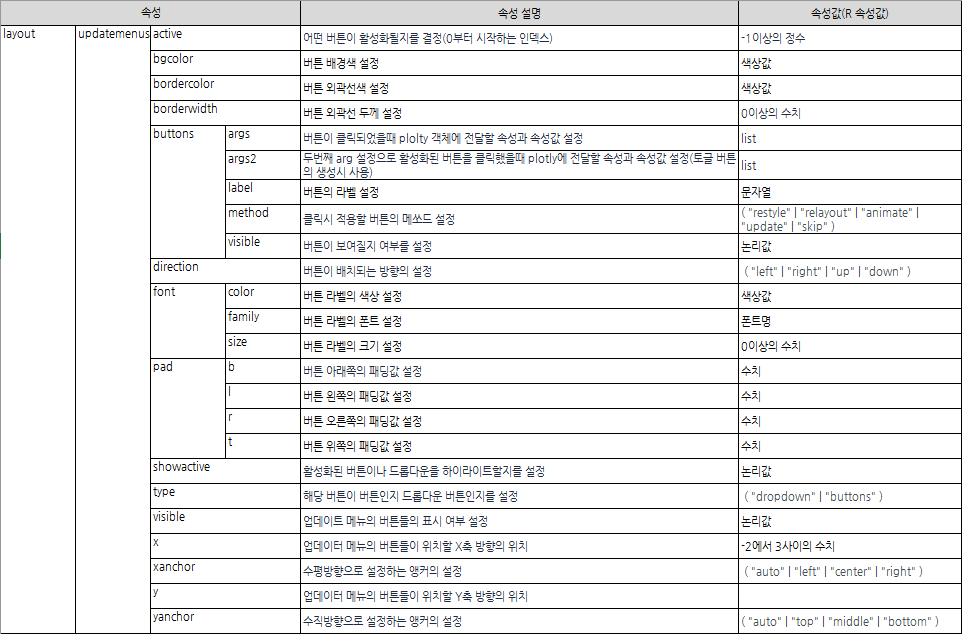

```{r setup, include=FALSE}
knitr::opts_chunk$set(echo = TRUE, message = FALSE, warning = FALSE, fig.width = 6.5, dpi = 130, eval = FALSE)
library(showtext)
showtext_auto()
library(tidyverse)
library(readxl)
library(patchwork)
library(plotly)

```

```{r echo = FALSE, message = FALSE, warning = FALSE, eval = TRUE}
##  R code
## 데이터 전처리를 위한 패키지 설치 및 로딩
if(!require(readr)) {
  install.packages('readr')
  library(readr)
}

if(!require(lubridate)) {
  install.packages('lubridate')
  library(lubridate)
}

if(!require(tidyverse)) {
  install.packages('tidyverse')
  library(tidyverse)
}

## 1. covid19 원본 데이터 셋 로딩
## covid19 데이터 로딩(파일을 다운로드 받은 경우)
# df_covid19 <- read_csv(file = "데이터저장경로/owid-covid-data.csv",
#                             col_types = cols(Date = col_date(format = "%Y-%m-%d")
#                                              )
#                             )
## covid19 데이터 로딩(온라인에서 바로 로딩할 경우)
# df_covid19 <- read_csv(file = "https://covid.ourworldindata.org/data/owid-covid-data.csv",
#                             col_types = cols(Date = col_date(format = "%Y-%m-%d")
#                                              )
#                             )

df_covid19 <- read_csv(file = "D:/R/git/datavisualization/plotly/RnPy/owid-covid-data_221203.csv",
                            col_types = cols(Date = col_date(format = "%Y-%m-%d")
                                             )
                            )
## 2. 전체 데이터셋 중 최근 100일간의 데이터를 필터링한 df_covid19_100 생성
df_covid19_100 <- df_covid19 |> 
  ## 한국 데이터와 각 대륙별 데이터만을 필터링
  filter(iso_code %in% c('KOR', 'OWID_ASI', 'OWID_EUR', 'OWID_OCE', 'OWID_NAM', 'OWID_SAM', 'OWID_AFR')) |>
  ## 읽은 데이터의 마지막 데이터에서 100일전 데이터까지 필터링
  filter(date >= max(date) - 100) |>
  ## 국가명을 한글로 변환
  mutate(location = case_when(
    location == 'South Korea' ~ '한국', 
    location == 'Asia' ~ '아시아', 
    location == 'Europe' ~ '유럽', 
    location == 'Oceania' ~ '오세아니아', 
    location == 'North America' ~ '북미', 
    location == 'South America' ~ '남미', 
    location == 'Africa' ~ '아프리카')) |>
  ## 국가 이름의 순서를 설정 
  mutate(location = fct_relevel(location, '한국', '아시아', '유럽', '북미', '남미', '아프리카', '오세아니아')) |>
  ## 날짜로 정렬
  arrange(date)


## 3. df_covid19_100을 한국과 각 대륙별열로 배치한 넓은 형태의 데이터프레임으로 변환
df_covid19_100_wide <- df_covid19_100 |>
  ## 날짜, 국가명, 확진자와, 백신접종완료자 데이터만 선택
  select(date, location, new_cases, people_fully_vaccinated_per_hundred) |>
  ## 열 이름을 적절히 변경
  rename('date' = 'date', '확진자' = 'new_cases', '백신접종완료자' = 'people_fully_vaccinated_per_hundred') |>
  ## 넓은 형태의 데이터로 변환
  pivot_wider(id_cols = date, names_from = location, 
              values_from = c('확진자', '백신접종완료자')) |>
  ## 날짜로 정렬
  arrange(date)

## 4. covid19 데이터를 국가별로 요약한 df_covid19_stat 생성
df_covid19_stat <- df_covid19 |> 
  group_by(iso_code, continent, location) |>
  summarise(인구수 = max(population, na.rm = T), 
            인당GDP = max(gdp_per_capita, na.rm = T),
            전체확진자수 = sum(new_cases, na.rm = T),
            전체사망자수 = sum(new_deaths, na.rm = T), 
            십만명당중환자실 = last(icu_patients_per_million),
            재생산지수 = last(reproduction_rate),
            봉쇄지수 = max(stringency_index), 
            전체검사자수 = max(total_tests, na.rm = T), 
            신규검사자수 = sum(new_tests, na.rm = T),
            전체백신접종자수 = max(total_vaccinations, na.rm = T),
            백신접종자완료자수 = max(people_fully_vaccinated, na.rm = T),
            부스터접종자수 = max(total_boosters, na.rm = T),
            인구백명당백신접종완료률 = max(people_fully_vaccinated_per_hundred, na.rm = T),
            인구백명당부스터접종자수 = max(total_boosters_per_hundred, na.rm = T)
            ) |> 
    ungroup() |>
    mutate(십만명당사망자수 = round(전체사망자수 / 인구수 *100000, 5),
           백신접종완료률 = 백신접종자완료자수 / 인구수)


```

```{r echo = FALSE, message = FALSE, warning = FALSE, eval = TRUE}
## R 코드

df_취업률 <- read_excel('d:/R/data/2020년 학과별 고등교육기관 취업통계.xlsx', 
                     ## '학과별' 시트의 데이터를 불러오는데,
                     sheet = '학과별',
                     ## 앞의 13행을 제외하고
                     skip = 13, 
                     ## 첫번째 행은 열 이름으로 설정
                     col_names = TRUE, 
                     ## 열의 타입을 설정, 처음 9개는 문자형으로 다음 79개는 수치형으로 설정
                     col_types = c(rep('text', 9), rep('numeric', 79)))

## df_취업률에서 첫번째부터 9번째까지의 열과 '계'로 끝나는 열을 선택하여 다시 df_취업률에 저장
df_취업률 <- df_취업률 |> 
  select(1:9, ends_with('계'), '입대자')

## df_취업률에서 졸업자가 500명 이하인 학과 2000개 샘플링
df_취업률_2000 <- df_취업률 |> 
  filter(졸업자_계 < 500) |>
  mutate(id = row_number()) |>
  filter(row_number() %in% seq(from = 1, to = nrow(df_취업률), by = 4))

## 열 이름을 적절히 설정
names(df_취업률_2000)[10:12] <- c('졸업자수', '취업률', '취업자수')

margins_R = list(t = 50, b = 25, l = 25, r = 25)

```

```{python echo = FALSE, message = FALSE, warning = FALSE, eval = FALSE}
import pandas as pd
from datetime import datetime, timedelta
from pandas.api.types import CategoricalDtype
from matplotlib import pyplot as plt
import plotly.graph_objects as go

df_covid19 = pd.read_csv("D:/R/git/datavisualization/plotly/RnPy/owid-covid-data_221203.csv")

df_covid19['date'] = pd.to_datetime(df_covid19['date'], format="%Y-%m-%d")

df_covid19_100 = df_covid19[(df_covid19['iso_code'].isin(['KOR', 'OWID_ASI', 'OWID_EUR', 'OWID_OCE', 'OWID_NAM', 'OWID_SAM', 'OWID_AFR'])) & (df_covid19['date'] >= (max(df_covid19['date']) - timedelta(days = 100)))]


df_covid19_100.loc[df_covid19_100['location'] == 'South Korea', "location"] = '한국'
df_covid19_100.loc[df_covid19_100['location'] == 'Asia', "location"] = '아시아'
df_covid19_100.loc[df_covid19_100['location'] == 'Europe', "location"] = '유럽'
df_covid19_100.loc[df_covid19_100['location'] == 'Oceania', "location"] = '오세아니아'
df_covid19_100.loc[df_covid19_100['location'] == 'North America', "location"] = '북미'
df_covid19_100.loc[df_covid19_100['location'] == 'South America', "location"] = '남미'
df_covid19_100.loc[df_covid19_100['location'] == 'Africa', "location"] = '아프리카'

ord = CategoricalDtype(categories = ['한국', '아시아', '유럽', '북미', '남미', '아프리카', '오세아니아'], ordered = True)

df_covid19_100['location'] = df_covid19_100['location'].astype(ord)

df_covid19_100 = df_covid19_100.sort_values(by = 'date')

df_covid19_100_wide = df_covid19_100.loc[:,['date', 'location', 'new_cases', 'people_fully_vaccinated_per_hundred']].rename(columns={'new_cases':'확진자', 'people_fully_vaccinated_per_hundred':'백신접종완료자'})

df_covid19_100_wide = df_covid19_100_wide.pivot(index='date', columns='location', values=['확진자', '백신접종완료자']).sort_values(by = 'date')

df_covid19_100_wide.columns = ['확진자_한국', '확진자_아시아', '확진자_유럽', '확진자_북미', '확진자_남미', '확진자_아프리카','확진자_오세아니아',
                              '백신접종완료자_한국', '백신접종완료자_아시아', '백신접종완료자_유럽', '백신접종완료자_북미', '백신접종완료자_남미', '백신접종완료자_아프리카','백신접종완료자_오세아니아']
                              
df_covid19_stat = df_covid19.groupby(['iso_code', 'continent', 'location'], dropna=False).agg(
    인구수 = ('population', 'max'),
    전체확진자수 = ('new_cases', 'sum'),
    전체사망자수 = ('new_deaths', 'sum'), 
    백신접종자완료자수 = ('people_fully_vaccinated', 'max'),
    인구백명당백신접종완료율 = ('people_fully_vaccinated_per_hundred', 'max'),
    인구백명당부스터접종자수 = ('total_boosters_per_hundred', 'max')
).reset_index()

df_covid19_stat['십만명당사망자수'] = round(df_covid19_stat['전체사망자수'] / df_covid19_stat['인구수'] *100000, 5)

df_covid19_stat['백신접종완료율'] = df_covid19_stat['백신접종자완료자수'] / df_covid19_stat['인구수']

######################################   
## python 코드
## 대학 학과 취업률 데이터 셋

df_취업률 = pd.read_excel("d:/R/data/2020년 학과별 고등교육기관 취업통계.xlsx", 
                           sheet_name = '학과별',
                           skiprows=(13), 
                           header = 0)

df_취업률 = pd.concat([df_취업률.iloc[:, 0:8], 
                    df_취업률.loc[:, df_취업률.columns.str.endswith('계')], 
                    df_취업률.loc[:, '입대자']], 
                   axis = 1
                   )

df_취업률_2000 = df_취업률.loc[(df_취업률['졸업자_계'] < 500)]

df_취업률_2000 = df_취업률_2000.iloc[range(0, len(df_취업률_2000.index) , 4)]

df_취업률_2000 = df_취업률_2000.rename(columns = {'졸업자_계':'졸업자수', '취업률_계':'취업률', '취업자_합계_계':'취업자수'})

margins_P = dict(t = 50, b = 25, l = 25, r = 25)

```

`plotly` 시각화는 동적 시각화로써 웹을 통해 배포될때 가장 효과가 크다. 웹을 사용한다는 것은 웹에서 제공하는 많은 기능을 사용할 수 있다는 장점이 있다. `plotly` 시각화를 만들때 설명했던 것처럼 호버를 사용한 사용자 반응형 기능이나 다음 장에서 설명할 범례나 마우스를 사용한 사용자 반응형 기능을 기본적으로 제공하지만 버튼, 드롭다운 버튼, 슬라이더의 세가지 컨트롤을 추가적으로 제공한다. 이 기능을 사용하면 시각화 내에서 데이터를 필터링 하거나 원하는 데이터만 추출하는 등 아주 기초적인 대시보드의 역할을 할 수 있다.

`plotly`의 컨트롤 사용을 알아보기 위해 2010년부터 2022년까지의 전국 17개 시도별 대학 신입생 충원율 자료를 사용하겠다.

-   R

```{r eval = TRUE}
df_충원율_botton <- read_excel('D:/R/git/datavisualization/plotly/RnPy/chap6/고등 주요 01-시도별 신입생 충원율(2010-2022)_220825y.xlsx', 
                     sheet = 'Sheet1',
                     skip = 7, 
                     col_names = FALSE, 
                     col_types = c(rep('text', 2), rep('numeric', 12)))

df_충원율_botton <- df_충원율_botton |> dplyr::select(1, 2, 5)

colnames(df_충원율_botton) <- c('연도', '지역', '신입생충원율')

df_충원율_botton <- df_충원율_botton |> pivot_wider(names_from = '연도', values_from = '신입생충원율')

df_충원율_botton <- as.data.frame(df_충원율_botton)

```

-   python

```{python}
import pandas as pd
import plotly.graph_objects as go

df_충원율_control = pd.read_excel("D:/R/git/datavisualization/plotly/RnPy/chap6/고등 주요 01-시도별 신입생 충원율(2010-2022)_220825y.xlsx", 
                           sheet_name = 'Sheet1',
                           skiprows=(6), 
                           header = 0)
df_충원율_control = df_충원율_control.iloc[:, [0, 1, 4]]
df_충원율_control.columns = ('연도', '지역', '신입생충원율')
df_충원율_control = df_충원율_control.pivot(index = '지역', columns = '연도', values = '신입생충원율').reset_index()

```

`plotly`에서 제공하는 시각화 컨트롤은 데이터와 레이아웃을 정해진 방법대로 설정을 변경하는 버튼 컨트롤, 몇가지 선택사항중에 하나를 선택하는 드롭다운 버튼 컨트롤, 마우스 드래그를 통해 값을 설정하는 슬라이더의 세 가지 컨트롤을 사용할 수 있다. 이 중 버튼 컨트롤과 드롭다운 버튼 컨트롤은 'updatemenus'라는 같은 속성들을 사용하는데 버튼 타입을 설정하는 속성을 통해 버튼을 사용할지 드롭다운을 설정할지를 결정하게 된다. 하지만 슬라이더 컨트롤은 'slider' 속성을 사용하기 때문에 버튼 컨트롤, 드롭다운 컨트롤의 속성과 매우 다르다. 


위의 메쏘드들은 'layout' 속성의 하위 속성인 'updatemenus' 속성으로 설정이 가능하다. 의 하위 속성인 에서 해당 버튼의 메쏘드를 설정한다. 

# plotly 위치 설정

컨트롤을 생성하기 전에 가장 먼저 결정해야 하는 것은 어떤 컨트롤을 만들지에 대한 결정일 것이다. 해당 컨트이 수행해야 할 기능에 따라 컨트롤의 종류가 달라질 것이다. 컨트롤의 종류가 결정되면 다음번 고민은 이 컨트롤을 어디에 배치할지를 결정해야한다. `plotly` 시각화에서 컨트롤을 추가하는 것은 전체 플롯의 범위에서 `plotly` 그래프와의 공간을 공유하기 때문에 `plotly` 그래프의 크기를 어느 정도 크기로 어디에 배치할 것이고 컨트롤들을 어디에 배치 할지에 대한 결정이 이루어져야 한다. 결정이 되었다면 먼저 `plotly` 시각화의 크기를 'domain' 속성을 사용하여 설정하여야 한다. 

`plotly`의 크기와 위치 설정을 위해 사용하는 'domain' 속성은 'layout'의 'xaxis'와 'yaxis'의 하위 속성이다. 이 'domain' 속성은 전체 플로팅 영역에서 X축과 Y축이 그려지는 좌측 하단의 시작 위치와 우측 상단의 끝 위치에 비례한 0과 1사이의 수치값을 통해 설정한다. 다음의 그림과 같이 전체 플로팅 영역의 오른쪽 아래에 위치시키고 왼쪽과 상단에 10%씩의 공간을 남기기 위해서는 'xaxis'의 'domain'은 시작 위치를 0.1, 끝 위치를 1로 설정하고 'yaxis'의 'domain'은 시작 위치를 0, 끝 위치를 0.9로 설정하여야 한다. 


# 버튼 컨트롤

버튼 컨트롤은 `plotly`로 만들어진 객체의 data 속성이나 layout 속성의 속성값을 변경하여 `plotly` 시각화에 변경을 가하는 컨트롤을 말한다. 다른 컨트롤에서도 동일하지만 버튼 컨트롤로 어떤 속성을 갱신하느냐에 따라 해당 버튼의 속성을 설정하여야 하는데 이를 버튼 메쏘드(Method)라고 하며 메쏘드에는 다음의 네 가지가 있다.   

-   update : 데이터 속성과 레이아웃 속성이 모두 갱신되는 메쏘드

-   restyle : 데이터 속성만 갱신되는 메쏘드

-   relayout : 레이아웃 속성만 갱신되는 메쏘드

-   animate : 애니메이션의 시작과 중단을 설정하는 메쏘드

해당 버튼이 어떤 속성을 갱신하는지에 따라 위와 같이 네가지 메쏘드 중에 하나를 설정하여야 하는데 만약 이 메쏘드의 설정이 적절하지 않으면 버튼은 작동하지 않는다. 예를 들어 'update' 메쏘드로 속성을 설정하였는데 데이터 속성이나 레이아웃 속성 중 하나만 갱신하도록 설정되면 해당 버튼은 작동하지 않는다. 또 data 속성을 갱신하면서 'relayout' 메쏘드로 속성을 설정하거나 layout 속성을 갱신하면서 'restyle' 메쏘드로 속성을 설정하면 작동하지 않는다. 

버튼 컨트롤은 'layout' 속성의 'updatemenus' 속성을 통해서 설정이 가능한데 다음은 버튼에서 주로 사용하는 하위 속성이다. 이 'updatemenus' 속성에는 여러개의 버튼 컨트롤을 정의할 수 있기 때문에 'updatemenus'는 각각의 버튼 설정들의 리스트로 구성하여야 한다.  



### restyle 버튼

restyle 버튼은 해당 버튼을 클릭함으로써 data 속성이 갱신되는 버튼을 말한다. 앞 서 설명한 바와 같이 'updatemenus'의 속성으로는 각각의 버튼들의 속성들이 정의된 딕셔너리(R은 리스트)의 리스트로 설정해야 한다. 

restyle 버튼이 클릭되면 갱신되어야 하는 data 속성들은 'args' 속성으로 설정하는데 여러개의 data 속성이 갱신될 수 있기 때문에 'args' 속성에는 속성이름과 속성값으로 구성된 딕셔너리(R은 리스트)의 리스트로 설정되어야 한다. 또 해당 버튼의 메쏘드를 설정하기 위한 'type' 속성도 중요한데 'type' 속성은 기본값이 "restyle"으로 설정된다. 버튼이 위치하는 'x', 'y'의 값도 설정이 필요하고 버튼에 표시될 라벨의 설정도 기본적으로 필요하다. 

다음은 각 시도별 대학 신입생 충원율의 bar 트레이스를 그리는데 restyle 버튼으로 연도를 설정하는 R과 python 코드이다. 먼저 bar 트레이스를 생성하고 'layout' 속성의 'xaxis', 'yaxis'의 'domain'을 설정하여 bar 트레이스의 위치를 설정하였다. 이후 'updatemenus' 속성으로 버튼을 설정하였는데 이 버튼은 총 7개의 세부 버튼으로 구성된 업데이트 메뉴인 것이다. 이 업데이트 메뉴에 속하는 버튼들은 'button' 속성을 사용하여 각각의 구성해준다. 

또 'args'의 속성도 설정에 매우 주의해야 한다. `plotly` 시각화에는 여러개의 트레이스들이 포함되어 하나의 시각화를 구성하기 때문에 하나의 속성명은 여러개의 트레이스에 영향을 미칠수 있다. 예를 들어 scatter 트레이스, bar 트레이스의 두개로 구성된 `plotly`에서 X, Y축에 매핑되는 'x', 'y' 속성은 scatter 트레이스와 bar 트레이스에 모두 존재하기 때문에 트레이스의 순서대로 각각의 매핑값을 리스트로 만들어주어야 한다. 만약 하나의 트레이스만 존재하더라도 리스트로 묶어야 한다. 

-   R

R에서 버튼을 추가하기 위해서는 `layout()`에서 설정하는데 'updatemenus' 속성의 하위 속성들을 설정함으로써 추가한다. 'updatenemus'는 앞에서 설명한 바와 같이 list의 리스트로 구성이 되기 때문에 `list()`가 두번 중첩되어야 한다. 설정되는 버튼이 하나라고 하더라도 리스트로 묶어주어야 정상적으로 버튼이 나타난다. 'args' 속성 설정에는 갱신해야 할 속성명과 갱신되어야할 속성값의 리스트로 구성하거나 속성명에 속성값을 '='로 설정하는 할당식을 사용하는데 여기서 주의할 것은 속성값을 다시 리스트로 묶어 주어야 한다는 것이다. 

```{r eval = TRUE}
fig <- df_충원율_botton |>
  plot_ly() |>
  add_trace(type = 'bar', x = ~지역, 
            y = ~`2022`, text = ~paste0(round(`2022`, 1), '%'), 
            textposition = 'outside'
            )

fig <- fig |> add_annotations(x = -0.1, y = 0.85, text = '<b>연도</b>', 
                              xanchor = 'center', yanchor = 'middle', 
                              yref='paper', xref='paper', showarrow=FALSE )

fig <- fig %>% layout(
  title = "연도별 충원율",
  xaxis = list(domain = c(0.1, 1), categoryorder = "total descending"),
  yaxis = list(title = "충원율(%)"),
  updatemenus = list(
    list(
      type = "buttons",
      y = 0.8,
      buttons = list(
        list(method = "restyle",label = '2018년',
             args = list(list(y = list(df_충원율_botton$`2018`), 
                              text = list(paste0(round(df_충원율_botton$`2018`, 1), '%')))
             )
        )
      )
    )
  ),
  margin = margins_R
)
                         
                         
                         
                         
##           args = list("y", list(df_충원율_botton$`2010`)),
             label = "2014년")),
        list(method = "restyle",
             args = list(list(y = list(df_충원율_botton$`2019`)), 
##           args = list("y", list(df_충원율_botton$`2010`)),
             label = "2016년")),
        list(method = "restyle",
             args = list(list(y = list(df_충원율_botton$`2020`)), 
##           args = list("y", list(df_충원율_botton$`2010`)),
             label = "2018년")),
        list(method = "restyle",
             args = list(list(y = list(df_충원율_botton$`2021`)), 
##           args = list("y", list(df_충원율_botton$`2010`)),
             label = "2020년")),
        list(method = "restyle",
             args = list(list(y = list(df_충원율_botton$`2022`)), 
##           args = list("y", list(df_충원율_botton$`2010`)),
             label = "2022년"))))
  ),
  margin = margins_R)

fig

```

-   python

python에서 버튼을 추가하기 위해서는 `update_layout()`에서 'updatemenus' 속성의 하위 속성들을 설정함으로써 추가한다. 'updatemenus'는 리스트로 구성이 되여야하기 때문에 '[]'를 사용하여 버튼 속성들의 딕셔너리들을 설정한다. 버튼이 여러개라면 딕셔너리를 여러개 설정하지만 버튼이 하나라도 리스트로 구성해야 한다. 이는 'button'의 설정도 유사한데 일반적으로 버튼은 여러개의 버튼을 설정하는 경우가 많기 때문에 'buttons'의  하위 속성들로 구성된 딕셔너리의 리스트('[]')로 구성하여 설정한다. 또 'args'의 설정은 갱신할 속성명과 갱신할 속성값으로 구성된 딕셔너리로 설정하지만 속성값의 설정은 반드시 리스트('[]')로 묶어서 설정하여야 한다. 즉 딕셔너리 안에 리스트가 구성되는 형태로 전달되어야 한다. 

```{python}
fig = go.Figure()

fig.add_trace(go.Bar(
    x = df_충원율_control['지역'], 
    y = df_충원율_control[2022]
))

fig.update_layout(title = dict(text = "연도별 충원율", x = 0.5),
  xaxis = dict(domain = (0.1, 1)),
  yaxis = dict(title = "충원율(%)"),
  updatemenus =[ 
    dict(
      type = "buttons",
      y = 0.8,
      buttons = [
        dict(method = "restyle",
             args = [dict(y = [df_충원율_control[2010]])],
             label = "2010년"),
        dict(method = "restyle",
             args = [dict(y = [df_충원율_control[2012]])],
             label = "2012년"),
        dict(method = "restyle",
             args = [dict(y = [df_충원율_control[2014]])],
             label = "2014년"),
        dict(method = "restyle",
             args = [dict(y = [df_충원율_control[2016]])],
             label = "2016년"),
        dict(method = "restyle",
             args = [dict(y = [df_충원율_control[2018]])],
             label = "2018년"),
        dict(method = "restyle",
             args = [dict(y = [df_충원율_control[2020]])],
             label = "2020년"),
        dict(method = "restyle",
             args = [dict(y = [df_충원율_control[2022]])],
             label = "2022년")]
    )]
)

fig.show()

```

### relayout 버튼

relayout 버튼은 해당 버튼을 클릭함으로써 layout 속성이 갱신되는 버튼을 말한다. relayout 버튼은 restyle 버튼과 대부분의 생성 방법은 동일한데, 버튼은 갱신되는 속성값이 'layout'의 하위 속성이어야 하고 'button'의 'type'이 "relayout"으로 설정되어야 한다. 

다음은 앞 선 restyle 버튼을 그대로 재활용하여 그래프 제목을 바꾸는 R과 python의 코드이다. 

-   R

```{r eval = TRUE}
fig <- df_충원율_botton |>
  plot_ly() |>
  add_trace(type = 'bar', x = ~지역, 
            y = ~`2022`
            )

fig <- fig |> add_annotations(x = -0.1, y = 0.85, text = '<b>연도</b>', 
                              xanchor = 'center', yanchor = 'middle', 
                              yref='paper', xref='paper', showarrow=FALSE )

fig <- fig %>% layout(
  title = "연도별 충원율",
  xaxis = list(domain = c(0.1, 1), categoryorder = "total descending"),
  yaxis = list(title = "충원율(%)"),
  updatemenus = list(
    list(
      type = "buttons",
      y = 0.8,
      buttons = list(
        list(method = "relayout",
             args = list(list(title.text='2010년 충원율')),
             label = "2010년"),
        list(method = "relayout",
             args = list(list(title.text='2012년 충원율')),
             label = "2012년"),
        list(method = "relayout",
             args = list(list(title.text='2014년 충원율')),
             label = "2014년"),
        list(method = "relayout",
             args = list(list(title.text='2016년 충원율')),
             label = "2016년"),
        list(method = "relayout",
             args = list(list(title.text='2018년 충원율')),
             label = "2018년"),
        list(method = "relayout",
             args = list(list(title.text='2020년 충원율')),
             label = "2020년"),
        list(method = "relayout",
             args = list(list(title.text='2022년 충원율')),
             label = "2022년")))
  ),
  margin = margins_R)

fig

```

### update 버튼


-   R

```{r eval = TRUE}
fig <- df_충원율_botton |>
  plot_ly() |>
  add_trace(type = 'bar', x = ~지역, 
            y = ~`2022`
            )

fig <- fig |> add_annotations(x = -0.1, y = 0.85, text = '<b>연도</b>', 
                              xanchor = 'center', yanchor = 'middle', 
                              yref='paper', xref='paper', showarrow=FALSE )

fig <- fig %>% layout(
  title = "연도별 충원율",
  xaxis = list(domain = c(0.1, 1), categoryorder = "total descending"),
  yaxis = list(title = "충원율(%)"),
  updatemenus = list(
    list(
      type = "buttons",
      y = 0.8,
      buttons = list(
        list(method = "update",
             args = list(list(y = list(df_충원율_botton$`2010`)), list(title.text='2010년 충원율')),
             label = "2010년"),
        list(method = "update",
             args = list(list(y = list(df_충원율_botton$`2012`)), list(title.text='2012년 충원율')),
             label = "2012년"),
        list(method = "update",
             args = list(list(y = list(df_충원율_botton$`2014`)), list(title.text='2014년 충원율')),
             label = "2014년"),
        list(method = "update",
             args = list(list(y = list(df_충원율_botton$`2016`)), list(title.text='2016년 충원율')),
             label = "2016년"),
        list(method = "update",
             args = list(list(y = list(df_충원율_botton$`2018`)), list(title.text='2018년 충원율')),
             label = "2018년"),
        list(method = "update",
             args = list(list(y = list(df_충원율_botton$`2020`)), list(title.text='2020년 충원율')),
             label = "2020년"),
        list(method = "update",
             args = list(list(y = list(df_충원율_botton$`2022`)), list(title.text='2022년 충원율')),
             label = "2022년")))
  ),
  margin = margins_R)

fig

```


# 드롭다운 컨트롤

-   R

```{r eval = TRUE}
fig <- df_충원율_botton |>
  plot_ly() |>
  add_trace(type = 'bar', x = ~지역, 
            y = ~`2022`
            )

fig <- fig %>% layout(
  title = "연도별 충원율",
  xaxis = list(domain = c(0.1, 1)),
  yaxis = list(title = "충원율(%)"),
  updatemenus = list(
    list(
#      type = "buttons",
      y = 0.8,
      buttons = list(
        list(method = "restyle",
             args = list("y", list(df_충원율_botton$`2010`)),
             label = "2010년"),
        list(method = "restyle",
             args = list("y", list(df_충원율_botton$`2012`)),
             label = "2012년"),
        list(method = "restyle",
             args = list("y", list(df_충원율_botton$`2014`)),
             label = "2014년"),
        list(method = "restyle",
             args = list("y", list(df_충원율_botton$`2016`)),
             label = "2016년"),
        list(method = "restyle",
             args = list("y", list(df_충원율_botton$`2018`)),
             label = "2018년"),
        list(method = "restyle",
             args = list("y", list(df_충원율_botton$`2020`)),
             label = "2020년"),
        list(method = "restyle",
             args = list("y", list(df_충원율_botton$`2022`)),
             label = "2022년")))
  ), 
  margin = margins_R)

fig

```

```{python}
fig = go.Figure()

fig.add_trace(go.Bar(
    x = df_충원율_control['지역'], 
    y = df_충원율_control[2022]
))

fig.update_layout(title = dict(text = "연도별 충원율", x = 0.5),
  xaxis = dict(domain = (0.1, 1)),
  yaxis = dict(title = "충원율(%)"),
  updatemenus =[ 
    dict(
#      type = "buttons",
      y = 0.8,
      buttons = [
        dict(method = "restyle",
             args = [dict(y = [df_충원율_control[2010]])],
             label = "2010년"),
        dict(method = "restyle",
             args = [dict(y = [df_충원율_control[2012]])],
             label = "2012년"),
        dict(method = "restyle",
             args = [dict(y = [df_충원율_control[2014]])],
             label = "2014년"),
        dict(method = "restyle",
             args = [dict(y = [df_충원율_control[2016]])],
             label = "2016년"),
        dict(method = "restyle",
             args = [dict(y = [df_충원율_control[2018]])],
             label = "2018년"),
        dict(method = "restyle",
             args = [dict(y = [df_충원율_control[2020]])],
             label = "2020년"),
        dict(method = "restyle",
             args = [dict(y = [df_충원율_control[2022]])],
             label = "2022년")]
    )]
)

fig.show()

```

# 슬라이더 컨트롤

-   R

```{r eval = TRUE}
fig <- df_충원율_botton |>
  plot_ly() |>
  add_trace(type = 'bar', x = ~지역, 
            y = ~`2022`
            )

steps <- list(
  list(args = list("y", list(df_충원율_botton$`2010`)), 
       label = "2010", 
       method = "restyle", 
       value = "1"
  ),
  list(args = list("y", list(df_충원율_botton$`2012`)), 
       label = "2012", 
       method = "restyle", 
       value = "2"
  ),
  list(args = list("y", list(df_충원율_botton$`2014`)), 
       label = "2014", 
       method = "restyle", 
       value = "3"
  ),
  list(args = list("y", list(df_충원율_botton$`2016`)), 
       label = "2016", 
       method = "restyle", 
       value = "4"
  ),
  list(args = list("y", list(df_충원율_botton$`2018`)), 
       label = "2018", 
       method = "restyle", 
       value = "5"
  ),
  list(args = list("y", list(df_충원율_botton$`2020`)), 
       label = "2020", 
       method = "restyle", 
       value = "6"
  ),
  list(args = list("y", list(df_충원율_botton$`2022`)), 
       label = "2022", 
       method = "restyle", 
       value = "7"
  )
)


fig <- fig %>% layout(
  title = "연도별 충원율",
  sliders = list(
    list(
      active = 6, 
      currentvalue = list(prefix = "연도: "), 
      pad = list(t = 60), 
      steps = steps)), 
  margin = margins_R)

fig

```

-   python

```{python}
fig = go.Figure()

fig.add_trace(go.Bar(
    x = df_충원율_control['지역'], 
    y = df_충원율_control[2022]
))

steps = [
  dict(args = [dict(y = [df_충원율_control[2010]])], 
       label = "2010", 
       method = "restyle", 
       value = "1"
  ),
  dict(args = [dict(y = [df_충원율_control[2012]])], 
       label = "2012", 
       method = "restyle", 
       value = "2"
  ),
  dict(args = [dict(y = [df_충원율_control[2014]])], 
       label = "2014", 
       method = "restyle", 
       value = "3"
  ),
  dict(args = [dict(y = [df_충원율_control[2016]])], 
       label = "2016", 
       method = "restyle", 
       value = "4"
  ),
  dict(args = [dict(y = [df_충원율_control[2018]])], 
       label = "2018", 
       method = "restyle", 
       value = "5"
  ),
  dict(args = [dict(y = [df_충원율_control[2020]])], 
       label = "2020", 
       method = "restyle", 
       value = "6"
  ),
  dict(args = [dict(y = [df_충원율_control[2022]])], 
       label = "2022", 
       method = "restyle", 
       value = "7"
  )]


fig.update_layout(title = dict(text = "연도별 충원율", x = 0.5),
  xaxis = dict(domain = (0.1, 1)),
  yaxis = dict(title = "충원율(%)"),
  sliders = [dict(
    dict(
      active = 6, 
      currentvalue = dict(prefix = "연도: "), 
      pad = dict(t = 60), 
      steps = steps))]
)

fig.show()

```
