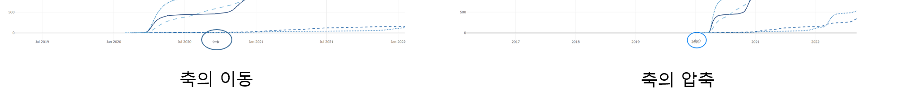

```{r setup, include=FALSE}
knitr::opts_chunk$set(echo = TRUE, message = FALSE, warning = FALSE, fig.width = 6.5, dpi = 130, eval = FALSE)
library(showtext)
showtext_auto()
library(tidyverse)
library(readxl)
library(patchwork)
library(plotly)

```

```{r echo = FALSE, message = FALSE, warning = FALSE, eval = TRUE}
##  R code
## 데이터 전처리를 위한 패키지 설치 및 로딩
if(!require(readr)) {
  install.packages('readr')
  library(readr)
}

if(!require(lubridate)) {
  install.packages('lubridate')
  library(lubridate)
}

if(!require(tidyverse)) {
  install.packages('tidyverse')
  library(tidyverse)
}

## 1. covid19 원본 데이터 셋 로딩
## covid19 데이터 로딩(파일을 다운로드 받은 경우)
# df_covid19 <- read_csv(file = "데이터저장경로/owid-covid-data.csv",
#                             col_types = cols(Date = col_date(format = "%Y-%m-%d")
#                                              )
#                             )
## covid19 데이터 로딩(온라인에서 바로 로딩할 경우)
# df_covid19 <- read_csv(file = "https://covid.ourworldindata.org/data/owid-covid-data.csv",
#                             col_types = cols(Date = col_date(format = "%Y-%m-%d")
#                                              )
#                             )

df_covid19 <- read_csv(file = "D:/R/data/Rnpy/owid-covid-data.csv",
                            col_types = cols(date = col_date(format = "%Y-%m-%d")
                                             )
                            )
## 2. 전체 데이터셋 중 최근 100일간의 데이터를 필터링한 df_covid19_100 생성
df_covid19_100 <- df_covid19 |> 
  ## 한국 데이터와 각 대륙별 데이터만을 필터링
  filter(iso_code %in% c('KOR', 'OWID_ASI', 'OWID_EUR', 'OWID_OCE', 'OWID_NAM', 'OWID_SAM', 'OWID_AFR')) |>
  ## 읽은 데이터의 마지막 데이터에서 100일전 데이터까지 필터링
  filter(date >= max(date) - 100) |>
  ## 국가명을 한글로 변환
  mutate(location = case_when(
    location == 'South Korea' ~ '한국', 
    location == 'Asia' ~ '아시아', 
    location == 'Europe' ~ '유럽', 
    location == 'Oceania' ~ '오세아니아', 
    location == 'North America' ~ '북미', 
    location == 'South America' ~ '남미', 
    location == 'Africa' ~ '아프리카')) |>
  ## 국가 이름의 순서를 설정 
  mutate(location = fct_relevel(location, '한국', '아시아', '유럽', '북미', '남미', '아프리카', '오세아니아')) |>
  ## 날짜로 정렬
  arrange(date)


## 3. df_covid19_100을 한국과 각 대륙별열로 배치한 넓은 형태의 데이터프레임으로 변환
df_covid19_100_wide <- df_covid19_100 |>
  ## 날짜, 국가명, 확진자와, 백신접종완료자 데이터만 선택
  select(date, location, new_cases, people_fully_vaccinated_per_hundred) |>
  ## 열 이름을 적절히 변경
  rename('date' = 'date', '확진자' = 'new_cases', '백신접종완료자' = 'people_fully_vaccinated_per_hundred') |>
  ## 넓은 형태의 데이터로 변환
  pivot_wider(id_cols = date, names_from = location, 
              values_from = c('확진자', '백신접종완료자')) |>
  ## 날짜로 정렬
  arrange(date)

## 4. covid19 데이터를 국가별로 요약한 df_covid19_stat 생성
df_covid19_stat <- df_covid19 |> 
  group_by(iso_code, continent, location) |>
  summarise(인구수 = max(population, na.rm = T), 
            인당GDP = max(gdp_per_capita, na.rm = T),
            전체확진자수 = sum(new_cases, na.rm = T),
            전체사망자수 = sum(new_deaths, na.rm = T), 
            십만명당중환자실 = last(icu_patients_per_million),
            재생산지수 = last(reproduction_rate),
            봉쇄지수 = max(stringency_index), 
            전체검사자수 = max(total_tests, na.rm = T), 
            신규검사자수 = sum(new_tests, na.rm = T),
            전체백신접종자수 = max(total_vaccinations, na.rm = T),
            백신접종자완료자수 = max(people_fully_vaccinated, na.rm = T),
            부스터접종자수 = max(total_boosters, na.rm = T),
            인구백명당백신접종완료률 = max(people_fully_vaccinated_per_hundred, na.rm = T),
            인구백명당부스터접종자수 = max(total_boosters_per_hundred, na.rm = T)
            ) |> 
    ungroup() |>
    mutate(십만명당사망자수 = round(전체사망자수 / 인구수 *100000, 5),
           백신접종완료률 = 백신접종자완료자수 / 인구수)


```

```{r echo = FALSE, message = FALSE, warning = FALSE, eval = TRUE}
## R 코드

df_취업률 <- read_excel('D:/R/data/Rnpy/2021년 학과별 고등교육기관 취업통계.xlsx', 
                     ## '학과별' 시트의 데이터를 불러오는데,
                     sheet = '학과별',
                     ## 앞의 13행을 제외하고
                     skip = 13, 
                     ## 첫번째 행은 열 이름으로 설정
                     col_names = TRUE, 
                     ## 열의 타입을 설정, 처음 9개는 문자형으로 다음 79개는 수치형으로 설정
                     col_types = c(rep('text', 9), rep('numeric', 79)))

## df_취업률에서 첫번째부터 9번째까지의 열과 '계'로 끝나는 열을 선택하여 다시 df_취업률에 저장
df_취업률 <- df_취업률 |> 
  select(1:9, ends_with('계'), '입대자')

## df_취업률에서 졸업자가 500명 이하인 학과 2000개 샘플링
df_취업률_2000 <- df_취업률 |> 
  filter(졸업자_계 < 500) |>
  mutate(id = row_number()) |>
  filter(row_number() %in% seq(from = 1, to = nrow(df_취업률), by = 4))

## 열 이름을 적절히 설정
names(df_취업률_2000)[10:12] <- c('졸업자수', '취업률', '취업자수')

margins_R = list(t = 50, b = 25, l = 25, r = 25)

```

```{python echo = FALSE, message = FALSE, warning = FALSE, eval = FALSE}
import pandas as pd
from datetime import datetime, timedelta
from pandas.api.types import CategoricalDtype
from matplotlib import pyplot as plt
import plotly.graph_objects as go

df_covid19 = pd.read_csv("D:/R/data/Rnpy/owid-covid-data.csv")

df_covid19['date'] = pd.to_datetime(df_covid19['date'], format="%Y-%m-%d")

df_covid19_100 = df_covid19[(df_covid19['iso_code'].isin(['KOR', 'OWID_ASI', 'OWID_EUR', 'OWID_OCE', 'OWID_NAM', 'OWID_SAM', 'OWID_AFR'])) & (df_covid19['date'] >= (max(df_covid19['date']) - timedelta(days = 100)))]


df_covid19_100.loc[df_covid19_100['location'] == 'South Korea', "location"] = '한국'
df_covid19_100.loc[df_covid19_100['location'] == 'Asia', "location"] = '아시아'
df_covid19_100.loc[df_covid19_100['location'] == 'Europe', "location"] = '유럽'
df_covid19_100.loc[df_covid19_100['location'] == 'Oceania', "location"] = '오세아니아'
df_covid19_100.loc[df_covid19_100['location'] == 'North America', "location"] = '북미'
df_covid19_100.loc[df_covid19_100['location'] == 'South America', "location"] = '남미'
df_covid19_100.loc[df_covid19_100['location'] == 'Africa', "location"] = '아프리카'

ord = CategoricalDtype(categories = ['한국', '아시아', '유럽', '북미', '남미', '아프리카', '오세아니아'], ordered = True)

df_covid19_100['location'] = df_covid19_100['location'].astype(ord)

df_covid19_100 = df_covid19_100.sort_values(by = 'date')

df_covid19_100_wide = df_covid19_100.loc[:,['date', 'location', 'new_cases', 'people_fully_vaccinated_per_hundred']].rename(columns={'new_cases':'확진자', 'people_fully_vaccinated_per_hundred':'백신접종완료자'})

df_covid19_100_wide = df_covid19_100_wide.pivot(index='date', columns='location', values=['확진자', '백신접종완료자']).sort_values(by = 'date')

df_covid19_100_wide.columns = ['확진자_한국', '확진자_아시아', '확진자_유럽', '확진자_북미', '확진자_남미', '확진자_아프리카','확진자_오세아니아',
                              '백신접종완료자_한국', '백신접종완료자_아시아', '백신접종완료자_유럽', '백신접종완료자_북미', '백신접종완료자_남미', '백신접종완료자_아프리카','백신접종완료자_오세아니아']
                              
df_covid19_stat = df_covid19.groupby(['iso_code', 'continent', 'location'], dropna=False).agg(
    인구수 = ('population', 'max'),
    전체확진자수 = ('new_cases', 'sum'),
    전체사망자수 = ('new_deaths', 'sum'), 
    백신접종자완료자수 = ('people_fully_vaccinated', 'max'),
    인구백명당백신접종완료율 = ('people_fully_vaccinated_per_hundred', 'max'),
    인구백명당부스터접종자수 = ('total_boosters_per_hundred', 'max')
).reset_index()

df_covid19_stat['십만명당사망자수'] = round(df_covid19_stat['전체사망자수'] / df_covid19_stat['인구수'] *100000, 5)

df_covid19_stat['백신접종완료율'] = df_covid19_stat['백신접종자완료자수'] / df_covid19_stat['인구수']

######################################   
## python 코드
## 대학 학과 취업률 데이터 셋

df_취업률 = pd.read_excel("D:/R/data/Rnpy/2021년 학과별 고등교육기관 취업통계.xlsx", 
                           sheet_name = '학과별',
                           skiprows=(13), 
                           header = 0)

df_취업률 = pd.concat([df_취업률.iloc[:, 0:8], 
                    df_취업률.loc[:, df_취업률.columns.str.endswith('계')], 
                    df_취업률.loc[:, '입대자']], 
                   axis = 1
                   )

df_취업률_2000 = df_취업률.loc[(df_취업률['졸업자_계'] < 500)]

df_취업률_2000 = df_취업률_2000.iloc[range(0, len(df_취업률_2000.index) , 4)]

df_취업률_2000 = df_취업률_2000.rename(columns = {'졸업자_계':'졸업자수', '취업률_계':'취업률', '취업자_합계_계':'취업자수'})

margins_P = dict(t = 50, b = 25, l = 25, r = 25)

```

이번 장에서는 plotly에서 동적 시각화에서 사용하기 위해 제공하는 다양한 기능에 대해 알아본다.

# plotly 시각화 사용하기

R의 ggplot2나 python의 matplotlib, seaborn로 만든 정적 시각화는 그래프를 만들 때 시각화한 데이터 외에 시각화 자체에서 추가적인 데이터를 얻기가 어렵다. 따라서 시각화에 추가적인 데이터를 제공하기 위해서는 다시 코딩해서 만들어야 하는 불편함이 따른다. 특히 특정 위치의 데이터 값을 확인하거나 특정 구간 데이터를 줌인하기 위해서도 다시 코딩해야 하는데 사용자의 사용을 예상하여 따라 수없이 많은 시각화를 만들어 놓을 수는 없다. 반면 plotly와 같은 동적 시각화에서는 특징적 데이터 값의 확인, 줌인, 줌 아웃, 특정 데이터만의 표기 등과 같은 데이터 분석에 자유롭게 사용할 수 있는 다양한 기능을 제공한다.

## modebar의 사용

plotly가 시각화 사용자와의 상호작용을 위한 주요 기능을 제공하는 메뉴가 'modebar'이다. 'modebar'는 plotly가 실행되는 R-Studio, Jupiter Notbook이나 웹 브라우저의 오른쪽 상단에 나타나는 버튼 메뉴를 말한다.

scatter 트레이스에 나오는 'modebar'는 다음의 그림과 같이 8개의 기능을 버튼을 통해 제공한다. 트레이스 종류에 따라 제공되는 'modebar'가 달라지는데, scatter 트레이스의 'modebar'를 기본으로 설명하겠다. 


### 시각화 저장 버튼 

시각화 저장 기능은 기본적으로 모드바의 가장 왼쪽에 카메라 아이콘으로 표현된다. 이 기능은 현재 표시되는 plotly 시각화를 정적 이미지로 저장한다. plotly에서는 기본적으로 'png'타입으로 이미지의 저장이 가능하다.

### Zoom()과 Pan() 기능 버튼

plotly 시각화는 시각화 플롯 영역에서 마우스 좌클릭한 상태로 드래그하면 시각화의 확대 영역을 설정할 수 있다. 이 기능은 plotly 시각화에서 마우스의 기본 기능 설정이기 때문에 'Zoom' 버튼을 누르지 않고 가능하다. Zoom 기능을 완료하고 원 상태의 시각화로 돌아가기 위해서는 모드바의 리셋 버튼을 누르거나 마우스 더블 클릭으로 돌아갈 수 있다.

Pan 기능은 시각화의 표현 비율을 그대로 두고 그래프를 이동시키는 기능이다. 이 기능을 사용하려면 모드바의 'Pan' 버튼을 누른 다음 마우스 좌클릭한 상태에서 움직이면 그래프가 같이 움직이게 된다. 그래프의 이동에 따라 X축과 Y축도 같이 이동하는 것을 확인할 수 있다. Pan 기능을 사용하고 원래 시각화로 돌아가기 위해서는 모드바의 리셋 버튼을 누르거나 마우스 더블 클릭으로 돌아갈 수 있다.

### Zoom In()과 ZoomOut() 기능 버튼

앞서 Zoom 버튼은 마우스 드래그를 통해 Zoom 기능을 활용하였다. 하지만 Zoom In/Out 기능 버튼의 '+' 버튼을 누를때마다 현재 시각화의 중심으로 Zoom In 이 되고 '-' 버튼을 누를때마다 현재 시각화의 중심에서 Zoom Out이 된다.

### Autoscale()과 Reset Axes() 기능 버튼

plotly를 만들때 X축과 Y축의 범위를 설정하지 않으면 plotly는 표시되는 데이터의 사이즈에 맞게 X축과 Y축의 범위를 자동 설정한다. 이 기능을 'Autoscale'이라고 하는데 'Autoscale' 버튼은 plotly가 시각화를 생성할 당시 자동으로 설정했던 축 설정으로 되돌아 가는 버튼이다. 'reset axes' 버튼은 초기 시각화로 돌아가는 기능을 제공한다.

### toggle spike line() 기능 버튼

'Toggle Spike Line' 버튼은 X축, Y축으로 그려지는 보조선의 설정을 변경하는 버튼이다. 이 버튼으로 스파이크 라인을 활성화하면 X축과 Y축으로 'toaxis'가 설정된 스파이크 라인이 설정되고 다시 한번 누르면 스파이크 라인이 없어진다.


### Show Closet Data On Hover()/Compare Data On Hover() 기능

이 두 버튼은 호버의 설정과 관련한 기능을 조절하는 버튼이다. 'Show Closet Data On Hover' 버튼은 데이터에 가장 가까운 데이터에 호버가 나타나는 기능으로 설정하는 버튼이고 'Compare Data On Hover'는 X축으로 동일한 데이터에 대한 호버가 표시되는 기능, 즉 'hovermode'를 "x"로 설정하는 버튼이다.


## 마우스의 기능

### 호버를 통한 데이터 확인

plotly 시각화에서 가장 쉽게 사용하는 기능은 마우스를 사용하여 해당 위치의 데이터 정보를 확인하는 기능이다. plotly 객체로 생성된 시각화 위에 표현된 각 트레이스들은 자체 데이터를 JSON의 형태로 포함하고 있기 때문에 마우스 포인터를 트레이스위에 위치시키면 호버를 통해 해당 트레이스의 정보가 표시된다.

마우스 포인터에 의해 표시되는 호버의 정보는 각 트레이스의 'hoverinfo', 'hovertemplate' 등 호버 속성 설정에 따라 표시된다.


### 드래그를 통한 Zoom In

트레이스가 나타나는 플롯팅 영역(plotting area)에서 마우스 왼쪽 버튼을 클릭한 상태에서 드래그하면 다음 그림과 같이 줌 인 영역을 선택할 수 있다. 이렇게 영역을 선택한 후에 마우스 클릭을 놓으면 해당 부분이 줌인 되어 표시되게 된다. 만약 다시 처음의 상태로 돌아가려면 모드바의 집 아이콘인 'Reset Axes' 버튼을 사용한다.


### 드래그를 통한 축 이동과 압축(팽창)

plolty에서 마우스 드래그를 통해 추가로 할 수 있는 기능은 축 이동과 축 압축이다. X축과 Y축의 위치에서 마우스의 왼쪽 버튼을 클릭한 상태에서 상하 또는 좌우로 드래그를 하면 축의 범위가 조절된다. 이를 통해 데이터가 표현되는 축의 범위를 변경할 수 있다. 만약 처음 눈금 라벨의 아래나 마지막 눈금 라벨의 위(Y축), 처음 눈금 라벨의 왼쪽이나 마지막 눈금 라벨의 오른쪽(X축)에서 마우스를 클릭하고 드래그하면 축의 원점이나 최종점이 고정된 채 축을 압축하거나 팽창할 수 있다.



## 범례의 사용

plotly에서 범례는 단순히 트레이스 이름과 표현방식을 매핑해주는 역할을 넘어 트레이스들의 표시를 조절할 수 있는 기능이 있다. 범례의 아이템을 클릭하면 해당 트레이스의 표시를 토글하는 역할을 하는 것으로, 여러 데이터 트레이스 중에 특정한 트레이스만을 확인하기 위해서 해당 트레이스만 남기고 다른 트레이스의 표시를 제거함으로써 자신이 보기 원하는 데이터만 선별하여 볼 수 있게 된다. 이 기능은 대시보드에서 흔히 제공하는 옵션 중의 하나인데 plotly에서는 범례를 사용하여 이 기능을 기본적으로 제공한다는 것이다. 

특히 이 기능이 더 편리한 것은 현재 표시되고 있는 데이터의 범위에 따라 X축과 Y축의 범위가 자동으로 다시 설정되어 남은 데이터의 특징이 더 잘 보인다는 장점이 있다. 다음은 범례를 사용하여 한국과 일본의 데이터만 남긴 결과이다.


# Plotly 배포

## Off-line 배포

데이터 시각화는 보통 데이터 분석의 결과가 요약되는 보고서에 첨부되어 데이터 분석의 결과를 보다 설득력 있게 제공하는 데 많이 활용된다. plotly의 결과도 정적 이미지로 저장하여 보고서에 포함해 사용할 수 있다. 이를 위해서는 앞에서 살펴본 모드바의 다운로드 기능을 사용하여 'png' 형태의 파일로 다운로드 받아 사용할 수 있지만 R과 python 코드에서 바로 저장할 수도 있다.

-   R

R에서 plotly 시각화를 정적 이미지로 다운로드 받기 위해서는 R-Studio를 사용하는 방법과 코드를 사용하여 다운로드 받는 방법의 두 가지로 나눌 수 있다.

R-Studio를 사용하는 사용자라면 보통 우측 하단 'Viewer' 패널에 plotly 시각화가 표현된다 'Viewer' 패널의 'Export' 기능을 사용하면 plolty 시각화를 jpg, png, bmp 파일로 저장할 수 있다. 이 기능을 사용하면 저장할 파일의 크기를 조절할 수 있다는 장점도 있다.


또 'Viewer' 패널에서 plotly 시각화를 html 형식의 파일로도 저장이 가능하다. 파일로 저장해서 웹브라우저에서 열면 해당 시각화를 웹브라우저에서 사용할 수 있고 앞서 png, jpg, bmp 이미지 파일과는 달리 동적 시각화의 모든 기능을 사용할 수 있다는 장점이 있다.


이렇게 사용자가 직접 이미지나 HTML로 저장하는 방식이 아닌 코드에서 자동으로 이미지 파일을 저장하기 위해서는 plolty 패키지에서 제공하는 `export()`를 사용하거나 htmlwidgets 패키지의 `savewidget()`을 사용할 수 있다. `export()`는 plotly 시각화 객체를 매개변수로 지정하고 파일명을 지정하면 해당 파일명으로 plotly 시각화가 저장된다.

`export()`에서 지원하는 파일 포맷은 jpg, png, pdf 등으로 파일명 지정 시 파일포맷 확장자를 지정하면 해당 파일 포맷으로 저장된다.[^1]

[^1]: plotly는 export()보다는 orca()를 사용하라고 권고하고 있으나 orca()는 한글 변환에 문제가 있어 여기서는 export()를 위주로 설명한다. 또 WebGL이나 svg 파일 포맷으로 저장할 때는 매개변수로 `RSelenium::rsDriver()` 설정이 필요하다.

```{r}
fig <- df_취업률_500 |> 
  ## X축은 졸업자수, Y축은 취업자수로 매핑한 plotly 객체 생성
  plot_ly() |>
  add_trace(type = 'scatter', mode = 'markers', 
            x = ~졸업자수, y = ~취업자수)

export(fig, file = 'fig.png')

```

만약 HTML 파일로 저장하기 위해서는 `htmlwidgets` 패키지를 설치하고 `savewidget()`을 다음과 같이 사용할 수 있다.

```{r}
htmlwidgets::saveWidget(widget = fig, 'fig.html')

```

-   python

python에서 plotly 시각화를 정적 이미지로 다운로드 받기 위해서는 Kaleido 라이브러리나 orca 라이브러리를 설치하여야 한다. plotly에서는 Kaleido 라이브러리를 설치를 권장한다.[^2] 이 라이브러리는 python의 plotly 객체를 저장하기 위해 꼭 필요하지만 직접 임포트를 하지 않아도 되고 plolty 라이브러리의 `write_image()`을 사용할 때 내부적으로 사용된다.

[^2]: 윈도우 10에서는 kaleido 라이브러리와 plolty 라이브러리가 충돌하여
    write_image()가 hang이 걸리는 경우가 있다. 이 경우 kaleido
    라이브러리를 삭제하고 실행하면 정상 작동한다.

```{python}
> pip install Kaleido

```

plotly 객체를 저장하기 위해 `write_image()`을 사용한다. `write_image()`에서 저장이 가능한 파일 포맷은 래스터 이미지 파일인 png, jpg, webp와 벡터 이미지 파일인 svg, pdf 등 이다. 이들 파일 포맷의 결정은 `write_image()`의 저장 파일명을 설정할 떄 파일 확장자에 따라 결정된다.

```{python}
fig.write_image("fig.png")

```

만약 HTML 파일 포맷으로 저장해야 한다면 `write_html()`을 사용한다.

```{python}
fig.write_html("fig.html")

```

## On-line 배포

plolty와 같은 동적 시각화는 사실 보고서에 넣는 것 보다는 온라인 웹페이지를 통해서 배포할 때 그 효과가 극대화된다. 앞서 오프라인 배포에서도 HTML 파일로 저장이 가능한데 이 HTML 파일은 plotly의 동적 기능을 위한 자바 스크립트(plotly.js)를 포함하기 때문에 HTML 파일의 크기가 3\~4MB를 넘는다. 따라서 이렇게 큰 사이즈의 HTML을 웹 서버에 올려서 서비스하는 것은 가능하지만 블로그에 포스팅 할 경우 파일 사이즈가 커서 업로드가 불가능한 경우가 있다. 이런 경우는 plotly에서 제공하는
차트 스튜디오(chart studio)를 사용하여 포스팅할 수 있다.

차트 스튜디오는 자신이 생성한 plotly 객체를 업로드하고 이 파일을 블로그에 임베딩하는 기능을 제공한다. 또한 plotly 객체의 배포 외에도 웹 브라우저에서 차트를 쉽게 생성하거나 편집할 수 있는 편집기 기능도 제공한다. 차트 스튜디오는 무료 계정으로 사용이 가능한데 무료 계정은 자신이 생성한 plotly 시각화 결과를 누구나 볼 수 있는 퍼블릭 모드로만 사용할 수 있고 유료 계정의 경우 자신의 plotly 시각화 결과를 다른 사람에게 공개하지 않는 프라이빗 모드를 사용할 수 있다.


차트 스튜디오를 사용하기 위해서는 먼저 차트 스튜디오에 가입을 해야한다.


가입을 신청하면 사용자 인증을 위한 이메일이 발송되는데 이 이메일에 인증해주면 가입이 완료된다. 이후 로그인하면 먼저 R-Studio과 Jupyter Notebook에서 업로드를 하기 위한 토큰을 받아야 한다. 로그인 후 'Setting' 메뉴의 'API Keys' 메뉴를 선택하고 패스워드를 입력하면 다음과 같은 키를 키 값이 나오는데 이 키 값을 잘 기록해 두어야 한다.


### 환경 설정과 업로드

이 키 값을 R-Studio와 Jupyter notebook에서 다음과 같이 세팅하고 plotly 시각화 객체를 업로드할 수 있다.

-   R

R에서 다음과 같이 환경변수를 설정해주면 해당 R 세션내에서는 차트 스튜디오를 사용할 수 있다.

```{r}
Sys.setenv("plotly_username"="your_plotly_username")
Sys.setenv("plotly_api_key"="your_api_key")

```

만약 R 세션이 열릴때 자동적으로 환경변수를 설정하기 위해서는 '.Rprofile' 파일에 환경변수를 넣어준다.

환경변수가 설정된 후에는 plotly 시각화를 만들고 `api_create()`를 사용하여 차트 스튜디오에 올려준다.

```{r}
fig <- df_취업률_500 |> 
  ## X축은 졸업자수, Y축은 취업자수로 매핑한 plotly 객체 생성
  plot_ly() |>
  add_trace(type = 'scatter', mode = 'markers', 
            x = ~졸업자수, y = ~취업자수)

api_create(fig, filename = "업로드할 파일 이름")

```


-   python

python에서 차트 스튜디오에 접속하기 위해서는 먼저 `pip`를 사용하여 `chart_studio` 라이브러리를 설치하여야 한다.

```{python}
> pip install chart_studio

```

라이브러리가 설치 되었다면 `chart_studio.tools.set_credentials_file()`을 사용하여 차트 스튜디오의 ID와 API Key를 다음과 같이 설정한다.

```{python}
import chart_studio
chart_studio.tools.set_credentials_file(username='your_plotly_username', api_key='your_api_key')

```

이 과정을 python 실행시 자동으로 설정하려면 python 홈 디렉터리에 '.plotly/.credentials' 파일을 다음과 같이 만들어야 한다.

```{python}
{
"username": "your_plotly_username",
"api_key": "your_api_key"
}

```

이제 차트 스튜디오를 사용할 환경설정이 완료되었다면 업로드할 plotly 시각화를 생성하고 완성되면 `chart_studio.plotly` 라이브러리를 임포트하고 `plot()`이나 `iplot()`을 사용하여 plotly 시각화 객체를 차트 스튜디오에 업로드할 수 있다. 다음의 코드를 실행시키면 업로드된 결과가 웹브라우저를 통해 자동으로 실행되고 실행 결과로 해당 URL이 나타난다. `iplot()`을 사용하면 업로드된 결과가 웹브라우저를 통해 실행되고 jupyter notebook에도 동일한 결과가 나타난다.

```{python}
import chart_studio.plotly as py
py.plot(fig, filename = '업로드할 파일 이름', auto_open=True)

```

### 블로그에 임베딩

앞과 같이 R과 python에서 만든 그래프가 차트 스튜디오에 올라가면 이 시각화를 임베딩하기 위한 주소를 추출해야 한다. 주소의 추출은 업로딩된 그래프의 바로 아래 버튼을 클릭하면 다음과 같이 나타난다.

여기에 나타난 임베딩 태그를 복사하여 포스팅에 붙여 넣으면 해당 위치에 plotly 시각화가 나타난다.


# 정적 시각화(ggplot, matplotlib)의 plotly 변환

기존의 데이터 분석에서 시각화를 위해 많이 사용하는 패키지가 R은 ggplot2일 것이고 python 사용자는 matplotlib이나 seaborn을 사용한다. plotly는 이들 정적 시각화를 인터랙티브 데이터 시각화로 변환하는 기능도 제공하기 때문에 기존의 시각화도 재활용할 수 있다.

-   R

R의 경우는 plotly 패키지에서 제공하는 `ggplotly()`를 사용하면 간단히 변환된다. ggplot2로 생성된 객체를 `ggplotly()`에 매개변수로 전달해 주면 plotly 객체로 변환된다.

```{r eval = FALSE}
ggplotly <- df_covid19_100 |> 
  ggplot(aes(x = date, y = new_cases, color = location )) +
  geom_line(aes(group = location, linetype = location)) +
  scale_x_date(breaks = '1 months') +
  scale_y_continuous(labels = scales::comma) +
  labs(x = '날짜', y = '확진자수', linetype = '지역', color = '지역')

## ggplot객체를 plotly 객체로 변환
ggplotly(ggplotly)

```

```{r echo = FALSE, fig.cap='R의 ggplot2 객체의 전환'}
ggplotly <- df_covid19_100 |> 
  ggplot(aes(x = date, y = new_cases, color = location )) +
  geom_line(aes(group = location, linetype = location)) +
  scale_x_date(breaks = '1 months') +
  scale_y_continuous(labels = scales::comma) +
  scale_color_brewer(palette = 'Blues', direction = -1) + 
  labs(x = '날짜', y = '확진자수', linetype = '지역', color = '지역')

## ggplot객체를 plotly 객체로 변환
ggplotly(ggplotly)

```


-   python

python의 경우는 `plotly.tools` 패키지의 `mpl_to_plotly()`를 사용하여 matplotlib과 seaborn 패키지로 생성된 정적 시각화를 plotly의 동적 시각화로 변환할 수 있다.

```{python eval = FALSE}
import seaborn as sns
import plotly.tools as tls

sns.lineplot(x="date", y="new_cases",
             hue="location",
             data=df_covid19_100)

mpl_fig = plt.gcf()
plotly_fig = tls.mpl_to_plotly(mpl_fig)
plotly_fig.show()

```


