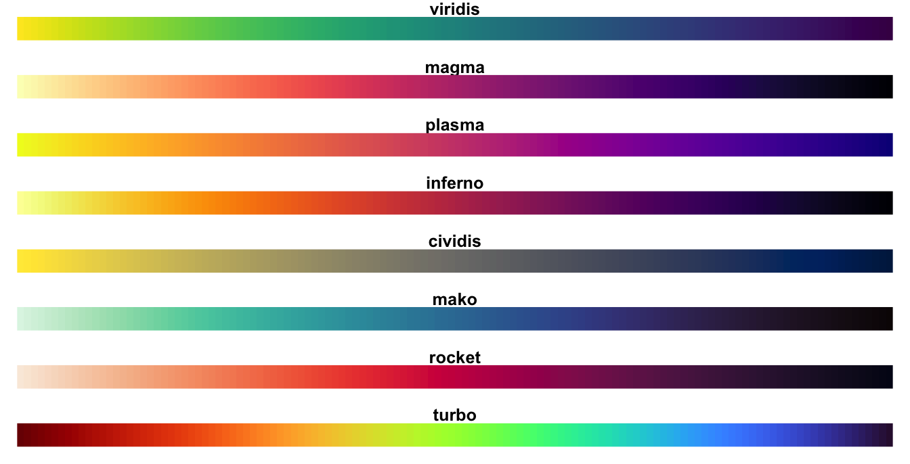

```{r setup, include=FALSE}
knitr::opts_chunk$set(echo = TRUE, message = FALSE, warning = FALSE, fig.width = 6.5, dpi = 130, eval = FALSE)
library(showtext)
showtext_auto()
library(tidyverse)
library(readxl)
library(patchwork)
library(plotly)

```


좋은 데이터 시각화는 다음의 그림과 같은 네 가지 요소가 적절히 갖추어져야 한다. 첫 번째는 데이터로 표현되는 정보이다. 사용자가 전달하려는 목적에 맞는 데이터로 구성한  시각화를 만들어야 한다. 두 번째는 스토리이다. 데이터를 시각화하여 말하고자 하는 것을 표현하는 과정을 잘 설계해야 한다. 세 번째는 목적이다. 이 시각화를 무슨 목적으로 만드는지, 그 목적에 적합하게 구성되어 있는지를 고려해야 한다. 네 번째는 시각화 형태이다. 목적에 맞는 데이터를 전달하고자 하는 스토리에 맞는 시각화 형태를 사용해야 한다. 예를 들어 데이터의 전체에 대한 비율을 전달하고자 한다면 비율을 전달하기에 적절한 시각화를 사용해야 할 것이다. 


# 스토리텔링

R이든 python이든, 어떤 패키지나 라이브러리를 쓰든 데이터 시각화를 만드는 사용자들은 가끔, 아니 자주 시각화의 테크닉을 최대한 사용하여 수려한 그래프를 만들기 위해 노력한다. 그렇게 많은 기술적 요소를 가진 시각화를 만드는 사용자는 자기 기술에 대해 뿌듯할지 모르지만, 많은 경우 화려한 기술에 데이터가, 데이터가 말하는 의미가 퇴색되는 경우가 종종 발생한다. 그래서 시각화 디자인을 만들기 전에는 반드시 그 데이터가, 시각화가 무엇을 의미하고, 무엇을 전달하려 하는지를 명확히 해야 한다. 이를 스토리텔링이라고 한다. 

특히 최근에는 데이터 분석의 결과를 대중에게 전달할 때 이 스토리텔링을 중요하게 여긴다. 이것을 영문으로 KWYRWTS라고 표시하는데 이는 'Know What You Really Want To Say'(네가 진정 이야기하고자 하는 것을 알아라)의 준말이다.

# 청중은 누구인가?

시각화의 목적을 결정했다면 그 시각화를 누구를 대상으로 보여줄지를 파악해야 한다. 시각화의 청중이 정책 입안자인지, 투자자인지, 일반 대중인지, 회사의 고위급 의사결정자인지에 따라 그 그래프의 유형, 형식, 배포 방식 등이 달라진다. 

보통 정책 입안자나 회사의 고위급 의사결정자 들은 시간이 많지 않고 여러 가지 고려해야 할 사항이 많아 항상 머릿속이 복잡하다. 이들에게 시각화를 집중시키기 위해서는 그들의 관심이 가장 많은 결과부터 크고 눈에 띄는 방법으로 시작하는 것이 효과적일 수 있다. 그래프의 제목부터 명확하고 간결하게 결론을 부각함으로써 시간이 없고 많은 고려가 필요한 사람들의 집중을 끌어낼 수 있다. 또 만약 그들의 나이가 다소 많다면 보다 크고 진한 폰트로 글자를 읽는 수고를 덜어주는 것도 고려할 필요가 있다.

동종 업계 종사자들은 일반적으로 유사한 지식을 가지고 있지만 해당 데이터에 대한 상세한 정보를 알고 있지 못하다. 이렇게 유사한 지식 수준들을 지닌 사람들에게는 상세한 주석과 설명으로 충분한 정보를 제공해도 이해가 가능할 것이며 전문 분야에서 사용하는 용어나 시각화를 사용하는 것도 충분히 고려할 만하다. 

당신과 같은 프로젝트에 참여한 동료들에게는 자신이 찾아낸 데이터의 함의, 모니터링 결과 또는 데이터 탐색 결과를 보여주는 데 집중해야 한다. 당신과 적극적으로 협력해 온 사람들이기 때문에 이미 여러 가지 다양한 맥락에 대한 지식을 가지고 있을 것이다. 따라서 굳이 필요가 없는 사전 지식에 대한 설명은 생략하여도 좋을 것이다. 또 조금은 복잡하고 어려운 단어들일지라도 프로젝트에서 공유하고 있는 변수명, 주석, 시각화의 전반적 형태 등은 그대로 사용하는 것이 오히려 데이터를 설명하고 데이터를 이해하는 데 도움이 될 것이다. 

하지만 시각화가 가장 빛을 발하는 곳은 일반 대중에게 발표될 때일 것이다. 일반 대중이란 그 특성을 특정할 수 없기 때문에 그들의 사전 지식 여부나 지적 수준을 가늠할 수 없다. 따라서 사전 지식이나 지적 수준에 대한 고려 없이 시각화를 만들어야 한다. 데이터에 대한 설명과 해석 방법들에 대한 맥락적 텍스트가 충분히 제공되어야 하고, 무엇보다 청중과 공감할 수 있는 시각화를 만들어야 한다. 어려운 도형을 사용하는 시각화보다는 누구나 쉽게 해석할 수 있는 시각화가 좋고, 데이터와 연관성이 강한 색상을 선택해야 하며, 동시에 표현하는 변량을 4~5개 이하로 제한함으로써 청중들이 데이터 좀 더 간결하게 만들 필요가 있다. 

# 적절한 시각화 타입의 선정

시각화의 목적이 설정되었다면 다음은 어떤 시각화 타입으로 시각화를 만들지를 선택해야 한다. 이 책에서는 시각화하는 목적에 따라 시각화를 설명하였다. 데이터의 관계성을 보여줄지, 데이터 간의 비교를 보여줄지, 데이터의 추세를 보여줄지, 데이터의 분포를 보여줄지 등의 목적에 따라 선택할 수도 있고, 그 데이터의 종류가 두 개의 연속형 데이터인지, 하나의 연속형 데이터와 하나의 이산형 데이터인지, 두 개의 이산형 데이터인지, 세 가지 이상의 데이터를 표현해야 할지와 같이 그 데이터의 종류에 따라 결정할 수도 있다. 데이터에 따라, 혹은 목적에 따라 차트의 종류를 선택하는 방법은 여러 가지가 있는데 이 중 대표적인 두 가지를 소개한다. 

첫 번째는 스위스의 Martin J. Eppler 교수와 Christian Muntwiler가 주도하는 swiss visual literacy project(https://www.visual-literacy.org/)에서 제안한 시각화 방법의 주기율표(The Periodic Table of Visualization Methods)이다. 시각화 주기율표는 시각화를 데이터, 정보, 개념, 전략, 메타포 및 복합 시각화로, 또 프로세스와 구조 시각화로 분리한다. 다시 이들을 구조적 시각화와 절차적 시각화로 분류하며, 더 나아가서 세부 사항을 보여주는지, 개요를 보여주는지, 둘 다 보여주는지에 따라 더 세분화한다. 


두 번째는 Dr. Andrew Abela의 The Extreme Presentation™ Method에서 제공하는 Chart Chooser이다. Chart Chooser는 시각화의 종류를 크게 비교(Comparison), 분포(Distibution), 구성(Composition), 관계(Relationship)로 구분하고 이를 다시 표현되는 변수의 종류에 따라 구분하여 적절한 타입의 시각화 종류를 찾을 수 있도록 도식화하였다. 


# 간결한 시각화

'완성이란 더 이상 덧붙일 것이 없을 때가 아니라 더 이상 뺄 것이 없을 때 이루어지는 것 같다.' 어린 왕자로 유명한 생텍쥐페리가 『생텍쥐페리, 인생을 쓰다』에서 언급한 문장이다. 물론 데이터 시각화를 두고 한 말은 아니겠지만 데이터 시각화를 언급할 때 많이 거론되는 명언이다. 

plotly를 포함한 시각화 패키지나 시각화 프로그램들에는 매우 다양한 시각화 요소들을 제공한다. 하지만 이 요소들을 최대한 사용하여 시각화를 만드는 것은 사용자의 주의를 흐트러트린다. 또, 데이터 스토리텔링이 시각화 디자이너의 의도대로 흘러가게 하지 않고, 청중의 의도대로 흘러가게 하여 시각화 디자이너가 원하는 대로 설명하는 데 장애가 될 수 있다. 예를 들어 막대 그래프의 막대가 많을 때는 굳이 모든 막대에 레이블을 붙을 필요는 없을 것이다. 특별히 강조해야 하는 곳에만 레이블을 붙임으로써 시각화 작성자의 의도대로 청중의 관심을 이끌 수 있다. 따라서 시각화의 스토리를 전달하기 위해 꼭 필요한 디자인 요소들만을 사용하는지, 청중의 주의를 분산시키는 디자인적 요소들을 얼마나 제거했는지를 잘 고려해야 한다. 이렇게 차트의 의미 없는 그래픽 요소들을 챠트정크(Chartjunk)라고 한다. 

다음 그림의 왼쪽 차트를 보면 막대그래프, 표, 많은 텍스트로 전체 시각화의 집중도가 떨어진다. 이 시각화에서 의미 없이 사용된 색상 구분과 관계없는 표를 제거하고, 지나치게 긴 범례 텍스트를 간결하게 정리하고, 시각화의 맥락과 관점들을 추가하여 정리하면 오른쪽의 그림과 같이 바꿀 수 있다. 어떤 것이 더 청중의 집중도를 높이고 시각화가 전달하고자 하는 목표를 달성하는지 생각해보라. 


간결한 시각화를 측정하는 방법으로 데이터 잉크가 있다. 데이터 잉크는 통계학자로 유명한 Edward Tufte가 고안한 인덱스로 전체 데이터 시각화에 프린트할 때 사용되는 잉크 중에 데이터를 표현하는 데 꼭 필요한 잉크의 비율을 말한다. Edward Tufte는 가장 좋은 데이터 시각화는 데이터 잉크만으로 구성된 시각화라고 제시하였다. 결국 시각화는 데이터를 전달하는데 불필요한 요소들을 제외하고 데이터를 설명하는 요소로만 구성해야 한다는 것이다. 다음의 그림은 데이터 잉크가 낮은 그래프와 높은 그래프를 보인다. 


# 읽기 쉬운 라벨링

읽기 쉬운 제목과 텍스트는 시각화의 맥락을 사용자에게 가장 정확하게 전달하는 매우 강력한 시각화 요소 중의 하나이다. 사실 데이터 시각화에서 텍스트를 사용한 라벨링은 될 수 있는 대로 줄이는 게 좋다고 알려져 있다. 하지만 시각화를 만드는 사람들은 그래픽 요소만으로는 데이터의 의미를 전달할 수 없다. 결국 꼭 필요한 텍스트는 사용해야 한다는 것이다. 

그렇다면 텍스트를 최소로 사용하면서 데이터의 의미를 최대한 전달하기 위해서는 텍스트의 폰트와 크기, 색상을 잘 선택하여야 하고 텍스트의 위치와 사용 방법을 잘 결정해야 한다.

텍스트는 무엇보다 읽기가 쉬워야 한다. 읽기 쉬운 텍스트를 위해서는 글꼴 폰트, 글꼴 스타일, 글꼴 크기 및 텍스트 색상을 잘 설정해야 한다. 

우선 폰트부터 생각해 보자. 영문 폰트의 경우에는 데이터 시각화에서는 San Serif체가 가장 잘 읽히는 글씨체라고 알려져 있다.<https://blog.datawrapper.de/fonts-for-data-visualization/> 그래서 대부분의 신문에서 많이 사용된다. 특히 영국의 이코노미스트나 미국 블룸버그의 데이터 시각화에 사용되고 있다. 한글 폰트의 경우는 여러 연구가 있었지만, 그 결과가 서로 달라 어떤 것이 더 가독성이 높은 서체인지는 명확히 밝혀진 바가 없다.  <http://m.dongascience.com/news.php?idx=49775> 다만 필자의 경험에 따르면 가독성이 가장 떨어지는 글꼴은 필기체 형태의 글꼴, 기울여진 글꼴, 크기가 일정치 않은 글꼴(탈네모형 글꼴)이다. 


다음으로 글꼴의 크기와 색상을 생각해보자. 글꼴의 크기는 대체로 청중이 텍스트를 읽는 순서를 정해주는 역할을 하게 된다. 글꼴의 색상은 글자가 눈에 잘 띄게 해주는 역할을 한다. 따라서 가장 중요하고 강조해야 하는 텍스트에 크고 굵고 배경과 대비가 큰 글꼴의 크기와 색상을 설정해야 한다. 청중은 대체로 이 텍스트를 제일 먼저 보게 될 것이다. 그러나 이를 사용하기 위해 과도하게 글자의 크기를 달리한다든지, 다양한 색상을 사용하는 것은 오히려 역효과가 나기 때문에 조심해서 사용해야 한다. 

# 왜곡의 방지

데이터를 시각화할 때 가장 주의해야 하는 것은 보여주지 말아야 하는 데이터를 보여준다거나 보여주어야 하는 데이터가 생략되는 것이다. 또 특정 부위의 시각화를 지나치게 강조한다거나 지나치게 축소하는 것도 주의해야 한다. 이러한 현상을 데이터 왜곡이라고 한다. 물론 이러한 왜곡은 원치 않은 상황에서 우연히 발생하는 경우가 대부분이긴 하지만 간혹 작성자가 특정한 의도로 만드는 경우도 있다. 


이러한 데이터 왜곡은 여러 가지 원인이 있지만 다음의 몇 가지를 주의한다면 많은 왜곡은 제거될 수 있다.  

첫 번째는 동일한 단위의 스케일은 가급적 일정하게 유지하는 것이다. 그래프에 있는 데이터를 크게 보이게 하거나 작게 보이게 하도록 특정 축의 스케일을 변경한다면 데이터를 보는 청중에게 왜곡이 발생할 가능성이 커지게 된다. 특히 서브 플롯을 사용하는 경우 이런 현상들이 나타난다. 다음의 그림에서 보면 US의 스케일과 UK의 스케일이 서로 다르기 때문에 US의 25%와 UK의 26%가 매우 크게 차이가 난다. 심지어는 US의 25%가 UK의 26%보다 크게 그려졌다. 현재는 정상적으로 수정되었다. 


두 번째는 가급적 0부터 시작하는 기준선을 사용하는 것이 좋다. 데이터의 차이를 두드러지게 하기 위해 기준선을 0보다 큰 숫자로 시작하고 싶을 수 있지만 왜곡의 소지가 있다. 다음의 그림은 우리나라의 외환보유고에 대한 세 가지의 그래프이다. 모두 같은 데이터를 말하고 있지만 그 느낌은 모두 다르다. 또 22년 5월 대비 6월 감소율은 2.1%에 불과하지만, 상단 좌측 그래프는  2.1%보다 낙폭이 과도하게 느껴진다. 

이러한 왜곡을 방지하기 위해서는 가급적 0부터 시작하는 그래프를 그리는 게 좋다고 권고된다. 하지만 현실적으로 0부터의 시각화는 너무 엄격하고 차트의 가독성에 영향을 미치게 된다. 따라서 y축을 0 값에서 시작하는 것이 가장 좋은지 아니면 다른 값에서 시작하는지 결정하려면 장단점을 잘 고려해야 한다. 이럴 때는 전월 대비 비율이라든지 전체 대비 비율 등과 같이 값을 정규화(Normalization)하는 방법을 고려할 수 있다. 


# 적절한 색상 사용

색상을 적절히 사용하면 차트의 특정 부분에 청중의 주의를 끌 수 있다. 밝은 색상이나 타 색상과의 대비가 큰 색상은 청중의 시선을 빠르게 집중시킬 수 있어 시각화가 전달하고자 하는 메시지에 효과적으로 사용된다. 하지만 무지개 색상과 같이 과도하게 많은 색상의 팔레트를 사용하는 것은 피해야 할 것이다. 각각의 색상으로 보면 화려하고 예뻐 보일지 모르지만 시각화의 목적을 전달하는데 효과적인지를 먼저 고려해야 한다. 

데이터 시각화를 위한 패키지나 툴에서는 색상의 사용을 위해 각각의 패키지에서 팔레트를 제공한다. R과 python에서는 Brewer 팔레트를 많이 사용하는데, 지도 제작자인 Cindy Brewer가 개발한 팔레트로, 표현하고자 하는 데이터의 목적에 따라 다음과 같이 세 가지로 구분된다. 

-   Sequential palettes

순차적(Sequential) 팔레트는 두 개 혹은 세 개의 색조로 진행하는 색들로 구성된다. 그렇기 때문에 시작색과 중간색, 최종색의 이름을 사용하여 팔레트 이름이 만들어진다. 예를 들어 위의 팔레트 중 YlOrRd는 Yellow, Orange, Red의 세 가지 색을 순차적으로 구성하는 색으로 구성되어 있다. 이 순차적 팔레트는 보통 밝은색에서부터 시작하여 어두운색으로 진행되는데, 밝은색은 낮은 데이터 값으로, 어두운색은 높은 데이터 값으로 매핑된다. 따라서 이 팔레트들은 보통 데이터 값이 순서를 가지거나 값의 크기에 따른 비교가 가능한 데이터들의 색을 표시할 때 효과적으로 사용된다.


-   Diverging palettes

분기(Diverging) 팔레트는 보통 세 가지 색상을 사용하는 것은 순차 팔레트와 유사하지만, 중간값을 밝은색으로 두고 양쪽 끝으로 갈수록 어두운색으로 퍼져나가는 방식, 즉 중간을 중심으로 양쪽으로 분기되는 형태의 팔레트이다. 이 팔레트의 이름도 순차 팔레트와 유사하게 팔레트를 구성하는 색이름을 사용하여 만들어졌는데 RdYlGn은 중간값을 Yellow로 두고 데이터값이 작을수록 Red가 점점 어두워지는 색으로, 데이터 값이 커질수록 Green으로 퍼져 나간다. 팔레트 이름에 색상이 두개만 지정되어 있다면 중간 색을 흰색(white)로 설정된 팔레트이다. 이 팔레트는 중간값을 기준으로 작은 값과 큰 값을 대조할 때 효과적으로 사용된다.


-   Qualitative palettes

질적(Qualitative) 팔레트는 앞에서 언급한 순차 팔레트나 분기 팔레트와는 달리 특정한 색조의 순서에 특별한 의미가 없다. 색상의 구성은 각각의 데이터 값 간의 구분이 명확하도록 구성되어 있다. 따라서 인접한 색들이 유사한 색으로 구성되지 않게 구성되어 있다. 따라서 데이터를 구성하는 값이 순서와 관련 없는 범주형 변수인 경우 효과적으로 사용된다.


또 하나의 고려 점은 색맹이나 색약의 장애를 가진 청중을 위한 고려이다. 이 고려는 색맹이나 색약에 대한 고려뿐 아니라 흑백 출력에 대한 해결책도 제시한다. 

화려한 색상의 사용은 그래프를 시각적으로 예뻐 보이게 할 수 있겠지만 색상을 인식하 는데 장애가 있는 청중들에게는 데이터를 구분할 수 없는 단점이 있다. 또 흑백 프린터를 사용하는 경우 화려한 색상은 출력물에 구분하기가 어렵기 때문에 다시 시각화를 만들어야 하는 번거로움도 있다. 이러한 단점을 극복하기 위해 제공되는 팔레트가 Viridis 팔레트이다. 

Viridis 팔레트는 2015년 Stéfan van der Walt 와 Nathaniel Smith가 파이썬 matplotlib 패키지에 사용될 색상 팔레트로 설계했는데, 색상을 구분하기 어려운 사람들과 흑백으로 출력되는 출력물에서 색상들이 정확히 구분될 수 있도록 구성한 팔레트이다. 이 팔레트는 8가지 색상 팔레트로 구성된다. 가장 기본적인 "viridis" 팔레트를 비롯하여 "magma", "plasma", "inferno", "civids", "mako" , "rocket", "turbo"로 구성된다. 



Viridis 색상이 각각의 색맹에게 보여지고 흑백에서 출력되는 색상은 다음의 그림과 같다. 


\<참고 사이트\>

효과적인 시각화 만들기

https://medium.com/@denananda/simple-data-analysis-with-visualization-using-power-bi-8fc4498d64c4

청중은 누구인가?
https://medium.com/counterarts/designing-data-visualization-for-different-audiences-c1d1b12046a5

적절한 시각화 타입의 선정
https://extremepresentation.com/2008/06/visualization-taxonomies/

https://www.visual-literacy.org/

https://extremepresentation.com/

간결한 시각화

https://medium.com/counterarts/simplicity-is-a-data-visualization-best-friend-4ad4fbec30da

읽기쉬운 라벨링

https://blog.datawrapper.de/fonts-for-data-visualization/

http://m.dongascience.com/news.php?idx=49775

왜곡의 방지

http://www.mediatoday.co.kr/news/articleView.html?idxno=201041

https://edition.cnn.com/2020/08/27/world/global-coronavirus-attitudes-pew-intl/index.html

https://edition.cnn.com/2020/08/27/world/global-coronavirus-attitudes-pew-intl/index.html

적절한 색상의 사용

https://cran.r-project.org/web/packages/viridis/vignettes/intro-to-viridis.html